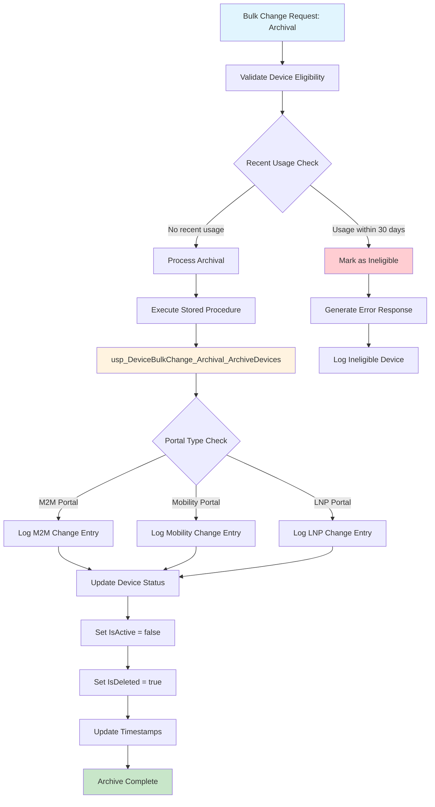
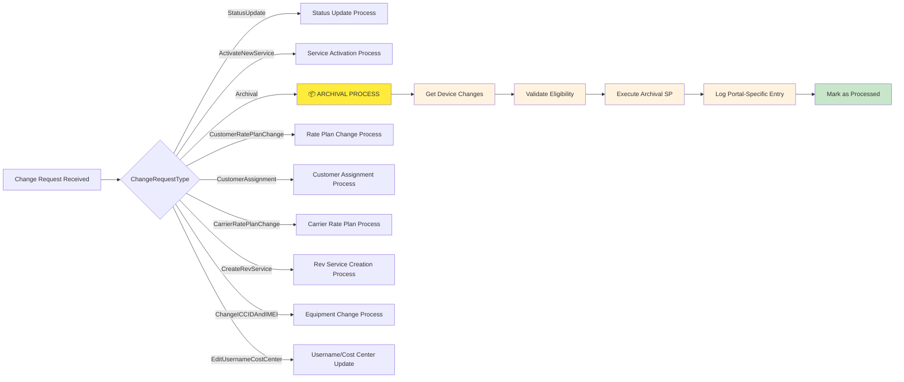

# ARCHIVE Device Flow

## Overview

### What
The ARCHIVE Device Flow is a bulk change operation that permanently deactivates devices in the system by marking them as inactive and deleted. This process ensures devices that are no longer in use are properly removed from active management while maintaining audit trails and data integrity.

### Why
- **Resource Management**: Remove unused devices from active monitoring and billing cycles
- **Data Integrity**: Maintain clean, accurate device inventories by eliminating obsolete entries
- **Compliance**: Ensure proper device lifecycle management and audit trail requirements
- **Cost Optimization**: Reduce overhead costs associated with managing inactive devices
- **Security**: Prevent unauthorized access to devices that should no longer be accessible

### How
The archival process validates device eligibility (checking for recent usage within 30 days), executes bulk database updates through stored procedures, and logs all changes across different portal types (M2M, Mobility, LNP) while maintaining comprehensive audit trails.

---

## Archive Change Type Process Flow

```
User Interface → M2MController.BulkChange() → BuildArchivalChangeDetails() → Validation (30-day usage check) → GetArchivalChanges() → DeviceChangeRequest Creation → Queue (SQS) → AltaworxDeviceBulkChange Lambda → ProcessArchivalAsync() → GetDeviceChanges() → usp_DeviceBulkChange_Archival_ArchiveDevices → Database Update (IsActive=false, IsDeleted=true) → Portal-Specific Logging (M2M/Mobility/LNP) → BulkChangeStatus.PROCESSED → Archive Complete
```

### Detailed Flow Breakdown:

**Frontend Tier:**
```
User Interface → Archive Request Submission
```

**Controller Tier:**
```
M2MController.BulkChange() → DeviceChangeType.Archival → BuildArchivalChangeDetails()
```

**Validation Tier:**
```
GetArchivalChanges() → ARCHIVAL_RECENT_USAGE_VALIDATION_DAYS (30 days) → Device Eligibility Check → Error Generation (if ineligible)
```

**Queue Tier:**
```
DeviceChangeRequest → SQS Message → Device Bulk Change Queue
```

**Lambda Processing Tier:**
```
AltaworxDeviceBulkChange Lambda → ChangeRequestType.Archival → ProcessArchivalAsync() → GetDeviceChanges()
```

**Database Tier:**
```
usp_DeviceBulkChange_Archival_ArchiveDevices → SqlConnection → CommandType.StoredProcedure → Device Status Update
```

**Logging Tier:**
```
Portal Type Check → M2M/Mobility/LNP Logging → DeviceBulkChangeLogRepository → BulkChangeStatus Update → Audit Trail Creation
```

---

## Process Flow



---

## Change Type Process Flow



---

## Key Components

### Validation Rules
- **Recent Usage Check**: Devices with usage within the last 30 days (`ARCHIVAL_RECENT_USAGE_VALIDATION_DAYS`) are ineligible for archival
- **Active Status Check**: Only active devices can be archived
- **Already Archived Check**: Prevents re-archival of already processed devices

### Database Operations
- **Stored Procedure**: `usp_DeviceBulkChange_Archival_ArchiveDevices`
- **Device Status Update**: Sets `IsActive = false` and `IsDeleted = true`
- **Audit Trail**: Comprehensive logging across all portal types

### Portal Type Support
- **M2M Portal** (PortalTypeId: 0): Machine-to-Machine devices
- **Mobility Portal** (PortalTypeId: 2): Mobile devices  
- **LNP Portal** (PortalTypeId: 1): Local Number Portability devices

### Error Handling
- SQL exceptions with detailed logging
- Invalid operation exceptions
- General exception handling with unique log references
- Graceful degradation with appropriate error responses

---

## Implementation Details

### Core Method
```csharp
case ChangeRequestType.Archival:
    var archivalChanges = GetDeviceChanges(context, bulkChangeId, bulkChange.PortalTypeId, PageSize).ToList();
    await ProcessArchivalAsync(context, logRepo, bulkChange.Id, archivalChanges);
    return true;
```

### Key Constants
- `ARCHIVAL_RECENT_USAGE_VALIDATION_DAYS = 30`
- `PageSize = 100` (for batch processing)
- Portal Type Constants: M2M (0), LNP (1), Mobility (2)

### Logging Strategy
- **Action Text**: `usp_DeviceBulkChange_Archival_ArchiveDevices`
- **Log Description**: `Archive Devices: Update AMOP`
- **Status Tracking**: `BulkChangeStatus.PROCESSED` or `BulkChangeStatus.ERROR`
- **Audit Trail**: Complete request/response logging with timestamps