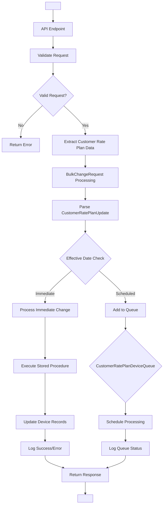

# AT&T POD 19 Service Provider - Customer Rate Plan Change Data Flow Diagram

## Overview
This document presents a comprehensive Data Flow Diagram (DFD) for the Customer Rate Plan Change process specifically for AT&T POD 19 Service Provider. The diagram illustrates the complete flow from request initiation to final processing and logging.

## Legend
- **[Process]**: Processing nodes/functions
- **{Data Store}**: Data storage entities
- **<External Entity>**: External systems or actors
- **→**: Data flow direction
- **||**: Decision points
- **◊**: Queue/Scheduling points

---

## Level 0 - Context Diagram

```
<Client Portal> → [Customer Rate Plan Change System] → {Device Database}
      ↑                          ↓                           ↓
<AT&T POD 19> ← [Billing System] ← [Audit & Logging] → {Log Database}
```

---

## Level 1 - Main Process Flow



---

## Level 2 - Detailed Data Flow Diagram

### A. Request Processing Layer

```
┌─────────────────────────────────────────────────────────────────────┐
│                           REQUEST PROCESSING                        │
├─────────────────────────────────────────────────────────────────────┤
│                                                                     │
│  <M2M Portal Client>                                               │
│          │                                                          │
│          ▼                                                          │
│  [M2MController.ProcessBulkChange]                                 │
│          │                                                          │
│          ▼                                                          │
│  [Validate BulkChangeRequest]                                      │
│          │                                                          │
│          ▼                                                          │
│  [Extract CustomerRatePlanUpdate] ──────┐                          │
│          │                               │                          │
│          ▼                               ▼                          │
│  {BulkChangeRequest JSON}         {Request Validation}             │
│          │                               │                          │
│          ▼                               ▼                          │
│  [AltaworxDeviceBulkChange.Process]  [Error Response]              │
│                                                                     │
└─────────────────────────────────────────────────────────────────────┘
```

### B. Core Processing Layer

```
┌─────────────────────────────────────────────────────────────────────┐
│                        CORE PROCESSING LAYER                       │
├─────────────────────────────────────────────────────────────────────┤
│                                                                     │
│  [ProcessCustomerRatePlanChangeAsync]                              │
│          │                                                          │
│          ▼                                                          │
│  [Parse Change Request JSON]                                       │
│          │                                                          │
│          ▼                                                          │
│  [Extract Parameters]:                                             │
│    • CustomerRatePlanId                                            │
│    • CustomerPoolId                                                │
│    • CustomerDataAllocationMB                                      │
│    • EffectiveDate                                                 │
│          │                                                          │
│          ▼                                                          │
│  ||Effective Date Decision||                                       │
│          │                                                          │
│    ┌─────┴─────┐                                                   │
│    ▼           ▼                                                    │
│ [Immediate] [Scheduled]                                            │
│    │           │                                                    │
│    ▼           ▼                                                    │
│ [Process    [Queue                                                 │
│  Now]       Processing]                                            │
│                                                                     │
└─────────────────────────────────────────────────────────────────────┘
```

### C. Immediate Processing Path

```
┌─────────────────────────────────────────────────────────────────────┐
│                      IMMEDIATE PROCESSING PATH                     │
├─────────────────────────────────────────────────────────────────────┤
│                                                                     │
│  [ProcessCustomerRatePlanChangeAsync]                              │
│          │                                                          │
│          ▼                                                          │
│  [SQL Connection Management]                                       │
│          │                                                          │
│          ▼                                                          │
│  [Execute Stored Procedure]:                                       │
│    usp_DeviceBulkChange_CustomerRatePlanChange_UpdateDevices       │
│          │                                                          │
│          ▼                                                          │
│  [SQL Parameters]:                                                 │
│    • @bulkChangeId                                                 │
│    • @customerRatePlanId                                           │
│    • @customerRatePoolId                                           │
│    • @customerDataAllocationMB                                     │
│    • @effectiveDate                                                │
│    • @needToMarkProcessed                                          │
│          │                                                          │
│          ▼                                                          │
│  {Device Table Updates}                                            │
│          │                                                          │
│          ▼                                                          │
│  [Return DeviceChangeResult]                                       │
│                                                                     │
└─────────────────────────────────────────────────────────────────────┘
```

### D. Scheduled Processing Path

```
┌─────────────────────────────────────────────────────────────────────┐
│                     SCHEDULED PROCESSING PATH                      │
├─────────────────────────────────────────────────────────────────────┤
│                                                                     │
│  [ProcessAddCustomerRatePlanChangeToQueueAsync]                    │
│          │                                                          │
│          ▼                                                          │
│  [Create DataTable Structure]:                                     │
│    • Id, DeviceId, CustomerRatePlanId                             │
│    • CustomerRatePoolId, CustomerDataAllocationMB                  │
│    • EffectiveDate, PortalType, TenantId                          │
│    • CreatedBy, CreatedDate, ModifiedBy                           │
│    • ModifiedDate, IsActive                                        │
│          │                                                          │
│          ▼                                                          │
│  [Populate DataTable with Device Changes]                         │
│          │                                                          │
│          ▼                                                          │
│  [SqlBulkCopy Operation]                                           │
│          │                                                          │
│          ▼                                                          │
│  {CustomerRatePlanDeviceQueue Table}                               │
│          │                                                          │
│          ▼                                                          │
│  ◊[Queue for Future Processing]◊                                   │
│                                                                     │
└─────────────────────────────────────────────────────────────────────┘
```

### E. Individual Device Processing

```
┌─────────────────────────────────────────────────────────────────────┐
│                    INDIVIDUAL DEVICE PROCESSING                    │
├─────────────────────────────────────────────────────────────────────┤
│                                                                     │
│  [ProcessCustomerRatePlanChangeBySubNumberAsync]                   │
│          │                                                          │
│          ▼                                                          │
│  [Input Parameters]:                                               │
│    • bulkChangeId                                                  │
│    • subscriberNumber                                              │
│    • customerRatePlanId                                            │
│    • customerRatePoolId                                            │
│    • effectiveDate                                                 │
│    • customerDataAllocationMB                                      │
│          │                                                          │
│          ▼                                                          │
│  [Execute Stored Procedure]:                                       │
│    usp_DeviceBulkChange_CustomerRatePlanChange_UpdateDeviceByNumber│
│          │                                                          │
│          ▼                                                          │
│  {Single Device Update}                                            │
│          │                                                          │
│          ▼                                                          │
│  [Return Update Result]                                            │
│                                                                     │
└─────────────────────────────────────────────────────────────────────┘
```

### F. Logging and Audit Layer

```
┌─────────────────────────────────────────────────────────────────────┐
│                       LOGGING AND AUDIT LAYER                      │
├─────────────────────────────────────────────────────────────────────┤
│                                                                     │
│  [Processing Result]                                               │
│          │                                                          │
│          ▼                                                          │
│  ||Portal Type Check||                                             │
│          │                                                          │
│    ┌─────┴─────┐                                                   │
│    ▼           ▼                                                    │
│ [M2M Portal] [Mobility Portal]                                     │
│    │           │                                                    │
│    ▼           ▼                                                    │
│ [Create       [Create                                              │
│  M2M Log]     Mobility Log]                                       │
│    │           │                                                    │
│    ▼           ▼                                                    │
│ {M2M_Device   {Mobility_Device                                     │
│  BulkChange    BulkChange                                          │
│  Log}          Log}                                                │
│          │                                                          │
│          ▼                                                          │
│  [Log Entry Fields]:                                               │
│    • BulkChangeId, DeviceChangeId                                  │
│    • LogEntryDescription                                           │
│    • ProcessBy, ProcessedDate                                      │
│    • RequestText, ResponseText                                     │
│    • HasErrors, ResponseStatus                                     │
│    • ErrorText                                                     │
│                                                                     │
└─────────────────────────────────────────────────────────────────────┘
```

### G. Data Storage Layer

```
┌─────────────────────────────────────────────────────────────────────┐
│                         DATA STORAGE LAYER                         │
├─────────────────────────────────────────────────────────────────────┤
│                                                                     │
│  {Core Tables}:                                                    │
│    ┌─────────────────────────────────────────────────────────────┐ │
│    │ Device Table                                                │ │
│    │ • DeviceId, CustomerRatePlanId                             │ │
│    │ • CustomerPoolId, CustomerDataAllocationMB                 │ │
│    │ • ServiceProviderId, TenantId                              │ │
│    │ • ModifiedBy, ModifiedDate                                 │ │
│    └─────────────────────────────────────────────────────────────┘ │
│                                                                     │
│  {Queue Tables}:                                                   │
│    ┌─────────────────────────────────────────────────────────────┐ │
│    │ CustomerRatePlanDeviceQueue                                 │ │
│    │ • Id, DeviceId, CustomerRatePlanId                         │ │
│    │ • CustomerRatePoolId, CustomerDataAllocationMB             │ │
│    │ • EffectiveDate, PortalType                                │ │
│    │ • TenantId, CreatedBy, CreatedDate                         │ │
│    │ • IsActive                                                 │ │
│    └─────────────────────────────────────────────────────────────┘ │
│                                                                     │
│  {Bulk Change Tables}:                                             │
│    ┌─────────────────────────────────────────────────────────────┐ │
│    │ BulkChange                                                  │ │
│    │ • Id, TenantId, PortalTypeId                               │ │
│    │ • ChangeTypeId, ProcessChanges                             │ │
│    │ • CreatedBy, CreatedDate                                   │ │
│    └─────────────────────────────────────────────────────────────┘ │
│                                                                     │
│    ┌─────────────────────────────────────────────────────────────┐ │
│    │ M2M_DeviceChange / Mobility_DeviceChange                   │ │
│    │ • Id, BulkChangeId, DeviceId                               │ │
│    │ • ChangeRequest (JSON), Status                             │ │
│    │ • ProcessedDate                                            │ │
│    └─────────────────────────────────────────────────────────────┘ │
│                                                                     │
│  {Log Tables}:                                                     │
│    ┌─────────────────────────────────────────────────────────────┐ │
│    │ M2M_DeviceBulkChangeLog                                     │ │
│    │ Mobility_DeviceBulkChangeLog                                │ │
│    │ • BulkChangeId, DeviceChangeId                             │ │
│    │ • LogEntryDescription, ProcessBy                           │ │
│    │ • RequestText, ResponseText                                │ │
│    │ • HasErrors, ResponseStatus                                │ │
│    │ • ProcessedDate, ErrorText                                 │ │
│    └─────────────────────────────────────────────────────────────┘ │
│                                                                     │
└─────────────────────────────────────────────────────────────────────┘
```

---

## Complete Process Flow Graph

```
    <Client>
       │
       ▼
┌─────────────┐
│ API Request │ ──→ BulkChangeRequest
└─────────────┘     {
                      ServiceProviderId: AT&T POD 19
                      ChangeType: 4 (Customer Rate Plan)
                      CustomerRatePlanUpdate: {
                        CustomerRatePlanId,
                        CustomerDataAllocationMB,
                        CustomerPoolId,
                        EffectiveDate
                      }
                    }
       │
       ▼
┌─────────────┐
│  Validate   │ ──→ {Validation Rules}
│  Request    │
└─────────────┘
       │
       ▼
┌─────────────┐
│   Parse     │ ──→ Extract CustomerRatePlanUpdate
│ Parameters  │
└─────────────┘
       │
       ▼
┌─────────────┐
│ Effective   │ ──→ if (effectiveDate <= DateTime.UtcNow)
│ Date Check  │
└─────────────┘
       │
   ┌───┴───┐
   ▼       ▼
┌─────┐ ┌─────┐
│ Now │ │Queue│
└─────┘ └─────┘
   │       │
   ▼       ▼
┌─────────────┐ ┌─────────────┐
│ Execute SP  │ │  SqlBulk    │
│ usp_Device  │ │  Copy to    │
│ BulkChange_ │ │ CustomerRate│
│ Customer    │ │ PlanDevice  │
│ RatePlan    │ │ Queue       │
│ Change_     │ │             │
│ UpdateDevice│ │             │
└─────────────┘ └─────────────┘
   │               │
   ▼               ▼
┌─────────────┐ ┌─────────────┐
│ Update      │ │ Schedule    │
│ Device      │ │ Future      │
│ Records     │ │ Processing  │
└─────────────┘ └─────────────┘
   │               │
   ▼               ▼
┌─────────────────────────────┐
│        Log Results          │
│ • M2M Portal → M2M Log     │
│ • Mobility → Mobility Log   │
│ • Success/Error Status      │
│ • Request/Response Text     │
└─────────────────────────────┘
           │
           ▼
    ┌─────────────┐
    │   Return    │ ──→ <Client Response>
    │  Response   │
    └─────────────┘
```

---

## AT&T POD 19 Specific Considerations

### Service Provider Configuration
- **ServiceProviderId**: Specific to AT&T POD 19
- **Portal Integration**: Both M2M and Mobility portals supported
- **Change Type**: 4 (Customer Rate Plan Change)

### Data Flow Characteristics
- **Tenant Isolation**: All operations scoped to specific TenantId
- **AT&T Integration**: Direct integration with AT&T POD 19 systems
- **Real-time Processing**: Immediate changes vs scheduled changes
- **Bulk Operations**: Multiple devices processed in single request

### Security and Validation
- **Authorization**: Tenant-level access control
- **Input Validation**: Rate plan ID, data allocation, effective date
- **Audit Trail**: Complete logging for compliance
- **Error Handling**: Comprehensive error tracking and reporting

### Performance Optimization
- **Async Processing**: Non-blocking operations
- **Batch Updates**: Bulk SQL operations
- **Connection Pooling**: Efficient database connections
- **Queue Management**: Scheduled processing for future dates

---

## Integration Points

### External Systems
- **AT&T POD 19 Network**: Service provider backend
- **Billing Systems**: Rate plan billing integration
- **Customer Portals**: M2M and Mobility interfaces
- **Audit Systems**: Compliance and tracking

### Internal Components
- **Device Management**: Device record updates
- **Customer Management**: Rate plan assignments
- **Queue Management**: Scheduled change processing
- **Logging Service**: Audit trail maintenance

---

## Error Handling and Recovery

```
Error Scenarios:
├── Validation Errors
│   ├── Invalid CustomerRatePlanId
│   ├── Invalid Data Allocation
│   └── Missing Required Parameters
├── Processing Errors
│   ├── Database Connection Failure
│   ├── Stored Procedure Errors
│   └── Transaction Conflicts
└── System Errors
    ├── Network Connectivity
    ├── Service Unavailability
    └── Timeout Scenarios

Recovery Mechanisms:
├── Retry Policies (ISyncPolicy)
├── Transaction Rollback
├── Error Logging
└── Client Notification
```

This comprehensive DFD provides a complete view of the Customer Rate Plan Change process for AT&T POD 19 Service Provider, including all data flows, processing paths, and system interactions.