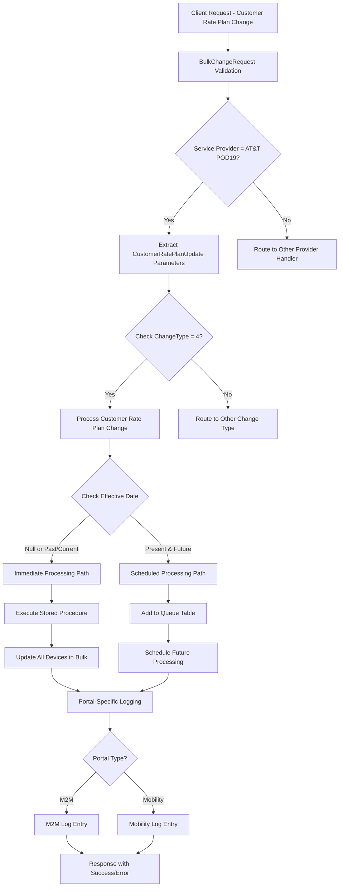
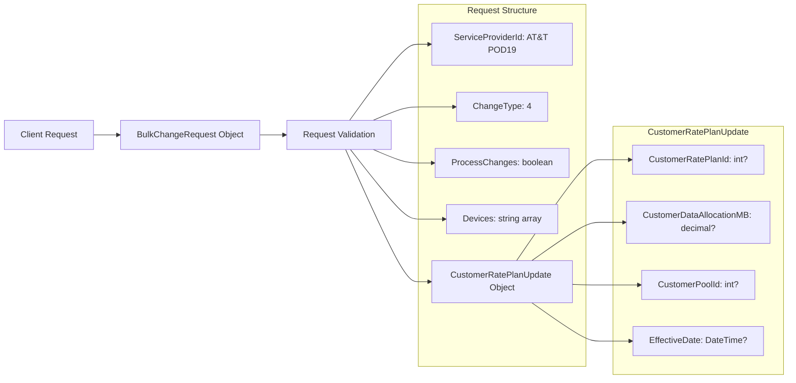
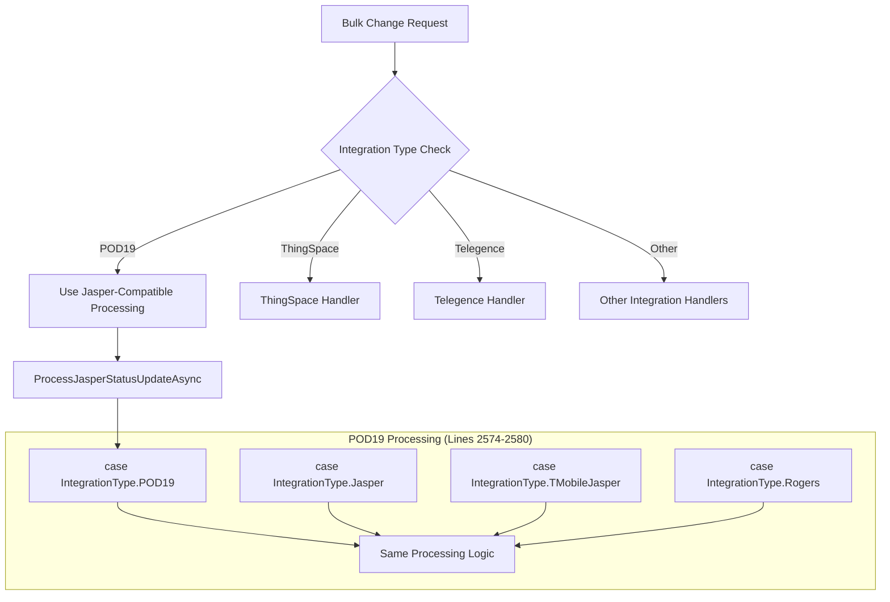
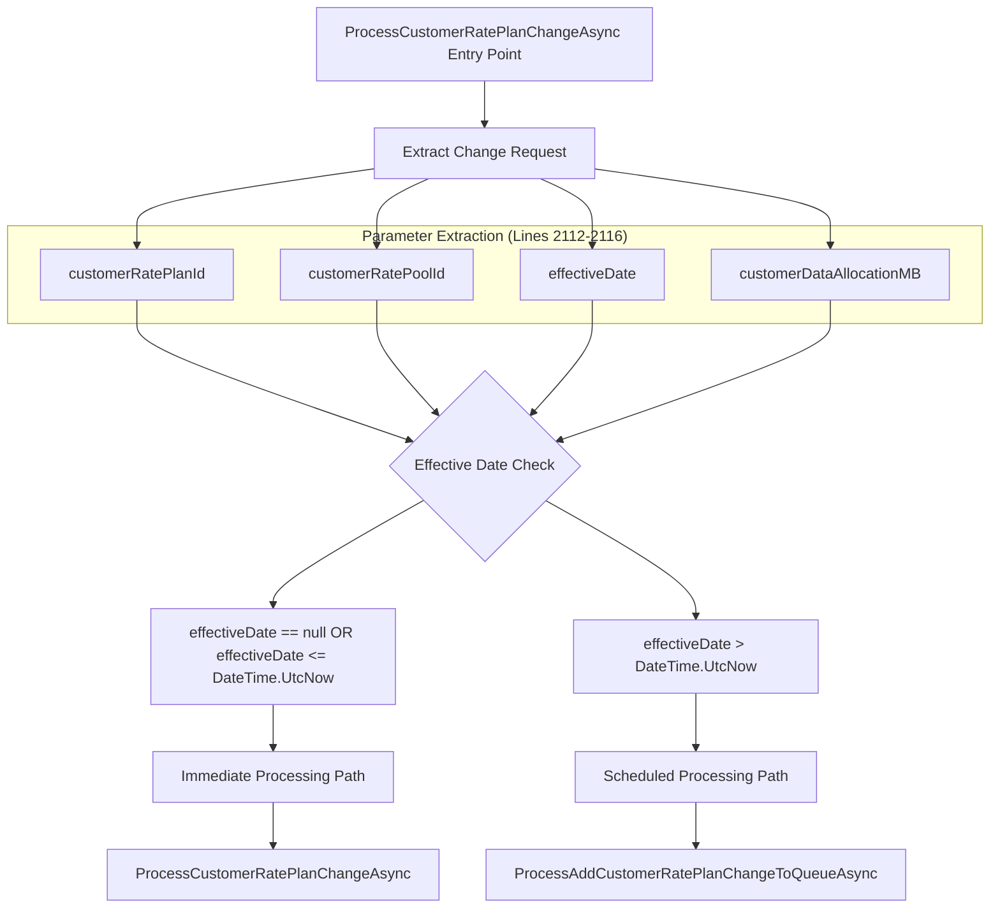
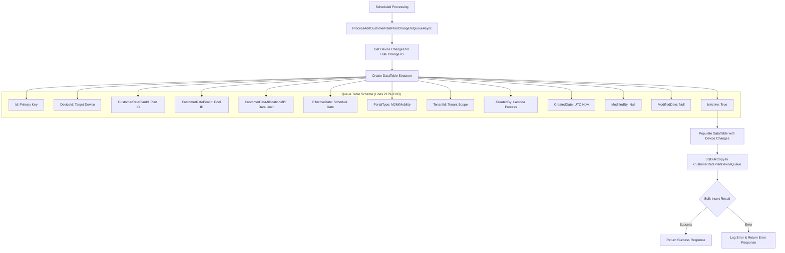
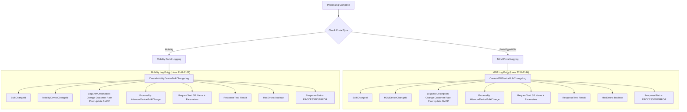
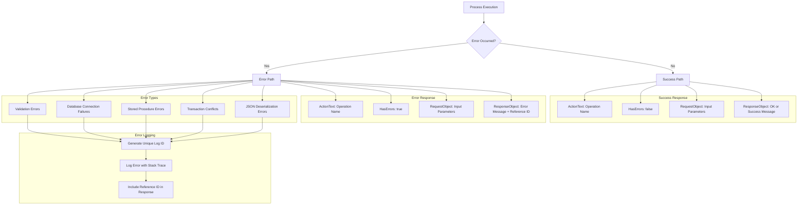
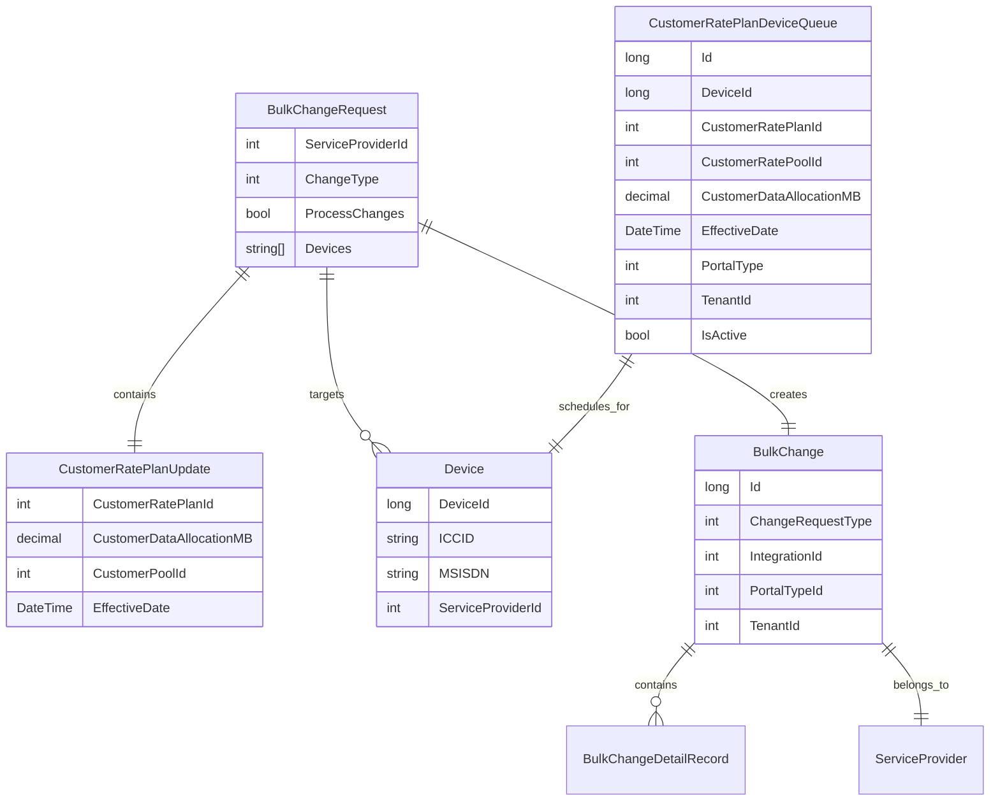
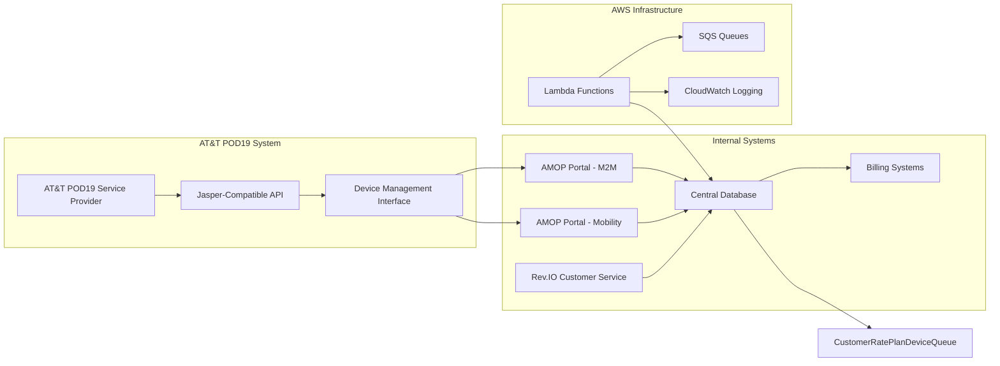
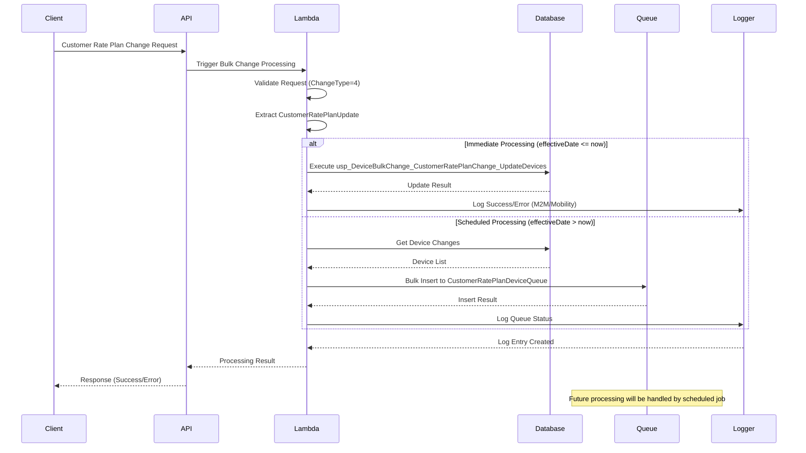

# AT&T POD19 Customer Rate Plan Change - Data Flow Graph

## Overview
This document provides a visual representation of the data flow for customer rate plan changes specific to AT&T POD19 service provider integration.

## High-Level Data Flow Architecture



## Detailed Processing Flow

### 1. Request Initiation and Validation



### 2. AT&T POD19 Integration Type Processing



### 3. Customer Rate Plan Processing Decision Matrix



### 4. Immediate Processing Path - Database Operations

```mermaid
graph TD
    A[Immediate Processing] --> B[ProcessCustomerRatePlanChangeAsync Method]
    
    subgraph "Database Execution (Lines 2249-2269)"
        C[Create SQL Connection]
        D[Create SQL Command]
        E[Set Command Type: StoredProcedure]
        F[Set Command Text: usp_DeviceBulkChange_CustomerRatePlanChange_UpdateDevices]
    end
    
    B --> C
    C --> D
    D --> E
    E --> F
    
    subgraph "SQL Parameters"
        G[@effectiveDate]
        H[@bulkChangeId]
        I[@customerRatePlanId]
        J[@customerRatePoolId]
        K[@customerDataAllocationMB]
        L[@needToMarkProcessed]
    end
    
    F --> G
    F --> H
    F --> I
    F --> J
    F --> K
    F --> L
    
    L --> M[Execute Stored Procedure]
    M --> N{Execution Result}
    N -->|Success| O[Return Success Response]
    N -->|Error| P[Log Error & Return Error Response]
    
    subgraph "Response Structure"
        Q[ActionText: SP Name]
        R[HasErrors: boolean]
        S[RequestObject: Parameters]
        T[ResponseObject: Result/Error]
    end
    
    O --> Q
    P --> Q
    O --> R
    P --> R
    O --> S
    P --> S
    O --> T
    P --> T
```

### 5. Scheduled Processing Path - Queue Management



### 6. Portal-Specific Logging Flow



### 7. Error Handling and Response Flow



### 8. Data Model Relationships



### 9. Integration Points and External Systems



### 10. Processing Timeline and Sequence



## Key Constants and Configuration

### Change Request Types
```
CustomerRatePlanChange = 4
CarrierRatePlanChange = 7
```

### Integration Types
```
POD19 = [Specific ID for AT&T POD19]
Jasper = [Compatible processing]
```

### Stored Procedures
```
usp_DeviceBulkChange_CustomerRatePlanChange_UpdateDevices
usp_DeviceBulkChange_CustomerRatePlanChange_UpdateDeviceByNumber
```

### Database Tables
```
CustomerRatePlanDeviceQueue
M2M_DeviceChange
Mobility_DeviceChange
Device
BulkChange
```

## Performance Considerations

### Batch Processing
- Processes multiple devices in single stored procedure call
- Uses SqlBulkCopy for queue operations
- Implements connection pooling

### Async Operations
- Non-blocking database operations
- Parallel processing capabilities
- Queue-based scheduling for future changes

### Error Resilience
- SQL retry policies
- Comprehensive error logging
- Transaction rollback capabilities
- Unique error reference IDs

## Security and Compliance

### Authorization
- Tenant-level access control
- Service provider validation
- Portal-specific permissions

### Data Protection
- Encrypted connection strings
- Sanitized logging (no sensitive data)
- Audit trail maintenance

### Validation
- Input parameter validation
- Business rule enforcement
- Rate limit checking