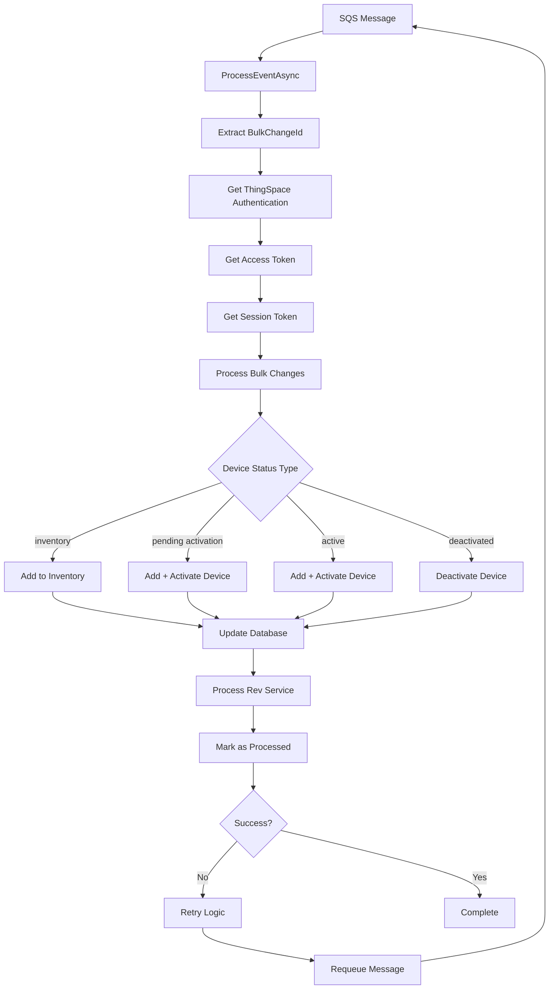

# AT&T POD 19 Device Status Update Data Flow

## Overview
This document outlines the complete data flow for updating device status in the AT&T POD 19 (ThingSpace) system. The system processes device status changes through a serverless AWS Lambda architecture with SQS message queuing.

## Architecture Components

### Core Components
- **AWS Lambda Function**: `AltaworxDeviceBulkChange`
- **Message Queue**: AWS SQS for bulk change processing
- **Database**: SQL Server with device and bulk change tables
- **External API**: AT&T ThingSpace API
- **Authentication**: OAuth2 token-based authentication

### Key Files
- `AltaworxDeviceBulkChange.cs` - Main processing logic
- `FunctionProcessUpdateStatus.cs` - Status verification and retry logic
- `StatusUpdateRequest.cs` - Request data structure
- `BulkChangeRepository.cs` - Database operations
- `UpdateDeviceStatusResult.cs` - Response structure

## Data Flow Diagram



## Detailed Data Flow

### 1. Entry Point - SQS Message Processing

```csharp
// Entry point in AltaworxDeviceBulkChange.cs
SQS Event → ProcessEventAsync() → ProcessEventRecordAsync()
```

**Message Attributes:**
- `BulkChangeId`: Identifier for the bulk operation
- `IsRetryNewActivateThingSpaceDevice`: Retry flag for activation
- `IsFromAutomatedUpdateDeviceStatusLambda`: Automated process flag
- `ServiceProviderId`: AT&T service provider identifier
- `RetryNumber`: Current retry attempt count

### 2. Authentication Flow

```csharp
// Authentication sequence
ThingSpaceCommon.GetThingspaceAuthenticationInformation()
└── ThingSpaceCommon.GetAccessToken(thingSpaceAuthentication)
    └── ThingSpaceCommon.GetSessionToken(thingSpaceAuthentication, accessToken)
```

**Authentication Steps:**
1. Retrieve ThingSpace credentials from database
2. Request OAuth access token from AT&T
3. Obtain session token for API operations
4. Validate token expiration and refresh as needed

### 3. Main Processing Logic

```csharp
ProcessBulkChangeAsync()
├── GetDeviceChanges() // Retrieve pending changes
├── ProcessThingSpaceDeviceStatusChange()
│   ├── UpdateThingSpaceDeviceStatusAsync()
│   └── ProcessRevServiceCreation()
└── MarkProcessed() // Update completion status
```

### 4. Device Status Operations

#### 4.1 Inventory Status
```csharp
case "inventory":
    var result = await AddThingSpaceDeviceAsync(
        context, logRepo, bulkChange, change, 
        thingSpaceAuth, accessToken, sessionToken, 
        request, serviceProviderId, updateStatus
    );
```

#### 4.2 Pending Activation Status
```csharp
case "pending activation":
    if (ThingSpaceDeviceIsValidForAdd(context, request, change.Id))
    {
        if (!changeRequest.IsIgnoreCurrentStatus)
        {
            // Add device to inventory first
            var addResult = await AddThingSpaceDeviceAsync(...);
        }
        else
        {
            // Direct activation
            var activateResult = await ActivateThingSpaceDeviceAsync(...);
        }
    }
```

#### 4.3 Active Status
```csharp
case "active":
    var addResult = await AddThingSpaceDeviceAsync(...);
    
    // If both ICCID and IMEI present, activate device
    if (!string.IsNullOrEmpty(request.ICCID) && 
        !string.IsNullOrEmpty(request.IMEI) && 
        !addResult.HasErrors)
    {
        var activateResult = await ActivateThingSpaceDeviceAsync(...);
    }
```

#### 4.4 Deactivated Status
```csharp
case "deactivated":
    var deactivateResult = await DeactivateThingSpaceDeviceAsync(...);
```

### 5. Database Operations

#### 5.1 Device Status Update Query
```sql
UPDATE Device
SET DeviceStatusId = @deviceStatusId,
    MSISDN = @msisdn,
    IpAddress = @ipAddress,
    ModifiedBy = 'AltaworxJasperAWSUpdateDeviceStatus',
    ModifiedDate = GETUTCDATE()
WHERE IsDeleted = 0 
    AND ServiceProviderId = @serviceProviderId
    AND ICCID = @iccid
```

#### 5.2 Bulk Change Tracking Update
```sql
UPDATE M2M_DeviceChange
SET MSISDN = @msisdn,
    IpAddress = @ipAddress
WHERE BulkChangeId = @bulkChangeId
    AND ICCID = @iccid
```

#### 5.3 Key Database Tables
- **Device**: Core device information and status
- **M2M_DeviceChange**: Bulk change tracking
- **ThingSpaceDevice**: ThingSpace-specific device data
- **ThingSpaceDeviceDetail**: Extended device attributes
- **ThingSpaceDeviceUsage**: Usage and billing information
- **DeviceBulkChangeLog**: Operation logging

### 6. AT&T ThingSpace API Integration

#### 6.1 API Endpoints
```
POST /devices/actions/activate    // Activate device
POST /devices/actions/deactivate  // Deactivate device
PUT  /devices/{deviceId}          // Update device
GET  /devices/{deviceId}          // Get device status
```

#### 6.2 Request Body Structure
```json
{
    "deviceIds": [
        {
            "id": "ICCID_VALUE",
            "kind": "iccid"
        }
    ],
    "accountName": "ACCOUNT_NUMBER",
    "servicePlan": "SERVICE_PLAN_NAME"
}
```

#### 6.3 Response Handling
```csharp
var updateResult = JsonConvert.DeserializeObject<UpdateThingSpaceDeviceStatusResult>(responseBody);
if (string.IsNullOrWhiteSpace(updateResult.requestId))
{
    // Handle API error
    return new DeviceChangeResult<T, ApiResponse>()
    {
        HasErrors = true,
        ResponseObject = new ApiResponse { IsSuccess = false, Response = "API call failed" }
    };
}
```

### 7. Callback Processing & Verification

#### 7.1 Device Activation Verification
```csharp
public async Task<bool> ProcessUpdateDeviceAfterActivateThingSpaceDevice(
    KeySysLambdaContext context, SqsValues sqsValues, BulkChange bulkChange)
{
    // Get devices pending verification
    var devices = bulkChangeRepository.GetICCIDM2MDeviceChangeBybulkId(
        context.CentralDbConnectionString, bulkChange.Id);
    
    foreach (var iccid in devices)
    {
        var deviceResponse = await ThingSpaceCommon.GetThingSpaceDeviceAsync(
            iccid, thingSpaceAuthentication.BaseUrl, accessToken, sessionToken, context.logger);
        
        var state = deviceResponse?.carrierInformations?.FirstOrDefault()?.state;
        
        if (!string.IsNullOrEmpty(state) && state.Equals("active"))
        {
            // Update device with MSISDN and IP address
            bulkChangeRepository.UpdateMSISDNToM2M_DeviceChange(
                context.CentralDbConnectionString, bulkChange.Id, 
                msisdnFromAPI, iccid, bulkChange.ServiceProviderId, deviceResponse);
        }
    }
    
    return devicesAfterUpdate.Count == 0; // All devices processed
}
```

### 8. Error Handling & Retry Logic

#### 8.1 Retry Configuration
```csharp
if (sqsValues.RetryNumber >= int.Parse(ThingSpaceUpdateDeviceStatusRetryNumber))
{
    LogInfo(context, LogTypeConstant.Info, 
        $"Have retried {ThingSpaceUpdateDeviceStatusRetryNumber} times. End process!");
    await bulkChangeRepository.MarkBulkChangeStatusAsync(
        context, bulkChangeId, BulkChangeStatus.PROCESSED);
    return bulkChangeId;
}
```

#### 8.2 Retry Delays
- **Standard Retry**: 5 seconds delay
- **ThingSpace Activation Check**: 15 minutes delay
- **Bulk Change Processing**: Variable delay based on queue status

#### 8.3 Error Types and Handling
| Error Type | Handling Strategy |
|------------|------------------|
| Authentication Failure | Log error, mark as failed |
| API Rate Limiting | Exponential backoff retry |
| Device Not Found | Mark as error, no retry |
| Network Timeout | Retry with delay |
| Invalid Status Transition | Log error, mark as failed |

### 9. Data Structures

#### 9.1 StatusUpdateRequest
```csharp
public class StatusUpdateRequest<T>
{
    public string UpdateStatus { get; set; }                    // Target status
    public bool IsIgnoreCurrentStatus { get; set; }             // Skip validation
    public int PostUpdateStatusId { get; set; }                 // Final status ID
    public string AccountNumber { get; set; }                   // Customer account
    public T Request { get; set; }                              // Device details
    public BulkChangeAssociateCustomer RevService { get; set; } // Rev service data
    public RevServiceProductCreateModel RevServiceProductCreateModel { get; set; }
    public int IntegrationAuthenticationId { get; set; }        // Auth context
}
```

#### 9.2 ThingSpaceStatusUpdateRequest
```csharp
public class ThingSpaceStatusUpdateRequest
{
    public string ICCID { get; set; }           // SIM card identifier
    public string IMEI { get; set; }            // Device identifier
    public string RevAccountNumber { get; set; } // Revenue account
    public string ServicePlan { get; set; }     // Service plan name
    public string ReasonCode { get; set; }      // Status change reason
}
```

#### 9.3 UpdateDeviceStatusResult
```csharp
public class UpdateDeviceStatusResult
{
    public string iccid { get; set; }  // Processed device ICCID
}
```

### 10. Monitoring & Logging

#### 10.1 Log Entry Types
- **API Calls**: Request/response logging
- **Database Operations**: SQL execution tracking
- **Error Events**: Exception and failure logging
- **Status Changes**: Device state transitions

#### 10.2 Log Repository Operations
```csharp
logRepo.AddMobilityLogEntry(new CreateMobilityDeviceBulkChangeLog()
{
    BulkChangeId = bulkChangeId,
    ErrorText = errorMessage,
    HasErrors = true,
    LogEntryDescription = "Update ThingSpace Device Status",
    MobilityDeviceChangeId = change.Id,
    ProcessBy = "AltaworxDeviceBulkChange",
    ProcessedDate = DateTime.UtcNow,
    RequestText = JsonConvert.SerializeObject(request),
    ResponseStatus = apiResult.IsSuccess ? BulkChangeStatus.PROCESSED : BulkChangeStatus.ERROR,
    ResponseText = apiResult.Response
});
```

### 11. Integration Points

#### 11.1 Rev Service Integration
- Creates revenue services for activated devices
- Links devices to customer accounts
- Manages billing relationships

#### 11.2 ADM Webhook Notifications
```csharp
await admWebhookService.NotifyStatusUpdateDone(request, ParameterizedLog(context));
```

#### 11.3 Customer Rate Plan Management
- Associates devices with rate plans
- Updates billing configurations
- Manages service feature assignments

## Status Transition Matrix

| From Status | To Status | Operation | API Call Required |
|-------------|-----------|-----------|------------------|
| New | Inventory | Add Device | POST /devices |
| Inventory | Pending Activation | Add Device | POST /devices |
| Pending Activation | Active | Activate | POST /devices/actions/activate |
| Active | Deactivated | Deactivate | POST /devices/actions/deactivate |
| Deactivated | Active | Reactivate | POST /devices/actions/activate |

## Environment Configuration

### Required Environment Variables
```
THINGSPACE_UPDATE_DEVICE_STATUS_RETRY_NUMBER=3
DEVICE_BULK_CHANGE_QUEUE_URL=https://sqs.region.amazonaws.com/account/queue
THINGSPACE_GET_STATUS_REQUEST_URL=https://thingspace.verizon.com/api/m2m/v1/
```

### Database Connection
- Central database connection string for device operations
- Separate logging database for audit trails
- Connection pooling and retry policies

## Performance Considerations

### Batch Processing
- Processes devices in batches to optimize API calls
- Implements queue-based processing for scalability
- Uses parallel processing where possible

### Rate Limiting
- Respects AT&T API rate limits
- Implements exponential backoff for retries
- Monitors API quota usage

### Database Optimization
- Uses stored procedures for complex operations
- Implements connection pooling
- Optimizes queries with proper indexing

## Security

### Authentication
- OAuth2 token-based authentication with AT&T
- Secure credential storage in AWS Systems Manager
- Token refresh and expiration handling

### Data Protection
- Encrypted database connections
- Secure API communication (HTTPS)
- Audit logging for compliance

## Troubleshooting Guide

### Common Issues
1. **Authentication Failures**: Check token expiration and refresh
2. **API Rate Limits**: Implement proper backoff strategies
3. **Device Not Found**: Verify ICCID/IMEI accuracy
4. **Status Conflicts**: Check current device status before updates
5. **Network Timeouts**: Increase timeout values and retry counts

### Debug Logging
Enable detailed logging by setting log levels appropriately and monitoring CloudWatch logs for detailed execution traces.

---

*This document represents the current implementation as of the codebase analysis. For the most up-to-date information, refer to the source code and AT&T ThingSpace API documentation.*