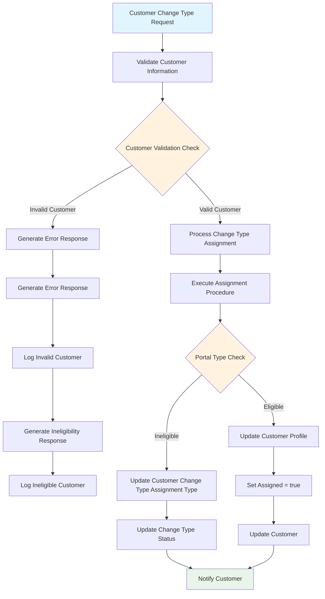

# Assign Customer Change Type - Data Flow Diagram

## Overview

This document represents the data flow diagram for the **Assign Customer Change Type** process, specifically focused on carrier rate plan changes. This process validates customer information, determines eligibility, and manages the assignment workflow.

## Data Flow Diagram



## Process Flow Description

### 1. Initial Request
**Step**: Customer Change Type Request
- **Description**: The process begins when a customer change type request is initiated
- **Input**: Customer identification and change type details
- **Trigger**: User interface interaction or API call

### 2. Customer Validation
**Step**: Validate Customer Information
- **Description**: System validates the provided customer information
- **Validation Points**:
  - Customer ID existence
  - Account status verification
  - Permissions check
  - Data integrity validation

### 3. Validation Decision Point
**Step**: Customer Validation Check
- **Decision Criteria**: 
  - Valid customer: Customer exists and meets basic requirements
  - Invalid customer: Customer not found or fails validation
- **Outcomes**:
  - **Valid Customer**: Proceed to change type assignment processing
  - **Invalid Customer**: Enter error handling workflow

### 4. Error Handling Workflow (Invalid Customer)
**Steps for Invalid Customer**:
1. **Generate Error Response**: Create standardized error message
2. **Generate Error Response**: Format response for client
3. **Log Invalid Customer**: Record the invalid attempt for audit
4. **Generate Ineligibility Response**: Create ineligibility notification
5. **Log Ineligible Customer**: Record ineligibility for tracking

### 5. Main Processing Workflow (Valid Customer)
**Step**: Process Change Type Assignment
- **Description**: Begin the main assignment procedure for validated customers
- **Actions**:
  - Extract change type requirements
  - Prepare assignment parameters
  - Initialize processing context

### 6. Assignment Execution
**Step**: Execute Assignment Procedure
- **Description**: Run the core assignment logic
- **Operations**:
  - Apply business rules
  - Check eligibility criteria
  - Prepare for portal type evaluation

### 7. Portal Type Evaluation
**Step**: Portal Type Check
- **Decision Criteria**: Determine customer's portal eligibility
- **Outcomes**:
  - **Eligible**: Customer qualifies for direct profile update
  - **Ineligible**: Customer requires change type assignment update

### 8. Eligible Customer Path
**Steps for Eligible Customers**:
1. **Update Customer Profile**: Direct profile modification
2. **Set Assigned = true**: Mark assignment as completed
3. **Update Customer**: Apply changes to customer record

### 9. Ineligible Customer Path
**Steps for Ineligible Customers**:
1. **Update Customer Change Type Assignment Type**: Modify assignment type
2. **Update Change Type Status**: Update processing status

### 10. Final Notification
**Step**: Notify Customer
- **Description**: Send notification about the change type assignment result
- **Notification Types**:
  - Success confirmation for eligible customers
  - Status update for ineligible customers
  - Error notification for failed assignments

### 11. Update Customer
**Step**: Update Customer
- **Description**: Final customer record update
- **Actions**:
  - Commit all changes
  - Update timestamps
  - Trigger downstream processes

## Business Rules

### Customer Validation Rules
- Customer must exist in the system
- Customer account must be active
- Customer must have appropriate permissions
- Customer data must pass integrity checks

### Portal Type Eligibility Rules
- **Eligible Criteria**:
  - Customer has valid portal access
  - Account is in good standing
  - No pending restrictions
  - Change type is permitted for customer tier

- **Ineligible Criteria**:
  - Suspended or restricted account
  - Insufficient permissions
  - Pending compliance issues
  - Change type not available for customer tier

### Assignment Processing Rules
- All assignments must be logged for audit
- Failed assignments trigger error workflows
- Successful assignments update customer profiles
- Notifications are sent for all outcomes

## Error Handling

### Invalid Customer Errors
- **Customer Not Found**: Customer ID does not exist
- **Account Inactive**: Customer account is suspended or closed
- **Permission Denied**: Insufficient permissions for change type
- **Data Validation Failed**: Customer data fails integrity checks

### Processing Errors
- **Assignment Procedure Failed**: Core assignment logic encounters error
- **Database Update Failed**: Customer profile update fails
- **Notification Failed**: Customer notification delivery fails
- **Concurrency Conflict**: Multiple simultaneous assignment attempts

### Error Logging
All errors are logged with:
- Timestamp
- Customer identifier
- Error type and description
- Processing context
- Recovery actions taken

## Integration Points

### Database Integration
- **Customer Profile Tables**: Store customer information and assignments
- **Change Type Tables**: Define available change types and rules
- **Audit Tables**: Track all assignment activities
- **Status Tables**: Maintain processing status information

### External System Integration
- **Notification Service**: Send customer notifications
- **Portal Systems**: Update portal access and permissions
- **Billing Systems**: Apply rate plan changes
- **Compliance Systems**: Verify regulatory requirements

### API Integration
- **Customer Management API**: Retrieve and update customer data
- **Change Type API**: Access change type definitions and rules
- **Notification API**: Send notifications to customers
- **Audit API**: Log activities and maintain audit trail

## Configuration

### System Constants
```javascript
// Change Type Constants
CUSTOMER_CHANGE_TYPE_REQUEST = "CustomerChangeTypeRequest"
PORTAL_TYPE_ELIGIBLE = "Eligible"
PORTAL_TYPE_INELIGIBLE = "Ineligible"
ASSIGNMENT_STATUS_COMPLETE = "Complete"
ASSIGNMENT_STATUS_PENDING = "Pending"

// Validation Constants
CUSTOMER_VALID = "Valid"
CUSTOMER_INVALID = "Invalid"
VALIDATION_PASSED = true
VALIDATION_FAILED = false

// Notification Types
NOTIFICATION_SUCCESS = "AssignmentSuccess"
NOTIFICATION_ERROR = "AssignmentError"
NOTIFICATION_INELIGIBLE = "CustomerIneligible"
```

### Processing Parameters
- **Validation Timeout**: 30 seconds
- **Assignment Timeout**: 60 seconds
- **Notification Timeout**: 15 seconds
- **Retry Attempts**: 3
- **Logging Level**: INFO

## Performance Considerations

### Optimization Strategies
- **Parallel Processing**: Run validation and assignment procedures concurrently where possible
- **Caching**: Cache customer validation results for repeat requests
- **Batch Processing**: Group multiple assignments for bulk processing
- **Connection Pooling**: Optimize database connection usage

### Monitoring Metrics
- **Processing Time**: Track assignment completion times
- **Success Rate**: Monitor assignment success/failure ratios
- **Error Frequency**: Track error types and frequencies
- **Customer Impact**: Measure customer satisfaction with assignment process

## Security Considerations

### Data Protection
- Encrypt sensitive customer information
- Sanitize logs to remove personal data
- Implement secure communication channels
- Maintain data access audit trails

### Access Control
- Role-based permissions for assignment operations
- Customer data visibility restrictions
- Change type authorization requirements
- Administrative oversight controls

### Compliance
- Regulatory requirement adherence
- Data retention policy compliance
- Privacy protection measures
- Audit trail maintenance

---

## Download Instructions

To download this file:
1. Save this content as `AssignCustomerChangeType_DataFlow.md`
2. The Mermaid diagram will render in any markdown viewer that supports Mermaid syntax
3. For PNG/PDF export, use tools like:
   - GitHub (renders Mermaid automatically)
   - Mermaid Live Editor (https://mermaid.live/)
   - VS Code with Mermaid extension
   - Typora or other Mermaid-compatible markdown editors

## Diagram Export Options

### Online Tools
- **Mermaid Live Editor**: Copy the mermaid code block to https://mermaid.live/ for PNG/SVG export
- **GitHub Gist**: Create a gist with this markdown for automatic rendering
- **GitLab**: Upload to GitLab repository for built-in Mermaid rendering

### Local Tools
- **VS Code**: Install Mermaid extension for preview and export
- **Typora**: Built-in Mermaid support with export options
- **Draw.io**: Import Mermaid syntax for further editing