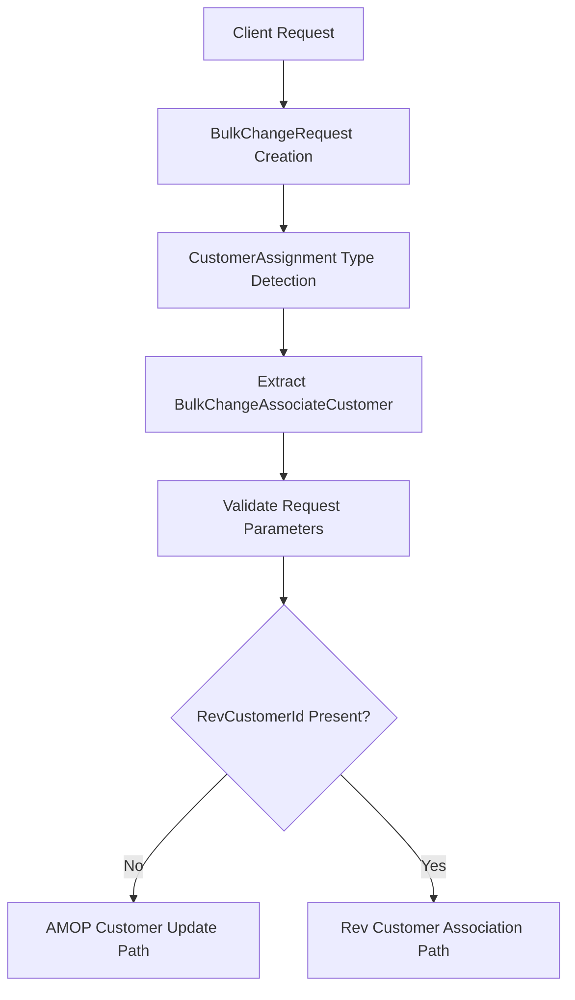
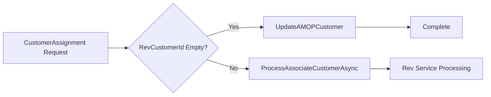
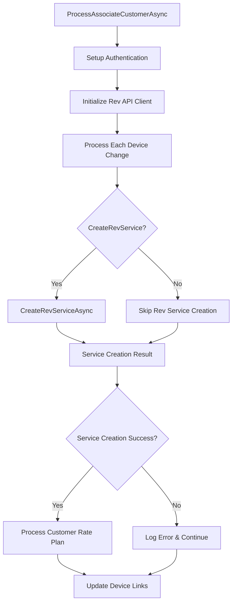
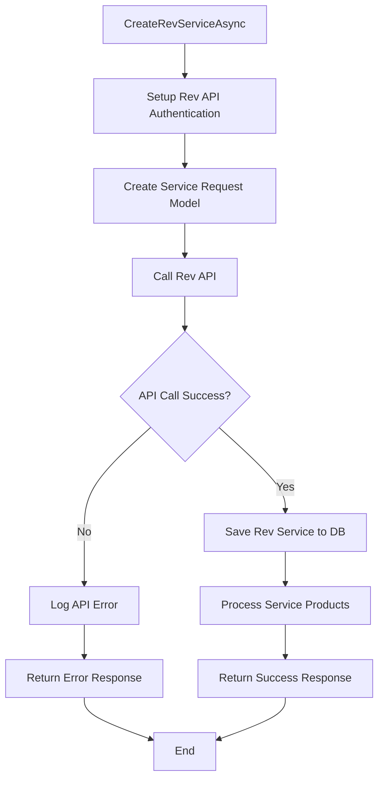
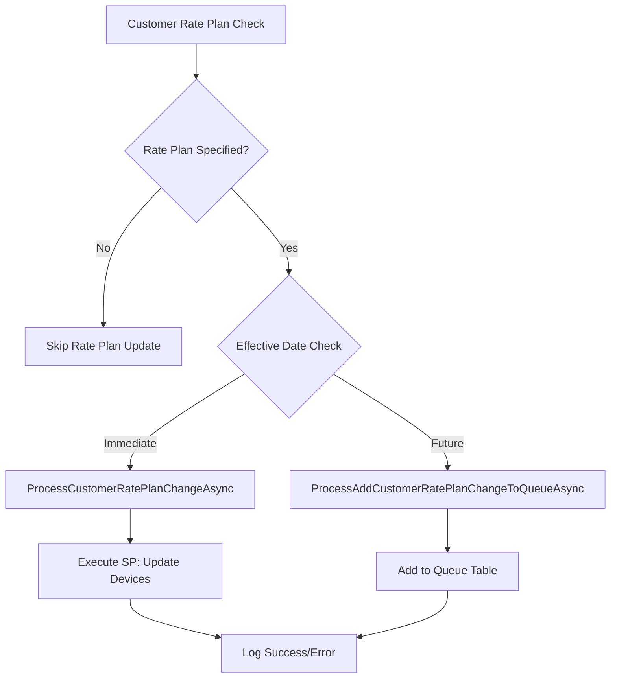
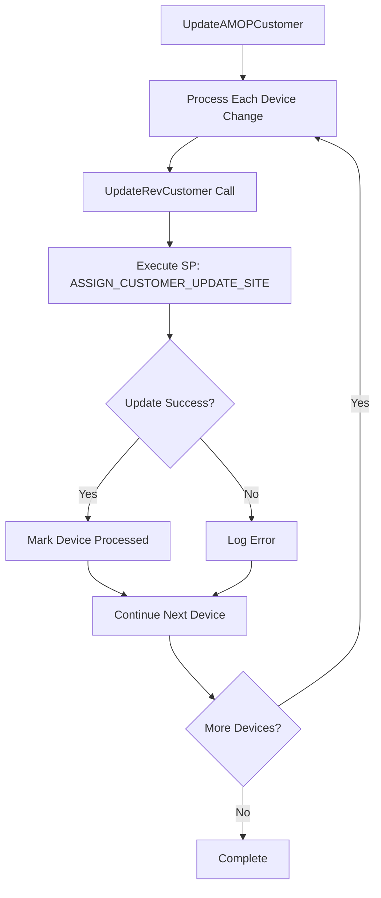
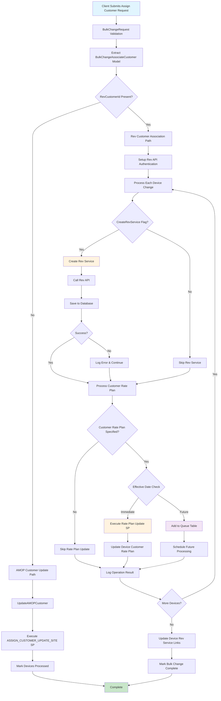

# POND IoT Service Provider - Assign Customer Data Flow

## Overview

This document outlines the complete data flow for the **Assign Customer** change type in the POND IoT Service Provider system. This change type allows associating devices with specific customers, optionally creating Rev services, and updating customer rate plans.

## Change Type Details

- **Change Type ID**: `CustomerAssignment` (ChangeRequestType.CustomerAssignment)
- **Purpose**: Associate IoT devices with customers and optionally create Rev services
- **Scope**: Device-to-customer mapping and service provisioning
- **Portal Support**: Both M2M Portal and Mobility Portal

## Data Models

### BulkChangeAssociateCustomer Request Model

```csharp
public class BulkChangeAssociateCustomer
{
    public string ICCID { get; set; }
    public string Number { get; set; }
    public string RevCustomerId { get; set; }
    public bool CreateRevService { get; set; }
    public string CustomerRatePlan { get; set; }
    public string CustomerRatePool { get; set; }
    public DateTime? EffectiveDate { get; set; }
    public int IntegrationAuthenticationId { get; set; }
    public int SiteId { get; set; }
    public string JasperDeviceID { get; set; }
    public string CarrierRatePlan { get; set; }
    public string CommPlan { get; set; }
    public bool AddCustomerRatePlan { get; set; }
}
```

### Bulk Change Request Structure

```csharp
public class BulkChangeRequest
{
    public int? ServiceProviderId { get; set; }
    public int? ChangeType { get; set; }  // CustomerAssignment
    public bool? ProcessChanges { get; set; }
    public string[] Devices { get; set; }
    public BulkChangeAssociateCustomer AssociateCustomerRequest { get; set; }
}
```

## Complete Data Flow Architecture

### 1. Request Initiation and Validation



**Input Parameters:**
- `ICCID`: Device identifier
- `RevCustomerId`: Target customer ID
- `CreateRevService`: Whether to create Rev service
- `CustomerRatePlan`: Customer rate plan ID
- `CustomerRatePool`: Customer rate pool ID
- `EffectiveDate`: When changes take effect
- `IntegrationAuthenticationId`: Authentication context

### 2. Processing Pipeline

#### Step 1: Initial Processing Decision



#### Step 2: Rev Customer Association Flow



### 3. Rev Service Creation Process

#### Rev Service Creation Flow



**Database Operations:**
- **Stored Procedure**: `usp_RevService_Create_Service`
- **Parameters**: RevCustomerId, Number, RevServiceId, RevServiceTypeId, ActivatedDate, RevProviderId

### 4. Customer Rate Plan Processing

#### Rate Plan Update Decision Flow



**Immediate Processing:**
```sql
EXEC usp_DeviceBulkChange_CustomerRatePlanChange_UpdateDevices
    @bulkChangeId = @bulkChangeId,
    @customerRatePlanId = @customerRatePlanId,
    @customerRatePoolId = @customerRatePoolId,
    @customerDataAllocationMB = @customerDataAllocationMB,
    @effectiveDate = @effectiveDate,
    @needToMarkProcessed = @needToMarkProcessed
```

**Scheduled Processing:**
- **Queue Table**: `Device_CustomerRatePlanOrRatePool_Queue`
- **Fields**: DeviceId, CustomerRatePlanId, CustomerRatePoolId, EffectiveDate, etc.

### 5. AMOP Customer Update Flow

#### AMOP Update Process



**Database Operation:**
```sql
EXEC usp_AssignCustomer_UpdateSite
    @revcustomerId = @revCustomerId,
    @tenantId = @tenantId,
    @iccid = @iccid
```

### 6. Logging and Audit Trail

#### M2M Portal Logging

```csharp
logRepo.AddM2MLogEntry(new CreateM2MDeviceBulkChangeLog()
{
    BulkChangeId = bulkChange.Id,
    M2MDeviceChangeId = change.Id,
    LogEntryDescription = "Associate Customer: Update Customer Rate Plan",
    ProcessBy = "AltaworxDeviceBulkChange",
    RequestText = ratePlanChangeResult.ActionText + Environment.NewLine + ratePlanChangeResult.RequestObject,
    ResponseText = ratePlanChangeResult.ResponseObject,
    HasErrors = ratePlanChangeResult.HasErrors,
    ResponseStatus = ratePlanChangeResult.HasErrors ? BulkChangeStatus.ERROR : BulkChangeStatus.PROCESSED
});
```

#### Mobility Portal Logging

```csharp
logRepo.AddMobilityLogEntry(new CreateMobilityDeviceBulkChangeLog()
{
    BulkChangeId = bulkChange.Id,
    MobilityDeviceChangeId = change.Id,
    LogEntryDescription = "Associate Customer: Update Customer Rate Plan",
    ProcessBy = "AltaworxDeviceBulkChange",
    RequestText = ratePlanChangeResult.RequestObject,
    ResponseText = ratePlanChangeResult.ResponseObject,
    HasErrors = ratePlanChangeResult.HasErrors,
    ResponseStatus = ratePlanChangeResult.HasErrors ? BulkChangeStatus.ERROR : BulkChangeStatus.PROCESSED
});
```

## Complete End-to-End Data Flow Diagram



## Error Handling

### Validation Errors
- Missing or invalid ICCID
- Invalid RevCustomerId format
- Missing required authentication parameters
- Invalid effective date format

### Processing Errors
- Rev API service creation failures
- Database connection timeouts
- Stored procedure execution errors
- Customer rate plan validation failures

### Error Response Structure
```csharp
public class DeviceChangeResult<TRequest, TResponse>
{
    public string ActionText { get; set; }
    public bool HasErrors { get; set; }
    public TRequest RequestObject { get; set; }
    public TResponse ResponseObject { get; set; }
}
```

## Integration Points

### 1. External Service Integration
- **Rev API**: Customer and service management
- **Authentication Services**: Integration authentication
- **Carrier Services**: Rate plan management

### 2. Database Integration
- **Device Tables**: Device-customer associations
- **Rev Service Tables**: Service creation and management
- **Customer Rate Plan Tables**: Rate plan assignments
- **Queue Tables**: Scheduled change management
- **Log Tables**: Audit trail and tracking

### 3. Portal Integration
- **M2M Portal**: IoT device management interface
- **Mobility Portal**: Mobile device management interface

## Security Considerations

### Authorization
- Integration-level authentication required
- Tenant-based access control
- Customer data protection compliance

### Data Protection
- Encrypted API communications
- Secure database connections
- Audit trail maintenance
- Sensitive data sanitization in logs

## Performance Optimization

### Parallel Processing
- Concurrent device processing where possible
- Async database operations
- Connection pooling

### Retry Mechanisms
- HTTP retry policies for API calls
- SQL retry policies for transient failures
- Exponential backoff strategies

### Monitoring
- Processing time metrics
- Error rate tracking
- Success/failure ratios

## Configuration Constants

### Stored Procedures
- `usp_RevService_Create_Service`
- `usp_DeviceBulkChange_CustomerRatePlanChange_UpdateDevices`
- `usp_AssignCustomer_UpdateSite`
- `usp_DeviceBulkChange_CustomerRatePlanChange_UpdateDeviceByNumber`

### Change Request Types
```csharp
public enum ChangeRequestType
{
    CustomerAssignment = 1,
    CustomerRatePlanChange = 4,
    CarrierRatePlanChange = 7,
    StatusUpdate = 2,
    // ... other types
}
```

### Queue Tables
- `Device_CustomerRatePlanOrRatePool_Queue`
- `TelegenceNewServiceActivation_Staging`

This data flow ensures reliable customer assignment with proper error handling, logging, and support for both immediate and scheduled processing scenarios.