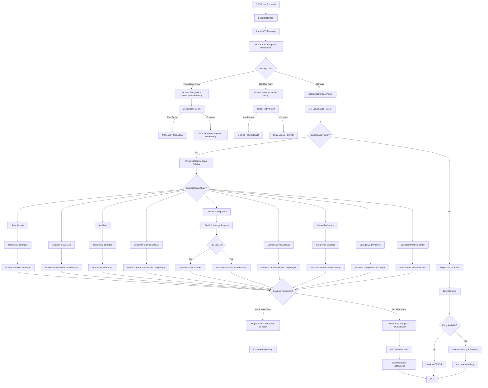
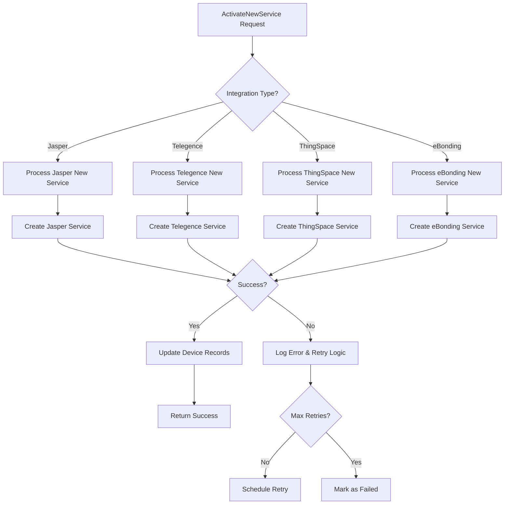
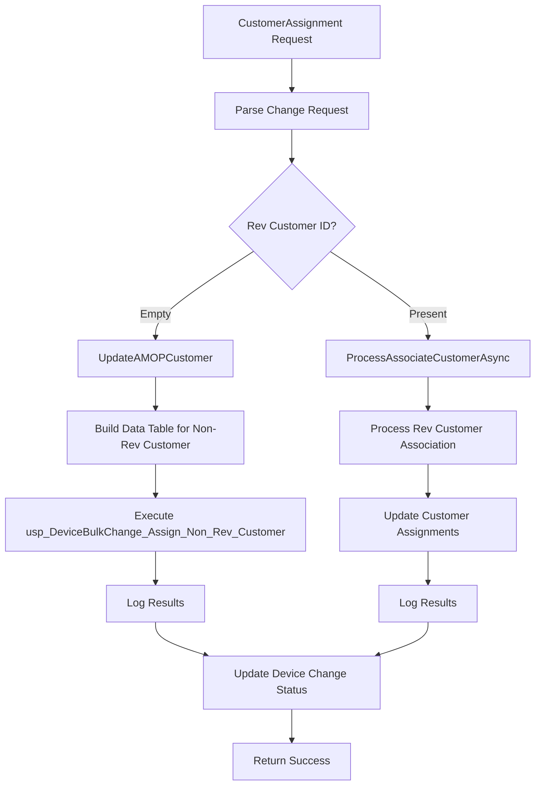
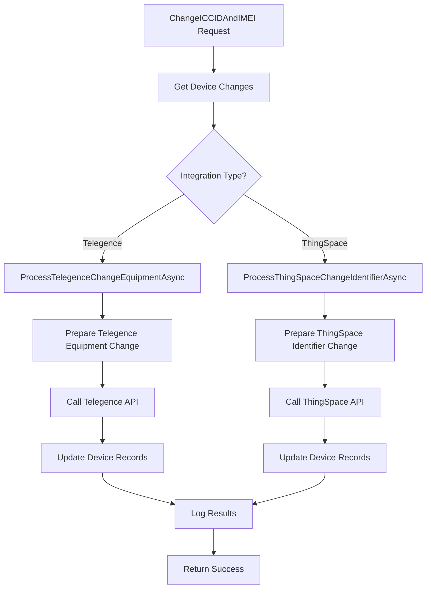
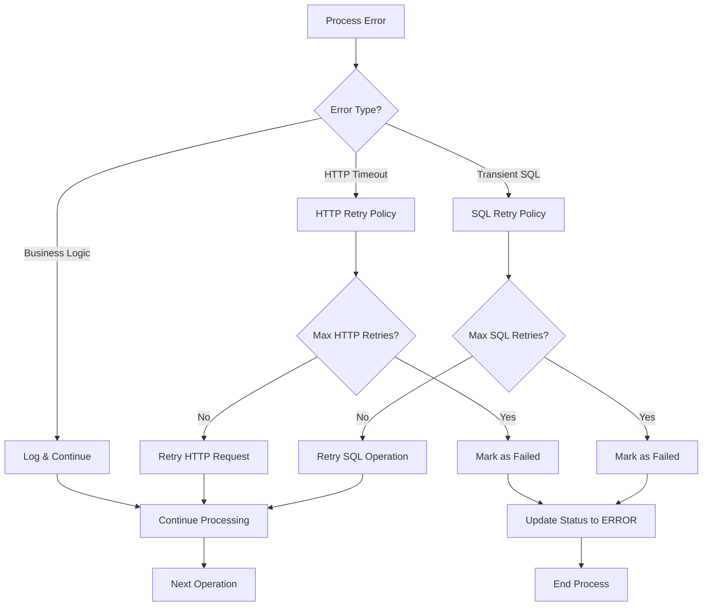
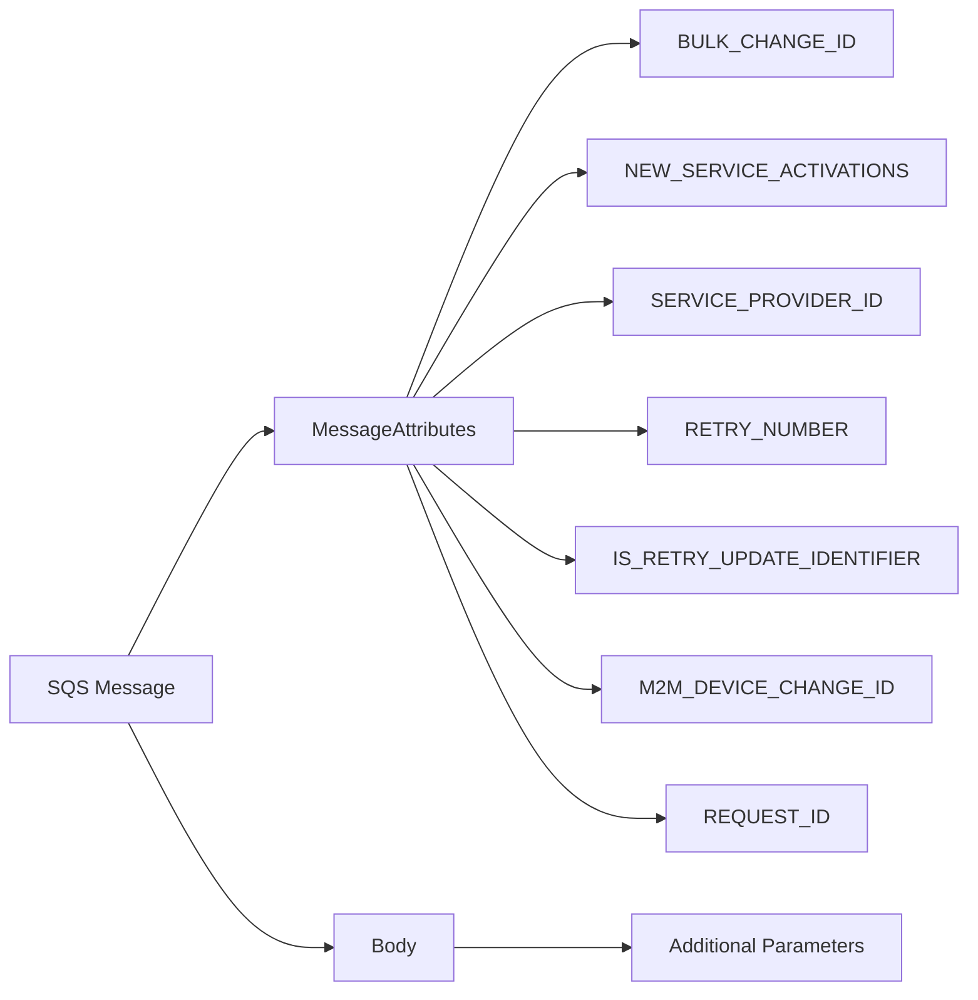
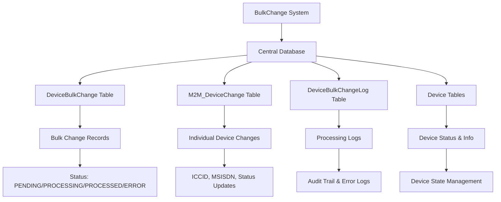
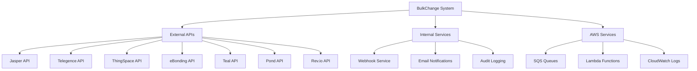

# BulkChange System Flow Diagram

## Overview
The BulkChange system is an AWS Lambda-based service that processes various types of device bulk operations through SQS messages. It handles different change request types with appropriate processing flows and error handling.

## Main Flow



## Change Request Types Detail

### 1. StatusUpdate Flow
```mermaid
graph TD
    A[StatusUpdate Request] --> B[Get Device Changes (PageSize)]
    B --> C{Integration Type?}
    C -->|Jasper| D[Process Jasper Status Update]
    C -->|Telegence| E[Process Telegence Status Update]
    C -->|ThingSpace| F[Process ThingSpace Status Update]
    C -->|eBonding| G[Process eBonding Status Update]
    C -->|Teal| H[Process Teal Status Update]
    C -->|Pond| I[Process Pond Status Update]
    
    D --> J[Update Device Status via Jasper API]
    E --> K[Update Device Status via Telegence API]
    F --> L[Update Device Status via ThingSpace API]
    G --> M[Update Device Status via eBonding API]
    H --> N[Update Device Status via Teal API]
    I --> O[Update Device Status via Pond API]
    
    J --> P[Log Results]
    K --> P
    L --> P
    M --> P
    N --> P
    O --> P
    P --> Q[Return Success/Failure]
```

### 2. ActivateNewService Flow


### 3. CustomerAssignment Flow


### 4. ChangeICCIDAndIMEI Flow


## Error Handling & Retry Logic



## SQS Message Structure



## Database Interactions



## Integration Points



## Performance Considerations

- **Batch Processing**: Device changes processed in configurable page sizes (default: 100)
- **Parallel Processing**: Configurable parallel request limits via environment variables
- **Retry Mechanisms**: Exponential backoff for transient failures
- **Memory Management**: Batch processing to avoid memory issues with large bulk changes
- **Queue Management**: SQS with delay mechanisms for retry scenarios

## Key Configuration

- `PageSize`: 100 (default batch size for device changes)
- `MAX_PARALLEL_REQUESTS`: Configurable parallel processing limit
- `SQL_TRANSIENT_RETRY_MAX_COUNT`: 3 retries for transient SQL errors
- `HTTP_RETRY_MAX_COUNT`: 3 retries for HTTP failures
- `NEW_SERVICE_ACTIVATION_MAX_COUNT`: 6 retries for new service activations
- `DELAY_IN_SECONDS_FIVE_SECONDS`: 5 second delay between batches
- `DELAY_IN_SECONDS_FIFTEEN_MINUTES`: 15 minute delay for ThingSpace retries