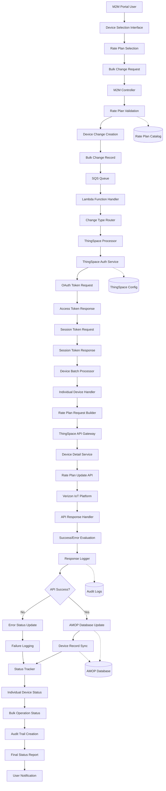

# Change Carrier Rate Plan Flow - ThingSpace Integration

## Overview

The Change Carrier Rate Plan flow is a bulk device management operation that updates carrier-level service plans for IoT devices through the Verizon ThingSpace API. This process enables organizations to modify device service capabilities, data allowances, and coverage areas while maintaining billing continuity and operational tracking.

## What - Purpose and Functionality

### ThingSpace Rate Plan Changes
The ThingSpace carrier rate plan change is a bulk operation that updates Verizon IoT device service plans through the ThingSpace API platform. It allows customers to modify data allowances, coverage areas, and service levels for their connected devices by calling the `UpdateThingSpaceDeviceDetailsAsync()` method with new rate plan specifications.

### Key Capabilities
- **Bulk Rate Plan Updates**: Update carrier rate plans for multiple devices simultaneously
- **ThingSpace Integration**: Direct integration with Verizon's IoT platform
- **Database Synchronization**: Ensures rate plan changes are reflected both in ThingSpace and local AMOP database
- **Error Handling & Logging**: Comprehensive logging and error handling for each device change

## Why - Business Requirements

### Business Need for ThingSpace Rate Plan Updates
Organizations need to optimize IoT device costs and service levels based on actual usage patterns and changing business requirements across their Verizon-connected device fleet. ThingSpace rate plan changes enable cost reduction by switching to more appropriate plans, geographic expansion by adding global coverage, and service optimization by upgrading or downgrading data allowances as needed.

### Operational Benefits
1. **Cost Management**: Switch devices to more cost-effective plans based on usage patterns
2. **Service Optimization**: Upgrade/downgrade data plans and coverage areas
3. **Operational Efficiency**: Bulk processing instead of individual device updates
4. **Audit Trail**: Complete logs of all rate plan changes for compliance
5. **Multi-Tenant Support**: Supports different service providers and customers

## How - Technical Implementation

### ThingSpace Implementation Process
The system authenticates with ThingSpace using OAuth credentials, then processes each device by creating a `ThingSpaceDeviceDetail` object with the target ICCID and new `CarrierRatePlan` value before calling the ThingSpace API. After successful API updates, the system synchronizes the changes to the local AMOP database using `deviceRepository.UpdateRatePlanAsync()` and logs all operations for audit trails and error tracking.

### Data Structure

```json
{
  "CarrierRatePlanUpdate": {
    "CarrierRatePlan": "premium_iot_plan",
    "EffectiveDate": "2024-01-01T00:00:00Z"
  }
}
```

### Processing Components

```csharp
// ThingSpace Device Detail Structure
var thingSpaceDeviceDetail = new ThingSpaceDeviceDetail
{
    ICCID = new List<string>() { change.DeviceIdentifier },
    CarrierRatePlan = carrierRatePlan.CarrierRatePlanUpdate.CarrierRatePlan,
};

// API Call
var result = await thingSpaceDeviceDetailService.UpdateThingSpaceDeviceDetailsAsync(
    thingSpaceDeviceDetail, environmentRepo, context.Context, context.logger);
```

## Complete Flow

### Whole Flow Overview
**User Interface** → **Rate Plan Selection** → **Device Selection** → **Plan Validation** → **Bulk Change Creation** → **Queue Processing (SQS)** → **Background Lambda Processing** → **Carrier Platform Routing** → **Authentication & Authorization** → **Device-by-Device Processing** → **Carrier API Execution** → **Database Synchronization** → **Status Tracking** → **Error Handling** → **Completion Processing** → **Audit Trail Creation** → **Rate Plan Activation Complete**

### Detailed Process Steps

#### 1. User Interface → Rate Plan Selection
User accesses the M2M device management portal and selects devices for carrier rate plan changes. User chooses the target carrier rate plan from available options and specifies effective date for the plan change.

#### 2. Request Validation → Plan Verification
System validates that the selected carrier rate plan exists in ThingSpace and is available for the service provider. System checks that all selected devices are eligible for rate plan changes and have required identifiers.

#### 3. Bulk Change Creation → Request Preparation
System creates a bulk change request record with carrier rate plan details and device list. System generates individual device change records for each selected device with the new rate plan information.

#### 4. Queue Processing → Background Execution
Bulk change request is queued for background processing to handle large device volumes efficiently. System retrieves the queued request and begins processing devices in batches to manage ThingSpace API limits.

#### 5. ThingSpace Authentication → Carrier Access
System authenticates with ThingSpace using stored OAuth credentials and API tokens. System verifies that write operations are enabled for the service provider account.

#### 6. Device-by-Device Processing → Individual Updates
For each device, system extracts the device identifier and new rate plan details from the change request. System calls ThingSpace API to update the device's service plan with the new rate plan configuration.

#### 7. ThingSpace API Execution → Service Plan Update
ThingSpace platform receives the rate plan change request and validates the device and plan combination. Verizon system updates the device's service configuration with the new rate plan, data allowances, and coverage settings.

#### 8. Database Synchronization → Local Record Update
After successful ThingSpace API response, system updates the internal device database with the new rate plan information. System maintains consistency between ThingSpace platform data and internal device management records.

#### 9. Status Tracking → Progress Monitoring
System logs the success or failure of each device update operation for audit purposes. System tracks overall bulk operation progress and updates the bulk change status accordingly.

#### 10. Completion Processing → Final Status
System marks successfully updated devices as processed and calculates overall bulk operation statistics. System updates the bulk change status to completed and notifies users of the final results.

## Data Flow Diagram



## Data Elements

### Input Data
- **Device Identifiers**: ICCID list for devices requiring rate plan changes
- **Target Rate Plan**: New carrier rate plan code (e.g., "premium_iot_plan")
- **Service Provider ID**: ThingSpace account identifier
- **Tenant Information**: Customer tenant for multi-tenant operations
- **Effective Date**: When the rate plan change should take effect

### Processing Data Structures
```json
{
  "BulkChangeCarrierRatePlanUpdate": {
    "CarrierRatePlanUpdate": {
      "CarrierRatePlan": "new_plan_code",
      "EffectiveDate": "2024-01-01T00:00:00Z"
    }
  },
  "ThingSpaceDeviceDetail": {
    "ICCID": ["123456789012345678"],
    "CarrierRatePlan": "premium_iot_plan"
  }
}
```

### API Data Exchange
- **Authentication Request**: Client credentials → OAuth access token
- **Session Request**: Access token → Session token for API calls
- **Device Update Request**: Device details + rate plan → ThingSpace API
- **Response Data**: Success confirmation or error details from Verizon

### Database Updates
- **Device Table**: Update carrier_rate_plan field with new plan code
- **Audit Logs**: Record all API calls, responses, and status changes
- **Bulk Change Status**: Track overall operation progress and completion
- **Error Records**: Store failure details for troubleshooting

## Error Handling

### Pre-flight Validation
- **Authentication Check**: Validates ThingSpace API credentials
- **Write Permissions**: Ensures service provider has write access enabled
- **Plan Existence**: Verifies rate plan codes exist in ThingSpace system
- **Device Validation**: Checks device eligibility for rate plan changes

### Individual Device Error Handling
- Each device processes independently - failures don't affect others
- Detailed error logging for troubleshooting
- Continuation of processing for remaining devices
- Status tracking for partial batch completions

### Comprehensive Logging
```json
{
  "BulkChangeId": 12345,
  "DeviceChangeId": 67890,
  "LogEntryDescription": "Update ThingSpace Rate Plan: ThingSpace API",
  "HasErrors": false,
  "RequestText": "API call details",
  "ResponseText": "API response details",
  "ProcessedDate": "2024-01-01T12:00:00Z",
  "ResponseStatus": "PROCESSED"
}
```

## Benefits

### Operational Efficiency
- **Scale Processing**: Handle thousands of devices in single operation
- **Partial Success**: Individual device failures don't affect batch completion
- **Performance**: Optimized for ThingSpace API rate limits

### Business Continuity
- **Service Continuity**: Plan changes maintain device connectivity
- **Billing Alignment**: Coordinates with billing cycle effective dates
- **Contract Compliance**: Ensures plan changes align with Verizon contracts

### Operational Visibility
- **Complete Audit Trail**: Every API call and database update logged
- **Status Tracking**: Real-time monitoring of bulk operation progress
- **Error Reporting**: Detailed error information for troubleshooting

## Conclusion

The Change Carrier Rate Plan flow for ThingSpace provides enterprise-grade capabilities for managing Verizon IoT device service plans, ensuring service continuity while enabling cost optimization and operational flexibility. The implementation maintains data consistency between ThingSpace and internal systems while providing comprehensive audit trails and error handling for reliable bulk operations.