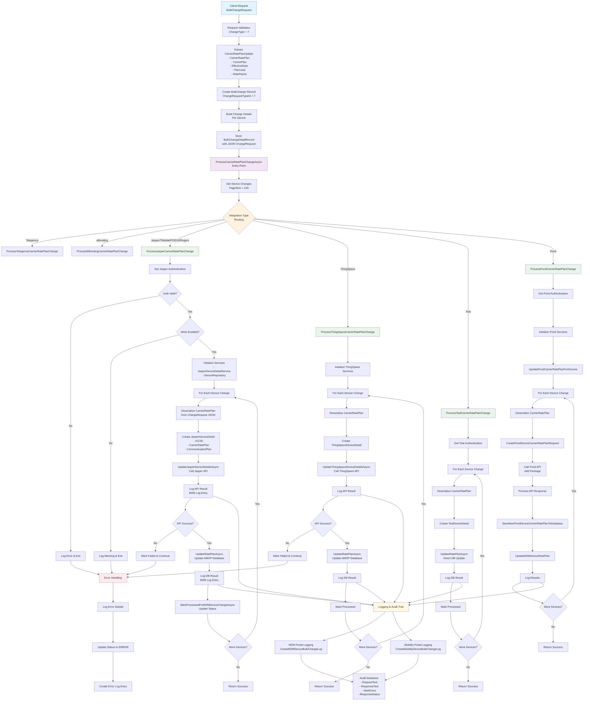
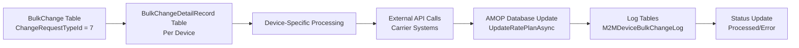

# CHANGE CARRIER RATEPLAN Data Flow Diagram

## Overview

This document provides a comprehensive dataflow diagram for the **CHANGE CARRIER RATEPLAN Change Type** (Type 7) process. This process handles changing the carrier-level rate plans for devices across different integration types including Jasper, ThingSpace, Teal, Pond, Telegence, and eBonding.

## Key Components

### Data Models

#### Input Request Structure
```csharp
public class BulkChangeRequest
{
    public int? ServiceProviderId { get; set; }
    public int? ChangeType { get; set; }           // 7 for CarrierRatePlanChange
    public bool? ProcessChanges { get; set; }
    public string[] Devices { get; set; }
    public CarrierRatePlanUpdate CarrierRatePlanUpdate { get; set; }
}

public class CarrierRatePlanUpdate
{
    public string CarrierRatePlan { get; set; }
    public string CommPlan { get; set; }
    public DateTime? EffectiveDate { get; set; }
    public string PlanUuid { get; set; }
    public long RatePlanId { get; set; }
}
```

#### Change Detail Record Structure
```csharp
public class BulkChangeDetailRecord
{
    public long Id { get; set; }
    public string DeviceIdentifier { get; set; }   // ICCID or MSISDN
    public long BulkChangeId { get; set; }
    public int ServiceProviderId { get; set; }
    public int IntegrationId { get; set; }
    public int TenantId { get; set; }
    public string ChangeRequest { get; set; }      // JSON serialized carrier rate plan update
    public int ChangeRequestTypeId { get; set; }   // 7 for CarrierRatePlanChange
}
```

## Complete Data Flow Diagram



## Integration-Specific Processing Details

### 1. Jasper Integration (Most Common)
```
Input Data:
├── CarrierRatePlan (string)
├── CommunicationPlan (string)
└── EffectiveDate (DateTime?)

Process Flow:
1. Authentication Validation
2. Write Permission Check
3. API Call to Jasper
4. Database Update (AMOP)
5. Status Logging

API Endpoints:
└── UpdateJasperDeviceDetailsAsync()
```

### 2. ThingSpace Integration
```
Input Data:
├── CarrierRatePlan (string)
└── EffectiveDate (DateTime?)

Process Flow:
1. Service Initialization
2. API Call to ThingSpace
3. Database Update (AMOP)
4. Status Logging

API Endpoints:
└── UpdateThingSpaceDeviceDetailsAsync()
```

### 3. Teal Integration
```
Input Data:
├── PlanUuid (string)
└── CarrierRatePlan (string)

Process Flow:
1. Authentication Check
2. Direct Database Update
3. Status Logging

Database Operations:
└── UpdateRatePlanAsync() - Direct AMOP Update
```

### 4. Pond Integration
```
Input Data:
├── RatePlanId (long)
└── CarrierRatePlan (string)

Process Flow:
1. Authentication Setup
2. API Call to Pond (Add Package)
3. Save Pond Response to Database
4. Update AMOP Database
5. Status Logging

API Endpoints:
└── Pond API - Add Package Request
```

## Database Operations Flow



### Key Database Tables
1. **BulkChange** - Master change record
2. **BulkChangeDetailRecord** - Individual device changes
3. **M2MDeviceBulkChangeLog** - Audit trail and logging
4. **Device Tables** - Final rate plan assignments

## Error Handling & Logging

### Error Types
1. **Authentication Failures**
   - Invalid credentials
   - Expired tokens
   - Missing authentication data

2. **API Failures**
   - Carrier system unavailable
   - Invalid rate plan codes
   - Network timeouts

3. **Database Failures**
   - Connection issues
   - Constraint violations
   - Transaction failures

### Logging Structure
```csharp
CreateM2MDeviceBulkChangeLog {
    BulkChangeId: long,
    M2MDeviceChangeId: long,
    LogEntryDescription: string,
    ProcessBy: "AltaworxDeviceBulkChange",
    RequestText: string,              // API request details
    ResponseText: string,             // API response
    HasErrors: boolean,
    ResponseStatus: BulkChangeStatus, // PROCESSED, ERROR, PENDING
    ProcessedDate: DateTime
}
```

## Performance Considerations

### Batch Processing
- **Page Size**: 100 devices per batch
- **Parallel Processing**: Up to 10 concurrent requests
- **Retry Logic**: 3 attempts for transient failures

### Optimization Features
- Connection pooling for database operations
- HTTP retry policies for API calls
- Async/await pattern throughout
- Bulk logging operations

## Integration Constants

### Change Type
```csharp
public enum ChangeRequestType {
    CarrierRatePlanChange = 7
}
```

### Integration Types
```csharp
public enum IntegrationType {
    Telegence = 1,
    eBonding = 2,
    Jasper = 3,
    ThingSpace = 4,
    Teal = 5,
    Pond = 6,
    TMobileJasper = 7,
    POD19 = 8,
    Rogers = 9
}
```

### Processing Status
```csharp
public enum BulkChangeStatus {
    PENDING,
    PROCESSED,
    ERROR
}
```

## Security & Compliance

### Authentication Methods
- **Jasper**: Username/Password + API Keys
- **ThingSpace**: OAuth Token-based
- **Teal**: API Key authentication
- **Pond**: Token-based authentication

### Data Protection
- Encrypted connection strings
- Sanitized logging (no credentials)
- Tenant-level isolation
- Audit trail maintenance

## Monitoring & Metrics

### Key Metrics
1. **Processing Time**: Average time per device change
2. **Success Rate**: Percentage of successful changes
3. **Error Rate**: Failed changes by integration type
4. **Throughput**: Devices processed per minute

### Alerting
- Failed authentication attempts
- High error rates (>5%)
- Processing time exceeding thresholds
- API availability issues