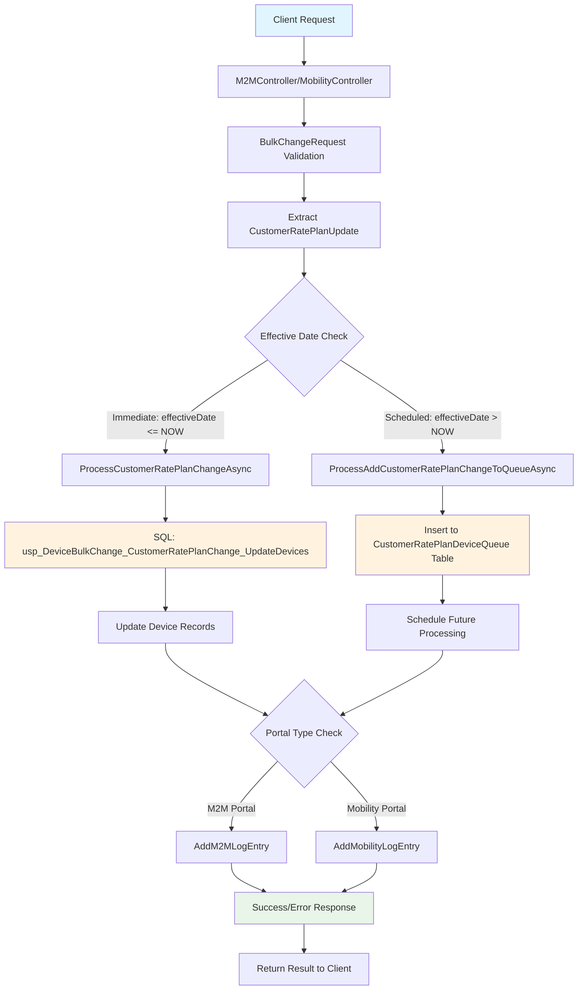

# Custom Rate Plan Change Type - Data Flow Diagram

## Overview

This document provides a comprehensive data flow diagram for **Custom Rate Plan Changes** (ChangeRequestType = 4). The custom rate plan change allows customers to modify their rate plans, data allocations, and pool assignments for IoT devices through both immediate and scheduled processing.

## System Architecture Components

### Core Components
- **Client Interface**: M2M Portal / Mobility Portal
- **API Layer**: M2MController.cs
- **Processing Engine**: AltaworxDeviceBulkChange.cs 
- **Database Layer**: SQL Server with Stored Procedures
- **Queue System**: CustomerRatePlanDeviceQueue Table
- **Logging System**: DeviceBulkChangeLog Tables

### Data Models
- **BulkChangeRequest**: Main request container
- **BulkChangeCustomerRatePlanUpdate**: Rate plan specific data
- **DeviceChangeResult**: Processing result wrapper

## Detailed Data Flow Diagram



## Processing Flow Steps

### 1. Request Initiation
```
Client → BulkChangeRequest → CustomerRatePlanUpdate
```

**Input Parameters:**
- `CustomerRatePlanId` (int?): Target customer rate plan identifier
- `CustomerDataAllocationMB` (decimal?): Data allocation limit in megabytes
- `CustomerPoolId` (int?): Shared pool identifier for data sharing
- `EffectiveDate` (DateTime?): When the change should take effect

### 2. Request Processing Pipeline

#### Step 2.1: Validation and Parsing
```csharp
// Extract from BulkChangeRequest
var changeRequest = JsonConvert.DeserializeObject<BulkChangeRequest>(change.ChangeRequest);
var customerRatePlanId = changeRequest?.CustomerRatePlanUpdate?.CustomerRatePlanId;
var customerRatePoolId = changeRequest?.CustomerRatePlanUpdate?.CustomerPoolId;
var effectiveDate = changeRequest?.CustomerRatePlanUpdate?.EffectiveDate;
var customerDataAllocationMB = changeRequest?.CustomerRatePlanUpdate?.CustomerDataAllocationMB;
```

#### Step 2.2: Effective Date Decision Logic
```csharp
if (effectiveDate == null || effectiveDate?.ToUniversalTime() <= DateTime.UtcNow)
{
    // Immediate Processing Path
    dbResult = await ProcessCustomerRatePlanChangeAsync(bulkChange.Id, 
        customerRatePlanId, effectiveDate, customerDataAllocationMB, 
        customerRatePoolId, context.CentralDbConnectionString, context.logger, syncPolicy);
}
else
{
    // Scheduled Processing Path
    dbResult = await ProcessAddCustomerRatePlanChangeToQueueAsync(bulkChange, 
        customerRatePlanId, effectiveDate, customerDataAllocationMB, 
        customerRatePoolId, context);
}
```

### 3. Immediate Processing Path

#### Database Operation
```sql
EXEC usp_DeviceBulkChange_CustomerRatePlanChange_UpdateDevices
    @bulkChangeId = @bulkChangeId,
    @customerRatePlanId = @customerRatePlanId,
    @customerRatePoolId = @customerRatePoolId,
    @customerDataAllocationMB = @customerDataAllocationMB,
    @effectiveDate = @effectiveDate,
    @needToMarkProcessed = @needToMarkProcessed
```

#### Parameters Mapping
- `@bulkChangeId`: Bulk change identifier for tracking
- `@customerRatePlanId`: New rate plan to assign
- `@customerRatePoolId`: Pool assignment for shared data
- `@customerDataAllocationMB`: Data limit allocation
- `@effectiveDate`: Implementation timestamp
- `@needToMarkProcessed`: Flag to mark change as completed

### 4. Scheduled Processing Path

#### Queue Table Structure
```
CustomerRatePlanDeviceQueue Table:
├── Id (Primary Key)
├── DeviceId (Target device)
├── CustomerRatePlanId (Plan to apply)
├── CustomerRatePoolId (Pool assignment)
├── CustomerDataAllocationMB (Data limit)
├── EffectiveDate (Scheduled time)
├── PortalType (M2M/Mobility)
├── TenantId (Customer scope)
├── CreatedBy (Process identifier)
├── CreatedDate (Queue timestamp)
├── ModifiedBy (Last modifier)
├── ModifiedDate (Last modification)
└── IsActive (Active status)
```

#### Queue Processing Logic
```csharp
foreach (var change in changes)
{
    var dr = table.NewRow();
    dr[1] = change.DeviceId;                    // DeviceId
    dr[2] = customerRatePlanId;                 // CustomerRatePlanId
    dr[3] = customerRatePoolId;                 // CustomerRatePoolId
    dr[4] = customerDataAllocationMB;           // CustomerDataAllocationMB
    dr[5] = effectiveDate;                      // EffectiveDate
    dr[6] = bulkChange.PortalTypeId;           // PortalType
    dr[7] = bulkChange.TenantId;               // TenantId
    dr[8] = "AWS Lambda - Device Bulk Change"; // CreatedBy
    dr[9] = DateTime.UtcNow;                   // CreatedDate
    dr[12] = true;                             // IsActive
    table.Rows.Add(dr);
}
```

### 5. Individual Device Processing

For single device updates:
```sql
EXEC usp_DeviceBulkChange_CustomerRatePlanChange_UpdateDeviceByNumber
    @bulkChangeId = @bulkChangeId,
    @subscriberNumber = @subscriberNumber,
    @customerRatePlanId = @customerRatePlanId,
    @customerRatePoolId = @customerRatePoolId,
    @effectiveDate = @effectiveDate,
    @customerDataAllocationMB = @customerDataAllocationMB
```

### 6. Logging and Audit Trail

#### M2M Portal Logging
```csharp
logRepo.AddM2MLogEntry(new CreateM2MDeviceBulkChangeLog()
{
    BulkChangeId = bulkChange.Id,
    M2MDeviceChangeId = change.Id,
    LogEntryDescription = "Change Customer Rate Plan: Update AMOP",
    ProcessBy = "AltaworxDeviceBulkChange",
    RequestText = dbResult.ActionText + Environment.NewLine + dbResult.RequestObject,
    ResponseText = dbResult.ResponseObject,
    HasErrors = dbResult.HasErrors,
    ResponseStatus = dbResult.HasErrors ? BulkChangeStatus.ERROR : BulkChangeStatus.PROCESSED
});
```

#### Mobility Portal Logging
```csharp
logRepo.AddMobilityLogEntry(new CreateMobilityDeviceBulkChangeLog()
{
    BulkChangeId = bulkChange.Id,
    MobilityDeviceChangeId = change.Id,
    LogEntryDescription = "Change Customer Rate Plan: Update AMOP",
    ProcessBy = "AltaworxDeviceBulkChange",
    RequestText = dbResult.ActionText + Environment.NewLine + dbResult.RequestObject,
    ResponseText = dbResult.ResponseObject,
    HasErrors = dbResult.HasErrors,
    ResponseStatus = dbResult.HasErrors ? BulkChangeStatus.ERROR : BulkChangeStatus.PROCESSED
});
```

## Technical Specifications

### Change Request Type
```csharp
ChangeRequestType.CustomerRatePlanChange = 4
```

### Processing Constants
```csharp
// Stored Procedure Names
DEVICE_BULK_CHANGE_CUSTOMER_RATE_PLAN_CHANGE_UPDATE_DEVICE
DEVICE_BULK_CHANGE_CUSTOMER_RATE_PLAN_CHANGE_UPDATE_DEVICE_BY_NUMBER

// Table Names
CustomerRatePlanDeviceQueueTable

// Portal Types
PortalTypeM2M = 0
PortalTypeMobility = 2

// Processing Limits
PageSize = 100
SQL_TRANSIENT_RETRY_MAX_COUNT = 3
```

### Error Handling

#### Validation Errors
- Invalid customer rate plan ID
- Invalid data allocation values (negative or excessive)
- Missing required parameters
- Invalid effective date (past dates for scheduling)
- Insufficient permissions for tenant/customer

#### Processing Errors
- Database connection failures
- Stored procedure execution errors
- Transaction rollback scenarios
- Concurrent modification conflicts
- Network timeouts during API calls

#### Error Response Structure
```csharp
public class DeviceChangeResult<string, string>
{
    public string ActionText { get; set; }        // Action performed
    public bool HasErrors { get; set; }           // Error flag
    public string RequestObject { get; set; }     // Request details
    public string ResponseObject { get; set; }    // Response/Error details
}
```

## Security and Performance Considerations

### Security Features
- **Tenant Isolation**: All operations scoped to specific tenant
- **Role-Based Access**: User permissions validated
- **Audit Logging**: Complete trail of all changes
- **Parameter Validation**: SQL injection prevention
- **Connection Security**: Encrypted database connections

### Performance Optimizations
- **Bulk Processing**: Multiple devices updated in single transaction
- **Connection Pooling**: Efficient database connection management
- **Retry Policies**: Transient error handling with exponential backoff
- **Asynchronous Operations**: Non-blocking processing
- **Batch Queue Processing**: Efficient scheduled change handling

### Monitoring Points
- Processing time metrics
- Error rate tracking
- Queue depth monitoring
- Database performance metrics
- Success/failure ratios

## Integration Points

### Portal Integration
- **M2M Portal**: Primary device management interface
- **Mobility Portal**: Mobile device specific management
- **Admin Portal**: Tenant and rate plan configuration

### Database Integration
- **Device Tables**: Core device information and assignments
- **Customer Tables**: Rate plan definitions and configurations
- **Queue Tables**: Scheduled change management
- **Log Tables**: Comprehensive audit and error tracking

### External Service Integration
- **Billing Systems**: Rate plan billing synchronization
- **Usage Monitoring**: Data allocation and consumption tracking
- **Notification Services**: Change confirmation and alerts

## Future Enhancements

### Planned Improvements
1. **Real-time Notifications**: Instant customer notifications for rate plan changes
2. **Advanced Scheduling**: Support for recurring rate plan modifications
3. **Bulk Import**: CSV/Excel file support for mass rate plan updates
4. **API Webhooks**: External system integration capabilities
5. **Analytics Dashboard**: Rate plan change trends and reporting

### Scalability Considerations
1. **Microservice Architecture**: Decomposition for better scalability
2. **Event-Driven Processing**: Asynchronous event sourcing
3. **Caching Layer**: Rate plan data caching for performance
4. **Load Balancing**: Distributed processing across multiple instances
5. **Database Sharding**: Horizontal scaling for large device volumes

---

*This document provides the complete data flow specification for Custom Rate Plan Changes in the AltaWorx Device Management System.*