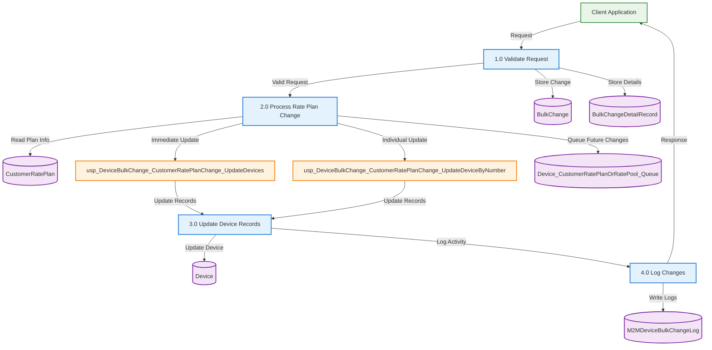

# Customer Rate Plan Change - Basic Data Flow Diagram

## Data Stores
- **BulkChange** - Main change request
- **BulkChangeDetailRecord** - Device-specific changes
- **Device** - Device information and rate plans
- **Device_CustomerRatePlanOrRatePool_Queue** - Scheduled changes
- **CustomerRatePlan** - Rate plan definitions
- **M2MDeviceBulkChangeLog** - Audit trail

## Stored Procedures
- **usp_DeviceBulkChange_CustomerRatePlanChange_UpdateDevices**
- **usp_DeviceBulkChange_CustomerRatePlanChange_UpdateDeviceByNumber**

## Process Summary
1. **Validate Request** - Check input and permissions
2. **Process Rate Plan Change** - Handle immediate or queue scheduled
3. **Update Device Records** - Execute database changes
4. **Log Changes** - Record audit trail and respond