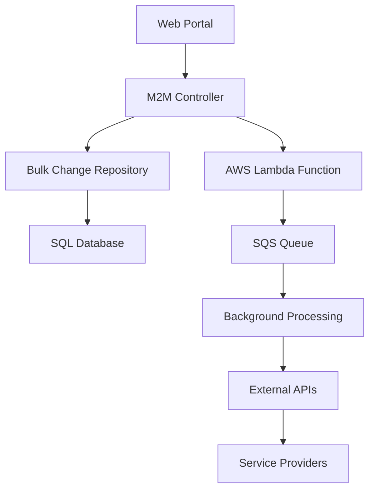
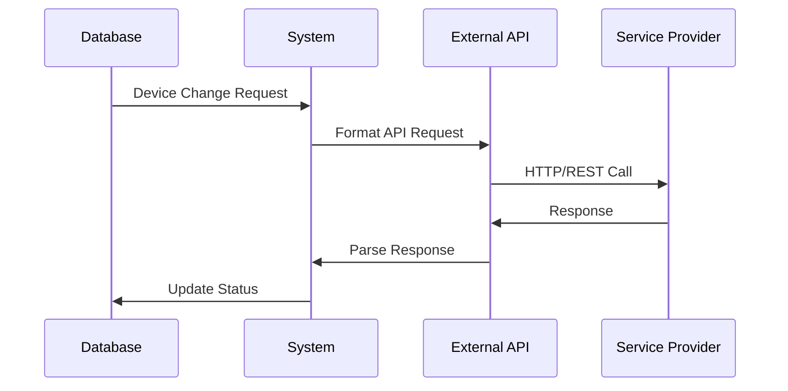

# Data Flow Documentation

## Overview

This document describes the data flow patterns in the Altaworx Device Bulk Change system, which manages device lifecycle operations for M2M (Machine-to-Machine) and Mobility services. The system processes bulk changes for devices across multiple service providers and portals.

## System Architecture

### Core Components



### Data Entities

#### Primary Data Models

**BulkChange**
```csharp
{
    Id: long,
    ServiceProviderId: int,
    ChangeType: int,
    ProcessChanges: bool,
    Devices: string[],
    PortalTypeId: int,
    Status: string,
    CreatedDate: DateTime,
    ProcessedDate: DateTime
}
```

**BulkChangeDetailRecord**
```csharp
{
    Id: long,
    BulkChangeId: long,
    MSISDN: string,
    ICCID: string,
    DeviceIdentifier: string,
    Status: string,
    ChangeRequest: string,
    ChangeRequestType: string,
    ServiceProviderId: int,
    TenantId: int
}
```

## Data Flow Patterns

### 1. Request Ingestion Flow

#### Entry Points
- **M2M Portal**: Device inventory management
- **Mobility Portal**: Mobile device management  
- **API Endpoints**: Direct API calls

#### Data Path
```
Portal Request → Controller Validation → Repository Layer → Database Storage
```

**Request Structure:**
```json
{
    "serviceProviderId": 123,
    "changeType": 4,
    "processChanges": true,
    "devices": ["ICCID1", "ICCID2", "IMEI1"],
    "customerRatePlanUpdate": {
        "customerRatePlanId": 456,
        "customerDataAllocationMB": 1024,
        "customerPoolId": 789,
        "effectiveDate": "2024-01-01T00:00:00Z"
    }
}
```

### 2. Processing Pipeline Flow

#### Immediate Processing
```
Request → Validation → Database Update → External API Call → Response Logging
```

#### Scheduled Processing  
```
Request → Validation → Queue Storage → Scheduled Execution → Database Update
```

#### Async Processing
```
SQS Message → Lambda Trigger → Bulk Processing → Status Update → Notification
```

### 3. Data Transformation Flow

#### Customer Rate Plan Changes
```
Input: CustomerRatePlanUpdate
↓
Validation: Plan ID, Data Allocation, Pool ID
↓
Transformation: Convert to SQL Parameters
↓
Storage: Execute usp_DeviceBulkChange_CustomerRatePlanChange_UpdateDevices
↓
Output: Device Change Records
```

#### Device Status Changes
```
Input: Device Identifiers + New Status
↓
Lookup: Current Device State
↓
Validation: Status Transition Rules
↓
API Call: External Service Provider
↓
Update: Device Status in Database
↓
Logging: Change Audit Trail
```

### 4. External Integration Flow

#### Service Provider APIs


#### Supported Integrations
- **Jasper**: IoT connectivity platform
- **ThingSpace**: Verizon IoT platform
- **Telegence**: Device management service
- **Teal**: Communication services
- **Pond**: Data connectivity
- **Rev Customer**: Customer management

### 5. Queue-Based Processing Flow

#### SQS Message Structure
```json
{
    "bulkChangeId": 12345,
    "m2mDeviceChangeId": 67890,
    "retryNumber": 0,
    "isRetryNewActivateThingSpaceDevice": false,
    "isFromAutomatedUpdateDeviceStatusLambda": false,
    "requestId": "uuid-string"
}
```

#### Processing Pipeline
```
SQS Message → Lambda Function → Message Parsing → Business Logic → Database Update
```

### 6. Data Storage Patterns

#### Primary Storage
- **Central Database**: Core device and change data
- **Tenant Databases**: Multi-tenant data isolation
- **Log Tables**: Audit and debugging information

#### Storage Operations
```sql
-- Bulk Change Creation
INSERT INTO BulkChange (ServiceProviderId, ChangeType, ...)

-- Device Change Details
INSERT INTO M2M_DeviceChange (BulkChangeId, ICCID, ChangeRequest, ...)

-- Status Updates
UPDATE M2M_DeviceChange SET Status = 'PROCESSED' WHERE Id = @id

-- Logging
INSERT INTO DeviceBulkChangeLog (BulkChangeId, LogEntryDescription, ...)
```

### 7. Error Handling and Retry Flow

#### Error Categories
- **Validation Errors**: Invalid input data
- **Integration Errors**: External API failures  
- **Database Errors**: SQL execution failures
- **Business Logic Errors**: Rule violations

#### Retry Mechanisms
```
Error Detection → Error Classification → Retry Policy Application → Re-queue or Fail
```

**Retry Policies:**
- SQL Transient Errors: 3 retries with exponential backoff
- HTTP Errors: 3 retries with fixed intervals
- Service Activation: 6 retries for new activations

### 8. Logging and Audit Flow

#### Log Data Structure
```csharp
{
    BulkChangeId: long,
    DeviceChangeId: long,
    LogEntryDescription: string,
    ProcessBy: string,
    RequestText: string,
    ResponseText: string,
    HasErrors: bool,
    ResponseStatus: BulkChangeStatus,
    CreatedDate: DateTime
}
```

#### Audit Trail
```
Request → Processing → External API → Response → Log Entry → Audit Database
```

## Data Security and Compliance

### Security Measures
- **Encrypted Connections**: All database connections use encryption
- **Sanitized Logging**: Sensitive data excluded from logs  
- **Access Control**: Role-based permissions
- **Input Validation**: Comprehensive parameter validation

### Data Protection
- **Multi-Tenant Isolation**: Tenant-scoped data access
- **Audit Trails**: Complete change history
- **Data Retention**: Configurable retention policies

## Performance Optimization

### Batch Processing
- **Bulk Operations**: Process multiple devices simultaneously
- **Connection Pooling**: Reuse database connections
- **Parallel Processing**: Concurrent API calls

### Caching Strategies
- **Configuration Caching**: Rate plan and status lookups
- **Connection Caching**: Database connection reuse
- **Response Caching**: API response caching where appropriate

### Monitoring and Metrics
- **Processing Times**: Track operation duration
- **Error Rates**: Monitor failure percentages  
- **Queue Depths**: SQS message backlog monitoring
- **API Response Times**: External service performance

## Data Lifecycle Management

### Creation
```
User Request → Validation → Database Insert → Queue Message → Processing
```

### Processing
```
Queue Message → Business Logic → External API → Status Update → Completion
```

### Archival
```
Completed Changes → Retention Check → Archive Process → Historical Storage
```

### Cleanup
```
Old Records → Retention Policy → Soft Delete → Permanent Removal
```

## Integration Data Formats

### Internal Format
- **JSON**: API requests and responses
- **SQL**: Database operations
- **XML**: Legacy system integration

### External Formats
- **REST/JSON**: Modern API integrations
- **SOAP/XML**: Legacy service providers
- **CSV**: Bulk data exchange
- **EDI**: B2B communications

## Scalability Considerations

### Horizontal Scaling
- **Lambda Functions**: Auto-scaling processing
- **SQS Queues**: Distributed message processing
- **Database Sharding**: Tenant-based partitioning

### Vertical Scaling
- **Database Optimization**: Index tuning and query optimization
- **Connection Pooling**: Efficient resource utilization
- **Caching Layers**: Reduce database load

## Disaster Recovery

### Backup Strategies
- **Database Backups**: Regular automated backups
- **Queue Persistence**: SQS message durability
- **Log Retention**: Audit trail preservation

### Recovery Procedures
- **Point-in-Time Recovery**: Database restoration
- **Message Replay**: Queue message reprocessing
- **State Reconstruction**: Rebuild processing state

---

*This document provides a comprehensive overview of data flows in the Altaworx Device Bulk Change system. For specific implementation details, refer to the individual component documentation and source code.*