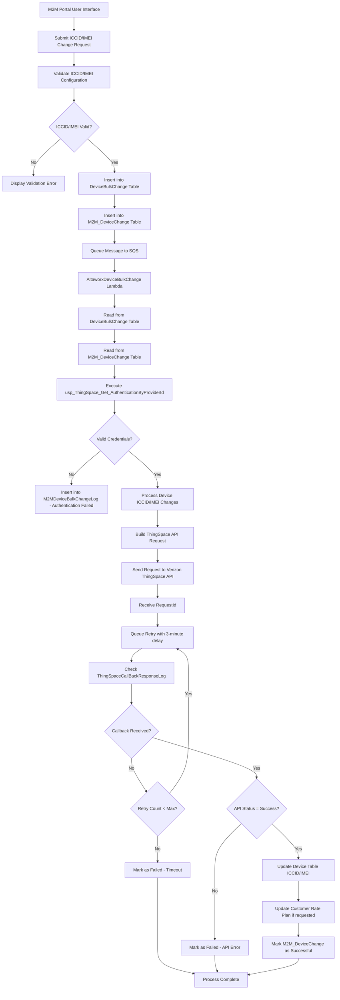

# Accurate ICCID/IMEI Change Flow for Verizon ThingSpace IoT

## Overview
This document describes the accurate process flow for changing ICCID/IMEI identifiers using Verizon ThingSpace API with callback-based async processing and retry mechanisms.

## Phase 1: User Request (Frontend)

### User Interface Flow:
1. **User selects "Change Identifier" option** from M2M Portal interface
2. **User provides the following information:**
   - **Old ICCID/IMEI** (current identifier to be changed)
   - **New ICCID/IMEI** (replacement identifier)
   - **Identifier Type** (ICCID or IMEI enum selection)
   - **Optional: Customer Rate Plan changes** (true/false flag)
   - **Optional: Effective Date** (when the change should take effect)
3. **Frontend sends PostChangeIdentifier request** to M2MController

## Phase 2: Controller Processing (M2MController.cs)

### Validation Process:
1. **Check old identifier exists in Device table**
   - Query Device table using provided identifier (EID or MSISDN)
   - Return validation error if device not found

2. **Verify device is active status** 
   - Check `DeviceStatu.IsActiveStatus` property
   - Return validation error if device is not in active status

3. **Validate new identifier format**
   - **ICCID validation**: 19-20 digits, numeric only
   - **IMEI validation**: 15 digits, numeric only
   - Return format error if validation fails

4. **Check new identifier not already in use**
   - Query Device table for existing ICCID/IMEI
   - Return duplicate error if identifier already exists

### Object Creation:
**a. BulkChangeUpdateIdentifier object creation:**
```csharp
{
    OldICCID = device.ICCID,           // Current ICCID value
    OldIMEI = device.IMEI,             // Current IMEI value  
    NewICCID = newICCID,               // New ICCID value (if ICCID change)
    NewIMEI = newIMEI,                 // New IMEI value (if IMEI change)
    IdentifierType = identifierType,    // ICCID or IMEI enum
    AddCustomerRatePlan = model.IsChangeCustomerRatePlan,  // true/false
    CustomerRatePlan = model.CustomerRatePlanId.ToString(),
    CustomerRatePool = model.CustomerRatePoolId.ToString()
}
```

**b. M2M_DeviceChange record creation:**
- Contains serialized JSON of change request
- Links to Device.id and current ICCID
- Sets initial status to "NEW"

### Database Operations:
- Create `DeviceBulkChange` record with status "NEW"
- Create `M2M_DeviceChange` records for each validated device
- Queue SQS message for Lambda processing

## Phase 3: Lambda Processing (ProcessChangeICCIDorIMEI.cs)

### Step A: Authentication Setup
```csharp
// Get ThingSpace authentication and tokens
var thingSpaceAuthentication = ThingSpaceCommon.GetThingspaceAuthenticationInformation(context.CentralDbConnectionString, bulkChange.ServiceProviderId);
var accessToken = ThingSpaceCommon.GetAccessToken(thingSpaceAuthentication);
var sessionToken = ThingSpaceCommon.GetSessionToken(thingSpaceAuthentication, accessToken);
```

### Step B: For each device change:

### Step C: Build ThingSpace request structure:
```csharp
{
    DeviceIds: [
        {
            Id: oldIdentifier,     // Current ICCID/IMEI
            Kind: "iccid"          // or "imei"
        }
    ],
    DeviceIdsTo: [
        {
            Id: newIdentifier,     // New ICCID/IMEI  
            Kind: "iccid"          // or "imei"
        }
    ],
    Change4gOption: "ChangeICCID"  // or "ChangeIMEI"
}
```

### Step D: Call ThingSpace API:
```csharp
var apiResult = await ThingSpaceCommon.PutUpdateIdentifierAsync(
    thingSpaceAuthentication, 
    thingSpaceChangeIdentifierRequest, 
    accessToken, 
    sessionToken, 
    ThingSpaceChangeIdentifierPath, 
    context.logger, 
    httpClientFactory, 
    httpRequestFactory
);
```

**API Response Processing:**
- **Receive requestId** for async tracking from `apiResult.ResponseObject`
- **Log API call with requestId** to M2MDeviceBulkChangeLog
- Store requestId for callback correlation

### Step E: Queue retry mechanism:
```csharp
// Set 3-minute delay for callback check
await EnqueueDeviceBulkChangesAsync(
    context, 
    bulkChange.Id, 
    DeviceBulkChangeQueueUrl, 
    CommonConstants.DELAY_IN_SECONDS_THREE_MINUTES, // 3 minutes
    0, // Initial retry count
    isRetryUpdateIdentifier: true, 
    m2mDeviceChangeId: deviceChange.Id, 
    requestId: apiResult.ResponseObject
);

// Mark device as "processing" status
await MarkProcessedForM2MDeviceChangeAsync(
    context, 
    deviceChange.Id, 
    true, 
    "Waiting for ThingSpace callback response", 
    isDeviceChangeProcessing: true
);
```

## Phase 4: Callback Handling & Retry (RetryUpdateIdentifierProcess)

### Step A: Check ThingSpaceCallBackResponseLog table
```csharp
var thingSpaceCallBackLog = GetThingSpaceCallbackLog(context, sqsValues.RequestId);
```

### Step B: IF callback received:
**Parse APIStatus from callback response**

#### IF Success (APIStatus = "success"):
1. **Update Device table with new identifier:**
   ```csharp
   var resultUpdateIdentifier = UpdateIdentifierForThingSpace(context, m2mDeviceChange, deviceChangeRequest);
   ```

2. **Call UpdateIdentifierForThingSpace stored procedure** (detailed in Phase 5)

3. **Update customer rate plan if requested:**
   ```csharp
   if (deviceChangeRequest.AddCustomerRatePlan) {
       resultUpdateCustomerRatePlan = await UpdateCustomerRatePlan(context, logRepo, bulkChangeId, m2mDeviceChange, deviceChangeRequest);
   }
   ```

4. **Mark M2M_DeviceChange as successful:**
   ```csharp
   await MarkProcessedForM2MDeviceChangeAsync(context, m2mDeviceChangeId, true, "DEVICE_CHANGE_IDENTIFIER SUCCESSFUL");
   ```

#### IF Failure (APIStatus != "success"):
- **Mark M2M_DeviceChange as failed with error message:**
  ```csharp
  await MarkProcessedForM2MDeviceChangeAsync(context, m2mDeviceChangeId, false, thingSpaceCallBackLog.APIResponse);
  ```

### Step C: IF no callback yet:
#### Retry Logic:
```csharp
if (sqsValues.RetryNumber >= THINGSPACE_UPDATE_DEVICE_STATUS_RETRY_NUMBER) {
    // Mark as failed due to timeout
    await MarkProcessedForM2MDeviceChangeAsync(context, m2mDeviceChangeId, false, "Timeout - No callback received");
} else {
    // Increment retry counter and re-queue with longer delay
    await EnqueueDeviceBulkChangesAsync(
        context, 
        bulkChangeId, 
        DeviceBulkChangeQueueUrl, 
        CommonConstants.DELAY_IN_SECONDS_THREE_MINUTES, 
        sqsValues.RetryNumber + 1,  // Increment retry count
        isRetryUpdateIdentifier: true, 
        m2mDeviceChangeId: m2mDeviceChangeId, 
        requestId: sqsValues.RequestId
    );
}
```

## Phase 5: Database Updates

### UpdateIdentifierForThingSpace Stored Procedure:
```sql
UPDATE Device 
SET 
    ICCID = CASE 
        WHEN @IdentifierType = 'ICCID' THEN @NewICCID 
        ELSE ICCID 
    END,
    IMEI = CASE 
        WHEN @IdentifierType = 'IMEI' THEN @NewIMEI 
        ELSE IMEI 
    END,
    ModifiedDate = GETUTCDATE(),
    ModifiedBy = 'AltaworxDeviceBulkChange'
WHERE Id = @DeviceId
```

### Parameters:
- `@DeviceId`: Device table primary key
- `@IdentifierType`: 'ICCID' or 'IMEI'
- `@NewICCID`: New ICCID value (if ICCID change)
- `@NewIMEI`: New IMEI value (if IMEI change)

## Data Flow Summary



## Key Configuration Parameters

### Environment Variables:
- `THINGSPACE_UPDATE_DEVICE_STATUS_RETRY_NUMBER`: Maximum retry attempts
- `DELAY_IN_SECONDS_THREE_MINUTES`: 180 seconds delay between retries
- ThingSpace API endpoints and authentication settings

### Database Tables:
- `DeviceBulkChange`: Bulk operation tracking
- `M2M_DeviceChange`: Individual device change tracking  
- `ThingSpaceCallBackResponseLog`: Callback response storage
- `M2MDeviceBulkChangeLog`: Detailed operation logging

## Error Handling Strategy

1. **Authentication Failures**: Log and stop processing
2. **Validation Errors**: Return to user immediately  
3. **API Failures**: Log error and mark device as failed
4. **Timeout Handling**: Mark as failed after max retry attempts
5. **Database Errors**: Log and continue with next device
6. **Callback Processing**: Handle both success and failure responses

This flow ensures reliable ICCID/IMEI changes with proper error handling, retry mechanisms, and comprehensive logging for audit and troubleshooting purposes.