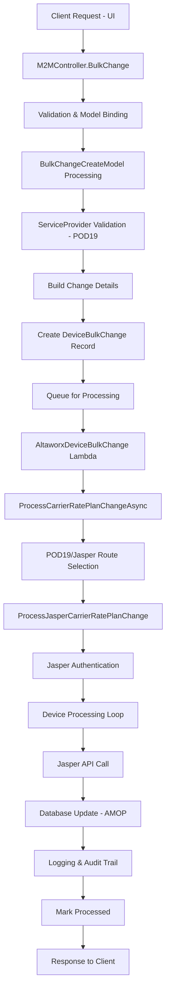
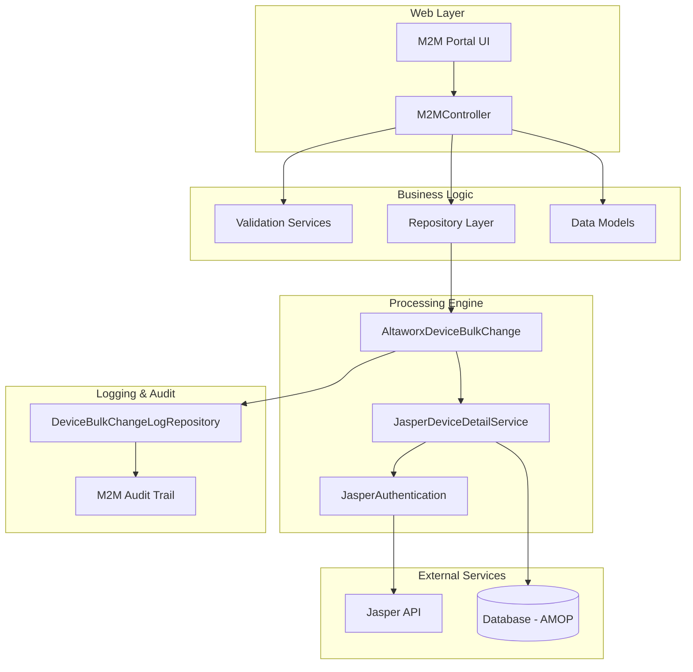
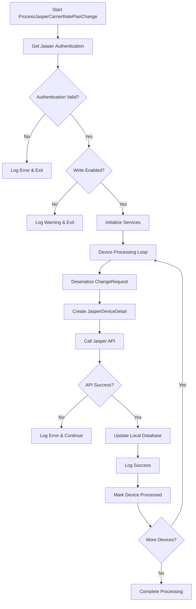
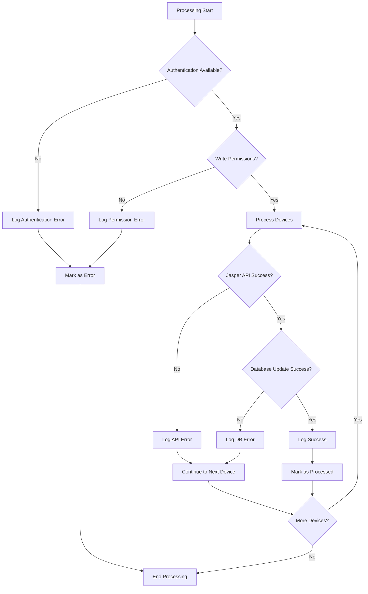
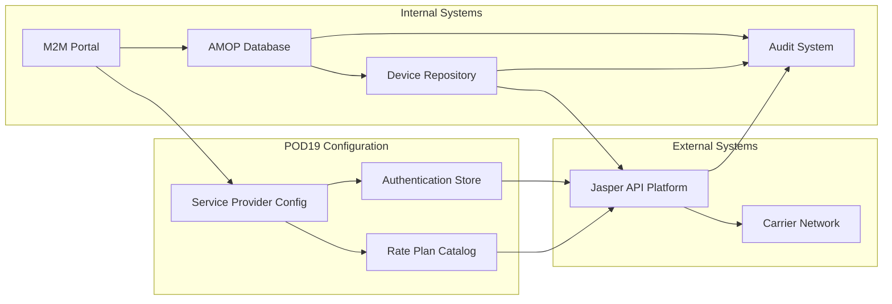

# POD 19 Service Provider - Carrier Rate Plan Change Data Flow

## Overview

This document outlines the complete data flow for **Carrier Rate Plan Change Type** operations specifically for **POD 19 Service Provider**. POD 19 uses the Jasper integration platform and follows a specific processing pipeline for carrier rate plan modifications.

## Integration Configuration

- **Service Provider**: POD 19
- **Integration Type**: `IntegrationType.POD19`
- **Processing Engine**: Jasper API Services
- **Change Request Type**: `CarrierRatePlanChange = 7`
- **Portal Type**: M2M Portal

## Data Flow Architecture - Graph Format

### 1. High-Level Data Flow Graph



### 2. Detailed Processing Flow Graph

```mermaid
graph LR
    subgraph "Request Phase"
        A1[HTTP POST Request] --> A2[BulkChangeCreateModel]
        A2 --> A3[CarrierRatePlanUpdate Object]
        A3 --> A4[Device ICCID List]
    end
    
    subgraph "Validation Phase"
        B1[Service Provider Validation] --> B2[Integration Type Check]
        B2 --> B3[POD19 Route Selection]
        B3 --> B4[Carrier Rate Plan Validation]
        B4 --> B5[Device ICCID Validation]
    end
    
    subgraph "Processing Phase"
        C1[Create Bulk Change Record] --> C2[Build Device Changes]
        C2 --> C3[Queue Processing Request]
        C3 --> C4[Lambda Function Trigger]
    end
    
    subgraph "Execution Phase"
        D1[Process Carrier Rate Plan] --> D2[Jasper Authentication]
        D2 --> D3[Device Loop Processing]
        D3 --> D4[Jasper API Update]
        D4 --> D5[Database Synchronization]
        D5 --> D6[Audit Log Creation]
    end
    
    A4 --> B1
    B5 --> C1
    C4 --> D1
    D6 --> E1[Completion Response]
```



### 3. Component Interaction Graph



## Detailed Process Flow

### Phase 1: Request Initiation

```
Client Request Structure:
├── ServiceProviderId: [POD19 Service Provider ID]
├── ChangeType: 7 (CarrierRatePlanChange)
├── ProcessChanges: true/false
├── Devices: [Array of ICCID strings]
└── CarrierRatePlanUpdate:
    ├── CarrierRatePlan: [Rate Plan Code]
    ├── CommPlan: [Communication Plan]
    ├── EffectiveDate: [Optional Date]
    ├── PlanUuid: [Generated/Retrieved]
    └── RatePlanId: [Carrier Plan ID]
```

**Entry Point**: `M2MController.BulkChange(BulkChangeCreateModel)`

**Validation Steps**:
1. User permission validation (`UserCanCreate`)
2. Model state validation
3. Service Provider validation (must be POD19)
4. Integration type confirmation (`IntegrationType.POD19`)
5. Carrier rate plan existence validation

### Phase 2: Data Transformation & Persistence

```csharp
// Core Data Structures
public class BulkChangeCreateModel
{
    public int? ServiceProviderId { get; set; }  // POD19 Service Provider
    public int? ChangeType { get; set; }         // 7 = CarrierRatePlanChange
    public bool? ProcessChanges { get; set; }
    public string[] Devices { get; set; }        // ICCID array
    public CarrierRatePlanUpdate CarrierRatePlanUpdate { get; set; }
}

public class CarrierRatePlanUpdate
{
    public string CarrierRatePlan { get; set; }  // Rate plan code
    public string CommPlan { get; set; }         // Communication plan
    public DateTime? EffectiveDate { get; set; }
    public string PlanUuid { get; set; }
    public long RatePlanId { get; set; }
}
```

**Processing Steps**:
1. **Build Change Details**: Convert UI model to internal change records
2. **Device Validation**: Validate each ICCID against device inventory
3. **Bulk Change Creation**: Create `DeviceBulkChange` record
4. **Device Change Records**: Create individual `M2M_DeviceChange` records
5. **Queue for Processing**: Set status to `NEW` for async processing

### Phase 3: Asynchronous Processing

**Lambda Function**: `AltaworxDeviceBulkChange.ProcessAsync()`

**Route Selection Logic**:
```csharp
switch (bulkChange.IntegrationId)
{
    case (int)IntegrationType.POD19:
        return await ProcessJasperCarrierRatePlanChange(context, logRepo, 
            bulkChange, serviceProviderId, changes);
}
```

### Phase 4: POD19/Jasper Specific Processing

**Method**: `ProcessJasperCarrierRatePlanChange()`

**Processing Graph**:


**Key Components**:

1. **Jasper Authentication**: Retrieved via `JasperCommon.GetJasperAuthenticationInformation()`
2. **Services Initialized**:
   - `JasperRatePlanRepository`
   - `JasperDeviceDetailService`
   - `DeviceRepository`

3. **Per-Device Processing**:
   ```csharp
   foreach (var change in changes)
   {
       // 1. Deserialize change request
       var carrierRatePlan = JsonConvert.DeserializeObject<BulkChangeCarrierRatePlanUpdate>(change.ChangeRequest);
       
       // 2. Build Jasper device detail
       var jasperDeviceDetail = new JasperDeviceDetail
       {
           ICCID = change.DeviceIdentifier,
           CarrierRatePlan = carrierRatePlan.CarrierRatePlanUpdate.CarrierRatePlan,
           CommunicationPlan = carrierRatePlan.CarrierRatePlanUpdate.CommPlan,
       };
       
       // 3. Update via Jasper API
       var result = await jasperDeviceDetailService.UpdateJasperDeviceDetailsAsync(jasperDeviceDetail);
       
       // 4. Update local database
       var dbResult = await deviceRepository.UpdateRatePlanAsync(
           jasperDeviceDetail.ICCID,
           jasperDeviceDetail.CarrierRatePlan,
           jasperDeviceDetail.CommunicationPlan,
           change.TenantId);
   }
   ```

### Phase 5: Database Synchronization

**Database Updates**:
1. **Device Table Update**: Rate plan and communication plan fields
2. **Audit Trail**: Device change history
3. **Status Updates**: Change processing status

**Method**: `DeviceRepository.UpdateRatePlanAsync()`

### Phase 6: Logging & Audit Trail

**Dual Logging System**:

1. **Jasper API Log Entry**:
   ```csharp
   logRepo.AddM2MLogEntry(new CreateM2MDeviceBulkChangeLog()
   {
       BulkChangeId = bulkChange.Id,
       M2MDeviceChangeId = change.Id,
       LogEntryDescription = "Update Jasper Rate Plan: Jasper API",
       ProcessBy = "AltaworxDeviceBulkChange",
       RequestText = result.ActionText + Environment.NewLine + result.RequestObject,
       ResponseText = JsonConvert.SerializeObject(result.ResponseObject),
       HasErrors = result.HasErrors,
       ResponseStatus = result.HasErrors ? BulkChangeStatus.ERROR : BulkChangeStatus.PROCESSED
   });
   ```

2. **Database Update Log Entry**:
   ```csharp
   logRepo.AddM2MLogEntry(new CreateM2MDeviceBulkChangeLog()
   {
       BulkChangeId = bulkChange.Id,
       M2MDeviceChangeId = change.Id,
       LogEntryDescription = "Update Jasper Rate Plan: AMOP Update",
       ProcessBy = "AltaworxDeviceBulkChange",
       RequestText = dbResult.ActionText + Environment.NewLine + dbResult.RequestObject,
       ResponseText = JsonConvert.SerializeObject(dbResult.ResponseObject),
       HasErrors = dbResult.HasErrors,
       ResponseStatus = dbResult.HasErrors ? BulkChangeStatus.ERROR : BulkChangeStatus.PROCESSED
   });
   ```

## Error Handling Flow



## POD19 Specific Configurations

### Authentication Requirements
- **Provider**: Jasper Platform
- **Authentication Type**: API Key based
- **Write Permissions**: Must be enabled
- **Base URL**: Service provider specific

### Integration Points
1. **M2M Portal**: User interface for rate plan changes
2. **Jasper API**: External carrier platform
3. **AMOP Database**: Local device management system
4. **Audit System**: Change tracking and compliance

### Rate Plan Structure
- **CarrierRatePlan**: Carrier-specific plan code
- **CommPlan**: Communication plan identifier
- **PlanUuid**: Unique plan identifier (for some integrations)
- **RatePlanId**: Numeric plan identifier

## Performance Considerations

### Batch Processing
- **Concurrent Processing**: Each device processed sequentially within batch
- **Error Isolation**: Individual device failures don't stop batch
- **Retry Logic**: HTTP retry policies for API calls

### Monitoring Points
1. **Processing Time**: Per-device and per-batch timing
2. **Error Rates**: API and database error tracking
3. **Success Rates**: Completion percentages
4. **Queue Depth**: Pending change requests

## Security & Compliance

### Data Protection
- **Authentication**: Encrypted API credentials
- **Audit Trail**: Complete change history
- **Access Control**: Role-based permissions

### Validation Layers
1. **UI Validation**: Client-side input validation
2. **Controller Validation**: Server-side model validation
3. **Business Logic Validation**: Rate plan existence checks
4. **API Validation**: Carrier platform validation

## Success Criteria

A POD19 Carrier Rate Plan change is considered successful when:

1. ✅ **Authentication Validated**: Jasper credentials confirmed
2. ✅ **Write Permissions Verified**: Service provider allows modifications
3. ✅ **Device Validated**: ICCID exists in system
4. ✅ **Rate Plan Validated**: Target rate plan exists and is accessible
5. ✅ **Jasper API Success**: External API confirms change
6. ✅ **Database Updated**: Local system reflects new rate plan
7. ✅ **Audit Logged**: Complete change trail recorded
8. ✅ **Status Updated**: Change marked as processed

## Integration Dependencies



This comprehensive data flow ensures reliable, auditable, and secure carrier rate plan changes for POD 19 service provider through the Jasper integration platform.