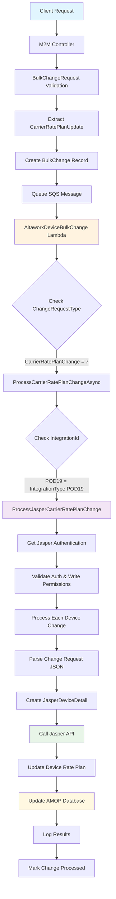
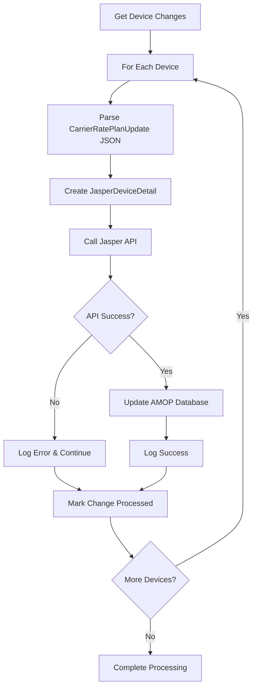
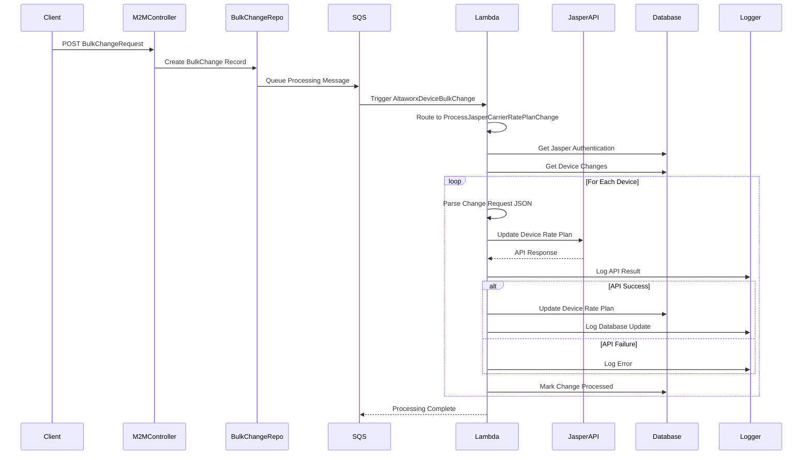

# POD 19 Service Provider - Carrier Rate Plan Change Data Flow Diagram

## Overview
This document provides a comprehensive data flow diagram for **Carrier Rate Plan Changes** specifically for the **POD 19 Service Provider**. POD 19 uses the Jasper integration platform for carrier rate plan management.

## System Architecture



## Detailed Data Flow Components

### 1. Request Initiation Layer
```
Client Application/Portal
         ↓
   M2M Controller
         ↓
   BulkChangeRequest
```

**Input Structure:**
```json
{
  "ServiceProviderId": 19,
  "ChangeType": 7,
  "ProcessChanges": true,
  "Devices": ["iccid1", "iccid2", ...],
  "CarrierRatePlanUpdate": {
    "CarrierRatePlan": "plan_code",
    "CommPlan": "communication_plan",
    "EffectiveDate": "2024-01-01T00:00:00Z",
    "PlanUuid": "uuid_value",
    "RatePlanId": 12345
  }
}
```

### 2. Processing Pipeline

#### Step 1: Request Validation & Routing
```
BulkChangeRequest → Validation → POD 19 Service Provider Check
```

**Validation Criteria:**
- ServiceProviderId must be valid
- ChangeType = 7 (CarrierRatePlanChange)
- CarrierRatePlanUpdate must be present
- Device list must not be empty

#### Step 2: Integration Type Resolution
```
POD 19 Service Provider → IntegrationType.POD19 → Jasper Integration
```

**Service Provider Mapping:**
- POD 19 → Uses Jasper API integration
- Shares processing with Jasper, TMobileJasper, and Rogers

#### Step 3: Device Processing Loop


### 3. Data Models

#### BulkChangeDetailRecord
```csharp
{
  "Id": 12345,
  "ICCID": "device_iccid",
  "BulkChangeId": 678,
  "ChangeRequest": "{CarrierRatePlanUpdate JSON}",
  "ChangeRequestTypeId": 7,
  "ChangeRequestType": "CarrierRatePlanChange",
  "ServiceProviderId": 19,
  "IntegrationId": POD19,
  "TenantId": 1
}
```

#### JasperDeviceDetail
```csharp
{
  "ICCID": "device_iccid",
  "CarrierRatePlan": "new_plan_code",
  "CommunicationPlan": "comm_plan"
}
```

### 4. External API Integration

#### Jasper API Flow
```
JasperDeviceDetailService
         ↓
   Jasper Authentication
         ↓
   HTTP Request to Jasper API
         ↓
   Update Device Rate Plan
         ↓
   Response Processing
```

**Jasper API Call Structure:**
- **Authentication**: Retrieved from database per service provider
- **Endpoint**: Jasper carrier network API
- **Method**: Rate plan update operation
- **Retry Policy**: HTTP retry with exponential backoff

### 5. Database Operations

#### AMOP Database Update
```sql
-- Device rate plan update
UPDATE Device 
SET CarrierRatePlan = @carrierRatePlan,
    CommunicationPlan = @commPlan
WHERE ICCID = @iccid 
  AND TenantId = @tenantId
```

#### Logging Operations
```
M2M Device Bulk Change Log:
- BulkChangeId
- M2MDeviceChangeId  
- LogEntryDescription
- ProcessBy: "AltaworxDeviceBulkChange"
- RequestText: API request details
- ResponseText: API response
- HasErrors: boolean
- ResponseStatus: PROCESSED/ERROR
```

### 6. Complete Processing Flow



### 7. Error Handling Matrix

| Error Type | Response | Recovery Action |
|------------|----------|-----------------|
| Invalid Authentication | Log Error, Stop Processing | Check service provider config |
| Write Disabled | Log Warning, Stop Processing | Enable writes in authentication |
| Jasper API Failure | Log Error, Continue with Next Device | Retry or manual intervention |
| Database Update Failure | Log Error, Mark as Failed | Database investigation required |
| JSON Parse Error | Log Error, Skip Device | Fix change request format |

### 8. Key Constants & Configuration

```csharp
// Change Request Type
CarrierRatePlanChange = 7

// Integration Types
IntegrationType.POD19 = (routes to Jasper processing)
IntegrationType.Jasper
IntegrationType.TMobileJasper  
IntegrationType.Rogers

// Processing Classes
ProcessJasperCarrierRatePlanChange()
JasperDeviceDetailService
JasperAuthentication
DeviceRepository
```

### 9. Monitoring & Observability

#### Log Entry Types
1. **Pre-flight Check**: Authentication validation
2. **Jasper API**: External API call results
3. **AMOP Update**: Database update results
4. **Error Handling**: Exception and failure scenarios

#### Success Criteria
- Jasper API returns success response
- AMOP database update succeeds
- Change marked as PROCESSED
- No errors in log entries

#### Performance Metrics
- Processing time per device
- API response times
- Success/failure rates
- Retry attempts

### 10. Security Considerations

#### Authentication
- Jasper credentials stored encrypted in database
- Service provider-specific authentication
- Write permissions validation

#### Data Protection
- ICCID and device identifiers handled securely
- Audit trail maintained in logs
- Tenant isolation enforced

#### Access Control
- Portal-level permissions
- Service provider restrictions
- Change type authorization

This data flow diagram provides a comprehensive view of how carrier rate plan changes are processed for POD 19 Service Provider, highlighting the Jasper integration pathway and all associated data transformations, API calls, and database operations.