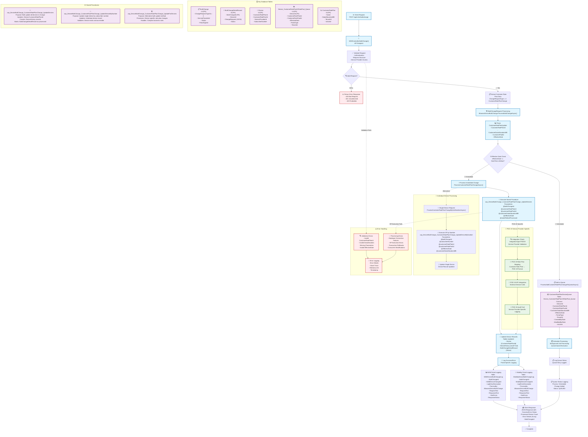

# POD 19 Service Provider - Customer Rate Plan Change Flow (Elaborate)

## Mermaid Flow Diagram

## Key Components Summary

### 🔌 POD 19 Service Provider Details
- **Integration Type**: IntegrationType.POD19
- **Service Provider ID**: Specific to POD 19 configuration
- **Special Handling**: Custom rate plan mapping and API integration

### 📊 Change Request Type
- **Numeric Value**: 4 (CustomerRatePlanChange)
- **Description**: Customer-facing rate plan changes (not carrier rate plans)
- **Scope**: Tenant-specific billing and data allocation

### 🗄️ Key Database Tables
1. **BulkChange**: Main change tracking table
2. **BulkChangeDetailRecord**: Individual device change records
3. **Device**: Core device information with rate plan assignments
4. **Device_CustomerRatePlanOrRatePool_Queue**: Scheduled changes queue
5. **CustomerRatePlan**: Rate plan definitions and configurations

### ⚙️ Stored Procedures
1. **usp_DeviceBulkChange_CustomerRatePlanChange_UpdateDevices**: Bulk device updates
2. **usp_DeviceBulkChange_CustomerRatePlanChange_UpdateDeviceByNumber**: Single device by subscriber number
3. **usp_DeviceBulkChange_CustomerRatePlanChange_UpdateForDevices**: Alternative bulk update method

### 📝 Logging Tables
1. **M2MDeviceBulkChangeLog**: M2M portal specific logging
2. **MobilityDeviceBulkChangeLog**: Mobility portal specific logging
3. **DeviceHistory**: Device change audit trail

### 🚀 Processing Types
1. **Immediate Processing**: EffectiveDate ≤ Current DateTime
2. **Scheduled Processing**: EffectiveDate > Current DateTime (queued)

### 🔍 Error Handling
- Validation errors (invalid parameters)
- Processing errors (database/API failures)
- Comprehensive error logging with reference IDs
- Transaction rollback capabilities

This elaborate flow diagram provides complete visibility into the POD 19 service provider's customer rate plan change process, including all database interactions, stored procedures, logging mechanisms, and error handling scenarios.