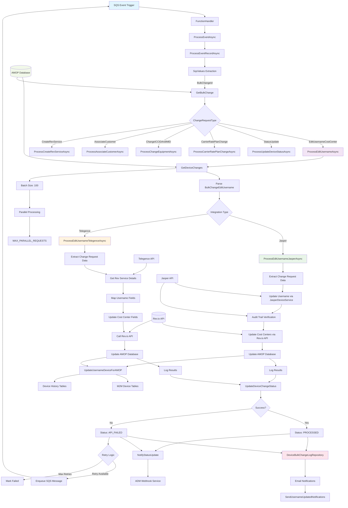

# POD19 Change Types & Username/Cost Center Changes - Dataflow Diagram

## System Overview
POD19 is an AWS Lambda-based system that processes bulk device changes, with specialized handling for username and cost center updates across multiple carrier integrations (Jasper, Telegence, ThingSpace, Rev.io).

## Detailed Component Breakdown

### 1. Entry Point & Message Processing
- **SQS Event Handler**: AWS Lambda triggered by SQS messages
- **Message Attributes**: 
  - `BulkChangeId`: Primary identifier for batch operation
  - `M2MDeviceChangeId`: Individual device change identifier
  - `RetryNumber`: Current retry attempt
  - `RequestId`: Unique request tracking

### 2. Change Type Classification
The system supports multiple change types:
- `EditUsernameCostCenter`: Username and cost center updates
- `StatusUpdate`: Device status modifications
- `CarrierRatePlanChange`: Rate plan modifications
- `ChangeICCIDAndIMEI`: Equipment identifier changes
- `AssociateCustomer`: Customer assignment
- `CreateRevService`: New service creation

### 3. Username/Cost Center Processing

#### Data Structure (BulkChangeEditUsername):
- `ContactName`: New username value
- `CostCenter1`: Primary cost center
- `CostCenter2`: Secondary cost center
- `CostCenter3`: Tertiary cost center

#### Integration Paths:

**Jasper Integration:**
1. Extract username and cost center data
2. Call Jasper API for username update
3. Verify update via audit trail
4. Update cost centers through Rev.io API
5. Update AMOP database records
6. Log operation results

**Telegence Integration:**
1. Extract change request data
2. Retrieve Rev service configuration
3. Map fields based on tenant settings
4. Update username and cost center fields
5. Call Rev.io API for updates
6. Update AMOP database
7. Log operation results

### 4. Database Operations

**Tables Involved:**
- `M2M_DeviceChange`: Device change records
- `M2M_Device`: Core device information
- `DeviceBulkChangeLog`: Operation logging
- `Rev_Service`: Rev.io service details

**Stored Procedures:**
- `UPDATE_USERNAME_GET_M2M_REV_SERVICE`
- `UPDATE_USERNAME_GET_REV_SERVICE`

### 5. Status Management

**Change Statuses:**
- `NEW`: Initial state
- `PENDING`: Queued for processing
- `PROCESSING`: Currently being processed
- `PROCESSED`: Successfully completed
- `API_FAILED`: API call failed

### 6. Error Handling & Retry Logic
- **SQL Transient Retry**: 3 attempts with exponential backoff
- **HTTP Retry**: 3 attempts for API calls
- **SQS Retry**: Re-queue failed messages with delay
- **Circuit Breaker**: Polly resilience patterns

### 7. Logging & Notifications
- **DeviceBulkChangeLogRepository**: Centralized logging
- **Email Notifications**: Success/failure alerts
- **ADM Webhook**: Status update notifications
- **CloudWatch**: Lambda execution logs

### 8. Performance Optimizations
- **Batch Processing**: 100 devices per batch
- **Parallel Processing**: Configurable parallel requests
- **Connection Pooling**: SQL connection management
- **Async Operations**: Non-blocking I/O operations

## Key Configuration Variables
- `DEVICE_BULK_CHANGE_QUEUE_URL`: SQS queue for processing
- `JASPER_DEVICE_USERNAME_UPDATE_PATH`: Jasper API endpoint
- `JASPER_DEVICE_AUDIT_TRAIL_PATH`: Jasper audit endpoint
- `MAX_PARALLEL_REQUESTS`: Concurrency limit (default: 10)

## Integration Points
1. **Jasper API**: Username updates and audit verification
2. **Rev.io API**: Cost center and service management
3. **Telegence API**: Service configuration retrieval
4. **AMOP Database**: Core data persistence
5. **SQS**: Asynchronous message processing
6. **CloudWatch**: Monitoring and logging