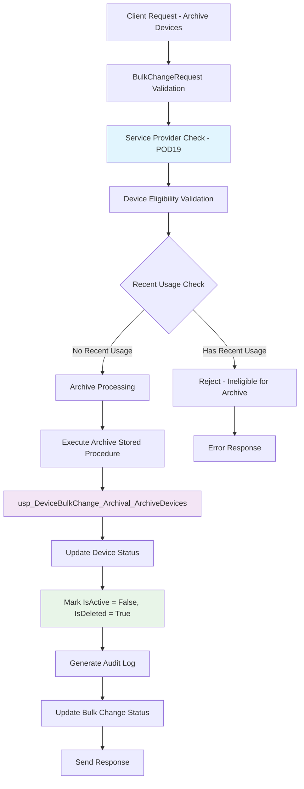
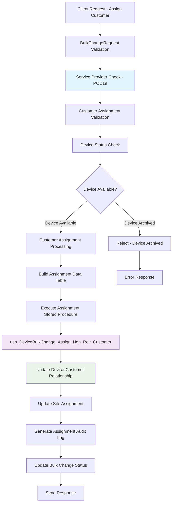
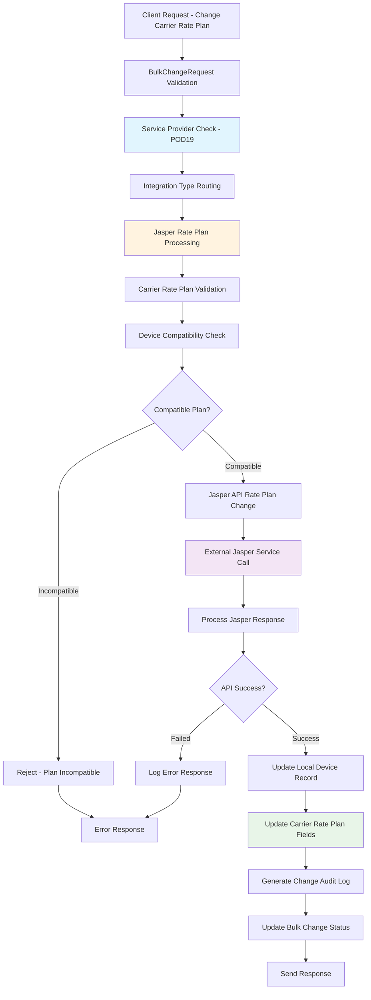
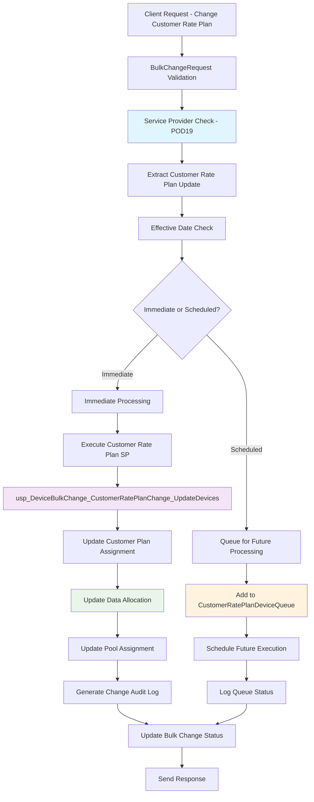
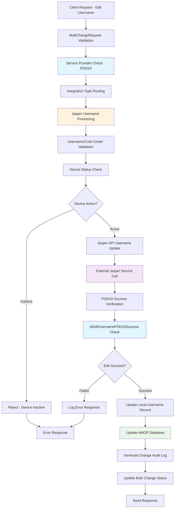
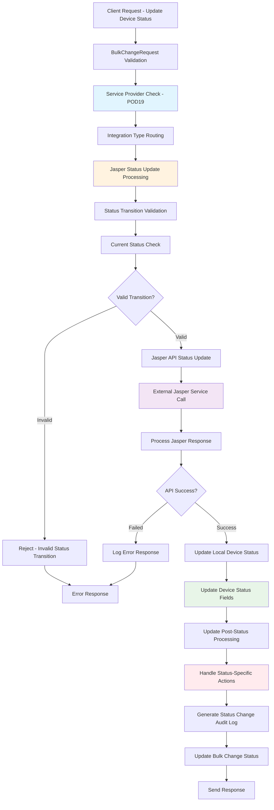
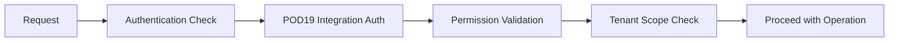
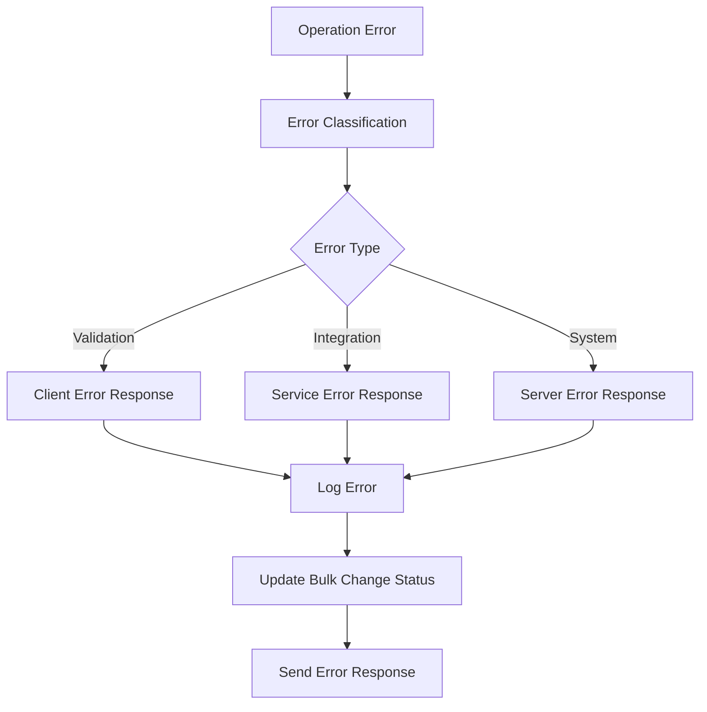
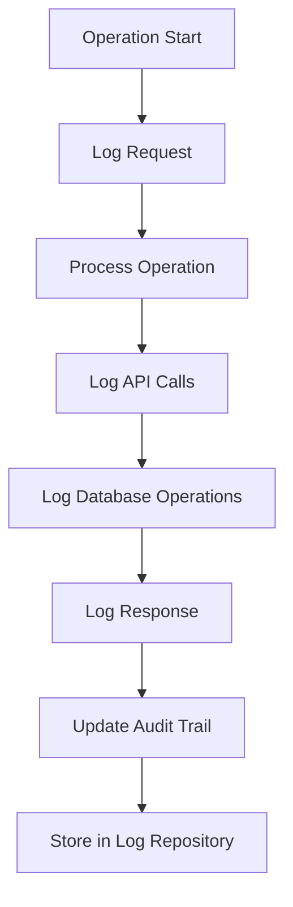

# POD19 Service Provider - Data Flow Diagrams

## Overview

This document provides comprehensive data flow diagrams for the 6 primary change types supported by POD19 Service Provider within the AltaWorx M2M device management system.

## POD19 Service Provider Context

POD19 is handled as a Jasper-compatible integration type in the system:
- Integration Type: `IntegrationType.POD19`
- Processing: Uses Jasper-based processing flows
- Authentication: Requires integration authentication ID
- Scope: M2M and Mobility portals

---

## 1. Archive Data Flow

### Overview
The Archive process moves devices to an inactive/archived state, making them ineligible for active operations while preserving historical data.

### Data Flow Diagram



### Key Components

**Input Parameters:**
- `Devices[]`: Array of ICCID identifiers
- `ServiceProviderId`: POD19 service provider ID
- `ChangeType`: Archive (specific type ID)

**Validation Rules:**
- Device must exist in system
- Device must not have recent usage (configurable days)
- Device must not already be archived
- User must have archive permissions

**Database Operations:**
```sql
EXEC usp_DeviceBulkChange_Archival_ArchiveDevices 
    @BulkChangeId = @bulkChangeId,
    @NeedToMarkProcessed = @needToMarkProcessed
```

**Error Scenarios:**
- Device has recent usage: "Device has had usage in the last X days and is ineligible to be archived"
- Device already archived: "M2MDeviceIsArchivedError"
- Device not found: "M2MDeviceNotExistError"

---

## 2. Assign Customer Data Flow

### Overview
The Assign Customer process associates devices with specific customer accounts for billing and management purposes.

### Data Flow Diagram



### Key Components

**Input Parameters:**
- `Devices[]`: Array of ICCID identifiers  
- `CustomerAssignment`: Customer assignment details
- `SiteId`: Target site for assignment
- `NonRevCustomerModel`: Customer model data

**Processing Steps:**
1. **Validation Phase:**
   - Check device existence
   - Verify device not archived
   - Validate customer information
   - Check assignment permissions

2. **Assignment Phase:**
   - Build data table with assignment details
   - Execute stored procedure
   - Update device-customer relationships
   - Update site assignments

**Database Operations:**
```sql
EXEC usp_DeviceBulkChange_Assign_Non_Rev_Customer
    @DataTable = @assignmentDataTable,
    @BulkChangeId = @bulkChangeId,
    @DeviceChangeId = @deviceChangeId
```

**Error Scenarios:**
- Device archived: "M2MDeviceIsArchivedError"
- Invalid customer: Customer validation errors
- Permission denied: User lacks assignment permissions

---

## 3. Change Carrier Rate Plan Data Flow

### Overview
The Change Carrier Rate Plan process updates the service provider's network connectivity plan for devices.

### Data Flow Diagram



### Key Components

**Input Parameters:**
- `Devices[]`: Array of ICCID identifiers
- `CarrierRatePlanUpdate`: Rate plan change details
  - `CarrierRatePlan`: New carrier plan code
  - `CommPlan`: Communication plan
  - `PlanUuid`: Plan unique identifier
  - `RatePlanId`: Carrier rate plan ID

**Integration Flow:**
1. **POD19 Routing:** Routes to Jasper-compatible processing
2. **Jasper API Integration:** External service call for rate plan change
3. **Response Processing:** Handle success/failure from carrier
4. **Local Update:** Update device records with new plan

**Database Operations:**
- Update device carrier rate plan fields
- Log API request/response
- Update bulk change status

**Error Scenarios:**
- Invalid rate plan: Plan not available for device type
- API failure: Carrier service unavailable
- Device incompatible: Device doesn't support target plan

---

## 4. Change Customer Rate Plan Data Flow

### Overview
The Change Customer Rate Plan process updates customer-facing billing plans and data allocations.

### Data Flow Diagram



### Key Components

**Input Parameters:**
- `Devices[]`: Array of ICCID identifiers
- `CustomerRatePlanUpdate`: Rate plan details
  - `CustomerRatePlanId`: Target customer plan
  - `CustomerDataAllocationMB`: Data allocation limit
  - `CustomerPoolId`: Shared pool identifier
  - `EffectiveDate`: Implementation date

**Processing Logic:**
```csharp
if (effectiveDate == null || effectiveDate?.ToUniversalTime() <= DateTime.UtcNow)
{
    // Immediate processing
    await ProcessCustomerRatePlanChangeAsync(bulkChange.Id, 
        customerRatePlanId, effectiveDate, customerDataAllocationMB, 
        customerRatePoolId, connectionString, logger, syncPolicy);
}
else
{
    // Queue for future processing
    await ProcessAddCustomerRatePlanChangeToQueueAsync(bulkChange, 
        customerRatePlanId, effectiveDate, customerDataAllocationMB, 
        customerRatePoolId, context);
}
```

**Database Operations:**
```sql
-- Immediate Processing
EXEC usp_DeviceBulkChange_CustomerRatePlanChange_UpdateDevices
    @bulkChangeId = @bulkChangeId,
    @customerRatePlanId = @customerRatePlanId,
    @customerRatePoolId = @customerRatePoolId,
    @customerDataAllocationMB = @customerDataAllocationMB,
    @effectiveDate = @effectiveDate,
    @needToMarkProcessed = @needToMarkProcessed

-- Scheduled Processing - Insert into Queue Table
CustomerRatePlanDeviceQueue
```

---

## 5. Edit Username/Cost Center Data Flow

### Overview
The Edit Username/Cost Center process updates device username and cost center assignments for POD19 devices.

### Data Flow Diagram



### Key Components

**Input Parameters:**
- `Devices[]`: Array of ICCID identifiers
- `Username`: Username/cost center update details
  - `NewUsername`: Target username
  - `CostCenter`: Cost center assignment
  - `EffectiveDate`: Implementation date

**POD19 Specific Processing:**
```csharp
case (int)IntegrationType.POD19:
    result = await ProcessEditUsernameJasperAsync(context, logRepo, 
        bulkChange, changes, usernameUpdateRequest, processedBy, httpClientFactory);
    
    // POD19 specific success verification
    if (bulkChange.IntegrationId == (int)IntegrationType.POD19)
    {
        var isEditSuccess = await jasperDeviceService.IsEditUsernamePOD19Success(
            JasperDeviceAuditTrailPath, change.ICCID, 
            Common.CommonString.ERROR_MESSAGE, 
            Common.CommonString.USERNAME_STRING);
    }
```

**Validation Steps:**
1. **Device Validation:** Verify device exists and is active
2. **Username Validation:** Check format and uniqueness requirements
3. **Permission Check:** Verify user can edit usernames
4. **Integration Check:** Confirm POD19 connectivity

**Database Operations:**
- Update device username fields
- Log API request/response
- Update AMOP database records
- Generate audit trail

---

## 6. Update Device Status Data Flow

### Overview
The Update Device Status process changes the operational status of POD19 devices (activate, suspend, restore, etc.).

### Data Flow Diagram



### Key Components

**Input Parameters:**
- `Devices[]`: Array of ICCID identifiers
- `StatusUpdate`: Status change details
  - `UpdateStatus`: Target status (activate, suspend, restore, etc.)
  - `IsIgnoreCurrentStatus`: Override current status checks
  - `PostUpdateStatusId`: Status after update completion
  - `AccountNumber`: Associated account

**Status Transition Matrix:**
- **Activate:** Test → Active, Suspended → Active
- **Suspend:** Active → Suspended
- **Restore:** Suspended → Active
- **Deactivate:** Active/Suspended → Deactivated

**Integration Processing:**
```csharp
case IntegrationType.POD19:
    return BuildStatusUpdateChangeDetailsJasper(awxDb, session, 
        serviceProviderId, iccids, statusUpdate, revService, integrationType);
```

**Database Operations:**
- Update device status fields
- Log status transition
- Update billing status if needed
- Generate comprehensive audit trail

**Error Scenarios:**
- Invalid status transition: Current status doesn't allow target status
- API failure: Jasper service unavailable
- Device not found: ICCID doesn't exist
- Permission denied: User lacks status update permissions

---

## Common Infrastructure Components

### Authentication & Authorization


### Error Handling Framework


### Logging & Audit Trail


---

## Performance & Scalability Considerations

### Batch Processing
- **Bulk Operations:** All change types support batch processing
- **Transaction Management:** Ensures data consistency
- **Connection Pooling:** Optimizes database performance

### Async Processing
- **Non-blocking Operations:** Uses async/await patterns
- **Queue Management:** Scheduled changes use queue tables
- **Parallel Processing:** Supports concurrent device updates

### Error Recovery
- **Retry Logic:** Implements exponential backoff
- **Partial Success:** Handles mixed success/failure scenarios
- **Rollback Capability:** Supports transaction rollback

---

## Security Considerations

### Data Protection
- **Encrypted Connections:** All API calls use HTTPS
- **Sanitized Logging:** No sensitive data in logs
- **Access Control:** Role-based permissions

### Validation
- **Input Sanitization:** Prevents injection attacks
- **Business Rule Enforcement:** Validates business logic
- **Rate Limiting:** Prevents abuse

### Compliance
- **Audit Requirements:** Complete audit trail
- **Data Retention:** Configurable retention policies
- **Privacy Protection:** PII handling compliance