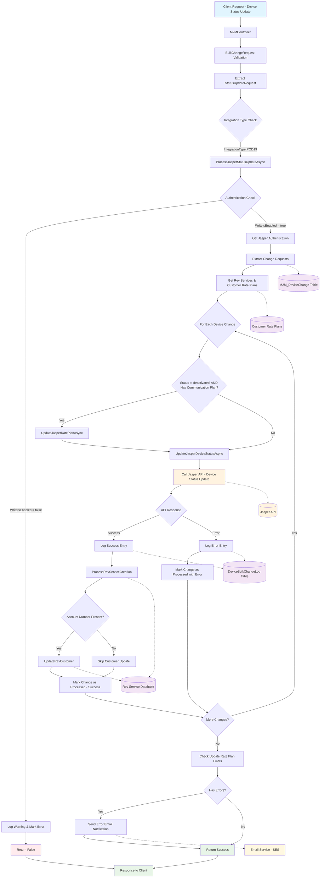

# POD 19 Service Provider - Device Status Update Data Flow Diagram

## Process Flow Description

### 1. **Request Initiation**
- Client sends device status update request to M2MController
- Request contains device identifiers (ICCID) and target status

### 2. **Validation & Routing**
- BulkChangeRequest validation occurs
- StatusUpdateRequest is extracted
- Integration type check determines POD19 uses Jasper processing path

### 3. **Authentication & Setup**
- Jasper authentication information retrieved from database
- Write permissions validated
- If writes disabled, process logs warning and returns error

### 4. **Data Preparation**
- Change requests deserialized from JSON
- Rev services and customer rate plans retrieved
- Device changes prepared for batch processing

### 5. **Device Processing Loop**
For each device change:
- **Rate Plan Update**: If status is 'deactivated' and device has communication plan, update rate plan first
- **Status Update**: Call Jasper API to update device status
- **Logging**: Record success/error in DeviceBulkChangeLog
- **Rev Service**: Process Rev service creation if successful
- **Customer Update**: Update Rev customer if account number present

### 6. **Error Handling & Notifications**
- Collect any rate plan update errors
- Send email notifications for errors via AWS SES
- Mark individual changes as processed with success/failure status

### 7. **Response**
- Return success/failure status to client
- Complete bulk change processing

## Key Data Flows

### Input Data:
- Device ICCID
- Target Status (active, deactivated, etc.)
- Account Number
- Post Update Status ID
- Rev Service Information

### External API Calls:
- **Jasper API**: Device status updates
- **Rev Service API**: Service creation/updates
- **AWS SES**: Error notifications

### Database Updates:
- **M2M_DeviceChange**: Device change records
- **DeviceBulkChangeLog**: Process logging
- **Rev Services**: Service status updates
- **Customer Records**: Customer associations

## POD 19 Specific Notes:
- POD 19 uses the same processing path as Jasper integration
- Authentication and API endpoints are Jasper-based
- Rate plan updates occur before status changes for deactivation
- Full logging and error handling with email notifications
- Rev service integration for service line management