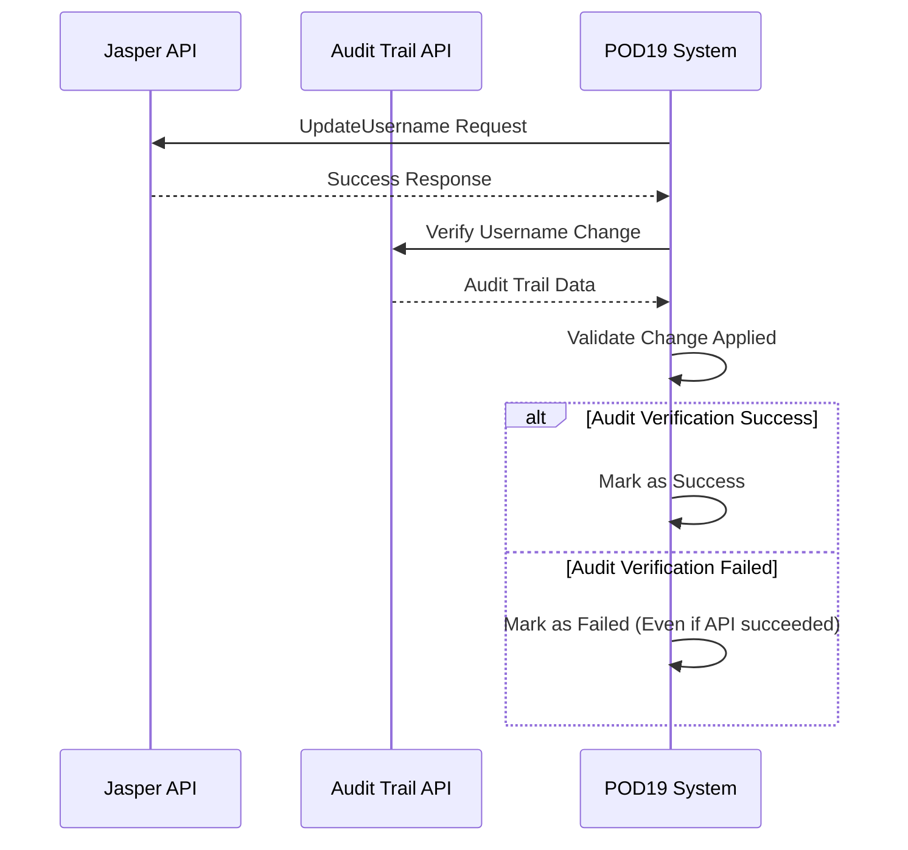

# POD19 Edit Username Workflow Diagram

## Overview
This document outlines the workflow for **POD19 Edit Username** change type processing. POD19 is a specific integration type that requires additional audit verification after username updates to ensure the changes were successfully applied in the carrier system.

## Flow Diagram

```mermaid
flowchart TD
    A[SQS Event Received] --> B[Function Handler]
    B --> C[Parse SQS Message]
    C --> D[Extract BulkChangeId & Parameters]
    D --> E{Message Type?}
    E -->|Edit Username| F[ProcessEditUsername Async]
    
    F --> G[Get Device Changes<br/>Edit Username]
    G --> H{Integration Type?}
    H -->|POD19| I[ProcessEditUsername<br/>JasperAsync]
    
    I --> J{Check Write Enabled<br/>for Service Provider}
    J -->|Write Disabled| J1[Log Error:<br/>Write Disabled]
    J -->|Write Enabled| K[Get Jasper Auth<br/>Information]
    
    K --> L[Extract Username<br/>Update Parameters<br/>ContactName, CostCenter1-3]
    L --> M{Contact Name<br/>Provided?}
    M -->|No| M1[Skip Username Update]
    M -->|Yes| N[Call Jasper API<br/>UpdateUsername<br/>JasperDeviceAsync]
    
    N --> O{Update Successful?}
    O -->|No| O1[Log API Error<br/>Mark as HasErrors]
    O -->|Yes| P[🔍 POD19 SPECIFIC<br/>Call Jasper Audit Trail API<br/>to Verify Username Updated]
    
    P --> Q{IsEditUsername<br/>POD19Success?}
    Q -->|No| Q1[❌ Error: Audit Failed<br/>Mark as HasErrors<br/>Enhanced Logging]
    Q -->|Yes| R[✅ Success: Username<br/>Updated & Verified<br/>POD19 Compliant]
    
    M1 --> S[Process Cost Center<br/>Updates if any]
    R --> S
    Q1 --> S
    O1 --> S
    J1 --> S
    
    S --> T{Cost Centers<br/>Provided?}
    T -->|No| U[Skip Cost Center Update]
    T -->|Yes| V[Get Rev Service<br/>Information]
    
    V --> W[Lookup Rev Service<br/>by ICCID]
    W --> X[Get Cost Center<br/>Field Indexes 1, 2, 3]
    X --> Y[Build Fields<br/>Update Dictionary]
    Y --> Z[Call Rev API<br/>UpdateService Fields]
    
    Z --> AA{Rev Update<br/>Successful?}
    AA -->|Yes| BB[Log Success Response]
    AA -->|No| CC[Log Error Response]
    
    U --> DD[Add Bulk Change<br/>Log Entry]
    BB --> DD
    CC --> DD
    
    DD --> EE[Mark M2M Device<br/>Change as Processed]
    EE --> FF{All Changes<br/>Processed?}
    FF -->|No| G
    FF -->|Yes| GG[Mark Bulk Change<br/>as PROCESSED]
    GG --> HH[End]

    %% Styling for POD19 specific elements
    classDef pod19Specific fill:#ffcccc,stroke:#ff0000,stroke-width:2px
    classDef successPath fill:#ccffcc,stroke:#00ff00,stroke-width:2px
    classDef errorPath fill:#ffcccc,stroke:#ff0000,stroke-width:2px
    classDef decision fill:#ffffcc,stroke:#ffaa00,stroke-width:2px
    
    class P,Q pod19Specific
    class R,BB successPath
    class Q1,O1,J1,CC errorPath
    class E,H,J,M,O,Q,T,AA,FF decision
```



## Key POD19 Differences

### 🔍 1. **Mandatory Audit Verification Step**
Unlike other Jasper integration types, POD19 includes a critical audit verification:
- **Phase 1**: Standard Jasper API call for username update
- **Phase 2**: POD19-specific audit trail verification via `IsEditUsernamePOD19Success()`
- **Result**: Both phases must succeed for overall success

### 🛡️ 2. **Enhanced Security & Compliance**


### ⚠️ 3. **Two-Phase Validation Logic**
```csharp
// POD19 Specific Implementation
if (bulkChange.IntegrationId == (int)IntegrationType.POD19)
{
    var isEditSuccess = await jasperDeviceService.IsEditUsernamePOD19Success(
        JasperDeviceAuditTrailPath, 
        change.ICCID, 
        Common.CommonString.ERROR_MESSAGE, 
        Common.CommonString.USERNAME_STRING
    );
    
    if (!isEditSuccess)
    {
        updateResult.HasErrors = true;
        updateResult.ResponseObject = "Update username failed - audit verification failed";
        // Enhanced logging for POD19 compliance
    }
}
```

## Error Scenarios & Handling

| Error Type | Standard Jasper | POD19 Enhancement |
|------------|----------------|-------------------|
| API Failure | ❌ Mark as Failed | ❌ Mark as Failed + Enhanced Logging |
| Success Response | ✅ Mark as Success | 🔍 **Trigger Audit Verification** |
| Audit Verification | N/A | ❌ **Mandatory Check - Fail if Audit Fails** |

## Security and Compliance Features

### POD19-Specific Requirements
- 🔍 **Enhanced audit trail verification**
- 📝 **Additional compliance logging**
- ✅ **Mandatory verification of all username changes**
- 🛡️ **Stricter error handling and validation procedures**
- 📊 **Detailed audit trail for regulatory compliance**

## Process Flow Summary

1. **Standard Processing**: SQS → Parse → Extract → Validate
2. **POD19 Username Update**: API Call → **Audit Verification** → Success/Failure
3. **Cost Center Updates**: Rev API calls (if applicable)
4. **Completion**: Logging → Mark Processed → Continue/End