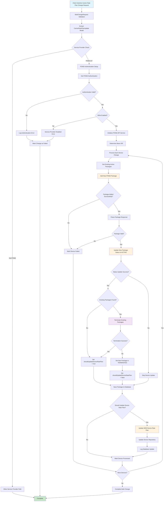

# POND IoT Carrier Rate Plan Change Flow

## Key Components:

### Authentication Phase:
- **POND Authentication**: Retrieves service provider credentials
- **Write Permission Check**: Validates if carrier rate plan changes are enabled
- **API Service Setup**: Initializes POND API service with production/sandbox URLs

### Package Management:
- **Get Existing Packages**: Retrieves currently active packages for the device
- **Add New Package**: Creates new package using PackageTypeId from rate plan
- **Package Status Management**: Updates package status (ACTIVE/TERMINATED)
- **Existing Package Termination**: Terminates old packages when new one is activated

### Device Update Process:
- **Database Persistence**: Saves package information to AMOP database
- **Device Rate Plan Update**: Updates the device's carrier rate plan in M2M system
- **Status Tracking**: Marks devices as processed with success/failure status

### Error Handling:
- Authentication failures are logged and bulk change is marked as failed
- Individual device failures don't stop processing of other devices
- Package creation failures skip device update but continue processing
- API errors are logged with specific error messages

### Integration Points:
- **POND API**: External carrier API for package management
- **AMOP Database**: Internal database for device and package tracking
- **M2M Device Repository**: Device management system updates