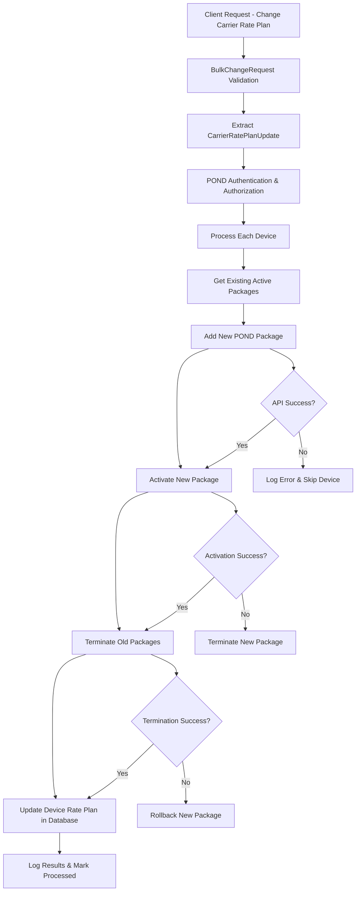

# POND IoT Service Provider - Change Carrier Rate Plan Data Flow Diagram

## Overview

This document outlines the comprehensive data flow for **POND IoT Service Provider's Change Carrier Rate Plan** functionality. This process handles the change of carrier-specific network connectivity plans for IoT devices managed through the POND platform.

## Key Components

### Data Models

#### Core Request Structure
```csharp
public class BulkChangeRequest
{
    public int? ServiceProviderId { get; set; }
    public int? ChangeType { get; set; } // CarrierRatePlanChange = 7
    public bool? ProcessChanges { get; set; }
    public string[] Devices { get; set; }
    public CarrierRatePlanUpdate CarrierRatePlanUpdate { get; set; }
}
```

#### Carrier Rate Plan Update Model
```csharp
public class CarrierRatePlanUpdate
{
    public string CarrierRatePlan { get; set; }        // Carrier plan code/name
    public string CommPlan { get; set; }              // Communication plan
    public DateTime? EffectiveDate { get; set; }      // When change takes effect
    public string PlanUuid { get; set; }              // Unique plan identifier
    public long RatePlanId { get; set; }              // Carrier's rate plan ID
}
```

#### POND API Request Model
```csharp
public class PondAddPackageRequest
{
    public long PackageTypeId { get; set; }           // Maps to RatePlanId
}
```

## Data Flow Architecture

### High-Level Process Flow



### Detailed Step-by-Step Flow

#### 1. Request Initiation & Validation

```
Client Request → AltaworxDeviceBulkChange.Function → ProcessCarrierRatePlanChangeAsync()
```

**Input Parameters:**
- `ServiceProviderId`: POND service provider identifier
- `ChangeType`: Must be `CarrierRatePlanChange (7)`
- `Devices[]`: Array of device ICCIDs to update
- `CarrierRatePlanUpdate`: New rate plan details

**Validation Steps:**
1. Verify service provider is POND
2. Extract carrier rate plan update details
3. Validate rate plan ID exists
4. Check device list is not empty

#### 2. POND Authentication & Setup

```
ProcessPondCarrierRatePlanChange() → POND Authentication & API Setup
```

**Authentication Process:**
1. Retrieve POND credentials from database
2. Validate service provider is enabled for writes
3. Initialize POND API service
4. Set base URL (sandbox vs production)

**Error Handling:**
- If authentication fails → Log error and abort process
- If service provider disabled → Return error to all devices

#### 3. Device Processing Loop

```
For Each Device → UpdatePondCarrierRatePlanForDevices()
```

**Per-Device Flow:**

##### Step 3.1: Get Existing Packages
```sql
SELECT PackageId FROM PondDevicePackages 
WHERE ICCID = @deviceICCID 
AND ServiceProviderId = @serviceProviderId 
AND Status = 'ACTIVE'
```

##### Step 3.2: Add New Package via POND API
```http
POST {baseUri}/{distributorId}/devices/{iccid}/packages
Content-Type: application/json

{
  "PackageTypeId": {ratePlanId}
}
```

**API Response Processing:**
- Parse `PondDeviceCarrierRatePlanResponse`
- Extract new `PackageId`
- Validate response structure

##### Step 3.3: Activate New Package
```http
PUT {baseUri}/packages/{packageId}/status
Content-Type: application/json

{
  "Status": "ACTIVE"
}
```

##### Step 3.4: Terminate Existing Packages
```
For Each Existing PackageId:
  PUT {baseUri}/packages/{packageId}/status
  {
    "Status": "TERMINATED"
  }
```

**Database Update:**
```sql
UPDATE PondDeviceCarrierRatePlan 
SET Status = 'TERMINATED', ProcessedBy = @processedBy
WHERE PackageId IN (@existingPackageIds)
```

##### Step 3.5: Update Device Rate Plan
```sql
UPDATE Device 
SET CarrierRatePlan = @newCarrierRatePlan
WHERE ICCID = @deviceICCID 
AND TenantId = @tenantId
```

##### Step 3.6: Save New Package to Database
```sql
INSERT INTO PondDeviceCarrierRatePlan 
(PackageId, ICCID, ServiceProviderId, Status, PackageTypeId, ProcessedBy, CreatedDate)
VALUES (@packageId, @iccid, @serviceProviderId, @status, @packageTypeId, @processedBy, @now)
```

### Error Handling & Rollback Logic

#### Scenario 1: New Package Addition Fails
```
Add New Package → FAILED
├── Log API Error
├── Mark Device as ERROR
└── Continue to Next Device
```

#### Scenario 2: Package Activation Fails
```
Activate New Package → FAILED
├── Terminate New Package
├── Log Activation Error
├── Mark Device as ERROR
└── Continue to Next Device
```

#### Scenario 3: Existing Package Termination Fails
```
Terminate Existing Packages → FAILED
├── Terminate New Package (Rollback)
├── Log Termination Error
├── Mark Device as ERROR
└── Continue to Next Device
```

#### Scenario 4: Database Update Fails
```
Update Device Rate Plan → FAILED
├── Log Database Error
├── Mark Device as ERROR
└── Continue to Next Device
```

### Logging & Audit Trail

#### Log Entry Types

1. **POND Add Carrier Rate Plan: API**
   - Request: `PondAddPackageRequest` JSON
   - Response: `PondDeviceCarrierRatePlanResponse` JSON
   - Status: SUCCESS/ERROR

2. **POND Update Carrier Rate Plan Status: API**
   - Request: Package status change request
   - Response: Status update confirmation
   - Status: SUCCESS/ERROR

3. **POND Add Carrier Rate Plan: DATABASE**
   - Request: Database insertion parameters
   - Response: Database operation result
   - Status: SUCCESS/ERROR

4. **Device Update Carrier Rate Plan: DATABASE**
   - Request: Device update parameters
   - Response: Device update result
   - Status: SUCCESS/ERROR

#### Log Structure
```csharp
public class CreateM2MDeviceBulkChangeLog
{
    public long BulkChangeId { get; set; }
    public long M2MDeviceChangeId { get; set; }
    public string LogEntryDescription { get; set; }
    public string ProcessBy { get; set; }
    public string RequestText { get; set; }
    public string ResponseText { get; set; }
    public bool HasErrors { get; set; }
    public BulkChangeStatus ResponseStatus { get; set; }
}
```

## Integration Points

### 1. POND API Integration

**Base Endpoints:**
- **Sandbox**: Retrieved from `PondAuthentication.SandboxURL`
- **Production**: Retrieved from `PondAuthentication.ProductionURL`

**API Endpoints Used:**
- `POST /{distributorId}/devices/{iccid}/packages` - Add new package
- `PUT /packages/{packageId}/status` - Update package status

**Authentication:**
- Distributor ID from POND authentication
- Bearer token or API key authentication
- Environment-specific URLs

### 2. Database Integration

**Tables Involved:**
- `PondDeviceCarrierRatePlan` - Package tracking
- `Device` - Device rate plan assignment
- `BulkChange` - Bulk operation tracking
- `BulkChangeDetailRecord` - Individual device changes
- `DeviceBulkChangeLog` - Audit logging

### 3. External Service Dependencies

**Required Services:**
- POND API Service (carrier platform)
- Central Database (AMOP)
- HTTP Client Factory
- Logging Repository
- Authentication Service

## Configuration Constants

### POND-Specific Constants
```csharp
// Package Status Values
public static class PackageStatus
{
    public const string ACTIVE = "ACTIVE";
    public const string TERMINATED = "TERMINATED";
    public const string PENDING = "PENDING";
}

// API Endpoints
public static class URLConstants
{
    public const string POND_ADD_PACKAGE_END_POINT = "devices/{0}/packages";
    public const string POND_UPDATE_PACKAGE_STATUS_END_POINT = "packages/{0}/status";
}

// Change Type
public enum ChangeRequestType
{
    CarrierRatePlanChange = 7
}
```

### Processing Limits
- `RemainingTimeCutoff = 60` seconds (Lambda timeout protection)
- Individual device processing with timeout checks
- Parallel processing capabilities

## Security Considerations

### Authentication & Authorization
- Service provider-specific authentication
- Write operation permissions validation
- Tenant-level access control
- ICCID-based device access validation

### Data Protection
- Encrypted connection strings
- Sanitized API request/response logging
- Secure credential storage
- PCI compliance for carrier data

### API Security
- HTTPS-only communication
- Bearer token authentication
- Rate limiting awareness
- Retry logic with exponential backoff

## Performance Optimization

### Async Operations
- Non-blocking API calls
- Parallel device processing capability
- Async database operations
- Lambda function timeout management

### Error Recovery
- Individual device error isolation
- Graceful degradation
- Comprehensive error logging
- Rollback mechanisms

### Monitoring
- Per-device success/failure tracking
- API response time monitoring
- Database operation performance
- Overall bulk change completion rates

## Flow Diagram Summary

```
┌─────────────────────────────────────────────────────────────────────────────────┐
│                          POND IoT Carrier Rate Plan Change                     │
└─────────────────────────────────────────────────────────────────────────────────┘
                                          │
                                          ▼
┌─────────────────────┐    ┌─────────────────────┐    ┌─────────────────────┐
│ 1. Request          │    │ 2. Authentication  │    │ 3. Device Loop      │
│ Validation          │───▶│ & Authorization     │───▶│ Processing          │
│                     │    │                     │    │                     │
│ • Extract Rate Plan │    │ • Get POND Auth     │    │ • Get Existing      │
│ • Validate Devices  │    │ • Check Permissions │    │ • Add New Package   │
│ • Check Service     │    │ • Setup API Client  │    │ • Activate Package  │
│   Provider          │    │                     │    │ • Terminate Old     │
└─────────────────────┘    └─────────────────────┘    │ • Update Database   │
                                                       └─────────────────────┘
                                                                 │
                                                                 ▼
┌─────────────────────┐    ┌─────────────────────┐    ┌─────────────────────┐
│ 6. Process          │    │ 5. Error Handling   │    │ 4. API Operations   │
│ Completion          │◀───│ & Rollback          │◀───│                     │
│                     │    │                     │    │ • POND Add Package  │
│ • Mark Processed    │    │ • Rollback on Error │    │ • POND Update Status│
│ • Log Final Status  │    │ • Log Errors        │    │ • POND Terminate    │
│ • Update Analytics  │    │ • Continue Next     │    │ • Database Updates  │
└─────────────────────┘    └─────────────────────┘    └─────────────────────┘
```

This comprehensive data flow ensures reliable carrier rate plan changes for POND IoT devices while maintaining data integrity, providing comprehensive logging, and handling error scenarios gracefully.