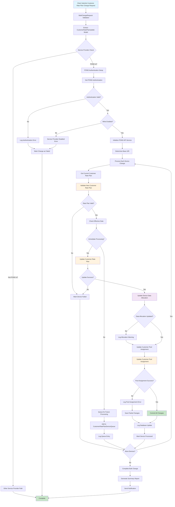

# POND IoT Customer Rate Plan Change Process Flowchart

This flowchart represents the data flow for changing customer rate plans specifically for POND IoT service provider.

## Process Flow Diagram

## Key Process Steps

### 1. Request Validation
- Validates incoming BulkChangeRequest
- Extracts CustomerRatePlanUpdate model
- Performs initial service provider verification

### 2. POND IoT Authentication
- Establishes secure connection to POND IoT platform
- Validates authentication credentials
- Checks write permissions

### 3. Device Processing Loop
- Iterates through each device in the change request
- Validates current customer rate plan
- Processes individual device changes

### 4. Rate Plan Updates
- **Immediate Processing**: Updates applied immediately if effective date is current
- **Scheduled Processing**: Queued for future processing if effective date is in the future

### 5. Data Management
- Updates customer rate plan assignments
- Modifies data allocation limits
- Manages customer pool assignments

### 6. Error Handling
- Comprehensive error logging
- Partial success handling
- Rollback capabilities for failed transactions

### 7. Completion
- Generates summary reports
- Sends notifications
- Marks bulk change as complete

## Process Characteristics

- **Batch Processing**: Handles multiple devices in a single request
- **Asynchronous Operations**: Supports both immediate and scheduled changes
- **Error Resilience**: Continues processing other devices even if individual devices fail
- **Audit Trail**: Comprehensive logging throughout the process
- **Validation**: Multiple validation points ensure data integrity