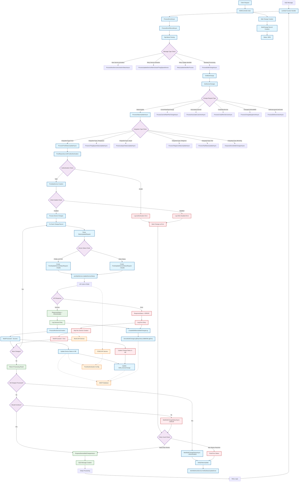

# POND IoT Service Provider - Update Device Status Data Flow

## Overview
This document provides a comprehensive data flow diagram for the Update Device Status functionality in the POND IoT Service Provider system.

## Data Flow Diagram (Graph Format)

## Detailed Component Description

### 1. Entry Points
- **Client Request**: Web interface or API call to M2MController
- **SQS Message**: Asynchronous processing via AWS Lambda function

### 2. Message Processing Flow
- **SqsValues**: Parses SQS message attributes including BulkChangeId, RetryNumber, etc.
- **Message Type Routing**: Different paths based on message attributes

### 3. POND Status Update Process
- **Authentication**: Retrieves POND API credentials from PondRepository
- **Write Permission Check**: Validates if write operations are enabled for the service provider
- **Status Determination**: Maps device status to POND service status (ACTIVE/INACTIVE)
- **API Integration**: Calls POND API service to update device status

### 4. Database Operations
- **Device Table**: Updates device status, MSISDN, IP address, and modification metadata
- **M2M_DeviceChange**: Updates processing status and response details
- **DeviceBulkChangeLog**: Logs all operations for audit trail

### 5. Error Handling & Retry Logic
- **Retry Mechanism**: Configurable retry count with exponential backoff
- **Queue Management**: SQS for asynchronous processing and retry management
- **Status Tracking**: Comprehensive logging at each processing step

### 6. Integration Points
- **POND API**: External service for device status updates
- **RevIO API**: Service creation and management
- **AMOP Database**: Central database for device and customer data
- **AWS SQS**: Message queuing for reliable processing

### 7. Key Classes and Methods

#### Main Processing Classes:
- `AltaworxDeviceBulkChange.Function`: Main Lambda function handler
- `ProcessPondStatusUpdateAsync`: POND-specific status update logic
- `PondApiService`: API client for POND service integration
- `BulkChangeRepository`: Database operations for bulk changes
- `DeviceBulkChangeLogRepository`: Logging operations

#### Key Data Models:
- `StatusUpdateRequest<T>`: Request structure for status updates
- `PondUpdateServiceStatusRequest`: POND-specific API request model
- `BulkChangeDetailRecord`: Individual device change record
- `SqsValues`: SQS message parsing and retry management

### 8. Status Flow States
1. **NEW**: Initial state when bulk change is created
2. **PROCESSING**: Active processing state
3. **PROCESSED**: Successfully completed
4. **ERROR**: Failed processing (after retries)

### 9. POND-Specific Status Mapping
- **POND_ACTIVE**: Enables all service statuses for the device
- **Other Statuses**: Disables all service statuses for the device

This data flow ensures reliable, traceable, and scalable device status updates for the POND IoT Service Provider with comprehensive error handling and audit capabilities.