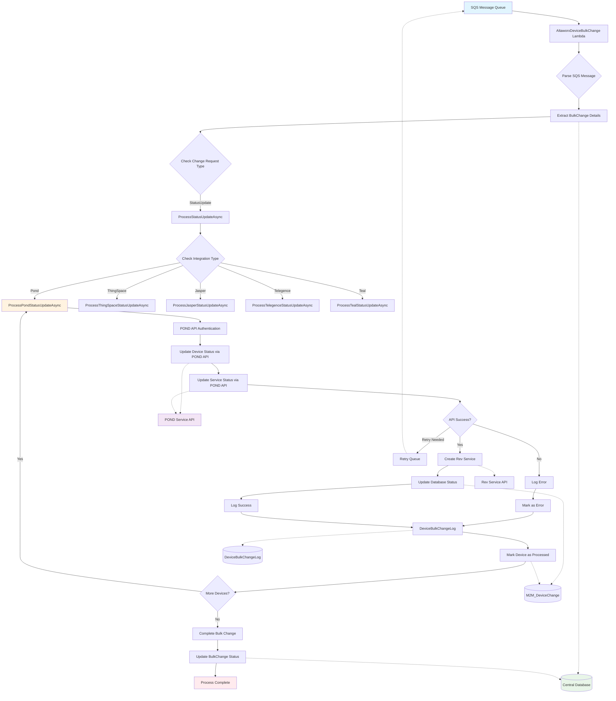

# POND IoT Service Provider - Update Device Status Data Flow
## Simplified Dataflow Diagram



## Data Flow Components

### 1. **Input Sources**
- **SQS Message Queue**: Entry point containing bulk change requests
- **Message Attributes**: 
  - BulkChangeId
  - M2MDeviceChangeId  
  - RetryNumber
  - IsFromAutomatedUpdateDeviceStatusLambda

### 2. **Core Processing Components**

#### **SQS Message Processing**
- Parse incoming SQS message
- Extract bulk change metadata
- Initialize retry logic and logging context

#### **Bulk Change Router**
- Identify change request type (StatusUpdate, ActivateNewService, etc.)
- Route to appropriate processor based on integration type

#### **POND Status Update Processor**
- Authenticate with POND API
- Process device status changes
- Handle service status updates
- Manage error handling and retries

### 3. **Integration Handlers**
- **POND Integration**: Updates device and service status via POND API
- **ThingSpace Integration**: Handles Verizon ThingSpace devices
- **Jasper Integration**: Manages Jasper/Cisco devices
- **Telegence Integration**: Processes Telegence carrier devices
- **Teal Integration**: Handles Teal carrier integration

### 4. **Data Persistence**
- **Central Database**: Stores bulk change metadata and status
- **M2M_DeviceChange**: Tracks individual device change records
- **DeviceBulkChangeLog**: Maintains audit trail and error logs

### 5. **External API Integration**
- **POND Service API**: Primary endpoint for device/service status updates
- **Rev Service API**: Handles billing service creation/updates
- **Carrier APIs**: Direct integration with various IoT carriers

### 6. **Error Handling & Retry Logic**
- Automatic retry mechanism with configurable retry counts
- SQS dead letter queue for failed messages
- Comprehensive logging for troubleshooting
- Status tracking for bulk operations

### 7. **Output/Results**
- Updated device status in database
- Service status synchronization
- Audit logs for compliance
- Error notifications for failed operations

## Key Data Structures

### StatusUpdateRequest
```csharp
{
    "UpdateStatus": "string",
    "IsIgnoreCurrentStatus": "boolean", 
    "PostUpdateStatusId": "integer",
    "AccountNumber": "string",
    "Request": "object",
    "RevService": "BulkChangeAssociateCustomer",
    "IntegrationAuthenticationId": "integer"
}
```

### SqsValues
```csharp
{
    "BulkChangeId": "long",
    "M2MDeviceChangeId": "long", 
    "RetryNumber": "integer",
    "IsFromAutomatedUpdateDeviceStatusLambda": "boolean",
    "RequestId": "string"
}
```

### UpdateDeviceStatusResult
```csharp
{
    "iccid": "string"
}
```

## Process Flow Summary

1. **Message Reception**: SQS receives device status update request
2. **Parsing & Validation**: Extract and validate bulk change parameters
3. **Integration Routing**: Route to appropriate carrier integration handler
4. **API Communication**: Execute status updates via carrier APIs
5. **Database Updates**: Persist status changes and create audit logs
6. **Error Handling**: Manage failures with retry logic and error logging
7. **Completion**: Mark bulk change as processed or failed

This simplified dataflow provides a clear overview of how device status updates flow through the POND IoT Service Provider system, from initial SQS message to final database persistence.