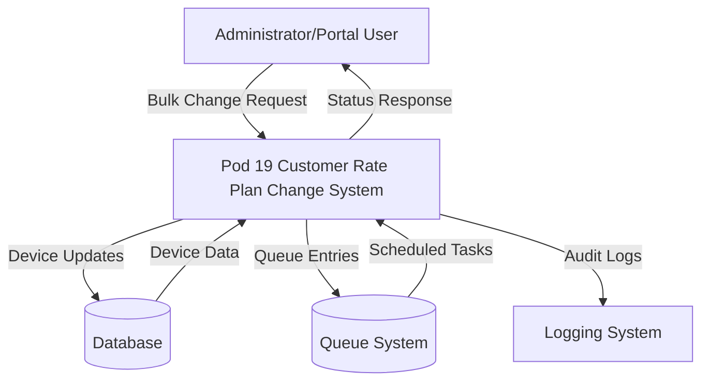
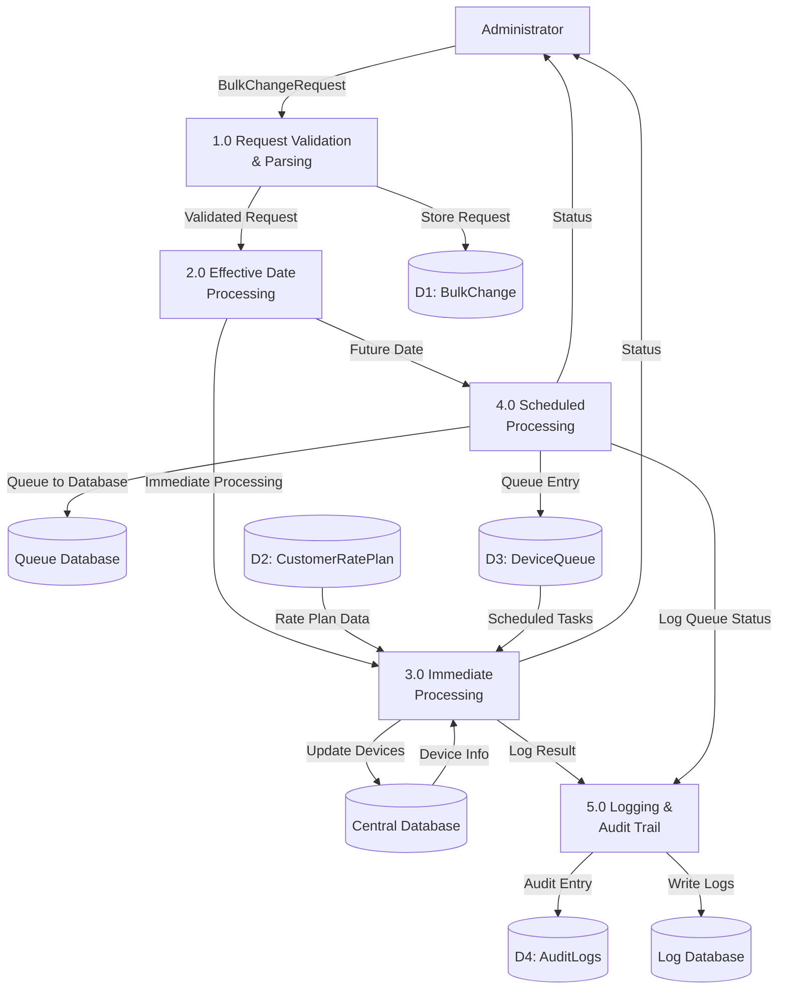
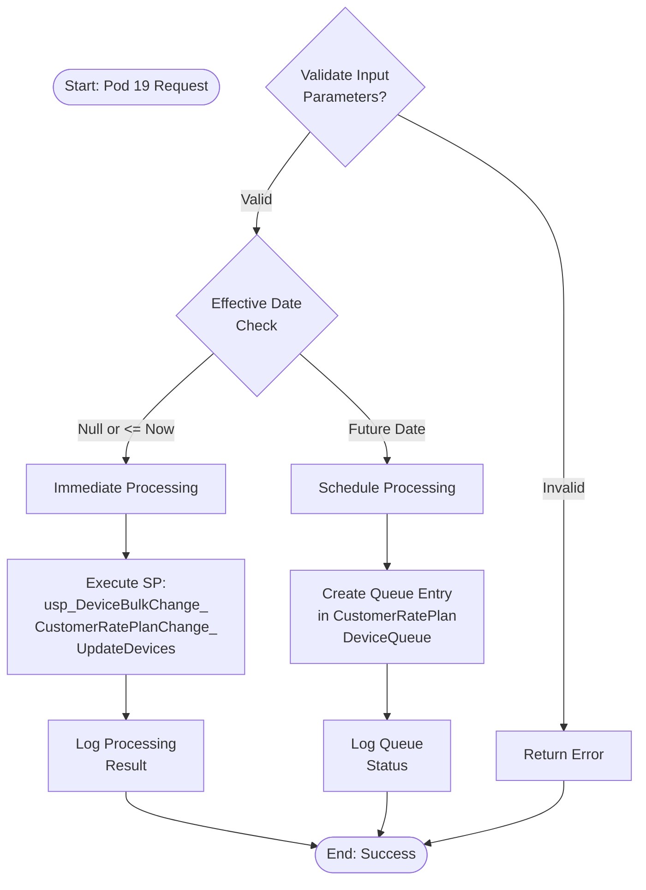
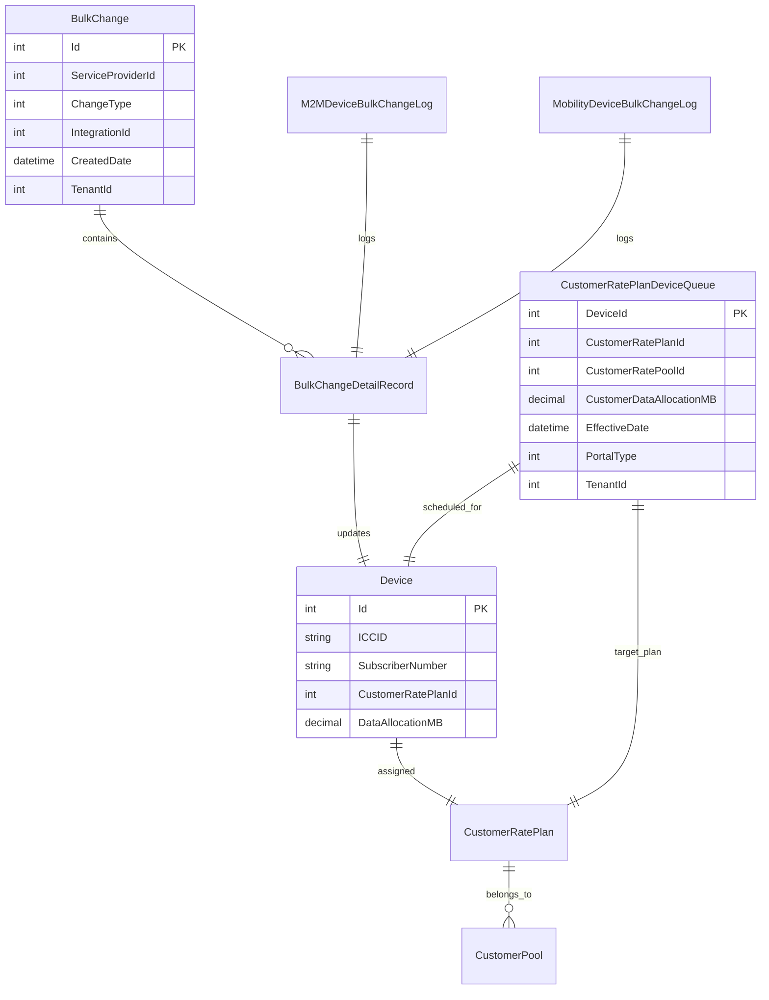
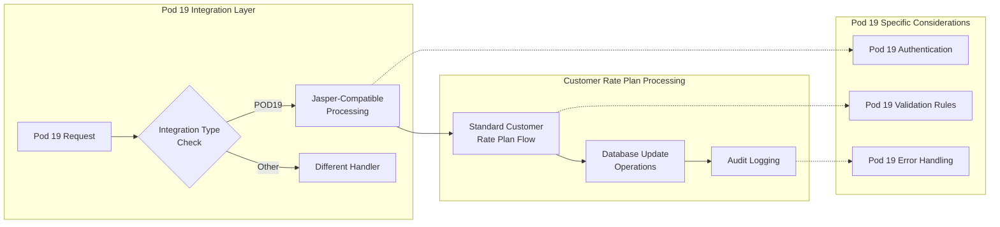
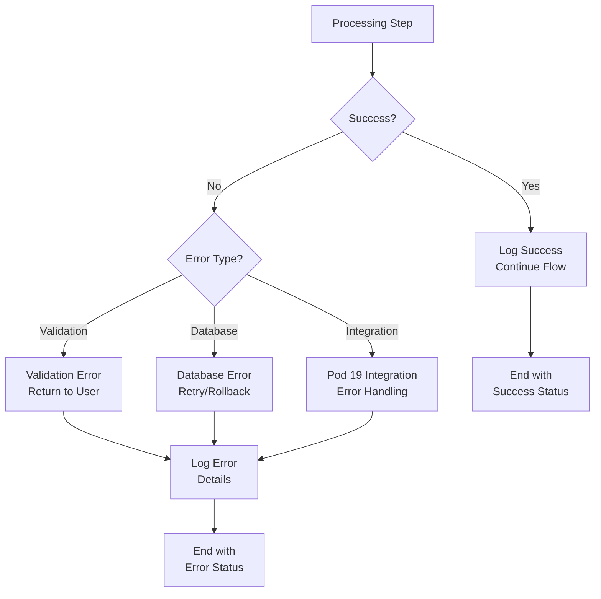
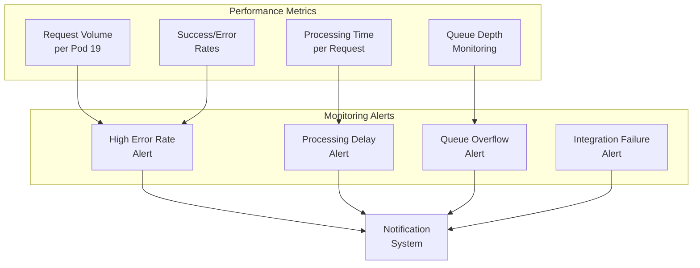

# Pod 19 Service Provider - Customer Rate Plan Change DFD

## Data Flow Diagram for Customer Rate Plan Change Type (Pod 19)

### Level 0 DFD - Context Diagram



### Level 1 DFD - System Breakdown



### Level 2 DFD - Detailed Process Flow

```mermaid
graph TB
    %% Input
    Input[BulkChangeRequest<br/>Pod 19 Provider]
    
    %% Validation Process
    subgraph "1.0 Request Validation"
        P11[1.1 Extract Customer<br/>Rate Plan Update]
        P12[1.2 Validate<br/>Parameters]
        P13[1.3 Check Pod 19<br/>Integration]
    end
    
    %% Date Processing
    subgraph "2.0 Effective Date Processing"
        P21[2.1 Parse<br/>Effective Date]
        P22[2.2 Compare with<br/>Current Time]
        P23[2.3 Route Request]
    end
    
    %% Immediate Processing
    subgraph "3.0 Immediate Processing"
        P31[3.1 Execute Stored<br/>Procedure]
        P32[3.2 Update Device<br/>Rate Plans]
        P33[3.3 Validate<br/>Results]
    end
    
    %% Scheduled Processing
    subgraph "4.0 Scheduled Processing"
        P41[4.1 Create Queue<br/>Entry]
        P42[4.2 Store in<br/>DeviceQueue Table]
        P43[4.3 Schedule<br/>Future Processing]
    end
    
    %% Logging
    subgraph "5.0 Logging & Audit"
        P51[5.1 Create Log<br/>Entry]
        P52[5.2 Determine Portal<br/>Type (M2M/Mobility)]
        P53[5.3 Write Audit<br/>Trail]
    end
    
    %% Data Stores
    DB[(Central Database)]
    QueueDB[(CustomerRatePlan<br/>DeviceQueue)]
    LogDB[(Audit Logs)]
    
    %% Flow
    Input --> P11
    P11 --> P12
    P12 --> P13
    P13 --> P21
    P21 --> P22
    P22 --> P23
    
    P23 -->|Immediate| P31
    P23 -->|Scheduled| P41
    
    P31 --> P32
    P32 --> P33
    P33 --> P51
    
    P41 --> P42
    P42 --> P43
    P43 --> P51
    
    P51 --> P52
    P52 --> P53
    
    P31 --> DB
    P42 --> QueueDB
    P53 --> LogDB
```

### Data Flow Details

#### 1. Input Data Structure
```
BulkChangeRequest {
    ServiceProviderId: 19 (Pod 19)
    ChangeType: 4 (Customer Rate Plan Change)
    CustomerRatePlanUpdate: {
        CustomerRatePlanId: Integer
        CustomerDataAllocationMB: Decimal
        CustomerPoolId: Integer
        EffectiveDate: DateTime
    }
    Devices: String[]
}
```

#### 2. Processing Decision Logic


#### 3. Database Interactions



#### 4. Integration Specific Flow for Pod 19



### Error Handling Flow



### Performance and Monitoring



## Summary

This DFD represents the complete data flow for customer rate plan changes specific to Pod 19 service provider. Key characteristics:

1. **Pod 19 Integration**: Uses Jasper-compatible processing for carrier operations but follows standard flow for customer rate plan changes
2. **Dual Processing Paths**: Immediate execution or scheduled queue processing based on effective date
3. **Comprehensive Logging**: Both M2M and Mobility portal logging with full audit trails
4. **Error Handling**: Multi-layered error handling with specific considerations for Pod 19 integration
5. **Database Operations**: Uses standardized stored procedures for consistency across all service providers
6. **Queue Management**: Sophisticated scheduling system for future-dated changes

The system ensures data consistency, provides comprehensive audit trails, and maintains high availability for Pod 19 service provider operations.