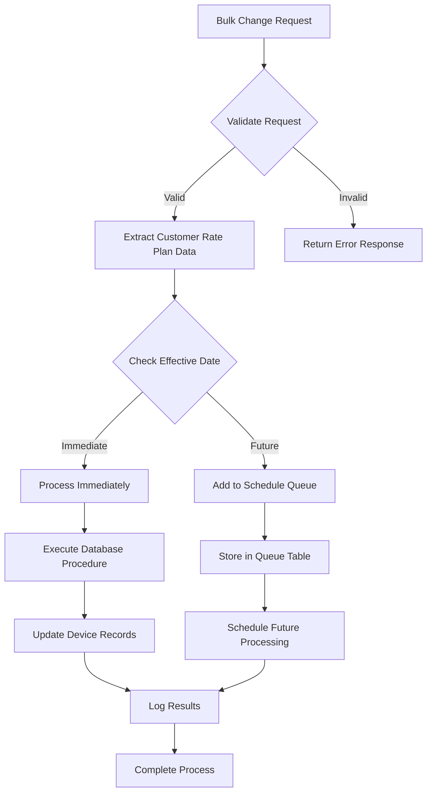
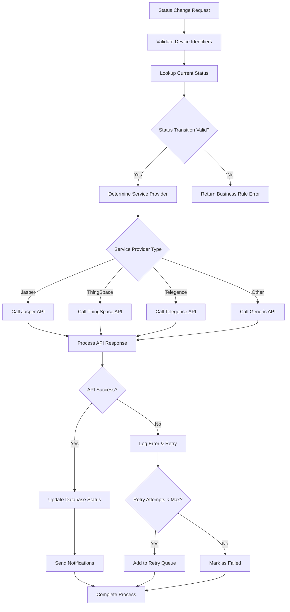
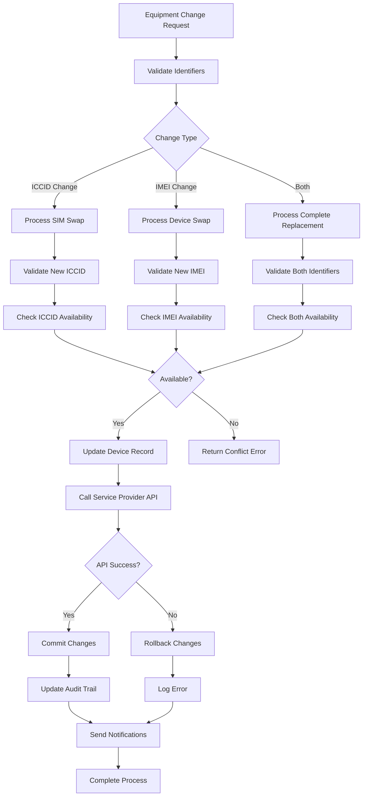
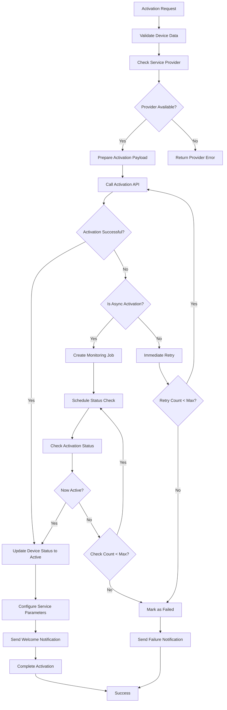
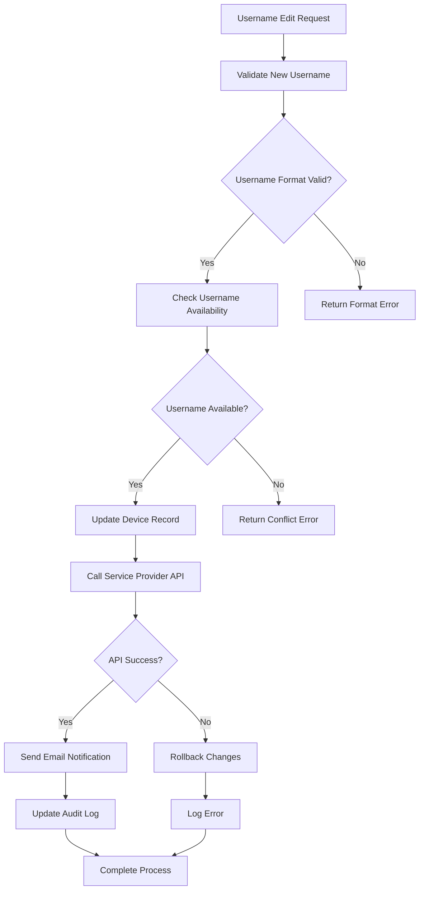
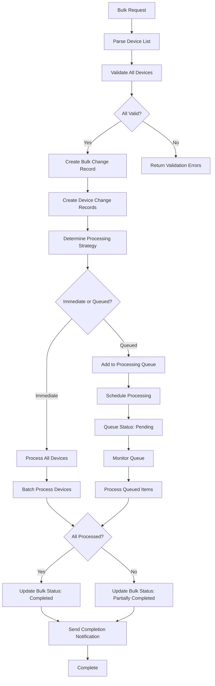
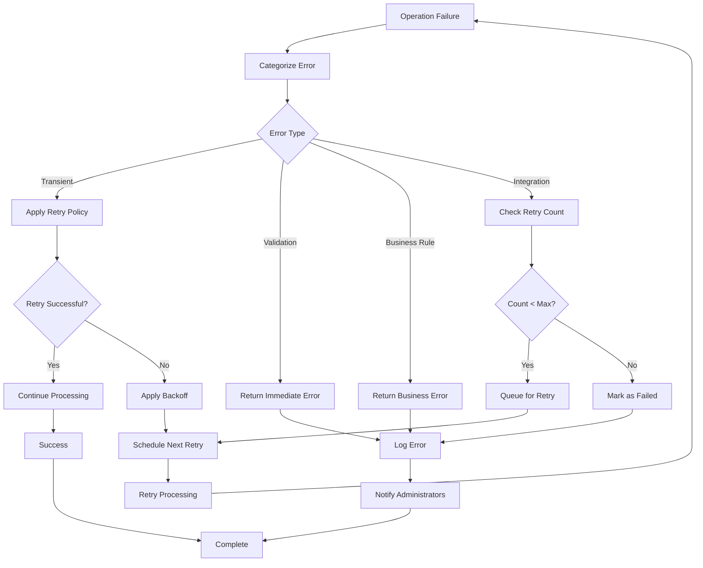
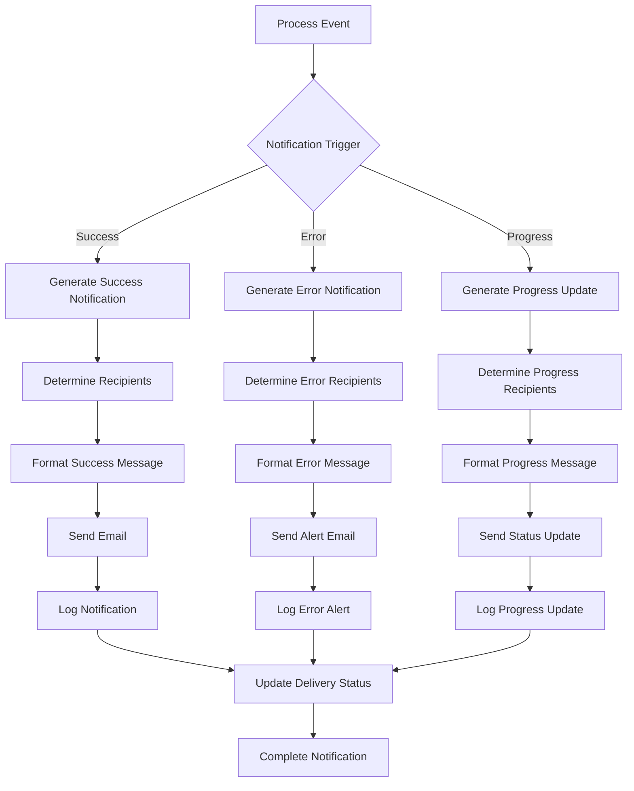
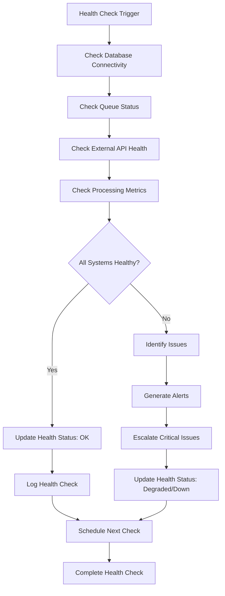
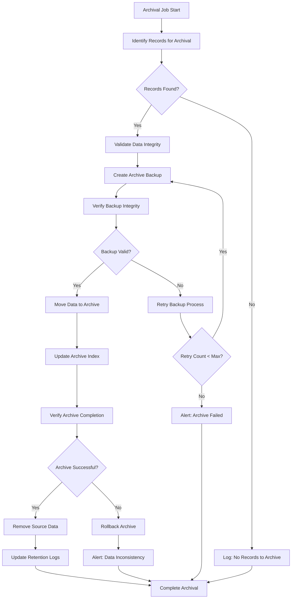

# Process Flow Documentation

## Overview

This document outlines the process flows for the Altaworx Device Bulk Change system, detailing the step-by-step workflows for various device management operations across M2M and Mobility portals.

## Core Process Types

### 1. Customer Rate Plan Change Process

#### Process Overview
Updates customer-specific rate plans for billing and data allocation purposes.



#### Detailed Steps

**Step 1: Request Validation**
```csharp
// Input validation
if (request.CustomerRatePlanUpdate == null) 
    return ValidationError("Customer rate plan update required");

if (request.Devices == null || request.Devices.Length == 0)
    return ValidationError("Device list cannot be empty");
```

**Step 2: Effective Date Processing**
```csharp
var effectiveDate = request.CustomerRatePlanUpdate.EffectiveDate;
var isImmediate = effectiveDate == null || 
                  effectiveDate?.ToUniversalTime() <= DateTime.UtcNow;

if (isImmediate) {
    await ProcessCustomerRatePlanChangeAsync(...);
} else {
    await ProcessAddCustomerRatePlanChangeToQueueAsync(...);
}
```

**Step 3: Database Operations**
```sql
-- Immediate processing
EXEC usp_DeviceBulkChange_CustomerRatePlanChange_UpdateDevices
    @bulkChangeId,
    @customerRatePlanId,
    @customerRatePoolId,
    @customerDataAllocationMB,
    @effectiveDate,
    @needToMarkProcessed

-- Scheduled processing
INSERT INTO CustomerRatePlanDeviceQueue 
    (DeviceId, CustomerRatePlanId, CustomerRatePoolId, 
     CustomerDataAllocationMB, EffectiveDate, PortalType, TenantId)
```

### 2. Device Status Change Process

#### Process Overview
Changes device operational status across service providers.



#### Status Transition Rules

**Valid Transitions:**
- `Inventory` → `Active`
- `Active` → `Suspended`
- `Suspended` → `Active`
- `Active` → `Deactive`
- `Deactive` → `Retired`

**Business Rules:**
```csharp
public bool IsValidStatusTransition(string currentStatus, string newStatus)
{
    var allowedTransitions = new Dictionary<string, string[]>
    {
        ["Inventory"] = new[] { "Active", "Test Ready" },
        ["Active"] = new[] { "Suspended", "Deactive" },
        ["Suspended"] = new[] { "Active", "Deactive" },
        ["Test Ready"] = new[] { "Active", "Deactive" },
        ["Deactive"] = new[] { "Retired" }
    };
    
    return allowedTransitions.ContainsKey(currentStatus) && 
           allowedTransitions[currentStatus].Contains(newStatus);
}
```

### 3. Equipment Change Process (ICCID/IMEI)

#### Process Overview
Handles device identifier changes for SIM swaps and device replacements.



#### Validation Rules

**ICCID Validation:**
```csharp
public bool IsValidICCID(string iccid)
{
    // ICCID should be 19-20 digits
    if (string.IsNullOrEmpty(iccid) || iccid.Length < 19 || iccid.Length > 20)
        return false;
    
    // Should contain only digits
    return iccid.All(char.IsDigit);
}
```

**IMEI Validation:**
```csharp
public bool IsValidIMEI(string imei)
{
    // IMEI should be 15 digits
    if (string.IsNullOrEmpty(imei) || imei.Length != 15)
        return false;
    
    // Luhn algorithm validation
    return ValidateLuhnChecksum(imei);
}
```

### 4. New Service Activation Process

#### Process Overview
Activates new devices and establishes service connectivity.



#### Activation Parameters

**ThingSpace Activation:**
```csharp
public class ThingSpaceActivationRequest
{
    public string Iccid { get; set; }
    public string ServicePlan { get; set; }
    public string ZipCode { get; set; }
    public string GroupName { get; set; }
    public string[] CarrierName { get; set; }
    public string AccountName { get; set; }
}
```

**Jasper Activation:**
```csharp
public class JasperActivationRequest
{
    public string Iccid { get; set; }
    public string RatePlan { get; set; }
    public string CommunicationPlan { get; set; }
    public DateTime EffectiveDate { get; set; }
}
```

### 5. Username Edit Process

#### Process Overview
Updates device username/identifiers with validation and conflict resolution.



#### Username Validation

**Format Rules:**
```csharp
public bool IsValidUsername(string username)
{
    // Length between 3-50 characters
    if (string.IsNullOrEmpty(username) || 
        username.Length < 3 || username.Length > 50)
        return false;
    
    // Alphanumeric and specific special characters only
    var validPattern = @"^[a-zA-Z0-9._-]+$";
    return Regex.IsMatch(username, validPattern);
}
```

**Uniqueness Check:**
```sql
SELECT COUNT(*) FROM Devices 
WHERE Username = @newUsername 
  AND TenantId = @tenantId 
  AND Id != @currentDeviceId
```

### 6. Bulk Processing Workflow

#### Process Overview
Manages large-scale device operations with batching and progress tracking.



#### Batch Processing Logic

**Device Batching:**
```csharp
public async Task ProcessDeviceBatch(IEnumerable<Device> devices, int batchSize = 100)
{
    var deviceBatches = devices.Chunk(batchSize);
    
    foreach (var batch in deviceBatches)
    {
        var tasks = batch.Select(device => ProcessSingleDevice(device));
        await Task.WhenAll(tasks);
        
        // Progress reporting
        await UpdateBatchProgress(completedCount, totalCount);
    }
}
```

### 7. Error Handling and Retry Process

#### Process Overview
Comprehensive error handling with categorized retry strategies.



#### Retry Policies

**SQL Transient Errors:**
```csharp
public static readonly RetryPolicy SqlRetryPolicy = Policy
    .Handle<SqlException>(ex => IsTransientError(ex))
    .WaitAndRetryAsync(
        retryCount: 3,
        sleepDurationProvider: retryAttempt => 
            TimeSpan.FromSeconds(Math.Pow(2, retryAttempt)),
        onRetry: (outcome, timespan, retryCount, context) =>
            LogRetryAttempt(retryCount, timespan)
    );
```

**HTTP Request Errors:**
```csharp
public static readonly RetryPolicy HttpRetryPolicy = Policy
    .Handle<HttpRequestException>()
    .Or<TaskCanceledException>()
    .WaitAndRetryAsync(
        retryCount: 3,
        sleepDurationProvider: retryAttempt => TimeSpan.FromSeconds(5),
        onRetry: LogHttpRetry
    );
```

### 8. Notification and Reporting Process

#### Process Overview
Automated notifications and status reporting for various stakeholders.



#### Notification Templates

**Success Notification:**
```html
<h2>Bulk Change Completed Successfully</h2>
<p>Bulk Change ID: {BulkChangeId}</p>
<p>Total Devices: {TotalDevices}</p>
<p>Successfully Processed: {SuccessCount}</p>
<p>Completion Time: {CompletionTime}</p>
```

**Error Notification:**
```html
<h2>Bulk Change Failed</h2>
<p>Bulk Change ID: {BulkChangeId}</p>
<p>Error: {ErrorMessage}</p>
<p>Failed Devices: {FailedDevices}</p>
<p>Support Contact: {SupportEmail}</p>
```

### 9. Monitoring and Health Check Process

#### Process Overview
Continuous monitoring of system health and performance metrics.



#### Health Metrics

**System Metrics:**
- Database connection time
- Queue depth and processing rate
- API response times
- Error rates by component
- Memory and CPU utilization

**Business Metrics:**
- Processing throughput
- Success/failure rates
- Average processing time
- Customer satisfaction scores

### 10. Data Archival Process

#### Process Overview
Automated archival of completed and historical data.



---

*This document provides comprehensive process flows for the Altaworx Device Bulk Change system. Each process includes detailed steps, decision points, error handling, and integration touchpoints.*