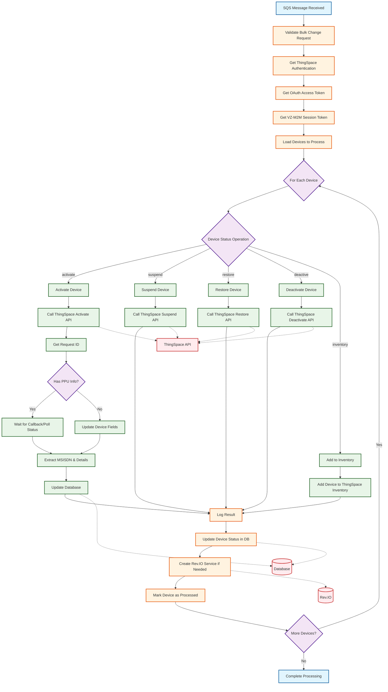

# Simplified Data Flow Diagram - Verizon ThingSpace Update Device Status

## Simple ThingSpace Data Flow

## Flow Steps Explained

### 1. **Initialization**
- Receive SQS message with bulk change request
- Validate the request and get ThingSpace configuration
- Authenticate with ThingSpace (OAuth + Session token)

### 2. **Device Processing Loop**
- Load all devices that need status updates
- Process each device individually
- Determine the required status operation

### 3. **Status Operations**
- **Activate**: Call activate API, handle PPU if needed, wait for confirmation
- **Suspend**: Call suspend API to temporarily disable service
- **Restore**: Call restore API to reactivate suspended device
- **Deactivate**: Call deactivate API to permanently terminate service
- **Inventory**: Add device to ThingSpace inventory without activation

### 4. **Post-Processing**
- Log the API operation result
- Update device status in local database
- Create Rev.IO service line if successful
- Mark device change record as processed

### 5. **Completion**
- Continue processing remaining devices
- Complete when all devices are processed

## Key ThingSpace Features

- **Dual Authentication**: OAuth access token + VZ-M2M session token required
- **PPU Handling**: Primary Place of Use validation for device activation
- **Callback Integration**: Asynchronous confirmation for activation operations
- **MSISDN Assignment**: Automatic phone number assignment during activation
- **Comprehensive Logging**: Full audit trail of all operations