# Verizon ThingSpace IoT - Change Carrier Rate Plan Data Flow

## Overview
This document outlines the complete data flow for changing carrier rate plans for IoT devices managed through Verizon's ThingSpace platform within the M2M device management system.

## Data Flow Diagram

```mermaid
flowchart TD
    %% User Interface Layer
    A[M2M Portal User] --> B[Device Selection Interface]
    B --> C[Rate Plan Selection]
    C --> D[Bulk Change Request]

    %% Request Processing Layer
    D --> E[M2M Controller]
    E --> F[Rate Plan Validation]
    F --> G[Device Change Creation]
    G --> H[Bulk Change Record]
    H --> I[SQS Queue]

    %% Background Processing Layer
    I --> J[Lambda Function Handler]
    J --> K[Change Type Router]
    K --> L[ThingSpace Processor]

    %% Authentication Layer
    L --> M[ThingSpace Auth Service]
    M --> N[OAuth Token Request]
    N --> O[Access Token Response]
    O --> P[Session Token Request]
    P --> Q[Session Token Response]

    %% Device Processing Layer
    Q --> R[Device Batch Processor]
    R --> S[Individual Device Handler]
    S --> T[Rate Plan Request Builder]

    %% ThingSpace API Layer
    T --> U[ThingSpace API Gateway]
    U --> V[Device Detail Service]
    V --> W[Rate Plan Update API]
    W --> X[Verizon IoT Platform]

    %% Response Processing Layer
    X --> Y[API Response Handler]
    Y --> Z[Success/Error Evaluation]
    Z --> AA[Response Logger]

    %% Database Synchronization Layer
    AA --> BB{API Success?}
    BB -->|Yes| CC[AMOP Database Update]
    BB -->|No| DD[Error Status Update]
    CC --> EE[Device Record Sync]
    DD --> FF[Failure Logging]

    %% Status Management Layer
    EE --> GG[Status Tracker]
    FF --> GG
    GG --> HH[Individual Device Status]
    HH --> II[Bulk Operation Status]

    %% Completion Layer
    II --> JJ[Audit Trail Creation]
    JJ --> KK[Final Status Report]
    KK --> LL[User Notification]

    %% Data Stores
    MM[(AMOP Database)]
    NN[(ThingSpace Config)]
    OO[(Audit Logs)]
    PP[(Rate Plan Catalog)]

    %% Data Store Connections
    F -.-> PP
    M -.-> NN
    CC -.-> MM
    AA -.-> OO
    EE -.-> MM

    %% Styling
    classDef userLayer fill:#e1f5fe
    classDef processLayer fill:#f3e5f5
    classDef apiLayer fill:#e8f5e8
    classDef dataLayer fill:#fff3e0

    class A,B,C,D userLayer
    class E,F,G,H,I,J,K,L processLayer
    class U,V,W,X,Y,Z apiLayer
    class MM,NN,OO,PP dataLayer
```



## Process Flow Description

### 1. User Interface Layer
- **M2M Portal User**: Service provider personnel initiating rate plan changes
- **Device Selection Interface**: Interface for selecting devices requiring plan updates
- **Rate Plan Selection**: Interface for choosing target carrier rate plans
- **Bulk Change Request**: Consolidated request for multiple device updates

### 2. Request Processing Layer
- **M2M Controller**: Main orchestrator for bulk change operations
- **Rate Plan Validation**: Verifies selected rate plan exists and is valid
- **Device Change Creation**: Creates individual change records for each device
- **Bulk Change Record**: Master record tracking the entire operation
- **SQS Queue**: Message queue for asynchronous processing

### 3. Background Processing Layer
- **Lambda Function Handler**: AWS Lambda for background bulk processing
- **Change Type Router**: Routes to appropriate change type processor
- **ThingSpace Processor**: Handles ThingSpace-specific rate plan changes

### 4. Authentication Layer
- **ThingSpace Auth Service**: Manages ThingSpace API authentication
- **OAuth Token Request/Response**: Initial OAuth authentication flow
- **Session Token Request/Response**: Session-specific token management

### 5. Device Processing Layer
- **Device Batch Processor**: Manages batches of devices for processing
- **Individual Device Handler**: Processes single device rate plan changes
- **Rate Plan Request Builder**: Constructs ThingSpace API requests

### 6. ThingSpace API Layer
- **ThingSpace API Gateway**: Verizon's API gateway for ThingSpace
- **Device Detail Service**: ThingSpace service for device management
- **Rate Plan Update API**: Specific API for updating device rate plans
- **Verizon IoT Platform**: Core Verizon IoT infrastructure

### 7. Response Processing Layer
- **API Response Handler**: Processes ThingSpace API responses
- **Success/Error Evaluation**: Determines operation success/failure
- **Response Logger**: Logs all API interactions

### 8. Database Synchronization Layer
- **API Success Decision**: Determines if local database should be updated
- **AMOP Database Update**: Updates internal device records
- **Error Status Update**: Marks failed operations
- **Device Record Sync**: Synchronizes carrier and local data
- **Failure Logging**: Records failed operations for troubleshooting

### 9. Status Management Layer
- **Status Tracker**: Monitors individual and bulk operation status
- **Individual Device Status**: Tracks each device's update status
- **Bulk Operation Status**: Overall operation progress and completion

### 10. Completion Layer
- **Audit Trail Creation**: Creates comprehensive operation logs
- **Final Status Report**: Generates operation summary
- **User Notification**: Notifies users of completion status

## Data Stores

### AMOP Database
- Stores device information and rate plan configurations
- Maintains device-to-customer associations
- Tracks device status and service history

### ThingSpace Configuration
- Contains ThingSpace API credentials and endpoints
- Stores service provider-specific configurations
- Manages authentication tokens and session data

### Audit Logs
- Comprehensive logging of all operations
- API request/response tracking
- Error and exception logging
- Compliance and troubleshooting data

### Rate Plan Catalog
- Available carrier rate plans
- Plan specifications and pricing
- Service provider access permissions

## Key Data Elements

### Rate Plan Change Request
```json
{
  "CarrierRatePlanUpdate": {
    "CarrierRatePlan": "premium_iot_plan",
    "CommPlan": "global_coverage",
    "EffectiveDate": "2024-01-01T00:00:00Z",
    "PlanUuid": "plan-uuid-123",
    "RatePlanId": 12345
  }
}
```

### ThingSpace Device Detail
```json
{
  "ICCID": ["89011234567890123456"],
  "CarrierRatePlan": "premium_iot_plan"
}
```

### Processing Status
- **QUEUED**: Request queued for processing
- **PROCESSING**: Currently being processed
- **PROCESSED**: Successfully completed
- **ERROR**: Failed with errors
- **PARTIAL**: Partially completed with some failures

## Error Handling

### Authentication Failures
- Invalid credentials or expired tokens
- Service provider access restrictions
- API endpoint unavailability

### API Errors
- Rate plan not found or invalid
- Device not found in ThingSpace
- Service restrictions or limitations

### Database Errors
- Connection failures
- Data consistency issues
- Transaction rollback scenarios

## Performance Considerations

### Batch Processing
- Processes devices in configurable batch sizes
- Handles ThingSpace API rate limits
- Implements retry logic for transient failures

### Async Processing
- Uses SQS for decoupled processing
- Lambda functions for scalable execution
- Database connection pooling

## Security Measures

### Authentication
- OAuth 2.0 for ThingSpace API access
- Secure credential storage
- Token refresh mechanisms

### Data Protection
- Encrypted API communications
- Audit trail for compliance
- Role-based access controls

## Monitoring and Alerting

### Operation Tracking
- Real-time status monitoring
- Progress indicators for bulk operations
- Completion notifications

### Error Monitoring
- Failed operation alerts
- API error rate tracking
- Database sync failure detection