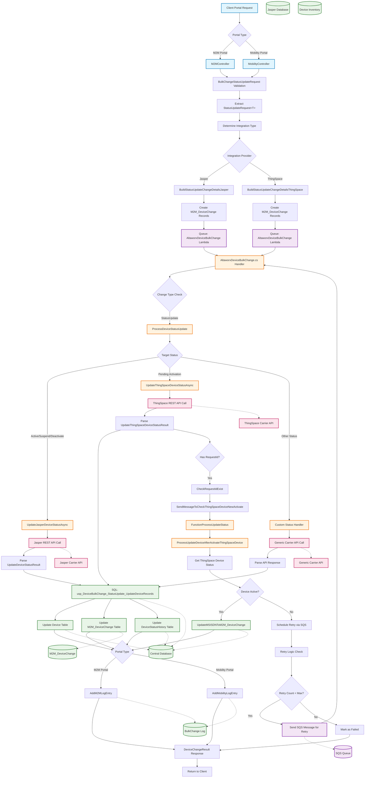

# Update Device Status - Data Flow Diagram (AT&T POD19)

## Overview
This Data Flow Diagram represents the Update Device Status process within the AT&T POD19 architecture, showing how device status changes flow through the M2M/Mobility portals, processing components, and external carrier APIs.

## Data Flow Diagram

## Data Elements and Flows

### 1. Input Data Elements

#### StatusUpdateRequest&lt;T&gt;
- **UpdateStatus**: Target device status (active, suspend, deactivate, etc.)
- **IsIgnoreCurrentStatus**: Flag to bypass current status validation
- **PostUpdateStatusId**: Target status ID after processing
- **AccountNumber**: Customer account identifier
- **Request**: Provider-specific request object (Jasper/ThingSpace)
- **RevService**: Revenue service association
- **IntegrationAuthenticationId**: Provider authentication credentials

#### BulkChangeStatusUpdate
- **TargetStatus**: Desired device status
- **JasperStatusUpdate**: Jasper-specific parameters
- **ThingSpaceStatusUpdate**: ThingSpace-specific parameters

### 2. Processing Components

#### M2MController/MobilityController
- **Input**: HTTP POST request with status change payload
- **Processing**: 
  - Validates request structure and permissions
  - Determines integration provider (Jasper/ThingSpace)
  - Creates M2M_DeviceChange records
  - Queues processing via AWS Lambda
- **Output**: BulkChange ID and processing status

#### AltaworxDeviceBulkChange Lambda
- **Input**: SQS message with BulkChange details
- **Processing**:
  - Retrieves device change records
  - Calls appropriate carrier API
  - Processes API responses
  - Updates database records
  - Handles error scenarios and retries
- **Output**: DeviceChangeResult with success/failure status

### 3. External System Integrations

#### Jasper API Integration
- **Endpoint**: Jasper REST API for device status updates
- **Authentication**: API key-based authentication
- **Request Format**: JSON with device identifiers and target status
- **Response**: UpdateDeviceStatusResult with ICCID confirmation

#### ThingSpace API Integration
- **Endpoint**: Verizon ThingSpace API for device lifecycle management
- **Authentication**: OAuth2 with session tokens
- **Request Format**: JSON with device details and activation parameters
- **Response**: UpdateThingSpaceDeviceStatusResult with requestId for tracking

### 4. Database Operations

#### Primary Stored Procedures
- **usp_DeviceBulkChange_StatusUpdate_UpdateDeviceRecords**: Main status update procedure
- **usp_DeviceBulkChange_UpdateMobilityDeviceChange**: Mobility-specific updates
- **usp_DeviceBulkChange_UpdateM2MChange**: M2M-specific updates

#### Key Database Tables
- **Device**: Core device inventory with status tracking
- **M2M_DeviceChange**: Change request tracking and status
- **DeviceStatusHistory**: Audit trail of status changes
- **BulkChangeLog**: Processing logs and error tracking

### 5. Queue and Retry Mechanisms

#### SQS Message Processing
- **Message Attributes**:
  - BulkChangeId: Processing batch identifier
  - RetryNumber: Current retry attempt
  - IsFromAutomatedUpdateDeviceStatusLambda: Processing source flag
- **Retry Logic**: Configurable retry count with exponential backoff
- **Dead Letter Queue**: Failed messages after max retries

### 6. Status-Specific Processing Flows

#### ThingSpace Pending Activation
1. Validate device eligibility for activation
2. Call ThingSpace activation API
3. Receive requestId for tracking
4. Schedule callback verification (15-minute delay)
5. Monitor activation status via GetDevice API
6. Update MSISDN and IP address once active

#### Jasper Status Updates
1. Direct API call with target status
2. Immediate response processing
3. Database updates with confirmed status
4. No callback mechanism required

### 7. Error Handling and Logging

#### Error Categories
- **Validation Errors**: Invalid request format or missing data
- **API Errors**: Carrier API failures or timeouts
- **Database Errors**: SQL execution failures
- **Authentication Errors**: Invalid or expired credentials

#### Logging Components
- **M2M Log Entries**: Portal-specific processing logs
- **Mobility Log Entries**: Mobility portal processing logs
- **Device Change Logs**: Detailed API request/response tracking
- **Error Logs**: Exception details and stack traces

## AT&T POD19 Specific Considerations

### Integration Points
- **Single Sign-On (SSO)**: AT&T enterprise authentication
- **Network Security**: VPN tunneling for carrier API access
- **Data Residency**: All processing within AT&T network boundaries
- **Compliance**: GDPR and telecommunications regulations

### Performance Requirements
- **Response Time**: < 5 seconds for immediate status changes
- **Throughput**: Support for bulk operations (1000+ devices)
- **Availability**: 99.9% uptime with failover capabilities
- **Scalability**: Auto-scaling based on processing queue depth

### Monitoring and Alerting
- **Real-time Dashboards**: Device status change metrics
- **Error Rate Monitoring**: API failure rate tracking
- **Performance Metrics**: Processing time and queue depth
- **Business Intelligence**: Status change analytics and reporting

This DFD provides a comprehensive view of the Update Device Status process within the AT&T POD19 environment, showing the complete flow from client request through carrier API integration to final database updates and response delivery.