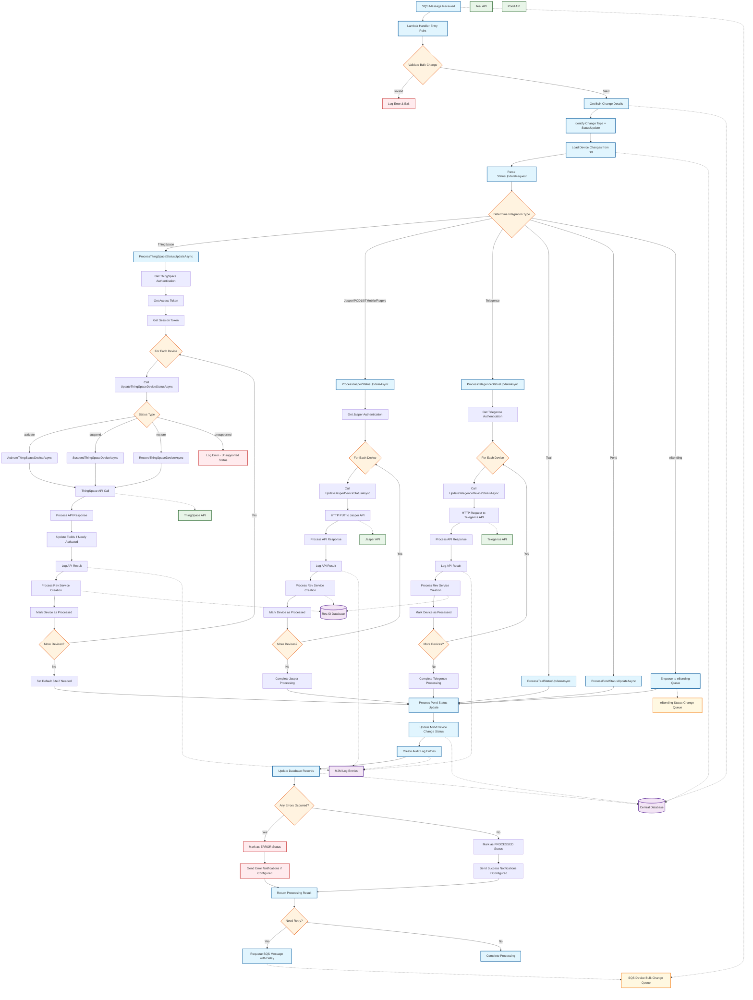

# Update Device Status - Change Type Overview

## Overview

### What (2 sentences)
The "Update Device Status" change type is a bulk operation that modifies the operational status of IoT/M2M devices across different carrier networks and service providers. This change type handles status transitions such as activating, suspending, restoring, or deactivating devices through various carrier APIs including ThingSpace, Jasper, Telegence, Teal, and Pond integrations.

### Why (2 sentences)  
This change type is essential for lifecycle management of IoT devices, allowing administrators to control device connectivity and services in bulk rather than individual device management. It enables automated device provisioning, cost control through suspension/restoration, and proper device decommissioning while maintaining audit trails and ensuring proper synchronization between carrier systems and internal databases.

### How (2 sentences)
The system processes status updates by first validating the bulk change request, then routing to the appropriate carrier-specific processor based on the integration type (ThingSpace, Jasper, etc.), where it makes API calls to update device status and subsequently updates internal databases and Rev.IO services. Each status change is logged with detailed audit information, error handling, and includes automatic retry mechanisms for failed operations, ensuring data consistency across all systems.

---

## Data Flow Diagram

---

## Key Components Explained

### 1. **Entry Point**
- **SQS Message Trigger**: Lambda function triggered by SQS message containing bulk change request
- **Message Validation**: Validates bulk change ID and processing parameters
- **Status Check**: Ensures bulk change exists and is in correct processing status

### 2. **Request Processing**
- **StatusUpdateRequest Parsing**: Extracts device identifiers and target status from change request
- **Integration Detection**: Determines carrier integration type (ThingSpace, Jasper, Telegence, etc.)
- **Routing Logic**: Routes to appropriate carrier-specific processor based on integration type

### 3. **Carrier-Specific Processing**

#### **ThingSpace Integration**
- **Authentication Flow**: Multi-step authentication (access token → session token)
- **Status Operations**: 
  - `activate`: Move device from inventory to active status
  - `suspend`: Temporarily disable device connectivity
  - `restore`: Reactivate suspended device
- **Field Updates**: Updates device fields for newly activated devices
- **Site Management**: Sets default site for inventory/pending activate devices

#### **Jasper Integration**
- **Direct API Calls**: HTTP PUT requests to Jasper API endpoints
- **Status Mapping**: Maps internal status to Jasper-specific status codes
- **Authentication**: Basic authentication with encoded credentials

#### **Telegence Integration**
- **HTTP Requests**: Specific API calls for Telegence carrier network
- **Status Processing**: Handles Telegence-specific status transitions
- **Response Handling**: Processes Telegence API responses

#### **Other Integrations**
- **Teal**: Carrier-specific API integration for Teal network
- **Pond**: Dedicated processing for Pond carrier services
- **eBonding**: Queues requests for separate eBonding processor

### 4. **Status Update Operations**

| Operation | Description | Typical Flow |
|-----------|-------------|--------------|
| **Activation** | Device provisioning and connectivity enablement | Inventory → Active |
| **Suspension** | Temporary service disconnection for cost control | Active → Suspended |
| **Restoration** | Reactivation of suspended services | Suspended → Active |
| **Deactivation** | Permanent service termination | Any Status → Deactivated |

### 5. **Post-Processing**
- **Rev.IO Service Management**: Creates or updates service lines in Rev.IO system
- **Database Updates**: Synchronizes device status across internal databases
- **Audit Logging**: Comprehensive logging with request/response details
- **Error Handling**: Detailed error tracking and retry mechanisms

### 6. **Data Persistence**

#### **Central Database**
- Device status records
- M2M device change tracking
- Bulk change status management
- Service provider configurations

#### **Rev.IO Database**
- Service line creation/updates
- Customer association management
- Billing and provisioning data

#### **Audit Logging**
- M2M log entries with full request/response details
- Error tracking and debugging information
- Processing timestamps and status tracking

### 7. **Error Handling & Monitoring**

#### **Error Types**
- **API Failures**: Carrier API timeouts, authentication failures
- **Database Errors**: Connection issues, constraint violations
- **Validation Errors**: Invalid device identifiers, unsupported status transitions
- **Authentication Errors**: Token expiration, credential issues

#### **Retry Mechanisms**
- **Automatic Retry**: Configurable retry count for transient failures
- **SQS Requeuing**: Messages requeued with exponential backoff
- **Status Tracking**: PROCESSED, ERROR, PENDING status management

#### **Monitoring & Notifications**
- **Detailed Logging**: Comprehensive audit trail for troubleshooting
- **Error Notifications**: Configurable alerting for failure scenarios
- **Performance Metrics**: Processing time and success rate tracking

---

## Technical Implementation Details

### **Key Classes and Methods**
- `ProcessStatusUpdateAsync`: Main orchestrator for status update processing
- `ProcessThingSpaceStatusUpdateAsync`: ThingSpace-specific implementation
- `ProcessJasperStatusUpdateAsync`: Jasper carrier integration
- `StatusUpdateRequest<T>`: Generic request container for status updates
- `BulkChangeDetailRecord`: Individual device change tracking

### **Integration Points**
- **SQS Queues**: Message-driven processing with retry capabilities
- **Lambda Functions**: Serverless processing with timeout management
- **HTTP APIs**: RESTful integration with carrier systems
- **Database Connections**: SQL Server integration with connection pooling
- **Authentication Systems**: Multi-factor authentication for carrier APIs

### **Configuration Management**
- **Environment Variables**: Carrier API endpoints and authentication settings
- **Service Provider Configuration**: Per-tenant carrier integration settings
- **Retry Policies**: Configurable retry counts and delay intervals
- **Timeout Settings**: API call and database operation timeouts