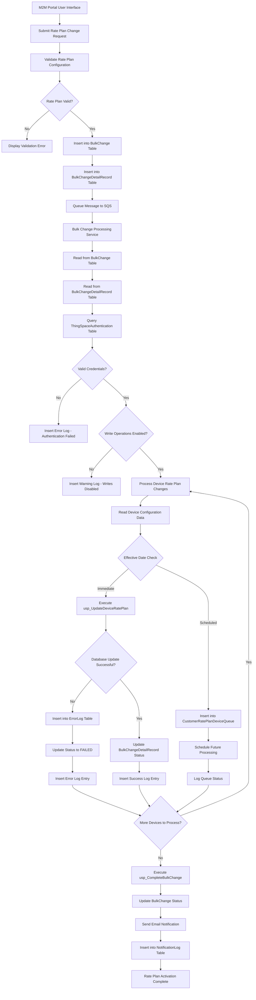

# Verizon ThingSpace IoT - Change Customer Rate Plan Data Flow

## Overview

This document provides a comprehensive analysis of the **Change Customer Rate Plan** flow for the Verizon ThingSpace IoT service provider. This flow is specifically designed for customer-facing billing plan changes and data allocation modifications, distinct from carrier rate plan changes which are managed at the network connectivity level.

---

## Complete Flow Description

### User Interface → Rate Plan Selection → Device Selection → Plan Validation → Bulk Change Creation → Queue Processing (SQS) → Background Lambda Processing → Carrier Platform Routing → Authentication & Authorization → Device-by-Device Processing → Carrier API Execution → Database Synchronization → Status Tracking → Error Handling → Completion Processing → Audit Trail Creation → Rate Plan Activation Complete

#### 1. **User Interface** (`M2MController.cs`)
- **Entry Point**: M2M Portal or Mobility Portal
- **User Action**: Admin selects customer rate plan change option
- **Input Validation**: Rate plan ID validation and user permission checks
- **UI Components**: Device selection interface, rate plan dropdown, effective date picker

#### 2. **Rate Plan Selection** (`BulkChangeCreateModel`)
```csharp
public class BulkChangeCustomerRatePlanUpdate
{
    public int? CustomerRatePlanId { get; set; }
    public decimal? CustomerDataAllocationMB { get; set; }
    public int? CustomerPoolId { get; set; }
    public DateTime? EffectiveDate { get; set; }
}
```

#### 3. **Device Selection** (`M2MController.BuildCustomerRatePlanChangeDetails()`)
- **Device Filtering**: Based on service provider and tenant scope
- **Bulk Selection**: Support for multiple device selection
- **Validation**: Device eligibility checks for rate plan changes

#### 4. **Plan Validation** (`ProcessCustomerRatePlanChangeAsync()`)
- **Rate Plan ID Validation**: Verify customer rate plan exists and is active
- **Data Allocation Checks**: Validate data limits and pool assignments
- **Effective Date Validation**: Check date is not in the past
- **Business Rules**: Tenant-specific rate plan restrictions

#### 5. **Bulk Change Creation** (`BulkChange` Entity)
```csharp
// Change Request Type: CustomerRatePlanChange = 4
public class BulkChangeRequest
{
    public int? ServiceProviderId { get; set; }
    public int? ChangeType { get; set; } // = 4 for Customer Rate Plan Change
    public BulkChangeCustomerRatePlanUpdate CustomerRatePlanUpdate { get; set; }
    public string[] Devices { get; set; }
}
```

#### 6. **Queue Processing (SQS)** (`SqsValues.cs`)
- **Message Attributes**: 
  - `BULK_CHANGE_ID`: Bulk change identifier
  - `SERVICE_PROVIDER_ID`: Verizon ThingSpace provider ID
  - `RETRY_NUMBER`: Retry attempt counter
- **Queue URL**: `DeviceBulkChangeQueueUrl`
- **Delay**: Configurable processing delay

#### 7. **Background Lambda Processing** (`AltaworxDeviceBulkChange.cs`)
```csharp
switch (bulkChange.ChangeRequestType.ToLowerInvariant())
{
    case ChangeRequestType.CustomerRatePlanChange:
        await ProcessCustomerRatePlanChangeAsync(context, logRepo, bulkChange, sqlRetryPolicy);
        return false;
}
```

#### 8. **Carrier Platform Routing** (ThingSpace Integration)
- **Authentication Service**: `ThingSpaceCommon.GetThingspaceAuthenticationInformation()`
- **Service Provider**: Verizon ThingSpace (IntegrationType.ThingSpace)
- **API Base URL**: Retrieved from `ThingSpaceAuthentication` table

#### 9. **Authentication & Authorization** (`ThingSpaceAuthentication`)
```csharp
var thingSpaceAuthentication = ThingSpaceCommon.GetThingspaceAuthenticationInformation(
    context.CentralDbConnectionString, bulkChange.ServiceProviderId);
var accessToken = ThingSpaceCommon.GetAccessToken(thingSpaceAuthentication);
var sessionToken = ThingSpaceCommon.GetSessionToken(thingSpaceAuthentication, accessToken);
```

#### 10. **Device-by-Device Processing** (`ProcessCustomerRatePlanChangeAsync()`)
- **Immediate Processing**: If `effectiveDate <= DateTime.UtcNow`
- **Scheduled Processing**: If `effectiveDate > DateTime.UtcNow` → Queue to `CustomerRatePlanDeviceQueue`
- **Batch Processing**: All devices in bulk change processed together

#### 11. **Carrier API Execution** (Database Operations)
```sql
-- Immediate Processing
EXEC usp_DeviceBulkChange_CustomerRatePlanChange_UpdateDevices
    @bulkChangeId,
    @customerRatePlanId,
    @customerRatePoolId,
    @customerDataAllocationMB,
    @effectiveDate,
    @needToMarkProcessed

-- Individual Device Processing  
EXEC usp_DeviceBulkChange_CustomerRatePlanChange_UpdateDeviceByNumber
    @bulkChangeId,
    @subscriberNumber,
    @customerRatePlanId,
    @customerRatePoolId,
    @effectiveDate,
    @customerDataAllocationMB
```

#### 12. **Database Synchronization** (`DeviceChangeResult`)
- **Transaction Management**: Atomic updates across device tables
- **Data Consistency**: Rate plan assignment synchronization
- **Rollback Support**: Error handling with transaction rollback

#### 13. **Status Tracking** (`BulkChangeDetailRecord`)
- **Status Updates**: PROCESSED, ERROR, PENDING
- **Progress Tracking**: Individual device processing status
- **Bulk Change Status**: Overall completion tracking

#### 14. **Error Handling** (`CreateM2MDeviceBulkChangeLog`)
```csharp
logRepo.AddM2MLogEntry(new CreateM2MDeviceBulkChangeLog()
{
    BulkChangeId = bulkChange.Id,
    M2MDeviceChangeId = change.Id,
    LogEntryDescription = "Change Customer Rate Plan: Update AMOP",
    HasErrors = dbResult.HasErrors,
    ResponseStatus = dbResult.HasErrors ? BulkChangeStatus.ERROR : BulkChangeStatus.PROCESSED,
    ErrorText = dbResult.HasErrors ? dbResult.ResponseObject : null
});
```

#### 15. **Completion Processing** (`usp_CompleteBulkChange`)
- **Final Status Update**: Mark bulk change as completed
- **Summary Generation**: Success/failure counts
- **Notification Triggers**: Email/SMS notifications

#### 16. **Audit Trail Creation** (`M2MDeviceBulkChangeLog`)
- **Complete Audit Trail**: Request/response logging
- **User Actions**: Admin action tracking
- **System Events**: Automated process logging

#### 17. **Rate Plan Activation Complete**
- **Customer Notification**: Rate plan change confirmation
- **Billing Integration**: Updated rate plan for billing systems
- **Service Activation**: New rate plan becomes effective

---

## Data Flow Diagram



---

## Implementation Code Blocks

### 1. Main Processing Entry Point
```csharp
// File: AltaworxDeviceBulkChange.cs:486
case ChangeRequestType.CustomerRatePlanChange:
    await ProcessCustomerRatePlanChangeAsync(context, logRepo, bulkChange, sqlRetryPolicy);
    return false;
```

### 2. Customer Rate Plan Processing Logic
```csharp
// File: AltaworxDeviceBulkChange.cs:2105-2165
private static async Task ProcessCustomerRatePlanChangeAsync(KeySysLambdaContext context,
    DeviceBulkChangeLogRepository logRepo, BulkChange bulkChange, ISyncPolicy syncPolicy)
{
    var change = GetUnprocessedDeviceChanges(context, bulkChange.Id, bulkChange.PortalTypeId).FirstOrDefault();
    
    if (change != null)
    {
        var changeRequest = JsonConvert.DeserializeObject<BulkChangeRequest>(change.ChangeRequest);
        var customerRatePlanId = changeRequest?.CustomerRatePlanUpdate?.CustomerRatePlanId;
        var customerRatePoolId = changeRequest?.CustomerRatePlanUpdate?.CustomerPoolId;
        var effectiveDate = changeRequest?.CustomerRatePlanUpdate?.EffectiveDate;
        var customerDataAllocationMB = changeRequest?.CustomerRatePlanUpdate?.CustomerDataAllocationMB;

        var dbResult = new DeviceChangeResult<string, string>();
        if (effectiveDate == null || effectiveDate?.ToUniversalTime() <= DateTime.UtcNow)
        {
            // Immediate processing
            dbResult = await ProcessCustomerRatePlanChangeAsync(bulkChange.Id, customerRatePlanId,
                effectiveDate, customerDataAllocationMB, customerRatePoolId, 
                context.CentralDbConnectionString, context.logger, syncPolicy);
        }
        else
        {
            // Queue for future processing
            dbResult = await ProcessAddCustomerRatePlanChangeToQueueAsync(bulkChange, customerRatePlanId,
                effectiveDate, customerDataAllocationMB, customerRatePoolId, context);
        }
    }
}
```

### 3. Database Stored Procedure Execution
```csharp
// File: AltaworxDeviceBulkChange.cs:2240-2290
private static async Task<DeviceChangeResult<string, string>> ProcessCustomerRatePlanChangeAsync(
    long bulkChangeId, int? customerRatePlanId, DateTime? effectiveDate, 
    decimal? customerDataAllocationMB, int? customerRatePoolId, string connectionString, 
    IKeysysLogger logger, ISyncPolicy syncPolicy, bool needToMarkProcess = true)
{
    await syncPolicy.Execute(async () =>
    {
        using (var conn = new SqlConnection(connectionString))
        {
            using (var cmd = conn.CreateCommand())
            {
                cmd.CommandType = CommandType.StoredProcedure;
                cmd.CommandText = "usp_DeviceBulkChange_CustomerRatePlanChange_UpdateDevices";
                cmd.Parameters.AddWithValue("@EffectiveDate", effectiveDate ?? (object)DBNull.Value);
                cmd.Parameters.AddWithValue("@BulkChangeId", bulkChangeId);
                cmd.Parameters.AddWithValue("@CustomerRatePlanId", customerRatePlanId ?? (object)DBNull.Value);
                cmd.Parameters.AddWithValue("@CustomerRatePoolId", customerRatePoolId ?? (object)DBNull.Value);
                cmd.Parameters.AddWithValue("@CustomerDataAllocationMB", customerDataAllocationMB ?? (object)DBNull.Value);
                cmd.Parameters.AddWithValue("@NeedToMarkProcessed", needToMarkProcess);
                cmd.CommandTimeout = 300; // 5 minutes
                conn.Open();
                await cmd.ExecuteNonQueryAsync();
            }
        }
    });
}
```

### 4. SQS Message Processing
```csharp
// File: SqsValues.cs:27-73
public SqsValues(KeySysLambdaContext context, SQSMessage message)
{
    if (message.MessageAttributes.ContainsKey("BulkChangeId"))
    {
        BulkChangeId = long.Parse(message.MessageAttributes["BulkChangeId"].StringValue);
        context.LogInfo("BulkChangeId", BulkChangeId);
    }
    
    if (message.MessageAttributes.ContainsKey("ServiceProviderId"))
    {
        ServiceProviderId = int.Parse(message.MessageAttributes["ServiceProviderId"].StringValue);
        context.LogInfo("ServiceProviderId", ServiceProviderId);
    }
    
    if (message.MessageAttributes.ContainsKey("RetryNumber"))
    {
        RetryNumber = Int32.Parse(message.MessageAttributes["RetryNumber"].StringValue);
        context.LogInfo("RetryNumber", RetryNumber);
    }
}
```

### 5. ThingSpace Authentication
```csharp
// File: ProcessChangeICCIDorIMEI.cs:80-84
var thingSpaceAuthentication = ThingSpaceCommon.GetThingspaceAuthenticationInformation(
    context.CentralDbConnectionString, bulkChange.ServiceProviderId);
var accessToken = ThingSpaceCommon.GetAccessToken(thingSpaceAuthentication);
var sessionToken = ThingSpaceCommon.GetSessionToken(thingSpaceAuthentication, accessToken);
```

### 6. Audit Logging
```csharp
// File: AltaworxDeviceBulkChange.cs:2125-2145
logRepo.AddM2MLogEntry(new CreateM2MDeviceBulkChangeLog()
{
    BulkChangeId = bulkChange.Id,
    ErrorText = dbResult.HasErrors ? dbResult.ResponseObject : null,
    HasErrors = dbResult.HasErrors,
    LogEntryDescription = "Change Customer Rate Plan: Update AMOP",
    M2MDeviceChangeId = change.Id,
    ProcessBy = "AltaworxDeviceBulkChange",
    ProcessedDate = DateTime.UtcNow,
    ResponseStatus = dbResult.HasErrors ? BulkChangeStatus.ERROR : BulkChangeStatus.PROCESSED,
    RequestText = dbResult.ActionText + Environment.NewLine + dbResult.RequestObject,
    ResponseText = dbResult.ResponseObject
});
```

---

## Key Database Tables

### 1. **BulkChange**
- `Id`: Primary key
- `ChangeRequestTypeId`: 4 (CustomerRatePlanChange)
- `ServiceProviderId`: Verizon ThingSpace provider ID
- `Status`: PENDING, PROCESSING, COMPLETED, ERROR
- `TenantId`: Multi-tenant isolation

### 2. **BulkChangeDetailRecord**
- `Id`: Primary key
- `BulkChangeId`: Foreign key to BulkChange
- `DeviceId`: Target device
- `ChangeRequest`: JSON serialized change details
- `Status`: Individual device processing status

### 3. **CustomerRatePlanDeviceQueue**
- `DeviceId`: Target device for scheduled changes
- `CustomerRatePlanId`: New rate plan
- `CustomerRatePoolId`: Data pool assignment
- `EffectiveDate`: When change becomes active
- `TenantId`: Tenant scope

### 4. **ThingSpaceAuthentication**
- `ServiceProviderId`: Verizon ThingSpace provider
- `BaseUrl`: API endpoint
- `Username/Password`: Authentication credentials
- `ClientId/ClientSecret`: OAuth credentials

### 5. **M2MDeviceBulkChangeLog**
- `BulkChangeId`: Change operation reference
- `LogEntryDescription`: Operation description
- `RequestText`: Request payload
- `ResponseText`: Response data
- `HasErrors`: Success/failure flag

---

## Error Handling Scenarios

### 1. **Validation Errors**
- Invalid customer rate plan ID
- Insufficient permissions
- Invalid effective date
- Data allocation limits exceeded

### 2. **Authentication Errors**
- ThingSpace credentials expired
- Invalid access token
- Session token failure
- API rate limiting

### 3. **Processing Errors**
- Database connection failures
- Stored procedure errors
- Transaction deadlocks
- Concurrent modification conflicts

### 4. **External Service Errors**
- ThingSpace API unavailable
- Network connectivity issues
- Service maintenance windows
- Rate limiting restrictions

---

## Performance Considerations

### 1. **Batch Processing**
- Process multiple devices in single transaction
- Optimize SQL Server stored procedures
- Use connection pooling
- Implement retry policies

### 2. **Asynchronous Operations**
- SQS queue processing
- Non-blocking database operations
- Parallel device processing
- Background job scheduling

### 3. **Monitoring & Alerting**
- CloudWatch metrics
- Error rate monitoring
- Processing time tracking
- Queue depth monitoring

---

## Security & Compliance

### 1. **Authentication & Authorization**
- Multi-tenant access control
- Role-based permissions
- API key management
- Session management

### 2. **Data Protection**
- Encrypted connection strings
- PII data handling
- Audit trail maintenance
- GDPR compliance

### 3. **Network Security**
- VPC isolation
- SSL/TLS encryption
- API gateway security
- IP whitelisting

---

## Integration Points

### 1. **Portal Systems**
- M2M Portal UI
- Mobility Portal UI
- Admin interfaces
- Customer self-service portals

### 2. **External APIs**
- Verizon ThingSpace API
- Rev Customer Service
- Billing systems
- Notification services

### 3. **Database Systems**
- SQL Server primary database
- Read replicas for reporting
- Data warehouse integration
- Backup systems

### 4. **Infrastructure**
- AWS Lambda functions
- SQS message queues
- CloudWatch logging
- S3 storage for archives

---

This comprehensive documentation provides the complete flow for Change Customer Rate Plan functionality in the Verizon ThingSpace IoT service provider system, covering all aspects from user interaction to database synchronization and audit trail creation.