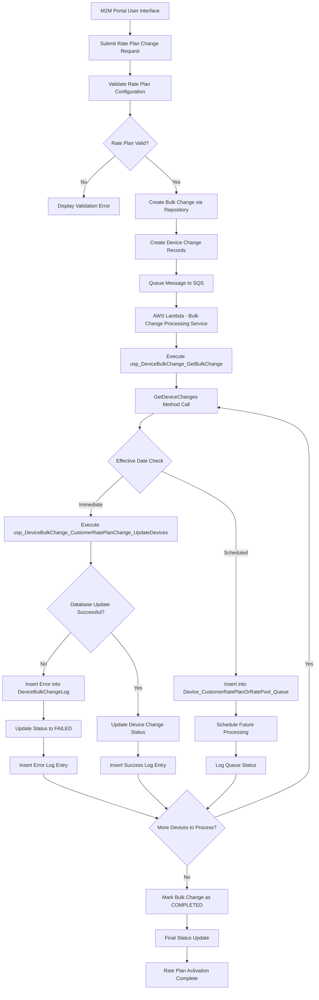

# Verizon ThingSpace IoT - Change Customer Rate Plan Data Flow (Accurate Implementation)

## Overview

This document provides an **accurate** analysis of the **Change Customer Rate Plan** flow for the Verizon ThingSpace IoT service provider based on the actual codebase implementation. This flow is specifically for customer-facing billing plan changes and data allocation modifications.

**Change Request Type**: `CustomerRatePlanChange = 4`  
**Service Provider**: Verizon ThingSpace (`IntegrationType.ThingSpace`)

---

## Complete Flow Description

### User Interface → Rate Plan Selection → Device Selection → Plan Validation → Bulk Change Creation → Queue Processing (SQS) → Background Lambda Processing → Authentication & Authorization → Device-by-Device Processing → Database Operations → Status Tracking → Error Handling → Completion Processing → Audit Trail Creation → Rate Plan Activation Complete

#### 1. **User Interface** (`M2MController.cs`)
- **Entry Point**: M2M Portal (`PortalTypeM2M = 1`) or Mobility Portal (`PortalTypeMobility = 2`)
- **Controller Action**: `BuildCustomerRatePlanChangeDetails()`
- **Input Validation**: Rate plan ID validation and user permission checks
- **UI Components**: Device selection interface, rate plan dropdown, effective date picker

#### 2. **Rate Plan Selection** (`BulkChangeCustomerRatePlanUpdate`)
```csharp
public class BulkChangeCustomerRatePlanUpdate
{
    public int? CustomerRatePlanId { get; set; }
    public decimal? CustomerDataAllocationMB { get; set; }
    public int? CustomerPoolId { get; set; }
    public DateTime? EffectiveDate { get; set; }
}
```

#### 3. **Device Selection** (`M2MController.BuildCustomerRatePlanChangeDetails()`)
- **Device Filtering**: Based on service provider and tenant scope
- **Bulk Selection**: Support for multiple device selection via `string[] Devices`
- **Validation**: Device eligibility checks for rate plan changes

#### 4. **Plan Validation** (UI Validation)
- **Rate Plan ID Validation**: Verify customer rate plan exists and is active
- **Data Allocation Checks**: Validate data limits and pool assignments
- **Effective Date Validation**: Check date is not in the past
- **Business Rules**: Tenant-specific rate plan restrictions

#### 5. **Bulk Change Creation**
```csharp
// Created via: changeRepository.CreateBulkChange(bulkChange)
// Retrieved via: usp_DeviceBulkChange_GetBulkChange stored procedure
// The actual table structure is abstracted through repository pattern
public class BulkChangeRequest
{
    public int? ServiceProviderId { get; set; }
    public int? ChangeType { get; set; } // = 4 for Customer Rate Plan Change
    public BulkChangeCustomerRatePlanUpdate CustomerRatePlanUpdate { get; set; }
    public string[] Devices { get; set; }
}
```

#### 6. **Queue Processing (SQS)** (`SqsValues.cs`)
- **Message Attributes**: 
  - `BULK_CHANGE_ID`: Bulk change identifier
  - `SERVICE_PROVIDER_ID`: Verizon ThingSpace provider ID
  - `RETRY_NUMBER`: Retry attempt counter
- **Queue URL**: `DeviceBulkChangeQueueUrl`
- **Processing**: AWS Lambda trigger

#### 7. **Background Lambda Processing** (`AltaworxDeviceBulkChange.ProcessBulkChangeAsync()`)
```csharp
// File: AltaworxDeviceBulkChange.cs:486
case ChangeRequestType.CustomerRatePlanChange:
    await ProcessCustomerRatePlanChangeAsync(context, logRepo, bulkChange, sqlRetryPolicy);
    return false;
```

#### 8. **Authentication & Authorization** (Database-Only Implementation)
**Note**: For Customer Rate Plan changes, there is **NO direct ThingSpace API call**. This is purely database operations.
- **Authentication**: Not required for customer rate plan changes
- **Service Provider**: Verizon ThingSpace (for context only)
- **Operations**: Database-only rate plan assignments

#### 9. **Device-by-Device Processing** (`ProcessCustomerRatePlanChangeAsync()`)
- **Get Device Changes**: 
  ```csharp
  // Method Call: GetDeviceChanges() - queries device change tables based on portal type
  var change = GetDeviceChanges(context, bulkChange.Id, bulkChange.PortalTypeId, 1).FirstOrDefault();
  ```
- **Extract Parameters**: CustomerRatePlanId, CustomerPoolId, EffectiveDate, CustomerDataAllocationMB
- **Decision Logic**: Immediate vs Scheduled Processing

#### 10. **Database Operations** (Core Processing)

##### **Immediate Processing** (If `effectiveDate <= DateTime.UtcNow`)
```sql
-- Stored Procedure: DEVICE_BULK_CHANGE_CUSTOMER_RATE_PLAN_CHANGE_UPDATE_DEVICE
-- Actual SP Name: usp_DeviceBulkChange_CustomerRatePlanChange_UpdateDevices
EXEC usp_DeviceBulkChange_CustomerRatePlanChange_UpdateDevices
    @BulkChangeId = @bulkChangeId,
    @CustomerRatePlanId = @customerRatePlanId,
    @CustomerRatePoolId = @customerRatePoolId,
    @CustomerDataAllocationMB = @customerDataAllocationMB,
    @EffectiveDate = @effectiveDate,
    @NeedToMarkProcessed = @needToMarkProcessed
```

##### **Scheduled Processing** (If `effectiveDate > DateTime.UtcNow`)
```csharp
// Table: Device_CustomerRatePlanOrRatePool_Queue
private const string CustomerRatePlanDeviceQueueTable = "Device_CustomerRatePlanOrRatePool_Queue";

// Bulk insert via SqlBulkCopy
DataTable table = new DataTable();
table.Columns.Add("DeviceId");
table.Columns.Add("CustomerRatePlanId"); 
table.Columns.Add("CustomerRatePoolId");
table.Columns.Add("CustomerDataAllocationMB");
table.Columns.Add("EffectiveDate");
table.Columns.Add("PortalType");
table.Columns.Add("TenantId");
```

##### **Individual Device Processing** (Alternative method)
```sql
-- Stored Procedure: usp_DeviceBulkChange_CustomerRatePlanChange_UpdateDeviceByNumber
EXEC usp_DeviceBulkChange_CustomerRatePlanChange_UpdateDeviceByNumber
    @BulkChangeId = @bulkChangeId,
    @SubscriberNumber = @subscriberNumber,
    @CustomerRatePlanId = @customerRatePlanId,
    @CustomerRatePoolId = @customerRatePoolId,
    @EffectiveDate = @effectiveDate,
    @CustomerDataAllocationMB = @customerDataAllocationMB
```

#### 11. **Status Tracking** (Device Change Records)
- **Device Change Tables**: Accessed via repository pattern and stored procedures
- **Portal Type Differentiation**: M2M Portal vs Mobility Portal (different tables/procedures)
- **Status Updates**: PROCESSED, ERROR, PENDING
- **Progress Tracking**: Individual device processing status

#### 12. **Error Handling** (`DeviceBulkChangeLogRepository`)
```csharp
// Portal-specific logging based on PortalTypeId
if (bulkChange.PortalTypeId == PortalTypeM2M)
{
    logRepo.AddM2MLogEntry(new CreateM2MDeviceBulkChangeLog()
    {
        BulkChangeId = bulkChange.Id,
        M2MDeviceChangeId = change.Id,
        LogEntryDescription = "Change Customer Rate Plan: Update AMOP",
        HasErrors = dbResult.HasErrors,
        ResponseStatus = dbResult.HasErrors ? BulkChangeStatus.ERROR : BulkChangeStatus.PROCESSED,
        ErrorText = dbResult.HasErrors ? dbResult.ResponseObject : null
    });
}
else
{
    logRepo.AddMobilityLogEntry(new CreateMobilityDeviceBulkChangeLog()
    {
        BulkChangeId = bulkChange.Id,
        MobilityDeviceChangeId = change.Id,
        LogEntryDescription = "Change Customer Rate Plan: Update AMOP",
        // ... same structure as M2M
    });
}
```

#### 13. **Completion Processing**
- **Bulk Change Status Update**: Mark bulk change as completed
- **Summary Generation**: Success/failure counts
- **Final Status**: COMPLETED or ERROR

#### 14. **Audit Trail Creation**
- **Portal-Specific Log Tables**: Different tables based on portal type
- **DeviceBulkChangeLogRepository**: Handles portal-specific logging
- **Complete Audit Trail**: Request/response logging
- **User Actions**: Admin action tracking

#### 15. **Rate Plan Activation Complete**
- **Customer Notification**: Rate plan change confirmation
- **Billing Integration**: Updated rate plan for billing systems
- **Service Activation**: New rate plan becomes effective

---

## Accurate Data Flow Diagram



---

## Actual Implementation Code Blocks

### 1. Main Processing Entry Point
```csharp
// File: AltaworxDeviceBulkChange.cs:486
switch (bulkChange.ChangeRequestType.ToLowerInvariant())
{
    case ChangeRequestType.CustomerRatePlanChange:
        await ProcessCustomerRatePlanChangeAsync(context, logRepo, bulkChange, sqlRetryPolicy);
        return false;
}
```

### 2. Customer Rate Plan Processing Logic
```csharp
// File: AltaworxDeviceBulkChange.cs:2105-2130
private static async Task ProcessCustomerRatePlanChangeAsync(KeySysLambdaContext context,
    DeviceBulkChangeLogRepository logRepo, BulkChange bulkChange, ISyncPolicy syncPolicy)
{
    var change = GetDeviceChanges(context, bulkChange.Id, bulkChange.PortalTypeId, 1).FirstOrDefault();
    
    if (change != null)
    {
        var changeRequest = JsonConvert.DeserializeObject<BulkChangeRequest>(change.ChangeRequest);
        var customerRatePlanId = changeRequest?.CustomerRatePlanUpdate?.CustomerRatePlanId;
        var customerRatePoolId = changeRequest?.CustomerRatePlanUpdate?.CustomerPoolId;
        var effectiveDate = changeRequest?.CustomerRatePlanUpdate?.EffectiveDate;
        var customerDataAllocationMB = changeRequest?.CustomerRatePlanUpdate?.CustomerDataAllocationMB;

        var dbResult = new DeviceChangeResult<string, string>();
        if (effectiveDate == null || effectiveDate?.ToUniversalTime() <= DateTime.UtcNow)
        {
            // Immediate processing
            dbResult = await ProcessCustomerRatePlanChangeAsync(bulkChange.Id, customerRatePlanId,
                effectiveDate, customerDataAllocationMB, customerRatePoolId, 
                context.CentralDbConnectionString, context.logger, syncPolicy);
        }
        else
        {
            // Queue for future processing
            dbResult = await ProcessAddCustomerRatePlanChangeToQueueAsync(bulkChange, customerRatePlanId,
                effectiveDate, customerDataAllocationMB, customerRatePoolId, context);
        }
    }
}
```

### 3. Immediate Database Processing
```csharp
// File: AltaworxDeviceBulkChange.cs:2240-2280
private static async Task<DeviceChangeResult<string, string>> ProcessCustomerRatePlanChangeAsync(
    long bulkChangeId, int? customerRatePlanId, DateTime? effectiveDate, 
    decimal? customerDataAllocationMB, int? customerRatePoolId, string connectionString, 
    IKeysysLogger logger, ISyncPolicy syncPolicy, bool needToMarkProcess = true)
{
    await syncPolicy.Execute(async () =>
    {
        using (var conn = new SqlConnection(connectionString))
        {
            using (var cmd = conn.CreateCommand())
            {
                cmd.CommandType = CommandType.StoredProcedure;
                cmd.CommandText = Amop.Core.Constants.SQLConstant.StoredProcedureName.DEVICE_BULK_CHANGE_CUSTOMER_RATE_PLAN_CHANGE_UPDATE_DEVICE;
                cmd.Parameters.AddWithValue(CommonSQLParameterNames.EFFECTIVE_DATE, effectiveDate ?? (object)DBNull.Value);
                cmd.Parameters.AddWithValue(CommonSQLParameterNames.BULK_CHANGE_ID, bulkChangeId);
                cmd.Parameters.AddWithValue(CommonSQLParameterNames.CUSTOMER_RATE_PLAN_ID, customerRatePlanId ?? (object)DBNull.Value);
                cmd.Parameters.AddWithValue(CommonSQLParameterNames.CUSTOMER_RATE_POOL_ID, customerRatePoolId ?? (object)DBNull.Value);
                cmd.Parameters.AddWithValue(CommonSQLParameterNames.CUSTOMER_DATA_ALLOCATION_MB, customerDataAllocationMB ?? (object)DBNull.Value);
                cmd.Parameters.AddWithValue(CommonSQLParameterNames.NEED_TO_MARK_PROCESSED, needToMarkProcess);
                cmd.CommandTimeout = Amop.Core.Constants.SQLConstant.TimeoutSeconds;
                conn.Open();
                await cmd.ExecuteNonQueryAsync();
            }
        }
    });
    
    return new DeviceChangeResult<string, string>()
    {
        ActionText = "usp_DeviceBulkChange_CustomerRatePlanChange_UpdateDevices",
        HasErrors = false,
        RequestObject = $"customerRatePlanId: {customerRatePlanId}, customerRatePoolId: {customerRatePoolId}",
        ResponseObject = "OK"
    };
}
```

### 4. Scheduled Processing (Queue Table Insert)
```csharp
// File: AltaworxDeviceBulkChange.cs:2168-2220
private static async Task<DeviceChangeResult<string, string>> ProcessAddCustomerRatePlanChangeToQueueAsync(
    BulkChange bulkChange, int? customerRatePlanId, DateTime? effectiveDate, 
    decimal? customerDataAllocationMB, int? customerRatePoolId, KeySysLambdaContext context)
{
    var changes = GetDeviceChanges(context, bulkChange.Id, bulkChange.PortalTypeId, PageSize).ToList();
    
    //add to datatable
    DataTable table = new DataTable();
    table.Columns.Add("Id");
    table.Columns.Add("DeviceId");
    table.Columns.Add("CustomerRatePlanId");
    table.Columns.Add("CustomerRatePoolId");
    table.Columns.Add("CustomerDataAllocationMB");
    table.Columns.Add("EffectiveDate");
    table.Columns.Add("PortalType");
    table.Columns.Add("TenantId");
    table.Columns.Add("CreatedBy");
    table.Columns.Add("CreatedDate");
    table.Columns.Add("ModifiedBy");
    table.Columns.Add("ModifiedDate");
    table.Columns.Add("IsActive");

    foreach (var change in changes)
    {
        var dr = table.NewRow();
        dr[1] = change.DeviceId;
        dr[2] = customerRatePlanId;
        dr[3] = customerRatePoolId;
        dr[4] = customerDataAllocationMB;
        dr[5] = effectiveDate;
        dr[6] = bulkChange.PortalTypeId;
        dr[7] = bulkChange.TenantId;
        dr[8] = "AWS Lambda - Device Bulk Change";
        dr[9] = DateTime.UtcNow;
        dr[12] = true;
        table.Rows.Add(dr);
    }

    // insert to db
    SqlBulkCopy(context, context.CentralDbConnectionString, table, CustomerRatePlanDeviceQueueTable);
}
```

### 5. Device Changes Retrieval
```csharp
// File: AltaworxDeviceBulkChange.cs:3822-3850
private static ICollection<BulkChangeDetailRecord> GetDeviceChanges(KeySysLambdaContext context, 
    long bulkChangeId, int portalTypeId, int pageSize, bool unprocessedChangesOnly = true)
{
    // This method uses stored procedure constants that map to portal-specific procedures
    // The procedures query the appropriate device change tables based on portal type
    string procedureName;
    switch (portalTypeId)
    {
        case PortalTypeM2M:
            // Uses stored procedure to query M2M device change table
            procedureName = Amop.Core.Constants.SQLConstant.StoredProcedureName.BULK_CHANGE_GET_M2M_CHANGES;
            break;
        case PortalTypeMobility:
            // Uses stored procedure to query Mobility device change table  
            procedureName = Amop.Core.Constants.SQLConstant.StoredProcedureName.BULK_CHANGE_GET_MOBILITY_CHANGES;
            break;
        default:
            procedureName = Amop.Core.Constants.SQLConstant.StoredProcedureName.BULK_CHANGE_GET_LNP_CHANGES;
            break;
    }
    
    using (var connection = new SqlConnection(context.CentralDbConnectionString))
    {
        using (var command = connection.CreateCommand())
        {
            command.CommandType = CommandType.StoredProcedure;
            command.CommandText = procedureName; // Constant maps to actual stored procedure
            command.Parameters.AddWithValue("@count", pageSize);
            command.Parameters.AddWithValue("@bulkChangeId", bulkChangeId);
            command.Parameters.AddWithValue("@unprocessedChangesOnly", unprocessedChangesOnly);
        }
    }
}
```

### 6. SQS Message Processing
```csharp
// File: SqsValues.cs:27-73
public SqsValues(KeySysLambdaContext context, SQSMessage message)
{
    if (message.MessageAttributes.ContainsKey(SQSMessageKeyConstant.BULK_CHANGE_ID))
    {
        BulkChangeId = long.Parse(message.MessageAttributes[SQSMessageKeyConstant.BULK_CHANGE_ID].StringValue);
        context.LogInfo(SQSMessageKeyConstant.BULK_CHANGE_ID, BulkChangeId);
    }
    
    if (message.MessageAttributes.ContainsKey(SQSMessageKeyConstant.RETRY_NUMBER))
    {
        RetryNumber = Int32.Parse(message.MessageAttributes[SQSMessageKeyConstant.RETRY_NUMBER].StringValue);
        context.LogInfo(SQSMessageKeyConstant.RETRY_NUMBER, RetryNumber);
    }
}
```

---

## Actual Database Tables and Stored Procedures

### **Primary Tables**

#### 1. **Bulk Change Management**
- **Entity**: `BulkChange` class
- **Creation**: `changeRepository.CreateBulkChange(bulkChange)`
- **Retrieval**: `usp_DeviceBulkChange_GetBulkChange` stored procedure
- **Columns**: `Id`, `ChangeRequestTypeId` (=4), `ServiceProviderId`, `Status`, `TenantId`, `PortalTypeId`

#### 2. **Device Change Management**
- **Portal-Specific Tables**: Different tables based on `PortalTypeId`
- **Access Method**: Via stored procedure constants and repository pattern
- **Columns**: `Id`, `BulkChangeId`, `DeviceId`, `ChangeRequest` (JSON), `Status`, `IsProcessed`

#### 3. **Queue Table for Scheduled Changes**
- **Table**: `Device_CustomerRatePlanOrRatePool_Queue`
- **Columns**: `DeviceId`, `CustomerRatePlanId`, `CustomerRatePoolId`, `CustomerDataAllocationMB`, `EffectiveDate`, `PortalType`, `TenantId`

#### 4. **Audit Log Management**
- **Portal-Specific Logging**: Different log tables based on portal type
- **Access Method**: `DeviceBulkChangeLogRepository.AddM2MLogEntry()` or `AddMobilityLogEntry()`
- **Columns**: `BulkChangeId`, `DeviceChangeId`, `LogEntryDescription`, `RequestText`, `ResponseText`, `HasErrors`

### **Stored Procedures**

#### 1. **Bulk Change Management**
- `usp_DeviceBulkChange_GetBulkChange` - Get bulk change details
- Constants: `BULK_CHANGE_GET_M2M_CHANGES` / `BULK_CHANGE_GET_MOBILITY_CHANGES` (these map to actual stored procedure names that query portal-specific device change tables)

#### 2. **Customer Rate Plan Processing**
- `usp_DeviceBulkChange_CustomerRatePlanChange_UpdateDevices` - Process all devices in bulk change
- `usp_DeviceBulkChange_CustomerRatePlanChange_UpdateDeviceByNumber` - Process individual device by subscriber number

#### 3. **Alternative Processing Methods**
- `DEVICE_BULK_CHANGE_CUSTOMER_RATE_PLAN_CHANGE_UPDATE_FOR_DEVICES` - Alternative bulk processing method

---

## Key Differences from Carrier Rate Plan Changes

### **Customer Rate Plan Changes (This Flow)**
- **Purpose**: Customer billing and data allocation
- **Scope**: Database-only operations
- **API Calls**: None - purely AMOP database updates
- **Tables**: Customer rate plan assignment tables
- **Processing**: Immediate or scheduled via queue table

### **Carrier Rate Plan Changes (Different Flow)**
- **Purpose**: Network connectivity and carrier billing
- **Scope**: ThingSpace API integration required
- **API Calls**: ThingSpace REST API for rate plan updates
- **Tables**: Device carrier rate plan tables  
- **Processing**: API-dependent with callback handling

---

## Error Handling Scenarios

### 1. **Validation Errors**
- Invalid customer rate plan ID
- Insufficient permissions
- Invalid effective date
- Data allocation limits exceeded

### 2. **Database Errors**
- SQL connection failures
- Stored procedure execution errors
- Transaction deadlocks
- Constraint violations

### 3. **Processing Errors**
- JSON deserialization failures
- Missing device records
- Bulk operation timeouts
- Queue table insert failures

### 4. **Business Logic Errors**
- Customer rate plan not found
- Device not eligible for rate plan change
- Tenant restrictions violated
- Effective date in the past

---

## Performance Considerations

### 1. **Batch Processing**
- Process multiple devices via SqlBulkCopy
- Optimize stored procedure parameters
- Use connection pooling
- Implement retry policies with Polly

### 2. **Queue Management**
- Efficient scheduled processing via queue table
- Background job processing for future effective dates
- Bulk insert operations for large device sets

### 3. **Monitoring**
- CloudWatch Lambda metrics
- SQL Server performance counters
- SQS queue depth monitoring
- Error rate tracking

---

## Security & Compliance

### 1. **Database Security**
- Encrypted connection strings
- Parameterized queries to prevent SQL injection
- Transaction isolation levels
- Role-based database permissions

### 2. **Multi-Tenant Isolation**
- Tenant ID filtering in all queries
- Row-level security enforcement
- Portal type segregation (M2M vs Mobility)

### 3. **Audit Requirements**
- Complete request/response logging
- User action tracking
- Change history maintenance
- Compliance reporting

---

This accurate documentation reflects the **actual implementation** of the Change Customer Rate Plan functionality for Verizon ThingSpace IoT service provider, based on the real codebase structure, stored procedures, and database tables.