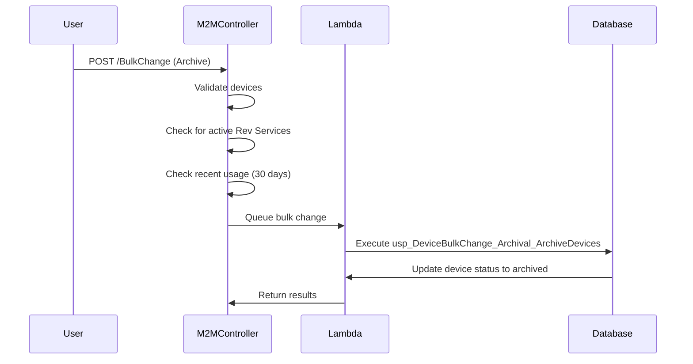
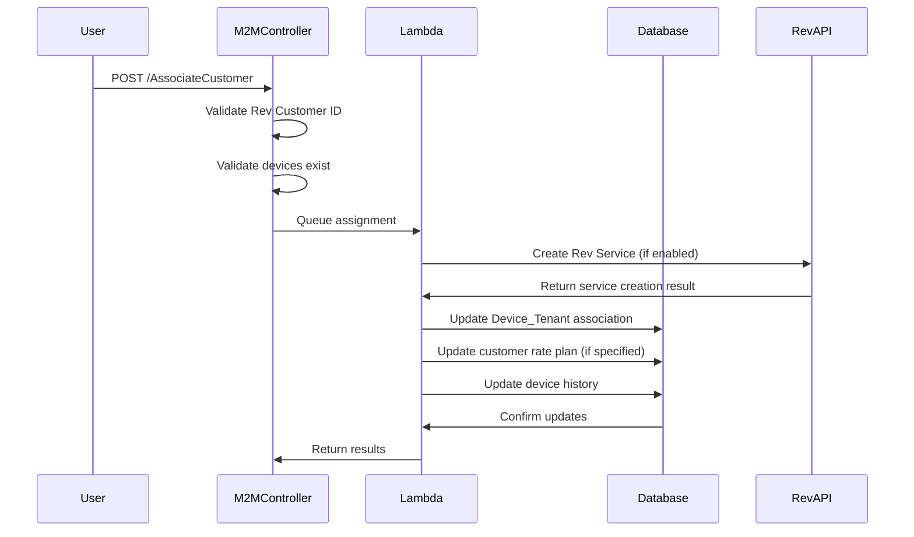
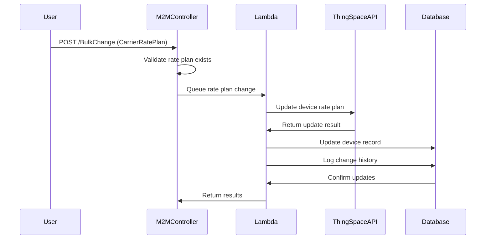
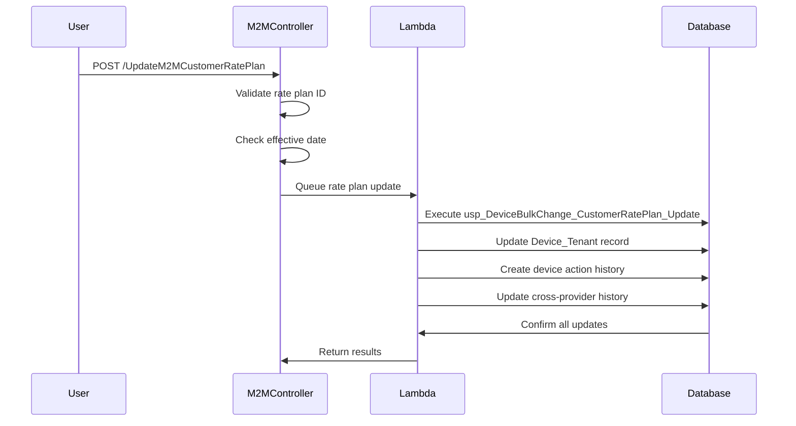
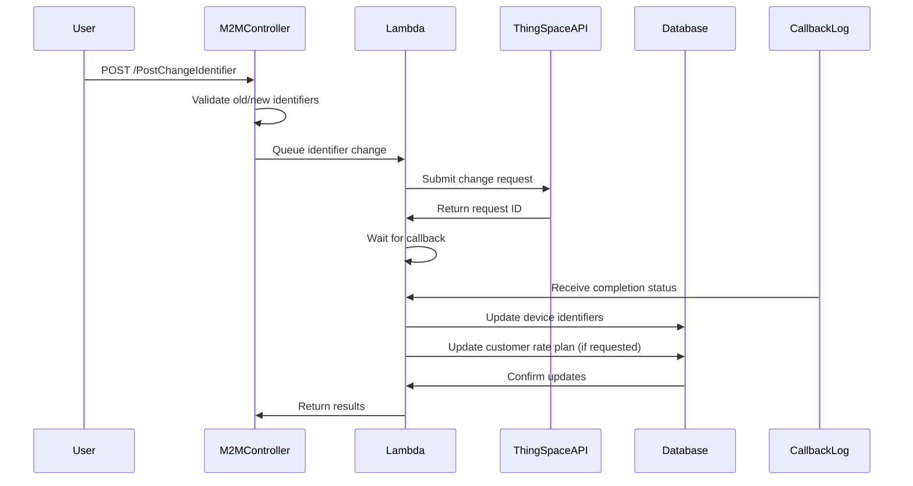
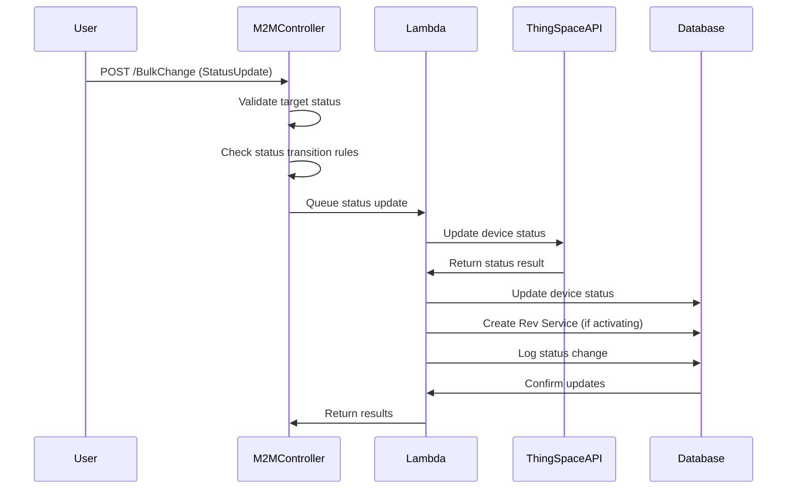
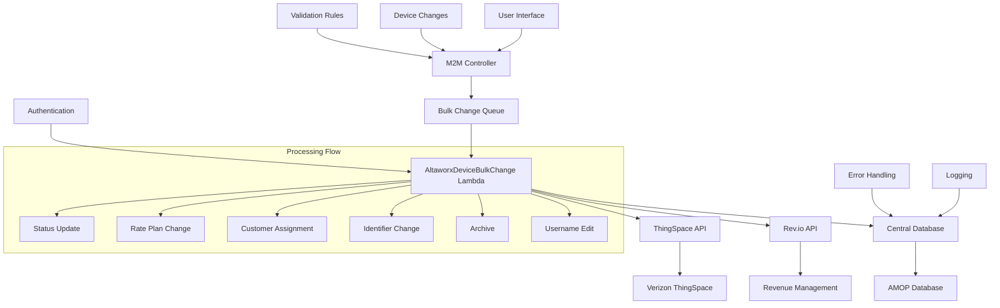
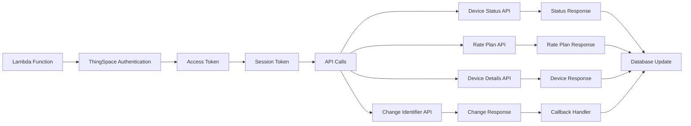

# Verizon ThingSpace IoT - BulkChange Flow Documentation

## Overview

This document provides a comprehensive guide to the BulkChange module flow for **Verizon ThingSpace IoT Service Provider**. The system supports six primary change types for managing IoT devices at scale through a streamlined bulk processing architecture.

## Table of Contents

1. [System Architecture](#system-architecture)
2. [Six Change Types Overview](#six-change-types-overview)
3. [Detailed Flow for Each Change Type](#detailed-flow-for-each-change-type)
4. [Data Flow Diagrams](#data-flow-diagrams)
5. [Key Components](#key-components)
6. [Error Handling](#error-handling)
7. [Monitoring and Logging](#monitoring-and-logging)

## System Architecture

### High-Level Flow

```
User Request → M2MController → AltaworxDeviceBulkChange Lambda → ThingSpace API → Database Update
```

### Core Components

1. **M2MController.cs** - Entry point for all bulk change requests
2. **AltaworxDeviceBulkChange.cs** - Lambda function handling the actual processing
3. **BulkChangeRepository.cs** - Data access layer for bulk operations
4. **ThingSpace Integration** - API communication with Verizon ThingSpace

## Six Change Types Overview

The Verizon ThingSpace IoT Service Provider supports the following change types:

| Change Type | ID | Description | API Endpoint |
|-------------|----|-----------|----|
| **Archive** | 1 | Archive devices that are no longer in use | N/A (Database only) |
| **Assign Customer** | 2 | Assign devices to specific customers | ThingSpace Device Management |
| **Change Carrier Rate Plan** | 3 | Modify carrier rate plans for devices | ThingSpace Rate Plan API |
| **Change Customer Rate Plan** | 4 | Update customer-specific rate plans | Database Update |
| **Change ICCID/IMEI** | 5 | Swap device identifiers | ThingSpace Device Change API |
| **Update Device Status** | 6 | Change device operational status | ThingSpace Device Status API |

## Detailed Flow for Each Change Type

### 1. Archive Device Flow

**Purpose**: Permanently archive devices that are no longer needed

**Prerequisites**:
- Device must have no active Rev Services (unless override is enabled)
- Device must not have usage in the last 30 days
- Device must be in an inactive state

**Flow Steps**:



**Implementation Details**:
- **File**: `M2MController.cs` (BuildArchivalChangeDetails method)
- **Validation**: 
  - No active Rev Services (configurable override)
  - No usage within `ARCHIVAL_RECENT_USAGE_VALIDATION_DAYS` (30 days)
- **Database Operations**: Updates device `IsActive` and `IsDeleted` flags

### 2. Assign Customer Flow

**Purpose**: Associate devices with specific customer accounts

**Prerequisites**:
- Valid Rev Customer ID
- Device must exist and be in assignable state
- Site configuration must be available

**Flow Steps**:



**Implementation Details**:
- **File**: `M2MController.cs` (CreateAssociateCustomerChangeRequest)
- **Options**:
  - `CreateRevService`: Whether to create billing service
  - `AddCarrierRatePlan`: Include carrier rate plan assignment
  - `AddCustomerRatePlan`: Include customer rate plan assignment
- **Database Operations**: Updates `Device_Tenant`, `RevService`, and related tables

### 3. Change Carrier Rate Plan Flow

**Purpose**: Modify carrier-level rate plans for devices

**Prerequisites**:
- Valid carrier rate plan code
- Device must be active in ThingSpace
- Write permissions enabled for service provider

**Flow Steps**:



**Implementation Details**:
- **File**: `AltaworxDeviceBulkChange.cs` (ProcessThingSpaceCarrierRatePlanChange)
- **ThingSpace API**: Uses `ThingSpaceDeviceDetailService.UpdateThingSpaceDeviceDetailsAsync`
- **Database Updates**: Updates device carrier rate plan and creates audit trail

### 4. Change Customer Rate Plan Flow

**Purpose**: Update customer-specific rate plans and data allocations

**Prerequisites**:
- Valid customer rate plan ID
- Device must be associated with a customer
- Effective date validation

**Flow Steps**:



**Implementation Details**:
- **File**: `M2MController.cs` (UpdateM2MCustomerRatePlan)
- **Database Operations**: 
  - Updates `Device_Tenant.CustomerRatePlanId`
  - Updates `Device_Tenant.CustomerDataAllocationMB`
  - Creates `DeviceActionHistory` record
- **Queue Processing**: Can be immediate or scheduled based on effective date

### 5. Change ICCID/IMEI Flow

**Purpose**: Swap device identifiers (SIM cards or device hardware)

**Prerequisites**:
- Device must be active
- New identifier must be available
- ThingSpace write permissions enabled

**Flow Steps**:



**Implementation Details**:
- **File**: `ProcessChangeICCIDorIMEI.cs`
- **ThingSpace API**: Uses change identifier endpoint with async callback
- **Retry Logic**: Automatic retry for failed requests with exponential backoff
- **Database Updates**: Updates `Device.ICCID` or `Device.IMEI` fields

### 6. Update Device Status Flow

**Purpose**: Change operational status of devices (Active, Inactive, Suspended, etc.)

**Prerequisites**:
- Valid target status for ThingSpace
- Device must exist in ThingSpace
- Status transition must be allowed

**Flow Steps**:



**Implementation Details**:
- **File**: `AltaworxDeviceBulkChange.cs` (ProcessStatusUpdateAsync)
- **ThingSpace Integration**: Uses device status update API
- **Status Mapping**: Maps AMOP statuses to ThingSpace statuses
- **Rev Service Creation**: Automatic service creation for activation requests

## Data Flow Diagrams

### Overall System DFD



### ThingSpace Integration DFD



## Key Components

### M2MController.cs Methods

| Method | Purpose | Change Types |
|--------|---------|--------------|
| `BulkChange()` | Main entry point for bulk operations | All |
| `ValidateBulkChange()` | Pre-validation of requests | All |
| `ProcessBulkChange()` | Queue processing initiation | All |
| `AssociateCustomer()` | Customer assignment | Assign Customer |
| `PostChangeIdentifier()` | Identifier changes | Change ICCID/IMEI |
| `UpdateM2MCustomerRatePlan()` | Customer rate plans | Change Customer Rate Plan |

### AltaworxDeviceBulkChange.cs Methods

| Method | Purpose | Change Types |
|--------|---------|--------------|
| `ProcessBulkChangeAsync()` | Main processing router | All |
| `ProcessStatusUpdateAsync()` | Device status changes | Update Device Status |
| `ProcessThingSpaceCarrierRatePlanChange()` | Carrier rate plans | Change Carrier Rate Plan |
| `ProcessAssociateCustomerAsync()` | Customer assignments | Assign Customer |
| `ProcessChangeEquipmentAsync()` | Identifier changes | Change ICCID/IMEI |
| `ProcessArchivalAsync()` | Device archival | Archive |
| `ProcessEditUsernameAsync()` | Username updates | Update Device Status |

### Database Tables

| Table | Purpose | Operations |
|-------|---------|------------|
| `DeviceBulkChange` | Bulk change tracking | Insert, Update |
| `M2M_DeviceChange` | Individual device changes | Insert, Update |
| `Device` | Device master data | Update |
| `Device_Tenant` | Customer associations | Insert, Update |
| `DeviceActionHistory` | Change audit trail | Insert |
| `DeviceBulkChangeLog` | Processing logs | Insert |

## Error Handling

### Validation Errors

1. **Device Not Found**: ICCID doesn't exist in system
2. **Invalid Status Transition**: Target status not allowed
3. **Active Rev Services**: Cannot archive device with active services
4. **Recent Usage**: Cannot archive device with recent usage
5. **Rate Plan Not Found**: Invalid rate plan code specified

### API Errors

1. **ThingSpace Authentication Failed**: Invalid credentials
2. **ThingSpace API Error**: Service unavailable or rate limited
3. **Device Not Found in ThingSpace**: Device not registered with carrier
4. **Status Update Failed**: Carrier rejected status change
5. **Rate Plan Assignment Failed**: Invalid rate plan for device type

### Retry Logic

- **SQL Transient Errors**: 3 retries with exponential backoff
- **HTTP Errors**: 3 retries with exponential backoff
- **ThingSpace Rate Limits**: Automatic retry with delay
- **Queue Processing**: Requeue failed items with increasing delay

## Monitoring and Logging

### Log Levels

- **INFO**: Normal processing events
- **WARN**: Recoverable errors or validation failures
- **ERROR**: Non-recoverable errors requiring attention
- **EXCEPTION**: System exceptions with stack traces

### Key Metrics

1. **Processing Time**: Average time per bulk change
2. **Success Rate**: Percentage of successful changes
3. **Error Rate**: Percentage of failed changes by type
4. **Queue Depth**: Number of pending changes
5. **ThingSpace API Response Time**: API performance metrics

### Notification Rules

- **High Error Rate**: Alert when error rate exceeds 10%
- **Long Processing Time**: Alert when processing exceeds SLA
- **Queue Backlog**: Alert when queue depth is high
- **Authentication Failures**: Immediate alert for auth issues

## Configuration Parameters

### Environment Variables

| Variable | Purpose | Default |
|----------|---------|---------|
| `THINGSPACE_UPDATE_DEVICE_STATUS_RETRY_NUMBER` | Max retries for status updates | 3 |
| `MAX_PARALLEL_REQUESTS` | Concurrent API calls | 10 |
| `DEVICE_BULK_CHANGE_QUEUE_URL` | SQS queue URL | N/A |
| `THINGSPACE_CHANGE_IDENTIFIER_URL` | Identifier change endpoint | N/A |

### Database Configuration

| Setting | Purpose | Value |
|---------|---------|-------|
| `ARCHIVAL_RECENT_USAGE_VALIDATION_DAYS` | Usage validation period | 30 days |
| `CommonConstants.PAGE_SIZE` | Batch processing size | 100 |
| `CommonConstants.DELAY_IN_SECONDS_*` | Queue retry delays | Various |

## Security Considerations

1. **Authentication**: All ThingSpace API calls require valid tokens
2. **Authorization**: User permissions validated before processing
3. **Data Encryption**: Sensitive data encrypted in transit and at rest
4. **Audit Trail**: All changes logged with user attribution
5. **Access Control**: Role-based access to different change types

## Performance Optimization

1. **Batch Processing**: Process devices in configurable batch sizes
2. **Parallel Execution**: Concurrent API calls within limits
3. **Queue Management**: Distributed processing across multiple workers
4. **Caching**: Token and configuration caching
5. **Database Optimization**: Indexed queries and bulk operations

---

*This documentation covers the complete BulkChange flow for Verizon ThingSpace IoT Service Provider. For implementation details, refer to the source code in the respective files mentioned throughout this document.*