# Verizon ThingSpace IoT - Update Device Status Overview

## What, Why, How for Verizon ThingSpace IoT Service Provider

### What (2 sentences)
The "Update Device Status" for Verizon ThingSpace IoT is a specialized bulk operation that manages cellular IoT device lifecycle transitions within Verizon's ThingSpace platform, handling device activation, suspension, restoration, deactivation, and inventory management through Verizon's M2M API endpoints. This operation processes ThingSpace-specific status changes including moving devices from inventory to active states, managing Primary Place of Use (PPU) information, and coordinating with Verizon's callback mechanisms for activation confirmations.

### Why (2 sentences)
This ThingSpace-specific implementation is essential for managing Verizon cellular IoT devices at enterprise scale, enabling automated provisioning of thousands of devices while maintaining compliance with Verizon's network requirements and regulatory standards for device registration. It provides critical cost management capabilities through automated suspension/restoration workflows and ensures proper device lifecycle management with comprehensive audit trails required for enterprise IoT deployments on Verizon's network.

### How (2 sentences)
The system processes ThingSpace device status updates through a multi-stage authentication flow (OAuth access token → session token), followed by carrier-specific API calls to Verizon's ThingSpace endpoints, with specialized handling for device activation including Primary Place of Use validation and asynchronous callback processing for activation confirmations. Each operation includes automatic retry mechanisms, comprehensive logging to M2M audit tables, integration with Rev.IO service provisioning, and coordination with Verizon's callback systems to ensure device activation completion and MSISDN assignment.

---

## Verizon ThingSpace Data Flow Diagram - Update Device Status

```mermaid
graph TB
    A[SQS Message - ThingSpace Device Status Update] --> B[Lambda Handler Entry Point]
    B --> C{Validate Bulk Change}
    C -->|Invalid| D[Log Error & Exit]
    C -->|Valid| E[Get ThingSpace Bulk Change Details]
    
    E --> F[Identify Integration Type = ThingSpace]
    F --> G[Load ThingSpace Device Changes from DB]
    G --> H[Parse StatusUpdateRequest with ThingSpaceStatusUpdateRequest]
    
    H --> I[ProcessThingSpaceStatusUpdateAsync]
    
    %% ThingSpace Authentication Flow
    I --> TS1[Get ThingSpace Authentication Config]
    TS1 --> TS2[Request OAuth Access Token]
    TS2 --> TS3{Access Token Valid?}
    TS3 -->|No| TS4[Log Authentication Error & Exit]
    TS3 -->|Yes| TS5[Request VZ-M2M Session Token]
    TS5 --> TS6{Session Token Valid?}
    TS6 -->|No| TS7[Log Session Error & Exit]
    TS6 -->|Yes| TS8[Begin Device Processing Loop]
    
    %% Device Processing Loop
    TS8 --> TS9{For Each Device}
    TS9 --> TS10[Check Lambda Timeout]
    TS10 --> TS11{Time Remaining?}
    TS11 -->|No| TS12[Requeue Message for Continuation]
    TS11 -->|Yes| TS13[Parse Device ChangeRequest]
    
    TS13 --> TS14{Determine Status Operation}
    
    %% Status-Specific Operations
    TS14 -->|activate| ACT1[ActivateThingSpaceDeviceAsync]
    TS14 -->|suspend| SUS1[SuspendThingSpaceDeviceAsync]
    TS14 -->|restore| RES1[RestoreThingSpaceDeviceAsync]
    TS14 -->|deactive| DEA1[DeactivateThingSpaceDeviceAsync]
    TS14 -->|inventory| INV1[AddThingSpaceDeviceInventoryAsync]
    TS14 -->|unsupported| ERR1[Log Unsupported Status Error]
    
    %% Activation Flow (Most Complex)
    ACT1 --> ACT2[Check Device Current Status]
    ACT2 --> ACT3{Device Already Active?}
    ACT3 -->|Yes| ACT4[Skip Activation - Update PPU Only]
    ACT3 -->|No| ACT5[Prepare Activation Request]
    
    ACT5 --> ACT6[Build ThingSpace Activation Payload]
    ACT6 --> ACT7[POST /api/m2m/v1/devices/actions/activate]
    ACT7 --> ACT8{Activation API Response}
    ACT8 -->|Success| ACT9[Extract RequestId from Response]
    ACT8 -->|Error| ACT10[Log API Error]
    
    ACT9 --> ACT11{Has PPU Information?}
    ACT11 -->|Yes| ACT12[ActivatedWithThingSpacePPUAsync]
    ACT11 -->|No| ACT13[UpdateFieldsOnNewlyActivatedAsync]
    
    ACT12 --> ACT14[Wait for Callback or Query Status]
    ACT13 --> ACT15[Query Device Status via API]
    ACT14 --> ACT16{Use Callback Result?}
    ACT15 --> ACT17[Process Status Response]
    
    ACT16 -->|Yes| ACT18[Process Callback Data]
    ACT16 -->|No| ACT19[Query ThingSpace API for Status]
    
    ACT18 --> ACT20[Extract MSISDN & Device Details]
    ACT19 --> ACT21[GET /api/m2m/v1/devices/actions/list]
    ACT17 --> ACT20
    ACT21 --> ACT20
    
    ACT20 --> ACT22[Update Device Record in Database]
    ACT22 --> ACT23{Activation Complete?}
    ACT23 -->|No| ACT24[Schedule Retry Check]
    ACT23 -->|Yes| ACT25[Mark Device as Activated]
    
    %% Suspension Flow
    SUS1 --> SUS2[POST /api/m2m/v1/devices/actions/suspend]
    SUS2 --> SUS3{Suspension API Response}
    SUS3 -->|Success| SUS4[Mark Device as Suspended]
    SUS3 -->|Error| SUS5[Log Suspension Error]
    
    %% Restoration Flow
    RES1 --> RES2[POST /api/m2m/v1/devices/actions/restore]
    RES2 --> RES3{Restoration API Response}
    RES3 -->|Success| RES4[Mark Device as Active]
    RES3 -->|Error| RES5[Log Restoration Error]
    
    %% Deactivation Flow
    DEA1 --> DEA2[POST /api/m2m/v1/devices/actions/deactivate]
    DEA2 --> DEA3{Deactivation API Response}
    DEA3 -->|Success| DEA4[Mark Device as Deactivated]
    DEA3 -->|Error| DEA5[Log Deactivation Error]
    
    %% Inventory Flow
    INV1 --> INV2[Add Device to ThingSpace Inventory]
    INV2 --> INV3[Mark Device as Inventory Status]
    
    %% Post-Processing for All Operations
    ACT25 --> POST1[Post-Processing]
    ACT10 --> POST1
    SUS4 --> POST1
    SUS5 --> POST1
    RES4 --> POST1
    RES5 --> POST1
    DEA4 --> POST1
    DEA5 --> POST1
    INV3 --> POST1
    ERR1 --> POST1
    ACT24 --> POST1
    
    POST1 --> POST2[Log Operation Result to M2M_Log]
    POST2 --> POST3{Operation Successful?}
    
    POST3 -->|Yes| POST4[Process Rev.IO Service Creation]
    POST3 -->|No| POST5[Mark Device Change as ERROR]
    
    POST4 --> POST6[Update Device Status in Database]
    POST6 --> POST7[Mark Device Change as PROCESSED]
    
    POST5 --> POST8[Add to processedICCIDs List]
    POST7 --> POST8
    
    POST8 --> POST9{More Devices to Process?}
    POST9 -->|Yes| TS9
    POST9 -->|No| POST10[Set Default Site if Needed]
    
    POST10 --> POST11{Devices Need Site Assignment?}
    POST11 -->|Yes| POST12[SetDefaultSite for Inventory/Pending Devices]
    POST11 -->|No| POST13[Complete ThingSpace Processing]
    
    POST12 --> POST13
    POST13 --> POST14[Return Processing Result]
    
    %% Callback Handling (Parallel Process)
    CB1[ThingSpace Callback Received] --> CB2[Store Callback in Log Table]
    CB2 --> CB3[Update Device with Callback Data]
    CB3 --> CB4[Mark Callback as Processed]
    
    %% External Systems
    TS_API[Verizon ThingSpace API]
    CENTRAL_DB[(Central Database)]
    REV_DB[(Rev.IO Database)]
    CALLBACK_SYS[ThingSpace Callback System]
    SQS_QUEUE[Device Status Update Queue]
    
    %% API Interactions
    TS7 -.-> TS_API
    TS5 -.-> TS_API
    ACT7 -.-> TS_API
    SUS2 -.-> TS_API
    RES2 -.-> TS_API
    DEA2 -.-> TS_API
    ACT21 -.-> TS_API
    
    %% Database Interactions
    G -.-> CENTRAL_DB
    ACT22 -.-> CENTRAL_DB
    POST2 -.-> CENTRAL_DB
    POST6 -.-> CENTRAL_DB
    POST7 -.-> CENTRAL_DB
    CB3 -.-> CENTRAL_DB
    
    %% Rev.IO Interactions
    POST4 -.-> REV_DB
    
    %% Callback System
    CALLBACK_SYS -.-> CB1
    ACT14 -.-> CALLBACK_SYS
    
    %% Queue Interactions
    A -.-> SQS_QUEUE
    TS12 -.-> SQS_QUEUE
    ACT24 -.-> SQS_QUEUE
    
    %% Styling
    classDef thingspaceBox fill:#0066cc,color:#ffffff,stroke:#004499,stroke-width:2px
    classDef activationBox fill:#00cc66,color:#ffffff,stroke:#009944,stroke-width:2px
    classDef operationBox fill:#ff9900,color:#ffffff,stroke:#cc7700,stroke-width:2px
    classDef errorBox fill:#ff4444,color:#ffffff,stroke:#cc2222,stroke-width:2px
    classDef dataStore fill:#9966cc,color:#ffffff,stroke:#6644aa,stroke-width:2px
    classDef callbackBox fill:#66ccff,color:#ffffff,stroke:#4499cc,stroke-width:2px
    classDef decisionBox fill:#ffcc66,color:#000000,stroke:#cc9933,stroke-width:2px
    
    class I,TS1,TS2,TS5,TS8,TS13,POST1,POST2,POST4,POST6,POST10,POST13 thingspaceBox
    class ACT1,ACT2,ACT5,ACT6,ACT7,ACT9,ACT12,ACT13,ACT18,ACT19,ACT20,ACT22,ACT25 activationBox
    class SUS1,SUS2,RES1,RES2,DEA1,DEA2,INV1,INV2,INV3 operationBox
    class TS4,TS7,ACT10,SUS5,RES5,DEA5,ERR1,POST5 errorBox
    class CENTRAL_DB,REV_DB,TS_API dataStore
    class CB1,CB2,CB3,CB4,CALLBACK_SYS callbackBox
    class C,TS3,TS6,TS11,TS14,ACT3,ACT8,ACT11,ACT16,ACT23,SUS3,RES3,DEA3,POST3,POST9,POST11 decisionBox
```



---

## ThingSpace-Specific Components Explained

### 1. **ThingSpace Authentication Flow**
- **OAuth Access Token**: Initial authentication using client credentials
- **VZ-M2M Session Token**: Secondary token required for all device operations
- **Token Validation**: Comprehensive error handling for authentication failures
- **Token Refresh**: Automatic token renewal for long-running operations

### 2. **Device Status Operations**

#### **Activation (`activate`)**
- **Complex Multi-Step Process**: Most sophisticated operation in ThingSpace
- **PPU Validation**: Primary Place of Use information processing
- **Asynchronous Processing**: Callback-based confirmation system
- **Status Polling**: Alternative status checking via API queries
- **MSISDN Assignment**: Automatic phone number assignment post-activation

#### **Suspension (`suspend`)**
- **Service Interruption**: Temporary disconnection while maintaining device registration
- **Cost Control**: Prevents data usage charges while preserving device configuration
- **Reversible Operation**: Can be restored without re-provisioning

#### **Restoration (`restore`)**
- **Service Resumption**: Reactivates previously suspended devices
- **Configuration Preservation**: Maintains all device settings and configurations
- **Immediate Connectivity**: Restores network access within minutes

#### **Deactivation (`deactive`)**
- **Permanent Termination**: Complete service termination and device removal
- **Irreversible Process**: Requires new activation for future use
- **Resource Cleanup**: Removes device from ThingSpace inventory

#### **Inventory Management (`inventory`)**
- **Device Registration**: Adds devices to ThingSpace inventory without activation
- **Bulk Provisioning**: Prepares devices for future activation
- **Cost Optimization**: No connectivity charges while in inventory

### 3. **ThingSpace-Specific Features**

#### **Primary Place of Use (PPU)**
- **Regulatory Compliance**: Required for E911 emergency services
- **Address Validation**: Comprehensive address verification process
- **Extended Attributes**: Rich metadata storage for device location

#### **Callback Processing**
- **Asynchronous Confirmations**: ThingSpace sends activation confirmations via callbacks
- **Status Updates**: Real-time device status notifications
- **Error Handling**: Comprehensive callback failure management

#### **Request ID Tracking**
- **Operation Correlation**: Unique identifiers for each API request
- **Status Monitoring**: Track operation progress through completion
- **Audit Trail**: Complete operation history for compliance

### 4. **Database Operations**

#### **Device Status Tracking**
```sql
-- Key database operations for ThingSpace devices
UPDATE Device SET Status = @NewStatus, MSISDN = @AssignedMSISDN WHERE ICCID = @DeviceICCID
INSERT INTO M2M_DeviceChange_Log (BulkChangeId, DeviceId, Operation, Status, Timestamp)
UPDATE M2M_DeviceChange SET Status = 'PROCESSED', CompletedDate = GETUTCDATE()
```

#### **Audit Logging**
- **M2M Log Entries**: Detailed operation logs with request/response data
- **Error Tracking**: Comprehensive error logging for troubleshooting
- **Performance Metrics**: Processing time and success rate tracking

### 5. **Integration Points**

#### **Verizon ThingSpace API Endpoints**
- **Authentication**: `/oauth2/token` and `/api/m2m/v1/session/login`
- **Device Operations**: `/api/m2m/v1/devices/actions/{operation}`
- **Status Queries**: `/api/m2m/v1/devices/actions/list`
- **Callback URLs**: Customer-configured webhook endpoints

#### **Rev.IO Service Management**
- **Service Line Creation**: Automatic billing service provisioning
- **Customer Association**: Links devices to customer accounts
- **Rate Plan Assignment**: Configures billing and usage parameters

### 6. **Error Handling & Monitoring**

#### **ThingSpace-Specific Errors**
- **Authentication Failures**: Token expiration, invalid credentials
- **API Rate Limiting**: ThingSpace API quota management
- **Device State Conflicts**: Invalid status transition attempts
- **PPU Validation Errors**: Address verification failures

#### **Retry Mechanisms**
- **Exponential Backoff**: Progressive delay for API retries
- **Callback Timeouts**: Fallback to API polling when callbacks fail
- **Partial Failure Recovery**: Continue processing unaffected devices

#### **Monitoring & Alerts**
- **Real-time Status**: Live operation status dashboard
- **SLA Monitoring**: Track activation completion times
- **Error Rate Alerts**: Automated notifications for failure thresholds

---

## Technical Implementation Details

### **Key ThingSpace Classes**
- `ProcessThingSpaceStatusUpdateAsync`: Main orchestrator
- `ActivateThingSpaceDeviceAsync`: Device activation handler
- `ThingSpaceStatusUpdateRequest`: Request payload structure
- `ThingSpaceAuthentication`: Authentication configuration
- `ThingSpaceCallBackResponseLog`: Callback processing

### **Configuration Parameters**
```json
{
  "ThingSpaceBaseUrl": "https://thingspace.verizon.com",
  "ThingSpaceClientId": "enterprise_client_id",
  "ThingSpaceClientSecret": "encrypted_client_secret",
  "CallbackEnabled": true,
  "DefaultSiteAssignment": true,
  "ActivationTimeoutMinutes": 30,
  "RetryAttempts": 3
}
```

### **Performance Characteristics**
- **Activation Time**: 15-30 minutes for new devices with PPU
- **Suspension/Restoration**: 1-5 minutes
- **Bulk Processing**: 100 devices per batch
- **Callback Response**: 30-60 seconds typical
- **API Rate Limits**: 1000 requests per hour per account