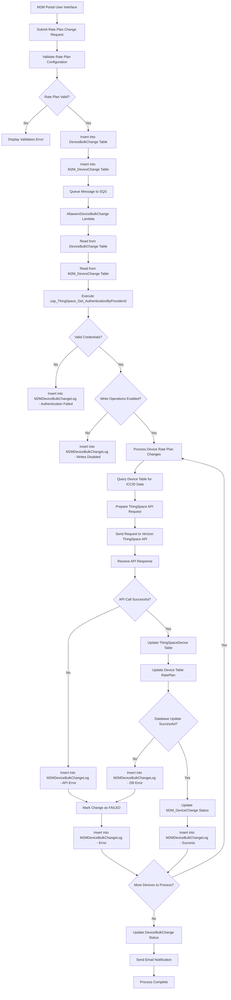

# Verizon Thingspace IoT - Change Customer Rate Plan

## Overview

### Purpose
Update customer-specific rate plans and data allocations in AMOP system for Verizon Thingspace IoT devices.

### What, Why, How

#### **What**
The Change Customer Rate Plan feature for Verizon Thingspace IoT allows AMOP (Altaworx Mobile Operations Platform) to update customer-specific rate plans and data allocations for IoT devices managed through Verizon's Thingspace platform.

#### **Why**
This functionality is essential because IoT customers frequently need to modify their service plans based on changing data usage patterns, device deployment scales, or business requirements, while maintaining seamless connectivity for their IoT devices.

#### **How**
The system processes rate plan changes through a multi-step workflow that validates customer rate plan IDs and pool assignments, updates the AMOP database via stored procedures, and maintains comprehensive audit trails for all changes made to customer billing configurations.

## Data Flow Architecture

### Complete Flow Diagram



### Flow Explanation

#### Phase 1: Request Submission and Validation
1. **M2M Portal User Interface**: User initiates rate plan change through web interface
2. **Submit Rate Plan Change Request**: Form submission with rate plan details
3. **Validate Rate Plan Configuration**: Server-side validation of rate plan parameters
4. **Rate Plan Valid?**: Decision point for validation results
   - **No**: Display validation errors to user
   - **Yes**: Proceed to database insertion

#### Phase 2: Database Recording and Queuing
5. **Insert into DeviceBulkChange Table**: Master record for bulk change operation
6. **Insert into M2M_DeviceChange Table**: Individual device change records
7. **Queue Message to SQS**: Asynchronous processing trigger
8. **AltaworxDeviceBulkChange Lambda**: AWS Lambda function activation

#### Phase 3: Processing Preparation
9. **Read from DeviceBulkChange Table**: Retrieve bulk change configuration
10. **Read from M2M_DeviceChange Table**: Get device-specific change details
11. **Execute usp_ThingSpace_Get_AuthenticationByProviderId**: Retrieve API credentials
12. **Valid Credentials?**: Authentication validation check
    - **No**: Log authentication failure
    - **Yes**: Proceed to write operations check

#### Phase 4: Operation Authorization
13. **Write Operations Enabled?**: Check if service provider allows modifications
    - **No**: Log writes disabled status
    - **Yes**: Begin rate plan processing

#### Phase 5: Rate Plan Processing Loop
14. **Process Device Rate Plan Changes**: Main processing logic
15. **Query Device Table for ICCID Data**: Retrieve device information
16. **Prepare ThingSpace API Request**: Format API request payload
17. **Send Request to Verizon ThingSpace API**: External API call
18. **Receive API Response**: Process API response
19. **API Call Successful?**: Validate API response
    - **No**: Log API error
    - **Yes**: Update local database

#### Phase 6: Database Updates
20. **Update ThingSpaceDevice Table**: Sync ThingSpace-specific data
21. **Update Device Table RatePlan**: Update main device rate plan
22. **Database Update Successful?**: Validate database operations
    - **No**: Log database error
    - **Yes**: Update change status

#### Phase 7: Status Management
23. **Update M2M_DeviceChange Status**: Mark individual device change complete
24. **Insert into M2MDeviceBulkChangeLog**: Record success/failure details
25. **More Devices to Process?**: Check for remaining devices
    - **Yes**: Return to rate plan processing
    - **No**: Complete bulk operation

#### Phase 8: Completion and Notification
26. **Update DeviceBulkChange Status**: Mark bulk operation complete
27. **Send Email Notification**: Notify stakeholders of completion
28. **Process Complete**: End of workflow

### Error Handling Paths
- **Authentication Failed**: Logs failure and stops processing
- **Writes Disabled**: Logs status and stops processing
- **API Error**: Logs error, marks device as failed, continues with next device
- **Database Error**: Logs error, marks device as failed, continues with next device

### Detailed Step-by-Step Process

### 1. Request Initiation
```
┌─────────────────┐
│ M2M Controller  │ ──► BulkChangeCreateModel
│ (User Interface)│     │
└─────────────────┘     ▼
                 ┌─────────────────────────────────┐
                 │ BulkChangeCustomerRatePlanUpdate│
                 │ - CustomerRatePlanId            │
                 │ - CustomerDataAllocationMB      │
                 │ - CustomerPoolId                │
                 │ - EffectiveDate                 │
                 └─────────────────────────────────┘
```

### 2. Change Request Processing
```
┌──────────────────────┐
│ AltaworxDeviceBulkChange │ ──► ChangeRequestType.CustomerRatePlanChange
│ (Main Processor)         │
└──────────────────────┘
            │
            ▼
┌──────────────────────────────────────────────────────────────┐
│ ProcessCustomerRatePlanChangeAsync()                         │
│ - Deserializes BulkChangeRequest                            │
│ - Extracts rate plan parameters                             │
│ - Validates effective date                                  │
└──────────────────────────────────────────────────────────────┘
```

### 3. Validation & Route Decision
```
┌─────────────────────────────────────────────────────────────────┐
│ Effective Date Check                                            │
│                                                                 │
│ IF effectiveDate <= DateTime.UtcNow:                          │
│    ──► ProcessCustomerRatePlanChangeAsync()                    │
│ ELSE:                                                          │
│    ──► ProcessAddCustomerRatePlanChangeToQueueAsync()         │
└─────────────────────────────────────────────────────────────────┘
```

### 4. Database Update (Immediate Processing)
```
┌─────────────────────────────────────────────────────────────────┐
│ SQL Stored Procedure Execution                                  │
│                                                                 │
│ usp_DeviceBulkChange_CustomerRatePlanChange_UpdateDevices      │
│                                                                 │
│ Parameters:                                                     │
│ - @BulkChangeId                                                │
│ - @CustomerRatePlanId                                          │
│ - @CustomerRatePoolId                                          │
│ - @CustomerDataAllocationMB                                    │
│ - @EffectiveDate                                               │
│ - @NeedToMarkProcessed                                         │
└─────────────────────────────────────────────────────────────────┘
```

### 5. Queue Processing (Future Effective Date)
```
┌─────────────────────────────────────────────────────────────────┐
│ Device_CustomerRatePlanOrRatePool_Queue                        │
│                                                                 │
│ Adds change request to queue table for scheduled processing    │
│ - Future execution based on EffectiveDate                      │
│ - Automated processing via scheduled jobs                      │
└─────────────────────────────────────────────────────────────────┘
```

### 6. Integration with Thingspace (For Equipment Changes)
```
┌─────────────────────────────────────────────────────────────────┐
│ ProcessThingSpaceChangeIdentifierAsync()                       │
│                                                                 │
│ When combined with equipment changes:                           │
│ 1. Authenticates with Thingspace API                          │
│ 2. Updates device identifiers (ICCID/IMEI)                    │
│ 3. Processes customer rate plan via UpdateCustomerRatePlan()   │
│ 4. Logs all API interactions                                   │
└─────────────────────────────────────────────────────────────────┘
```

### 7. Audit & Logging
```
┌─────────────────────────────────────────────────────────────────┐
│ DeviceBulkChangeLogRepository                                   │
│                                                                 │
│ M2M Portal:                                                     │
│ - CreateM2MDeviceBulkChangeLog                                 │
│                                                                 │
│ Mobility Portal:                                                │
│ - CreateMobilityDeviceBulkChangeLog                            │
│                                                                 │
│ Logs Include:                                                   │
│ - Request/Response details                                      │
│ - Error messages                                                │
│ - Processing status                                             │
│ - Timestamps                                                    │
└─────────────────────────────────────────────────────────────────┘
```

### 8. Response & Status Update
```
┌─────────────────────────────────────────────────────────────────┐
│ DeviceChangeResult<string, string>                             │
│                                                                 │
│ Success Response:                                               │
│ - HasErrors = false                                            │
│ - ResponseObject = "OK"                                        │
│ - ActionText = Stored procedure name                           │
│                                                                 │
│ Error Response:                                                 │
│ - HasErrors = true                                             │
│ - ResponseObject = Error details with reference ID            │
└─────────────────────────────────────────────────────────────────┘
```

## Technical Components

### Key Classes and Methods

#### Data Models
- **`BulkChangeCustomerRatePlanUpdate`**: Contains rate plan parameters
  - `CustomerRatePlanId`: Target rate plan identifier
  - `CustomerDataAllocationMB`: Data allocation limit
  - `CustomerPoolId`: Rate pool assignment
  - `EffectiveDate`: When change becomes active

#### Processing Methods
- **`ProcessCustomerRatePlanChangeAsync()`**: Main processing for immediate changes
- **`ProcessAddCustomerRatePlanChangeToQueueAsync()`**: Handles future-dated changes
- **`UpdateCustomerRatePlan()`**: Thingspace-specific rate plan update logic
- **`ProcessCustomerRatePlanChangeForDevicesAsync()`**: Device-specific processing

#### Integration Components
- **`ProcessThingSpaceChangeIdentifierAsync()`**: Thingspace API integration
- **`ThingSpaceCommon`**: Authentication and API communication utilities
- **`DeviceBulkChangeLogRepository`**: Comprehensive audit trail management

### Integration Points

#### Service Provider Integration
```
IntegrationType.ThingSpace

ThingSpace Authentication:
- Access Token Management
- Session Token Handling
- API Request/Response Processing

Callback Processing:
- ThingSpaceCallBackResponseLog
- Status validation and processing
```

#### Database Stored Procedures
- `usp_DeviceBulkChange_CustomerRatePlanChange_UpdateDevices`
- `usp_DeviceBulkChange_CustomerRatePlanChange_UpdateDeviceByNumber`
- `usp_DeviceBulkChange_CustomerRatePlanChange_UpdateForDevices`

## Error Handling

### Exception Management
```
┌─────────────────────────────────────────────────────────────────┐
│ Exception Management                                            │
│                                                                 │
│ SQL Retry Policy:                                              │
│ - Transient failure handling                                   │
│ - Automatic retry mechanisms                                    │
│                                                                 │
│ API Error Handling:                                            │
│ - Thingspace API failure management                            │
│ - Token refresh logic                                          │
│ - Comprehensive error logging                                  │
│                                                                 │
│ Status Tracking:                                               │
│ - BulkChangeStatus.ERROR                                       │
│ - BulkChangeStatus.PROCESSED                                   │
│ - Device change processing flags                               │
└─────────────────────────────────────────────────────────────────┘
```

### Retry Mechanisms
- **SQL Retry Policy**: Handles transient database connection failures
- **HTTP Retry Policy**: Manages temporary API communication issues
- **Token Refresh**: Automatic handling of expired authentication tokens

## Configuration

### Environment Variables
- `THINGSPACE_GET_STATUS_REQUEST_URL`: API endpoint for status requests
- `THINGSPACE_UPDATE_DEVICE_STATUS_RETRY_NUMBER`: Retry configuration
- `THINGSPACE_CHANGE_IDENTIFIER_URL`: Equipment change API endpoint

### Constants
- `THINGSPACE_DEVICESTATUS_PENDINGACTIVATION = 15`
- `THINGSPACE_DEVICESTATUSID_ACTIVE = 8`
- `THINGSPACE_CHANGE_TYPE_ICCID`: ICCID change identifier
- `THINGSPACE_CHANGE_TYPE_IMEI`: IMEI change identifier

## Workflow States

### Change Request Types
- `ChangeRequestType.CustomerRatePlanChange`: Primary rate plan modification
- `ChangeRequestType.ChangeICCIDAndIMEI`: Combined equipment and rate plan changes

### Processing Status
- `BulkChangeStatus.PROCESSED`: Successfully completed
- `BulkChangeStatus.ERROR`: Failed with errors
- `BulkChangeStatus.PROCESSING`: Currently being processed

### Device Status Constants
- `ThingSpace_Active`: Active device state
- `ThingSpace_Pending_Activate`: Pending activation
- `ThingSpace_Inventory`: Available in inventory
- `ThingSpace_Unknown`: Unknown device state

## Security Considerations

### Authentication
- Secure token management for Thingspace API
- Connection string encryption for database access
- Audit trail for all rate plan modifications

### Data Validation
- Rate plan ID validation before processing
- Effective date validation and scheduling
- Customer authorization checks

## Monitoring and Logging

### Log Categories
- **INFO**: Standard processing information
- **WARN**: Warning conditions and validation failures
- **ERROR**: Exception details and system errors
- **SUB**: Sub-process entry and exit points

### Audit Trail
- Complete request/response logging
- Processing timestamps
- Error reference IDs for troubleshooting
- Device change history tracking

## Performance Optimization

### Batch Processing
- Queue-based processing for future-dated changes
- Bulk update operations for multiple devices
- Configurable page sizes for large datasets

### Resource Management
- Connection pooling for database operations
- HTTP client factory for API communications
- Memory-efficient data processing patterns