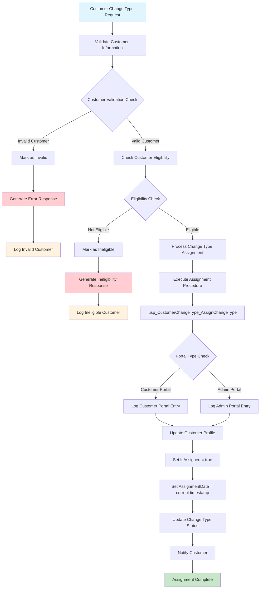

# Assign Customer Change Type - Data Flow Diagram

## Process Description

### Input
- **Customer Change Type Request**: Request to assign a specific change type to a customer

### Validation Steps
1. **Validate Customer Information**: Verify customer details and request format
2. **Customer Validation Check**: Ensure customer exists and data is complete
3. **Check Customer Eligibility**: Verify customer meets criteria for change type assignment

### Processing Flow
1. **Process Change Type Assignment**: Main processing logic for assignment
2. **Execute Assignment Procedure**: Run stored procedure for database operations
3. **Portal Type Check**: Determine which portal initiated the request (Customer/Admin)
4. **Log Entry**: Record the assignment action in appropriate portal logs

### Database Updates
1. **Update Customer Profile**: Modify customer record with new change type
2. **Set IsAssigned = true**: Mark the change type as assigned
3. **Set AssignmentDate**: Record timestamp of assignment
4. **Update Change Type Status**: Update status tracking

### Completion
1. **Notify Customer**: Send confirmation to customer
2. **Assignment Complete**: Process successfully finished

### Error Handling
- **Invalid Customer**: Log error and generate appropriate response
- **Ineligible Customer**: Log ineligibility reason and notify requester

## Key Components

- **Stored Procedure**: `usp_CustomerChangeType_AssignChangeType`
- **Portal Logging**: Separate logs for Customer Portal and Admin Portal access
- **Status Tracking**: IsAssigned flag and AssignmentDate timestamp
- **Notification System**: Customer notification upon successful assignment