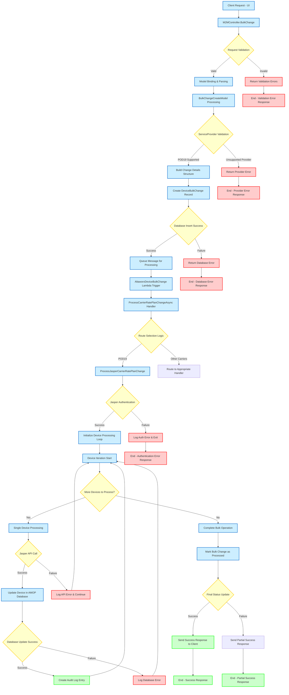

# Bulk Change Process - Data Flow Diagram

## Overview
This document describes the complete data flow for processing bulk carrier rate plan changes in the M2M (Machine-to-Machine) system, from initial client request through final processing and response.

## Data Flow Diagram

## Detailed Process Description

### 1. Client Request Initiation
- **Process**: User initiates a bulk carrier rate plan change through the web UI
- **Data**: Device selection criteria, new rate plan details, user authentication
- **Output**: HTTP request to M2MController

### 2. Controller Processing (M2MController.BulkChange)
- **Process**: Initial request handling and routing
- **Validation**: Request format, authentication tokens, required parameters
- **Data Transformation**: Raw HTTP request to structured model

### 3. Request Validation Gateway
- **Condition**: Validates request structure and required fields
- **Success Path**: Proceeds to model binding
- **Failure Path**: Returns HTTP 400 with validation error details

### 4. Model Binding & Parsing
- **Process**: Convert request data to BulkChangeCreateModel
- **Data Validation**: Type checking, range validation, business rule validation
- **Output**: Structured model object ready for processing

### 5. BulkChangeCreateModel Processing
- **Process**: Extract device lists, rate plan configurations, and processing options
- **Business Logic**: Apply company-specific rules and constraints
- **Data Enrichment**: Add metadata, timestamps, and processing flags

### 6. ServiceProvider Validation
- **Condition**: Verify that the carrier (POD19/Jasper) supports bulk operations
- **Success Path**: Continue with POD19-specific processing
- **Failure Path**: Return unsupported provider error

### 7. Build Change Details Structure
- **Process**: Create detailed change specifications for each device
- **Data**: Device identifiers, current plans, target plans, change metadata
- **Validation**: Ensure change compatibility and business rule compliance

### 8. Create DeviceBulkChange Record
- **Process**: Persist bulk change request to database for tracking
- **Data**: Bulk change ID, status, device count, user information, timestamps
- **Purpose**: Audit trail and progress tracking

### 9. Database Insert Validation
- **Condition**: Verify successful database record creation
- **Success Path**: Proceed to queue processing
- **Failure Path**: Return database error to client

### 10. Queue Message for Processing
- **Process**: Add bulk change job to processing queue
- **Data**: Bulk change ID, priority, processing parameters
- **Technology**: AWS SQS or similar message queue system

### 11. Lambda Function Trigger
- **Process**: AltaworxDeviceBulkChange Lambda function receives queue message
- **Execution Context**: Serverless processing environment
- **Input**: Bulk change ID and processing parameters

### 12. ProcessCarrierRatePlanChangeAsync Handler
- **Process**: Main orchestration logic for bulk change processing
- **Responsibilities**: Error handling, progress tracking, result aggregation
- **Concurrency**: Manages parallel device processing where appropriate

### 13. Route Selection Logic
- **Condition**: Determine processing route based on carrier type
- **POD19 Path**: Route to Jasper-specific processing
- **Other Carriers**: Route to alternative carrier handlers

### 14. ProcessJasperCarrierRatePlanChange
- **Process**: Jasper-specific bulk change processing logic
- **Responsibilities**: Jasper API interaction, error handling, retry logic
- **Data Transformation**: Convert internal format to Jasper API format

### 15. Jasper Authentication
- **Condition**: Authenticate with Jasper API using stored credentials
- **Success Path**: Obtain valid authentication token
- **Failure Path**: Log authentication error and terminate processing

### 16. Initialize Device Processing Loop
- **Process**: Prepare for iterative device processing
- **Data**: Device list, batch size configuration, progress tracking
- **Setup**: Initialize counters, error collections, and success tracking

### 17. Device Processing Loop Control
- **Condition**: Check if more devices need processing
- **Continue**: Process next device in the list
- **Complete**: Proceed to finalization when all devices processed

### 18. Single Device Processing
- **Process**: Handle individual device rate plan change
- **Data**: Device ID, current plan, target plan, change parameters
- **Validation**: Device-specific business rules and constraints

### 19. Jasper API Call
- **Condition**: Execute rate plan change via Jasper API
- **Success Path**: API returns successful change confirmation
- **Failure Path**: API returns error (device not found, plan invalid, etc.)

### 20. AMOP Database Update
- **Process**: Update device record in AMOP database with new rate plan
- **Data**: Device ID, new rate plan, change timestamp, status
- **Consistency**: Ensure data consistency between Jasper and internal systems

### 21. Database Update Validation
- **Condition**: Verify successful database update
- **Success Path**: Create audit log entry
- **Failure Path**: Log database error and continue processing

### 22. Audit Log Creation
- **Process**: Create detailed audit trail entry
- **Data**: Change details, timestamps, user information, success/failure status
- **Compliance**: Maintain regulatory and operational audit requirements

### 23. Complete Bulk Operation
- **Process**: Finalize bulk change processing
- **Data Aggregation**: Success count, failure count, error details
- **Status Calculation**: Overall operation success/failure determination

### 24. Mark Bulk Change as Processed
- **Process**: Update bulk change record with final status
- **Data**: Completion timestamp, final status, summary statistics
- **Database**: Update DeviceBulkChange table with results

### 25. Final Status Update Validation
- **Condition**: Verify successful status update
- **Success Path**: Send success response to client
- **Failure Path**: Send partial success response with error details

### 26. Client Response
- **Process**: Return final processing results to client
- **Data**: Operation status, success/failure counts, error details
- **Format**: Structured JSON response with comprehensive results

## Error Handling Strategies

### Validation Errors
- Immediate return to client with detailed error descriptions
- No processing queue involvement
- HTTP 400 status with error details

### Authentication Errors
- Logged for security monitoring
- Processing terminated
- Client notified of authentication failure

### API Errors
- Individual device failures logged
- Processing continues for remaining devices
- Partial success response provided

### Database Errors
- Critical errors terminate processing
- Non-critical errors logged and processing continues
- Retry logic for transient failures

## Data Persistence Points

1. **DeviceBulkChange Record**: Initial request tracking
2. **Device Updates**: Individual device rate plan changes
3. **Audit Logs**: Comprehensive change tracking
4. **Error Logs**: Failure analysis and debugging
5. **Status Updates**: Progress and completion tracking

## Performance Considerations

- **Batch Processing**: Devices processed in configurable batch sizes
- **Parallel Execution**: Multiple devices processed concurrently where possible
- **Queue Management**: Prevents system overload through controlled processing
- **Timeout Handling**: Individual device timeouts don't affect overall operation
- **Resource Monitoring**: Lambda execution time and memory usage tracked

## Security & Compliance

- **Authentication**: Multi-level authentication (UI, API, Jasper)
- **Authorization**: Role-based access control
- **Audit Trail**: Complete change history maintenance
- **Data Protection**: Sensitive information encryption
- **Error Handling**: Secure error messages without data exposure