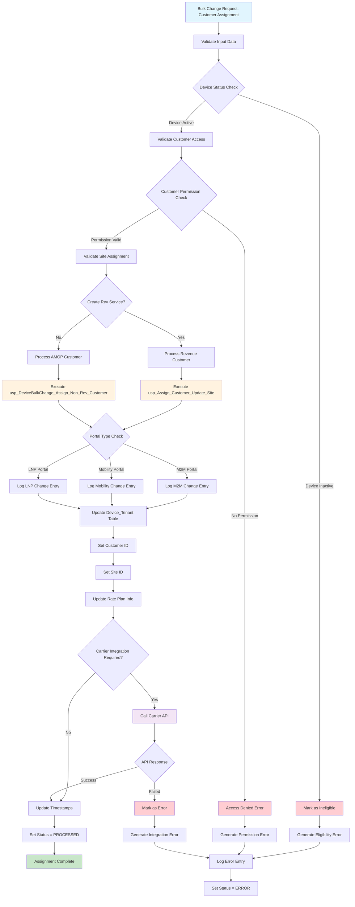

# Customer Assignment Data Flow - Mermaid Flowchart

## Process Description

### Input Validation Phase
- **Device Status Check**: Validates that devices are in active status
- **Customer Permission Check**: Ensures user has access to assign the selected customer
- **Site Assignment**: Validates customer sites and assigns appropriate site

### Processing Phase
- **Revenue vs AMOP**: Determines processing path based on CreateRevService flag
- **Database Updates**: Executes appropriate stored procedures for customer assignment
- **Portal Type Logging**: Creates audit entries based on portal type (M2M, Mobility, LNP)

### Integration Phase
- **Carrier API Calls**: Integrates with external carrier systems (ThingSpace, Jasper)
- **Rate Plan Updates**: Applies customer rate plans and data allocations
- **Service Activation**: Activates new services if required

### Completion Phase
- **Status Updates**: Marks bulk change as PROCESSED or ERROR
- **Audit Logging**: Creates comprehensive audit trail
- **Notifications**: Sends success/failure notifications

## Key Decision Points

1. **Device Eligibility**: Only active devices can be assigned
2. **Customer Permissions**: User must have access to the target customer
3. **Service Creation**: Determines if new revenue service needs to be created
4. **Carrier Integration**: Some assignments require external API calls
5. **Error Handling**: Multiple failure points with specific error logging