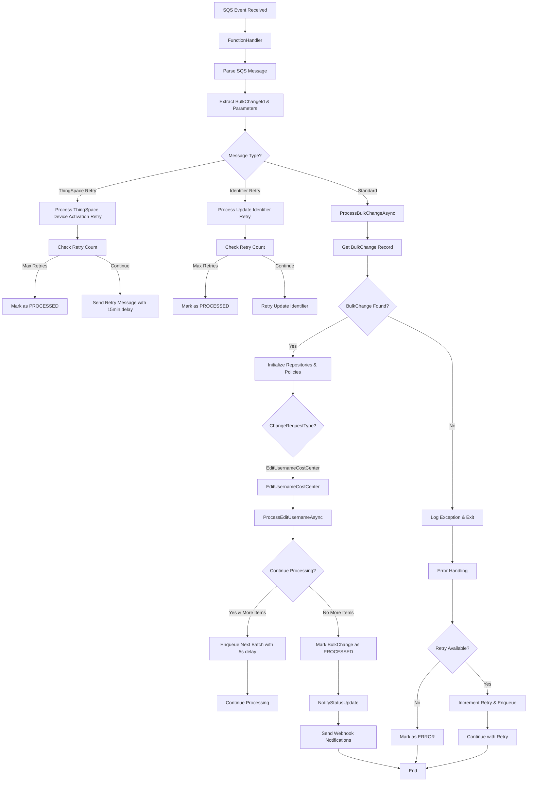

# Edit Username/Cost Center Flow

```mermaid
graph TD
    A[SQS Event Received] --> B[FunctionHandler]
    B --> C[Parse SQS Message]
    C --> D[Extract BulkChangeId & Parameters]
    D --> E{Message Type?}
    
    E -->|ThingSpace Retry| F[Process ThingSpace Device Activation Retry]
    E -->|Identifier Retry| G[Process Update Identifier Retry]
    E -->|Standard| H[ProcessBulkChangeAsync]
    
    F --> F1[Check Retry Count]
    F1 -->|Max Retries| F2[Mark as PROCESSED]
    F1 -->|Continue| F3[Send Retry Message with 15min delay]
    
    G --> G1[Check Retry Count]
    G1 -->|Max Retries| G2[Mark as PROCESSED]
    G1 -->|Continue| G3[Retry Update Identifier]
    
    H --> I[Get BulkChange Record]
    I --> J{BulkChange Found?}
    J -->|No| K[Log Exception & Exit]
    J -->|Yes| L[Initialize Repositories & Policies]
    L --> M{ChangeRequestType?}
    
    M -->|EditUsernameCostCenter| V[EditUsernameCostCenter]
    
    V --> V1[ProcessEditUsernameAsync]
    
    V1 --> W{Continue Processing?}
    
    W -->|Yes & More Items| X[Enqueue Next Batch with 5s delay]
    W -->|No More Items| Y[Mark BulkChange as PROCESSED]
    
    X --> Z[Continue Processing]
    Y --> AA[NotifyStatusUpdate]
    AA --> BB[Send Webhook Notifications]
    BB --> CC[End]
    
    K --> DD[Error Handling]
    DD --> EE{Retry Available?}
    EE -->|Yes| FF[Increment Retry & Enqueue]
    EE -->|No| GG[Mark as ERROR]
    FF --> HH[Continue with Retry]
    GG --> CC
    HH --> CC
```