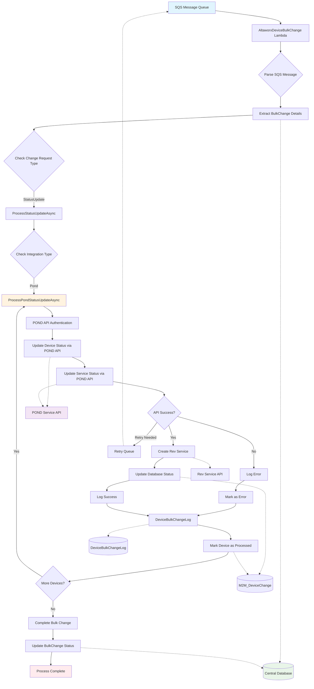

# POND IoT Service Provider Flow

## Key Components for POND IoT Provider:

### Main Flow:
1. **SQS Message Processing** - Receives bulk change requests
2. **Message Parsing** - Extracts device change details
3. **POND Integration** - Routes to POND-specific processing
4. **API Operations** - Authenticates and updates device/service status
5. **Database Updates** - Records changes and logs
6. **Completion** - Marks process as complete

### External Dependencies:
- **POND Service API** - Primary integration for device management
- **Rev Service API** - Secondary service creation
- **Central Database** - Main data store
- **Device Change Tables** - Audit and tracking

### Error Handling:
- API failure logging
- Retry queue mechanism
- Error state management