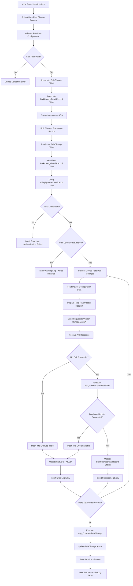

# Verizon ThingSpace IoT ServiceProvider - Carrier Rate Plan Change Data Flow Diagram

## Overview
This document describes the data flow for changing carrier rate plans in the Verizon ThingSpace IoT ServiceProvider system. The process involves bulk change operations that update device rate plans through ThingSpace APIs and synchronize the changes with the local AMOP database.

## Architecture Components

### Core Components
- **M2MController**: Web controller handling bulk change requests
- **AltaworxDeviceBulkChange**: Lambda function processing bulk changes
- **ThingSpaceDeviceDetailService**: Service for ThingSpace API interactions
- **DeviceRepository**: Database operations for device updates
- **BulkChangeLogRepository**: Logging and audit trail management

### Data Models
- **CarrierRatePlanUpdate**: Rate plan change request data
- **BulkChangeDetailRecord**: Individual device change record
- **ThingSpaceDeviceDetail**: ThingSpace API device representation
- **ThingSpaceAuthentication**: Authentication credentials for ThingSpace API

## Data Flow Diagram



## Detailed Process Flow

### 1. Rate Plan Change Request Submission
```
User Input Data:
- Carrier Rate Plan Code
- Communication Plan
- Effective Date
- Plan UUID
- Rate Plan ID
- Device Selection Criteria
```

### 2. Data Validation and Storage
- **Service Provider Check**: Query ServiceProvider table for ThingSpace integration status
- **Rate Plan Validation**: Verify rate plan exists in CarrierRatePlan table
- **Device Validation**: Confirm devices exist in Device table
- **Bulk Change Creation**: Insert record into BulkChange table
- **Detail Records**: Insert individual device changes into BulkChangeDetailRecord table

### 3. Authentication and Authorization
```
Database Operations:
1. Query ThingSpaceAuthentication Table
   └── Retrieve API credentials and configuration
   
2. Validate Service Provider Configuration
   └── Check integration enabled and write permissions
   
3. Obtain API Access Tokens
   └── Use stored credentials for authentication
```

### 4. Rate Plan Update Processing
```
For Each Device:
1. Read Device Information
   └── Query Device table for ICCID and current status
   
2. Prepare API Request
   └── Format rate plan change data for ThingSpace API
   
3. Execute API Call
   └── Send rate plan update to Verizon ThingSpace
   
4. Process API Response
   └── Parse success/failure response from ThingSpace
```

### 5. Database Synchronization

#### Successful Rate Plan Update
```
Stored Procedure: usp_UpdateDeviceRatePlan
Parameters:
- @ICCID: Device identifier
- @NewRatePlan: Updated rate plan code
- @EffectiveDate: When change takes effect
- @TenantId: Customer tenant identifier

Tables Updated:
- Device: Update current rate plan
- DeviceRatePlanHistory: Log rate plan change
- ThingSpaceDevice: Sync with ThingSpace data
```

### 6. Audit Trail and Logging

#### Success Log Entry
```
Table: M2MDeviceBulkChangeLog
Fields:
- BulkChangeId: Parent bulk change identifier
- DeviceChangeId: Individual device change record
- LogDescription: "Rate Plan Update - ThingSpace API Success"
- Status: "PROCESSED"
- RequestData: API request payload
- ResponseData: API response details
- ProcessedDate: Timestamp of completion
```

#### Error Log Entry
```
Table: M2MDeviceBulkChangeLog
Fields:
- BulkChangeId: Parent bulk change identifier
- DeviceChangeId: Individual device change record
- LogDescription: "Rate Plan Update - API/Database Error"
- Status: "ERROR"
- ErrorDetails: Specific error message
- RequestData: Failed request payload
- ProcessedDate: Timestamp of failure
```

## Error Handling

### Common Error Scenarios
1. **Authentication Failure**
   - Missing ThingSpace credentials
   - Invalid access/session tokens
   - Account permission issues

2. **API Errors**
   - ThingSpace service unavailable
   - Invalid rate plan codes
   - Device not found in ThingSpace

3. **Database Errors**
   - Connection failures
   - Constraint violations
   - Transaction rollbacks

### Retry Mechanisms
- **HTTP Retry Policy**: Exponential backoff for API calls
- **SQL Retry Policy**: Database connection retry logic
- **SQS Message Retry**: Failed messages re-queued for processing

## Data Security

### Authentication & Authorization
- **ThingSpace API**: OAuth 2.0 with client credentials
- **Database Access**: Encrypted connection strings
- **Audit Logging**: All operations logged with timestamps

### Data Protection
- **Sensitive Data**: Rate plan codes and device identifiers
- **Encryption**: In-transit and at-rest encryption
- **Access Control**: Role-based permissions

## Performance Considerations

### Scalability
- **Batch Processing**: Multiple devices processed per bulk change
- **Asynchronous Processing**: Lambda functions for non-blocking operations
- **Connection Pooling**: Efficient database connection management

### Monitoring
- **API Rate Limits**: ThingSpace API throttling considerations
- **Processing Time**: Lambda timeout configuration
- **Error Rates**: Monitoring and alerting for failure thresholds

## Integration Points

### External Systems
1. **Verizon ThingSpace API**
   - Device management endpoints
   - Rate plan update services
   - Authentication services

2. **AWS Services**
   - SQS for message queuing
   - Lambda for serverless processing
   - CloudWatch for monitoring

### Internal Systems
1. **AMOP Database**
   - Device inventory management
   - Rate plan configurations
   - Audit and logging tables

2. **M2M Portal**
   - User interface for bulk operations
   - Reporting and status tracking
   - Administrative functions

## Status Tracking

### Change Statuses
- **PENDING**: Change request created, awaiting processing
- **PROCESSING**: Currently being processed by Lambda
- **PROCESSED**: Successfully completed
- **ERROR**: Failed due to API or database error
- **RETRY**: Queued for retry after transient failure

### Monitoring Dashboard
- Real-time status of bulk changes
- Success/failure rates
- Processing time metrics
- Error categorization and trends

---

## Technical Implementation Details

### Database Tables

#### Primary Tables
```sql
BulkChange
- Id (Primary Key)
- ServiceProviderId
- TenantId
- ChangeType
- Status
- CreatedDate
- CompletedDate

BulkChangeDetailRecord
- Id (Primary Key)
- BulkChangeId (Foreign Key)
- DeviceIdentifier (ICCID)
- Status
- ChangeRequest (JSON)
- StatusDetails
- ChangeRequestTypeId

Device
- Id (Primary Key)
- ICCID
- IMEI
- Status
- CurrentRatePlan
- ServiceProviderId
- TenantId

CarrierRatePlan
- Id (Primary Key)
- RatePlanCode
- RatePlanName
- ServiceProviderId
- PlanUuid
- IsActive
```

#### Authentication and Configuration Tables
```sql
ThingSpaceAuthentication
- Id (Primary Key)
- ServiceProviderId
- BaseUrl
- ClientId
- ClientSecret
- Username
- Password
- WriteIsEnabled

ServiceProvider
- Id (Primary Key)
- Name
- IntegrationType
- IsActive
```

#### Logging and Audit Tables
```sql
M2MDeviceBulkChangeLog
- Id (Primary Key)
- BulkChangeId
- DeviceChangeId
- LogDescription
- Status
- RequestData
- ResponseData
- ErrorDetails
- ProcessedDate

ThingSpaceDeviceUsage
- Id (Primary Key)
- ICCID
- IMEI
- Status
- RatePlan
- CreatedDate
- DeviceStatusId
```

### Key Stored Procedures

#### Rate Plan Management
- **usp_UpdateDeviceRatePlan**: Updates device rate plan and creates history record
- **usp_GetDevicesByRatePlan**: Retrieves devices by current rate plan
- **usp_ValidateRatePlanChange**: Validates rate plan change request

#### Bulk Change Processing
- **usp_CreateBulkChange**: Creates new bulk change record
- **usp_GetBulkChangeDetails**: Retrieves bulk change and detail records
- **usp_CompleteBulkChange**: Marks bulk change as completed
- **usp_GetPendingBulkChanges**: Gets bulk changes awaiting processing

#### Authentication and Configuration
- **usp_GetThingSpaceAuthentication**: Retrieves ThingSpace API credentials
- **usp_ValidateServiceProvider**: Validates service provider configuration
- **usp_CheckWritePermissions**: Verifies write operations are enabled

#### Logging and Audit
- **usp_InsertBulkChangeLog**: Creates audit log entries
- **usp_UpdateDeviceChangeStatus**: Updates individual device change status
- **usp_GetBulkChangeHistory**: Retrieves historical bulk change data

### Configuration Parameters
- **ThingSpace API Base URL**: External API endpoint configuration
- **Authentication Endpoints**: OAuth and session token URLs
- **Rate Plan Update Path**: Specific API endpoint for rate plan changes
- **Retry Policy Settings**: Timeout and retry configuration
- **Notification Settings**: Email and alert configuration

This data flow ensures reliable, auditable, and secure carrier rate plan changes for Verizon ThingSpace IoT devices while maintaining data consistency between external APIs and internal systems.