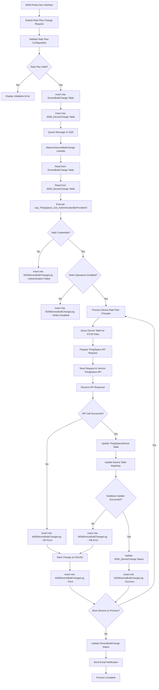

# Verizon ThingSpace IoT ServiceProvider - Carrier Rate Plan Change Data Flow Diagram

## Overview
This document describes the data flow for changing carrier rate plans in the Verizon ThingSpace IoT ServiceProvider system. The process involves bulk change operations that update device rate plans through ThingSpace APIs and synchronize the changes with the local AMOP database.

## Architecture Components

### Core Components
- **M2MController**: Web controller handling bulk change requests
- **AltaworxDeviceBulkChange**: Lambda function processing bulk changes
- **ThingSpaceDeviceDetailService**: Service for ThingSpace API interactions
- **DeviceRepository**: Database operations for device updates
- **BulkChangeLogRepository**: Logging and audit trail management

### Data Models
- **CarrierRatePlanUpdate**: Rate plan change request data
- **BulkChangeDetailRecord**: Individual device change record
- **ThingSpaceDeviceDetail**: ThingSpace API device representation
- **ThingSpaceAuthentication**: Authentication credentials for ThingSpace API

## Data Flow Diagram



## Detailed Process Flow

### 1. Rate Plan Change Request Submission
```
User Input Data:
- Carrier Rate Plan Code
- Communication Plan
- Effective Date
- Plan UUID
- Rate Plan ID
- Device Selection Criteria
```

### 2. Data Validation and Storage
- **Service Provider Check**: Validate ThingSpace integration is enabled for the service provider
- **Rate Plan Validation**: Verify rate plan exists in JasperCarrierRatePlan table
- **Device Validation**: Confirm devices exist in Device table with valid ICCID
- **Bulk Change Creation**: Insert record into DeviceBulkChange table
- **Detail Records**: Insert individual device changes into M2M_DeviceChange table

### 3. Authentication and Authorization
```
Database Operations:
1. Execute usp_ThingSpace_Get_AuthenticationByProviderId
   └── Retrieve API credentials, base URL, and configuration
   
2. Validate Write Permissions
   └── Check WriteIsEnabled flag in authentication record
   
3. Obtain API Access Tokens
   └── Use ClientId, ClientSecret for OAuth authentication
   └── Get session token for API calls
```

### 4. Rate Plan Update Processing
```
For Each Device in M2M_DeviceChange:
1. Read Device Information
   └── Query Device table for ICCID, current status, and rate plan
   
2. Parse Change Request JSON
   └── Extract CarrierRatePlanUpdate from ChangeRequest field
   
3. Execute ThingSpace API Call
   └── Send rate plan update to Verizon ThingSpace
   └── Use UpdateThingSpaceDeviceDetailsAsync service
   
4. Process API Response
   └── Parse success/failure response from ThingSpace
   └── Log response in M2MDeviceBulkChangeLog
```

### 5. Database Synchronization

#### Successful Rate Plan Update
```
Direct SQL Operations:
1. UPDATE ThingSpaceDevice
   └── SET RatePlan = new_rate_plan
   └── WHERE ICCID = device_iccid

2. UPDATE Device 
   └── SET RatePlan = new_rate_plan, CarrierRatePlanId = new_plan_id
   └── WHERE ICCID = device_iccid

3. INSERT INTO ThingSpaceDeviceUsage
   └── Log usage record with new rate plan

4. UPDATE M2M_DeviceChange
   └── SET Status = 'PROCESSED', IsProcessed = 1
   └── WHERE Id = device_change_id
```

### 6. Audit Trail and Logging

#### Success Log Entry
```
Table: M2MDeviceBulkChangeLog
Fields:
- BulkChangeId: Parent bulk change identifier
- M2MDeviceChangeId: Individual device change record
- LogEntryDescription: "Update ThingSpace Rate Plan: ThingSpace API"
- ResponseStatus: "PROCESSED"
- RequestText: API request payload and action details
- ResponseText: API response JSON
- ErrorText: NULL (for successful operations)
- HasErrors: false
- ProcessedDate: UTC timestamp of completion
- ProcessBy: "AltaworxDeviceBulkChange"
```

#### Error Log Entry
```
Table: M2MDeviceBulkChangeLog  
Fields:
- BulkChangeId: Parent bulk change identifier
- M2MDeviceChangeId: Individual device change record
- LogEntryDescription: "Update ThingSpace Rate Plan: API/Database Error"
- ResponseStatus: "ERROR"
- RequestText: Failed request payload and action details
- ResponseText: Error response from API or database
- ErrorText: Detailed error message and exception details
- HasErrors: true
- ProcessedDate: UTC timestamp of failure
- ProcessBy: "AltaworxDeviceBulkChange"
```

## Error Handling

### Common Error Scenarios
1. **Authentication Failure**
   - Missing ThingSpace credentials
   - Invalid access/session tokens
   - Account permission issues

2. **API Errors**
   - ThingSpace service unavailable
   - Invalid rate plan codes
   - Device not found in ThingSpace

3. **Database Errors**
   - Connection failures
   - Constraint violations
   - Transaction rollbacks

### Retry Mechanisms
- **HTTP Retry Policy**: Exponential backoff for API calls
- **SQL Retry Policy**: Database connection retry logic
- **SQS Message Retry**: Failed messages re-queued for processing

## Data Security

### Authentication & Authorization
- **ThingSpace API**: OAuth 2.0 with client credentials
- **Database Access**: Encrypted connection strings
- **Audit Logging**: All operations logged with timestamps

### Data Protection
- **Sensitive Data**: Rate plan codes and device identifiers
- **Encryption**: In-transit and at-rest encryption
- **Access Control**: Role-based permissions

## Performance Considerations

### Scalability
- **Batch Processing**: Multiple devices processed per bulk change
- **Asynchronous Processing**: Lambda functions for non-blocking operations
- **Connection Pooling**: Efficient database connection management

### Monitoring
- **API Rate Limits**: ThingSpace API throttling considerations
- **Processing Time**: Lambda timeout configuration
- **Error Rates**: Monitoring and alerting for failure thresholds

## Integration Points

### External Systems
1. **Verizon ThingSpace API**
   - Device management endpoints
   - Rate plan update services
   - Authentication services

2. **AWS Services**
   - SQS for message queuing
   - Lambda for serverless processing
   - CloudWatch for monitoring

### Internal Systems
1. **AMOP Database**
   - Device inventory management
   - Rate plan configurations
   - Audit and logging tables

2. **M2M Portal**
   - User interface for bulk operations
   - Reporting and status tracking
   - Administrative functions

## Status Tracking

### Change Statuses
- **PENDING**: Change request created, awaiting processing
- **PROCESSING**: Currently being processed by Lambda
- **PROCESSED**: Successfully completed
- **ERROR**: Failed due to API or database error
- **RETRY**: Queued for retry after transient failure

### Monitoring Dashboard
- Real-time status of bulk changes
- Success/failure rates
- Processing time metrics
- Error categorization and trends

---

## Technical Implementation Details

### Database Tables

#### Primary Tables
```sql
DeviceBulkChange
- Id (Primary Key)
- ServiceProviderId
- TenantId
- ChangeType
- Status
- CreatedDate
- CompletedDate
- RequestedBy

M2M_DeviceChange
- Id (Primary Key)
- BulkChangeId (Foreign Key)
- ICCID
- MSISDN
- Status
- ChangeRequest (JSON)
- StatusDetails
- IsProcessed
- CreatedDate

Device
- Id (Primary Key)
- ICCID
- IMEI
- Status
- RatePlan
- CarrierRatePlanId
- ServiceProviderId
- TenantId
- DeviceStatusId
- IsActive
- IsDeleted

JasperCarrierRatePlan
- Id (Primary Key)
- RatePlanCode
- RatePlanName
- ServiceProviderId
- PlanUuid
- JasperRatePlanId
- IsActive
- IsDeleted
```

#### ThingSpace Specific Tables
```sql
ThingSpaceDevice
- Id (Primary Key)
- ICCID
- Status
- RatePlan
- DeviceStatusId
- ServiceProviderId
- CreatedDate
- IsActive
- IsDeleted

ThingSpaceDeviceUsage
- Id (Primary Key)
- ICCID
- IMEI
- Status
- RatePlan
- DeviceStatusId
- CreatedDate
- IsActive
- IsDeleted

ThingSpaceDeviceDetail
- Id (Primary Key)
- ICCID
- AccountNumber
- ThingSpaceDateAdded
- CreatedDate
- IsActive
- IsDeleted
```

#### Logging and Audit Tables
```sql
M2MDeviceBulkChangeLog
- Id (Primary Key)
- BulkChangeId
- M2MDeviceChangeId
- LogEntryDescription
- ResponseStatus
- RequestText
- ResponseText
- ErrorText
- HasErrors
- ProcessedDate
- ProcessBy

MobilityDeviceBulkChangeLog
- Id (Primary Key)
- BulkChangeId
- MobilityDeviceChangeId
- LogEntryDescription
- ResponseStatus
- RequestText
- ResponseText
- ErrorText
- HasErrors
- ProcessedDate
- ProcessBy
```

### Key Stored Procedures

#### ThingSpace Authentication and Configuration
- **usp_ThingSpace_Get_AuthenticationByProviderId**: Retrieves ThingSpace API credentials by service provider
- **usp_M2MBulkChangeLogExport**: Exports bulk change log entries for reporting

#### Bulk Change Processing
- **dbo.usp_DeviceBulkChange_GetBulkChange**: Retrieves bulk change record details
- **usp_DeviceBulkChange_Assign_Non_Rev_Customer**: Assigns devices to non-revenue customers
- **usp_DeviceBulkChangeUpdateEquipmentMobility**: Updates mobility device equipment information
- **usp_UpdateEquipmentMobility**: Updates equipment details for mobility devices

#### Rate Plan and Customer Management
- **usp_DeviceBulkChange_CustomerRatePlanChange_UpdateDevices**: Updates device rate plans in bulk
- **usp_DeviceBulkChange_CustomerRatePlanChange_UpdateDeviceByNumber**: Updates rate plan for specific device by subscriber number
- **usp_UpdateCrossProviderDeviceHistory**: Tracks device history across providers

#### Revenue Service Management
- **usp_RevService_Create_Service**: Creates new revenue service records
- **usp_RevService_Create_ServiceProduct**: Creates service product associations
- **usp_Get_Rev_Service_Product_By_Rev_Customer_Id**: Retrieves revenue service products by customer

#### Status and Device Updates
- **usp_DeviceBulkChange_StatusUpdate_UpdateDeviceRecords**: Updates device status records
- **usp_DeviceBulkChange_UpdateMobilityDeviceChange**: Updates mobility device change records
- **usp_DeviceBulkChange_ThingSpace_InformationChange**: Processes ThingSpace information changes
- **usp_Update_Username_Device**: Updates device username information

#### Data Processing and Staging
- **usp_Telegence_Update_NewServiceActivations_FromStaging**: Processes new service activations from staging
- **usp_DeleteTelegenceMobilityFeature**: Removes mobility features from devices

### Configuration Parameters
- **ThingSpace API Base URL**: External API endpoint configuration
- **Authentication Endpoints**: OAuth and session token URLs
- **Rate Plan Update Path**: Specific API endpoint for rate plan changes
- **Retry Policy Settings**: Timeout and retry configuration
- **Notification Settings**: Email and alert configuration

This data flow ensures reliable, auditable, and secure carrier rate plan changes for Verizon ThingSpace IoT devices while maintaining data consistency between external APIs and internal systems.