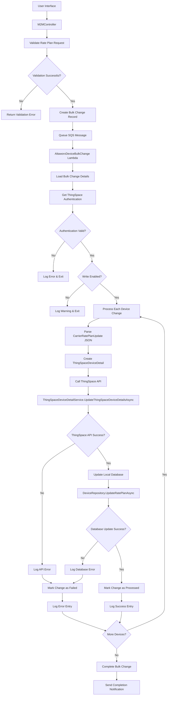

# Verizon ThingSpace IoT ServiceProvider - Carrier Rate Plan Change Data Flow Diagram

## Overview
This document describes the data flow for changing carrier rate plans in the Verizon ThingSpace IoT ServiceProvider system. The process involves bulk change operations that update device rate plans through ThingSpace APIs and synchronize the changes with the local AMOP database.

## Architecture Components

### Core Components
- **M2MController**: Web controller handling bulk change requests
- **AltaworxDeviceBulkChange**: Lambda function processing bulk changes
- **ThingSpaceDeviceDetailService**: Service for ThingSpace API interactions
- **DeviceRepository**: Database operations for device updates
- **BulkChangeLogRepository**: Logging and audit trail management

### Data Models
- **CarrierRatePlanUpdate**: Rate plan change request data
- **BulkChangeDetailRecord**: Individual device change record
- **ThingSpaceDeviceDetail**: ThingSpace API device representation
- **ThingSpaceAuthentication**: Authentication credentials for ThingSpace API

## Data Flow Diagram



## Detailed Process Flow

### 1. Request Initiation
```
Input: CarrierRatePlanUpdate
{
    "CarrierRatePlan": "new_plan_code",
    "CommPlan": "communication_plan",
    "EffectiveDate": "2024-01-01T00:00:00Z",
    "PlanUuid": "plan_uuid",
    "RatePlanId": 12345
}
```

### 2. Pre-processing Validation
- **Service Provider Validation**: Verify ThingSpace integration is enabled
- **Authentication Check**: Validate ThingSpace credentials
- **Write Permission**: Confirm write operations are enabled
- **Rate Plan Validation**: Verify the target rate plan exists

### 3. ThingSpace API Integration

#### Authentication Flow
```
1. Get ThingSpace Authentication Info
   └── ThingSpaceCommon.GetThingspaceAuthenticationInformation()
   
2. Obtain Access Token
   └── ThingSpaceCommon.GetAccessToken()
   
3. Get Session Token
   └── ThingSpaceCommon.GetSessionToken()
```

#### Device Update Flow
```
1. Create ThingSpaceDeviceDetail
   └── ICCID: [device_identifier]
   └── CarrierRatePlan: new_rate_plan

2. Call Update API
   └── ThingSpaceDeviceDetailService.UpdateThingSpaceDeviceDetailsAsync()
   
3. Process API Response
   └── Success: Continue to database update
   └── Error: Log failure and mark as error
```

### 4. Database Synchronization

#### Local Database Update
```
DeviceRepository.UpdateRatePlanAsync(
    iccid: device_iccid,
    carrierRatePlan: new_rate_plan,
    effectiveDate: null,
    tenantId: tenant_id
)
```

### 5. Logging and Audit Trail

#### Success Logging
```
CreateM2MDeviceBulkChangeLog {
    BulkChangeId: bulk_change_id,
    LogEntryDescription: "Update ThingSpace Rate Plan: ThingSpace API",
    ResponseStatus: BulkChangeStatus.PROCESSED,
    HasErrors: false,
    RequestText: api_request,
    ResponseText: api_response
}
```

#### Error Logging
```
CreateM2MDeviceBulkChangeLog {
    BulkChangeId: bulk_change_id,
    LogEntryDescription: "Update ThingSpace Rate Plan: ThingSpace API",
    ResponseStatus: BulkChangeStatus.ERROR,
    HasErrors: true,
    ErrorText: error_details,
    RequestText: api_request,
    ResponseText: error_response
}
```

## Error Handling

### Common Error Scenarios
1. **Authentication Failure**
   - Missing ThingSpace credentials
   - Invalid access/session tokens
   - Account permission issues

2. **API Errors**
   - ThingSpace service unavailable
   - Invalid rate plan codes
   - Device not found in ThingSpace

3. **Database Errors**
   - Connection failures
   - Constraint violations
   - Transaction rollbacks

### Retry Mechanisms
- **HTTP Retry Policy**: Exponential backoff for API calls
- **SQL Retry Policy**: Database connection retry logic
- **SQS Message Retry**: Failed messages re-queued for processing

## Data Security

### Authentication & Authorization
- **ThingSpace API**: OAuth 2.0 with client credentials
- **Database Access**: Encrypted connection strings
- **Audit Logging**: All operations logged with timestamps

### Data Protection
- **Sensitive Data**: Rate plan codes and device identifiers
- **Encryption**: In-transit and at-rest encryption
- **Access Control**: Role-based permissions

## Performance Considerations

### Scalability
- **Batch Processing**: Multiple devices processed per bulk change
- **Asynchronous Processing**: Lambda functions for non-blocking operations
- **Connection Pooling**: Efficient database connection management

### Monitoring
- **API Rate Limits**: ThingSpace API throttling considerations
- **Processing Time**: Lambda timeout configuration
- **Error Rates**: Monitoring and alerting for failure thresholds

## Integration Points

### External Systems
1. **Verizon ThingSpace API**
   - Device management endpoints
   - Rate plan update services
   - Authentication services

2. **AWS Services**
   - SQS for message queuing
   - Lambda for serverless processing
   - CloudWatch for monitoring

### Internal Systems
1. **AMOP Database**
   - Device inventory management
   - Rate plan configurations
   - Audit and logging tables

2. **M2M Portal**
   - User interface for bulk operations
   - Reporting and status tracking
   - Administrative functions

## Status Tracking

### Change Statuses
- **PENDING**: Change request created, awaiting processing
- **PROCESSING**: Currently being processed by Lambda
- **PROCESSED**: Successfully completed
- **ERROR**: Failed due to API or database error
- **RETRY**: Queued for retry after transient failure

### Monitoring Dashboard
- Real-time status of bulk changes
- Success/failure rates
- Processing time metrics
- Error categorization and trends

---

## Technical Implementation Details

### Key Classes and Methods

#### CarrierRatePlanUpdate.cs
```csharp
public class CarrierRatePlanUpdate
{
    public string CarrierRatePlan { get; set; }
    public string CommPlan { get; set; }
    public DateTime? EffectiveDate { get; set; }
    public string PlanUuid { get; set; }
    public long RatePlanId { get; set; }
}
```

#### ProcessThingSpaceCarrierRatePlanChange Method
```csharp
private async Task<bool> ProcessThingSpaceCarrierRatePlanChange(
    KeySysLambdaContext context,
    DeviceBulkChangeLogRepository logRepo,
    BulkChange bulkChange,
    ICollection<BulkChangeDetailRecord> changes)
```

### Database Stored Procedures
- **UPDATE_RATE_PLAN**: Updates device rate plan in local database
- **GET_THINGSPACE_AUTHENTICATION**: Retrieves ThingSpace credentials
- **LOG_BULK_CHANGE_ENTRY**: Records audit trail entries

### Environment Variables
- **THINGSPACE_BASE_URL**: ThingSpace API base URL
- **THINGSPACE_AUTH_URL**: Authentication endpoint
- **DEVICE_RATE_PLAN_UPDATE_PATH**: API path for rate plan updates

This data flow ensures reliable, auditable, and secure carrier rate plan changes for Verizon ThingSpace IoT devices while maintaining data consistency between external APIs and internal systems.