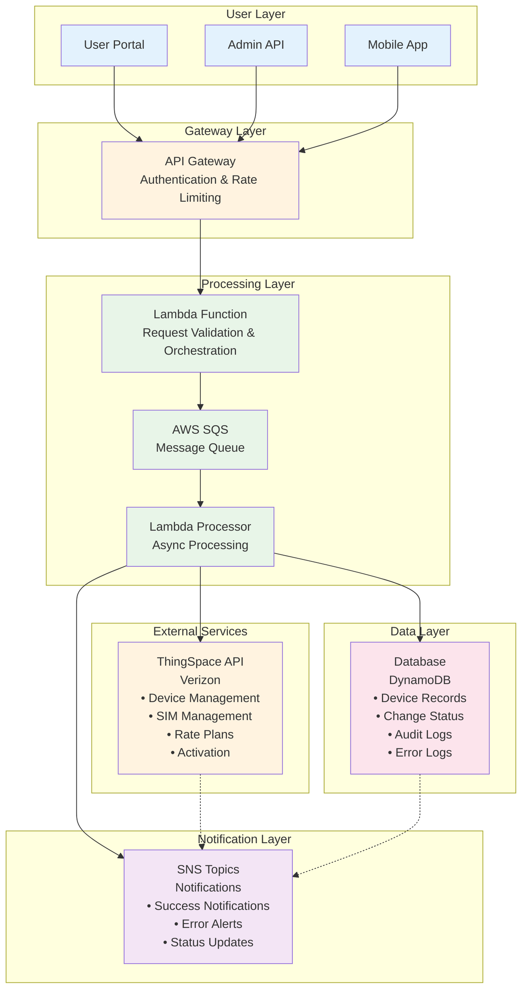

# Change ICCID/IMEI Change Type for Verizon ThingSpace IoT

## 1. Overview

### What is ICCID/IMEI Change Type?

**ICCID (Integrated Circuit Card Identifier)** and **IMEI (International Mobile Equipment Identity)** changes are critical operations in IoT device management that enable swapping SIM cards between devices or replacing physical device hardware while maintaining service continuity. These operations facilitate device lifecycle management including replacements, upgrades, and transfers across IoT fleets.

### Why is it Important?

ICCID/IMEI changes are essential for maintaining business continuity when IoT devices fail, need upgrading, or require redistribution across fleets, ensuring uninterrupted service and optimal resource allocation. This capability also supports regulatory compliance for device tracking and enables cost optimization through efficient rate plan assignments and fleet management.

### How Does it Work?

The process leverages **Verizon ThingSpace API** with **asynchronous callback handling** through AWS services to authenticate, validate device compatibility, and queue change requests for bulk processing via Lambda functions. The system processes changes device-by-device, tracks status in real-time, handles errors gracefully, and maintains comprehensive audit trails for compliance and troubleshooting.

## 2. Complete Process Flow for Change ICCID/IMEI Change Type

```
User Interface → Rate Plan Selection → Device Selection → Plan Validation → Bulk Change Creation → Queue Processing (SQS) → Background Lambda Processing → Authentication & Authorization → Device-by-Device Processing → Database Operations → Status Tracking → Error Handling → Completion Processing → Audit Trail Creation → Rate Plan Activation Complete
```

### Detailed Step-by-Step Flow

#### 1. **User Interface**
- **Purpose**: Entry point for initiating ICCID/IMEI change requests
- **Actions**: User accesses web portal, mobile app, or admin API interface
- **Inputs**: User credentials, change request parameters, device identifiers
- **Outputs**: Authenticated session, initial request data capture
- **Duration**: 1-2 minutes

#### 2. **Rate Plan Selection**
- **Purpose**: Choose appropriate data plans for target devices
- **Actions**: Display available rate plans, validate plan eligibility, capture plan selection
- **Inputs**: Device types, usage requirements, business rules
- **Outputs**: Selected rate plan configuration, pricing validation
- **Duration**: 2-3 minutes

#### 3. **Device Selection**
- **Purpose**: Identify and select target devices for ICCID/IMEI changes
- **Actions**: Device lookup, bulk selection, compatibility check
- **Inputs**: Device identifiers (IMEI/ICCID), search criteria, selection parameters
- **Outputs**: Validated device list, change type specification
- **Duration**: 2-5 minutes

#### 4. **Plan Validation**
- **Purpose**: Verify rate plan compatibility and business rule compliance
- **Actions**: Compatibility matrix check, regulatory validation, cost calculation
- **Inputs**: Selected devices, chosen rate plans, business constraints
- **Outputs**: Validation results, compatibility confirmation, cost estimation
- **Duration**: 1-2 minutes

#### 5. **Bulk Change Creation**
- **Purpose**: Generate batch processing requests for efficient handling
- **Actions**: Create change request batches, assign unique IDs, optimize processing order
- **Inputs**: Validated device-plan combinations, change specifications
- **Outputs**: Structured batch requests, processing priorities, request tracking IDs
- **Duration**: 30 seconds - 1 minute

#### 6. **Queue Processing (SQS)**
- **Purpose**: Queue requests for asynchronous processing with reliability
- **Actions**: Message creation, queue assignment, priority handling, dead letter queue setup
- **Inputs**: Batch change requests, processing parameters, retry configurations
- **Outputs**: Queued messages, processing tokens, queue acknowledgments
- **Duration**: 10-30 seconds

#### 7. **Background Lambda Processing**
- **Purpose**: Initialize serverless processing environment for async operations
- **Actions**: Lambda function invocation, environment setup, resource allocation
- **Inputs**: SQS messages, processing configurations, environment variables
- **Outputs**: Active processing instances, resource reservations, processing contexts
- **Duration**: 30 seconds - 1 minute

#### 8. **Authentication & Authorization**
- **Purpose**: Establish secure connections with Verizon ThingSpace API
- **Actions**: OAuth 2.0 token acquisition, API endpoint validation, rate limit setup
- **Inputs**: API credentials, service endpoints, authentication parameters
- **Outputs**: Valid access tokens, authenticated sessions, API connection handles
- **Duration**: 30 seconds - 1 minute

#### 9. **Device-by-Device Processing**
- **Purpose**: Execute individual ICCID/IMEI changes through ThingSpace API
- **Actions**: Device status retrieval, change execution, response handling
- **Inputs**: Device identifiers, change specifications, API connections
- **Outputs**: Change results, device status updates, API response codes
- **Duration**: 2-5 minutes per device

#### 10. **Database Operations**
- **Purpose**: Persist all changes and maintain data consistency
- **Actions**: Record updates, status persistence, transaction management
- **Inputs**: Change results, device status, audit information
- **Outputs**: Updated database records, transaction confirmations, data integrity validation
- **Duration**: 30 seconds - 1 minute per device

#### 11. **Status Tracking**
- **Purpose**: Monitor progress and provide real-time updates
- **Actions**: Progress calculation, status broadcasting, milestone tracking
- **Inputs**: Processing results, completion metrics, error counts
- **Outputs**: Status updates, progress reports, real-time dashboards
- **Duration**: Continuous throughout process

#### 12. **Error Handling**
- **Purpose**: Manage failures gracefully with retry mechanisms
- **Actions**: Error detection, categorization, retry logic, escalation procedures
- **Inputs**: API errors, validation failures, system exceptions
- **Outputs**: Error logs, retry attempts, escalation alerts, recovery actions
- **Duration**: Variable based on error complexity

#### 13. **Completion Processing**
- **Purpose**: Finalize successful changes and prepare final status
- **Actions**: Success validation, final status compilation, resource cleanup
- **Inputs**: All processing results, completion criteria, cleanup parameters
- **Outputs**: Final success/failure status, completion metrics, resource deallocation
- **Duration**: 1-2 minutes

#### 14. **Audit Trail Creation**
- **Purpose**: Generate comprehensive audit logs for compliance
- **Actions**: Audit log compilation, compliance data formatting, archival preparation
- **Inputs**: All transaction data, user actions, system events
- **Outputs**: Formatted audit trails, compliance reports, archived logs
- **Duration**: 1-2 minutes

#### 15. **Rate Plan Activation Complete**
- **Purpose**: Confirm final activation and service readiness
- **Actions**: Service activation verification, connectivity testing, final notifications
- **Inputs**: Activation results, service status, notification parameters
- **Outputs**: Activation confirmations, service readiness status, completion notifications
- **Duration**: 2-3 minutes

### **Total Process Duration**: 15-30 minutes (depending on batch size and complexity)
### **Success Criteria**: All devices successfully updated with new ICCID/IMEI assignments and active rate plans

## 3. Data Flow Diagram

### Visual Architecture Flow



### Component Interaction Flow

```ascii
┌─────────────────┐    ┌─────────────────┐    ┌─────────────────┐
│   User Portal   │    │   Admin API     │    │  Mobile App     │
└─────────┬───────┘    └─────────┬───────┘    └─────────┬───────┘
          │                      │                      │
          └──────────────────────┼──────────────────────┘
                                 │
                    ┌────────────▼────────────┐
                    │    API Gateway          │
                    │  (Authentication &      │
                    │   Rate Limiting)        │
                    └────────────┬────────────┘
                                 │
                    ┌────────────▼────────────┐
                    │   Lambda Function       │
                    │  (Request Validation    │
                    │   & Orchestration)      │
                    └────────────┬────────────┘
                                 │
                    ┌────────────▼────────────┐
                    │      AWS SQS            │
                    │   (Message Queue)       │
                    └────────────┬────────────┘
                                 │
                    ┌────────────▼────────────┐
                    │   Lambda Processor      │
                    │  (Async Processing)     │
                    └─────────┬──┬────────────┘
                              │  │
              ┌───────────────┘  └───────────────┐
              │                                  │
    ┌─────────▼─────────┐              ┌────────▼────────┐
    │  ThingSpace API   │              │   Database      │
    │   (Verizon)       │              │   (DynamoDB)    │
    │                   │              │                 │
    │ • Device Mgmt     │              │ • Device Records│
    │ • SIM Management  │              │ • Change Status │
    │ • Rate Plans      │              │ • Audit Logs   │
    │ • Activation      │              │ • Error Logs   │
    └─────────┬─────────┘              └────────┬────────┘
              │                                  │
              └──────────────┬───────────────────┘
                             │
                ┌────────────▼────────────┐
                │     SNS Topics          │
                │   (Notifications)       │
                │                         │
                │ • Success Notifications │
                │ • Error Alerts          │
                │ • Status Updates        │
                └─────────────────────────┘
```

### Data Processing Pipeline

1. **Input Sources**: Multiple user interfaces feed requests into the system
2. **Gateway Processing**: API Gateway handles authentication, rate limiting, and routing
3. **Request Orchestration**: Lambda function validates and prepares requests for processing
4. **Queue Management**: SQS ensures reliable, scalable message processing
5. **Async Processing**: Background Lambda processors handle ThingSpace API interactions
6. **Data Persistence**: All changes and status updates stored in DynamoDB
7. **Notification Distribution**: SNS distributes status updates and alerts to stakeholders

## 4. Process Flow Phases

### Phase 1: Initiation & Validation (0-5 minutes)

**Objectives:**
- Capture user requirements
- Validate input data
- Prepare for processing

**Activities:**
1. **User Input Collection**
   - Device identifiers (current IMEI/ICCID)
   - Target identifiers (new IMEI/ICCID)
   - Rate plan selections
   - Change type specification

2. **Input Validation**
   - Format validation (IMEI/ICCID format)
   - Existence validation (device/SIM exists)
   - Compatibility validation (device-plan compatibility)
   - Business rule validation

3. **Pre-processing**
   - Generate unique change request ID
   - Create audit trail entry
   - Prepare batch processing payload

**Success Criteria:**
- All validations pass
- Change request queued successfully
- Initial audit trail created

### Phase 2: Queue Management & Authentication (5-10 minutes)

**Objectives:**
- Queue requests for async processing
- Establish secure connections
- Prepare processing environment

**Activities:**
1. **Queue Processing**
   - SQS message creation
   - Priority assignment
   - Batch grouping optimization

2. **Authentication Setup**
   - ThingSpace OAuth 2.0 token acquisition
   - Token refresh mechanism setup
   - API rate limit management

3. **Processing Preparation**
   - Lambda function warm-up
   - Database connection pooling
   - Error handling setup

**Success Criteria:**
- Messages queued successfully
- Authentication tokens acquired
- Processing environment ready

### Phase 3: Core Processing (10-30 minutes)

**Objectives:**
- Execute ICCID/IMEI changes
- Handle individual device processing
- Manage API interactions

**Activities:**
1. **Device-by-Device Processing**
   - Retrieve current device status
   - Validate change feasibility
   - Execute change through ThingSpace API

2. **API Interactions**
   - Device suspension (if required)
   - ICCID/IMEI update
   - Rate plan assignment
   - Device reactivation

3. **Real-time Monitoring**
   - Status tracking updates
   - Progress reporting
   - Error detection and handling

**Success Criteria:**
- Device changes executed successfully
- API responses processed correctly
- Status accurately tracked

### Phase 4: Data Persistence & Error Handling (30-40 minutes)

**Objectives:**
- Persist all changes to database
- Handle errors gracefully
- Maintain data consistency

**Activities:**
1. **Database Operations**
   - Update device records
   - Store change history
   - Update status tables

2. **Error Handling**
   - Retry failed operations
   - Log detailed error information
   - Trigger manual review for complex errors

3. **Data Consistency**
   - Validate data integrity
   - Reconcile with ThingSpace
   - Ensure referential integrity

**Success Criteria:**
- All data persisted correctly
- Errors handled appropriately
- Data consistency maintained

### Phase 5: Completion & Notification (40-45 minutes)

**Objectives:**
- Finalize all operations
- Send notifications
- Complete audit trail

**Activities:**
1. **Final Validation**
   - Verify all changes completed
   - Confirm device connectivity
   - Validate rate plan activation

2. **Notification Processing**
   - Send success notifications
   - Alert on any failures
   - Update stakeholders

3. **Audit Completion**
   - Finalize audit trail
   - Generate completion reports
   - Archive processing logs

**Success Criteria:**
- All operations completed successfully
- Notifications sent
- Complete audit trail available

## 5. Technical Architecture

### AWS Services Used
- **API Gateway**: Request routing and authentication
- **Lambda Functions**: Serverless processing
- **SQS**: Message queuing for async processing
- **DynamoDB**: Device and status data storage
- **SNS**: Notification services
- **CloudWatch**: Logging and monitoring

### Security Considerations
- OAuth 2.0 for ThingSpace authentication
- API Gateway security policies
- Encrypted data transmission
- Audit logging for compliance
- Role-based access controls

### Scalability Features
- Auto-scaling Lambda functions
- SQS for handling burst loads
- Database connection pooling
- Efficient batch processing
- Rate limiting and throttling

### Error Recovery
- Automatic retry mechanisms
- Dead letter queues for failed messages
- Manual intervention workflows
- Comprehensive error logging
- Rollback capabilities where applicable

## 6. Monitoring & Observability

### Key Metrics
- Processing time per change
- Success/failure rates
- API response times
- Queue depth and processing lag
- Error categories and frequencies

### Alerting
- Processing failures
- API timeouts
- Queue backlog alerts
- Authentication failures
- Data consistency issues

### Reporting
- Daily processing summaries
- Device change audit reports
- Performance analytics
- Cost optimization reports
- Compliance audit trails