# Change ICCID/IMEI Change Type for Verizon ThingSpace IoT

## 1. Overview

### What is ICCID/IMEI Change Type?

**ICCID (Integrated Circuit Card Identifier)** and **IMEI (International Mobile Equipment Identity)** changes are critical operations in IoT device management that enable swapping SIM cards between devices or replacing physical device hardware while maintaining service continuity. These operations facilitate device lifecycle management including replacements, upgrades, and transfers across IoT fleets.

### Why is it Important?

ICCID/IMEI changes are essential for maintaining business continuity when IoT devices fail, need upgrading, or require redistribution across fleets, ensuring uninterrupted service and optimal resource allocation. This capability also supports regulatory compliance for device tracking and enables cost optimization through efficient rate plan assignments and fleet management.

### How Does it Work?

The process leverages **Verizon ThingSpace API** with **asynchronous callback handling** through AWS services to authenticate, validate device compatibility, and queue change requests for bulk processing via Lambda functions. The system processes changes device-by-device, tracks status in real-time, handles errors gracefully, and maintains comprehensive audit trails for compliance and troubleshooting.

## 2. Complete Process Flow for Change ICCID/IMEI Change Type

### Linear Flow with Arrows
```
User Interface → Rate Plan Selection → Device Selection → Plan Validation → Bulk Change Creation → Queue Processing (SQS) → Background Lambda Processing → Authentication & Authorization → Device-by-Device Processing → Database Operations → Status Tracking → Error Handling → Completion Processing → Audit Trail Creation → Rate Plan Activation Complete
```

### Detailed Visual Flow with Arrows

```
┌─────────────────────┐
│   User Interface    │ ──┐ (Initiate ICCID/IMEI Change Request)
│  (ICCID/IMEI Swap)  │   │
└─────────────────────┘   │
                          ▼
┌─────────────────────┐   
│  Rate Plan Selection│ ──┐ (Select Compatible Plans for New ICCID/IMEI)
│ (New Device/SIM Plans)│  │
└─────────────────────┘   │
                          ▼
┌─────────────────────┐   
│   Device Selection  │ ──┐ (Validate Old & New ICCID/IMEI Pairs)
│(Old→New ICCID/IMEI) │   │
└─────────────────────┘   │
                          ▼
┌─────────────────────┐   
│   Plan Validation   │ ──┐ (Verify ICCID/IMEI-Plan Compatibility)
│(ICCID/IMEI-Plan Check)│  │
└─────────────────────┘   │
                          ▼
┌─────────────────────┐   
│ Bulk Change Creation│ ──┐ (Create ICCID/IMEI Swap Batches)
│(ICCID/IMEI Batches) │   │
└─────────────────────┘   │
                          ▼
┌─────────────────────┐   
│Queue Processing(SQS)│ ──┐ (Queue ICCID/IMEI Change Messages)
│(ICCID/IMEI Messages)│   │
└─────────────────────┘   │
                          ▼
┌─────────────────────┐   
│Background Lambda    │ ──┐ (Initialize ICCID/IMEI Processors)
│Processing(ICCID/IMEI)│   │
└─────────────────────┘   │
                          ▼
┌─────────────────────┐   
│Authentication &     │ ──┐ (ThingSpace API Auth for ICCID/IMEI Ops)
│Authorization        │   │
└─────────────────────┘   │
                          ▼
┌─────────────────────┐   
│Device-by-Device     │ ──┐ (Execute ICCID/IMEI Swaps via API)
│Processing           │   │
└─────────────────────┘   │
                          ▼
┌─────────────────────┐   
│Database Operations  │ ──┐ (Update ICCID/IMEI Inventory)
│(ICCID/IMEI Records) │   │
└─────────────────────┘   │
                          ▼
┌─────────────────────┐   
│   Status Tracking   │ ──┐ (Monitor ICCID/IMEI Change Progress)
│(ICCID/IMEI Progress)│   │
└─────────────────────┘   │
                          ▼
┌─────────────────────┐   
│   Error Handling    │ ──┐ (Handle ICCID/IMEI Change Failures)
│(ICCID/IMEI Errors)  │   │
└─────────────────────┘   │
                          ▼
┌─────────────────────┐   
│Completion Processing│ ──┐ (Finalize ICCID/IMEI Changes)
│(ICCID/IMEI Complete)│   │
└─────────────────────┘   │
                          ▼
┌─────────────────────┐   
│Audit Trail Creation │ ──┐ (Log All ICCID/IMEI Changes)
│(ICCID/IMEI Audit)   │   │
└─────────────────────┘   │
                          ▼
┌─────────────────────┐   
│Rate Plan Activation │   
│Complete             │   
│(New ICCID/IMEI Live)│   
└─────────────────────┘   
```

### Comprehensive Flow with Process Arrows

```
    ┌─────────────────────────────────────────────────────────────────┐
    │                    ICCID/IMEI CHANGE PROCESS                    │
    └─────────────────────────────────────────────────────────────────┘
                                      │
                                      ▼
    ┌─────────────────┐    User Input    ┌─────────────────┐
    │ Current ICCID   │ ──────────────► │   Target ICCID  │
    │ Current IMEI    │                 │   Target IMEI   │
    └─────────────────┘                 └─────────────────┘
                                      │
                                      ▼
    ┌─────────────────────────────────────────────────────────────────┐
    │                    USER INTERFACE                               │
    │            (ICCID/IMEI Change Request Portal)                   │
    └─────────────────────────────────────────────────────────────────┘
                                      │
                                      ▼
    ┌─────────────────────────────────────────────────────────────────┐
    │                 RATE PLAN SELECTION                             │
    │          (Compatible Plans for New ICCID/IMEI)                  │
    └─────────────────────────────────────────────────────────────────┘
                                      │
                                      ▼
    ┌─────────────────────────────────────────────────────────────────┐
    │                  DEVICE SELECTION                               │
    │        (Validate Old & New ICCID/IMEI Mappings)                 │
    └─────────────────────────────────────────────────────────────────┘
                                      │
                                      ▼
    ┌─────────────────────────────────────────────────────────────────┐
    │                  PLAN VALIDATION                                │
    │        (ICCID/IMEI-Plan Compatibility Check)                    │
    └─────────────────────────────────────────────────────────────────┘
                                      │
                                      ▼
    ┌─────────────────────────────────────────────────────────────────┐
    │               BULK CHANGE CREATION                              │
    │          (Create ICCID/IMEI Swap Batches)                       │
    └─────────────────────────────────────────────────────────────────┘
                                      │
                                      ▼
    ┌─────────────────────────────────────────────────────────────────┐
    │              QUEUE PROCESSING (SQS)                            │
    │        (Queue Individual ICCID/IMEI Changes)                    │
    └─────────────────────────────────────────────────────────────────┘
                                      │
                                      ▼
    ┌─────────────────────────────────────────────────────────────────┐
    │           BACKGROUND LAMBDA PROCESSING                         │
    │        (Initialize ICCID/IMEI Change Handlers)                  │
    └─────────────────────────────────────────────────────────────────┘
                                      │
                                      ▼
    ┌─────────────────────────────────────────────────────────────────┐
    │           AUTHENTICATION & AUTHORIZATION                       │
    │        (ThingSpace API Auth for ICCID/IMEI Ops)                 │
    └─────────────────────────────────────────────────────────────────┘
                                      │
                                      ▼
    ┌─────────────────────────────────────────────────────────────────┐
    │           DEVICE-BY-DEVICE PROCESSING                          │
    │        (Execute ICCID/IMEI Swaps via ThingSpace)                │
    └─────────────────────────────────────────────────────────────────┘
                     │                              │
                     ▼                              ▼
    ┌─────────────────────────┐         ┌─────────────────────────┐
    │   DATABASE OPERATIONS   │         │    STATUS TRACKING      │
    │ (Update ICCID/IMEI      │◄────────┤   (Monitor Progress)    │
    │    Inventory)           │         │                         │
    └─────────────────────────┘         └─────────────────────────┘
                     │                              │
                     ▼                              ▼
    ┌─────────────────────────────────────────────────────────────────┐
    │                   ERROR HANDLING                                │
    │        (Handle ICCID/IMEI Change Failures)                      │
    └─────────────────────────────────────────────────────────────────┘
                                      │
                                      ▼
    ┌─────────────────────────────────────────────────────────────────┐
    │               COMPLETION PROCESSING                             │
    │        (Finalize All ICCID/IMEI Changes)                        │
    └─────────────────────────────────────────────────────────────────┘
                                      │
                                      ▼
    ┌─────────────────────────────────────────────────────────────────┐
    │               AUDIT TRAIL CREATION                              │
    │        (Log All ICCID/IMEI Change History)                      │
    └─────────────────────────────────────────────────────────────────┘
                                      │
                                      ▼
    ┌─────────────────────────────────────────────────────────────────┐
    │            RATE PLAN ACTIVATION COMPLETE                       │
    │        (New ICCID/IMEI Combinations Active)                     │
    └─────────────────────────────────────────────────────────────────┘
                                      │
                                      ▼
    ┌─────────────────┐              ┌─────────────────┐
    │   New ICCID     │              │   New IMEI      │
    │   Active &      │              │   Active &      │
    │   Connected     │              │   Validated     │
    └─────────────────┘              └─────────────────┘
```

### Detailed Step-by-Step Flow (Change ICCID/IMEI Perspective)

#### 1. **User Interface**
- **ICCID/IMEI Focus**: Portal to initiate SIM card swap or device replacement requests
- **Actions**: User specifies old ICCID/IMEI to new ICCID/IMEI mappings, selects change type (SIM swap vs device replacement)
- **Inputs**: Current ICCID/IMEI identifiers, target ICCID/IMEI identifiers, change reason, user credentials
- **Outputs**: ICCID/IMEI change request form, change type validation, initial compatibility check
- **Duration**: 1-2 minutes

#### 2. **Rate Plan Selection**
- **ICCID/IMEI Focus**: Choose rate plans compatible with new SIM cards or replacement devices
- **Actions**: Display plans compatible with target ICCID/IMEI, validate plan eligibility for new hardware/SIM
- **Inputs**: Target device IMEI capabilities, new SIM card ICCID specifications, existing plan features
- **Outputs**: Compatible rate plan list for new ICCID/IMEI, plan feature comparison, pricing for new assignments
- **Duration**: 2-3 minutes

#### 3. **Device Selection**
- **ICCID/IMEI Focus**: Validate current devices and confirm new ICCID/IMEI targets for assignment
- **Actions**: Verify current ICCID/IMEI exists in system, validate new ICCID/IMEI availability, check device-SIM compatibility
- **Inputs**: Existing ICCID/IMEI records, new ICCID/IMEI identifiers, device compatibility matrix
- **Outputs**: Validated ICCID/IMEI pairs (old to new), compatibility confirmation, change feasibility assessment
- **Duration**: 2-5 minutes

#### 4. **Plan Validation**
- **ICCID/IMEI Focus**: Ensure selected rate plans work with new ICCID/IMEI combinations
- **Actions**: Cross-reference new IMEI device capabilities with plan features, validate ICCID carrier compatibility
- **Inputs**: New IMEI device specifications, ICCID carrier restrictions, selected rate plan requirements
- **Outputs**: ICCID/IMEI-plan compatibility matrix, feature limitation warnings, cost impact analysis
- **Duration**: 1-2 minutes

#### 5. **Bulk Change Creation**
- **ICCID/IMEI Focus**: Create batch requests for multiple ICCID/IMEI swap operations
- **Actions**: Group ICCID/IMEI changes by device type and carrier, create sequential change orders, assign change priorities
- **Inputs**: Validated ICCID/IMEI change pairs, rate plan assignments, processing preferences
- **Outputs**: Structured ICCID/IMEI change batches, processing sequence, unique change request IDs
- **Duration**: 30 seconds - 1 minute

#### 6. **Queue Processing (SQS)**
- **ICCID/IMEI Focus**: Queue individual ICCID/IMEI change messages for async processing
- **Actions**: Create SQS messages for each ICCID/IMEI swap, set retry policies for failed changes, establish dead letter queues
- **Inputs**: ICCID/IMEI change requests, processing parameters, retry configurations
- **Outputs**: Queued ICCID/IMEI change messages, processing tokens, queue acknowledgments
- **Duration**: 10-30 seconds

#### 7. **Background Lambda Processing**
- **ICCID/IMEI Focus**: Initialize Lambda functions specifically for ICCID/IMEI change operations
- **Actions**: Invoke ICCID/IMEI change handlers, load device-specific processing logic, prepare ThingSpace API clients
- **Inputs**: ICCID/IMEI change messages, device type configurations, API endpoint mappings
- **Outputs**: Active ICCID/IMEI processing instances, initialized API clients, processing contexts
- **Duration**: 30 seconds - 1 minute

#### 8. **Authentication & Authorization**
- **ICCID/IMEI Focus**: Authenticate for ThingSpace device management and SIM management APIs
- **Actions**: Acquire OAuth tokens for device IMEI updates and SIM ICCID operations, validate API permissions
- **Inputs**: ThingSpace API credentials, device management scopes, SIM management permissions
- **Outputs**: Authenticated ThingSpace sessions for ICCID/IMEI operations, API rate limit allocations
- **Duration**: 30 seconds - 1 minute

#### 9. **Device-by-Device Processing**
- **ICCID/IMEI Focus**: Execute actual ICCID/IMEI swaps through ThingSpace API calls
- **Actions**: Suspend old ICCID/IMEI, update device record with new IMEI, assign new ICCID to device, activate new configuration
- **Inputs**: Old/new ICCID/IMEI pairs, device suspension commands, assignment API calls
- **Outputs**: ICCID/IMEI swap results, new device-SIM associations, activation status
- **Duration**: 2-5 minutes per device

#### 10. **Database Operations**
- **ICCID/IMEI Focus**: Update device inventory with new ICCID/IMEI assignments
- **Actions**: Record ICCID/IMEI change history, update device-SIM mappings, store old ICCID/IMEI as historical records
- **Inputs**: ICCID/IMEI change results, device association updates, historical tracking data
- **Outputs**: Updated device-SIM inventory, ICCID/IMEI change history, data consistency validation
- **Duration**: 30 seconds - 1 minute per device

#### 11. **Status Tracking**
- **ICCID/IMEI Focus**: Monitor ICCID/IMEI change progress and success rates
- **Actions**: Track successful ICCID/IMEI swaps, monitor failed changes, update change status dashboards
- **Inputs**: Individual ICCID/IMEI change results, progress metrics, error classifications
- **Outputs**: ICCID/IMEI change status updates, progress dashboards, success/failure statistics
- **Duration**: Continuous throughout process

#### 12. **Error Handling**
- **ICCID/IMEI Focus**: Handle ICCID/IMEI change failures and conflicts
- **Actions**: Detect ICCID conflicts, handle IMEI validation errors, retry failed swaps, escalate complex ICCID/IMEI issues
- **Inputs**: ThingSpace API errors, ICCID/IMEI validation failures, device compatibility issues
- **Outputs**: Error categorization, retry attempts for failed ICCID/IMEI changes, escalation alerts
- **Duration**: Variable based on ICCID/IMEI error complexity

#### 13. **Completion Processing**
- **ICCID/IMEI Focus**: Finalize successful ICCID/IMEI changes and prepare activation
- **Actions**: Verify all ICCID/IMEI swaps completed, validate new device-SIM associations, prepare for service activation
- **Inputs**: All ICCID/IMEI change results, device-SIM validation checks, activation readiness criteria
- **Outputs**: Completed ICCID/IMEI change summary, device readiness status, activation preparation
- **Duration**: 1-2 minutes

#### 14. **Audit Trail Creation**
- **ICCID/IMEI Focus**: Create comprehensive logs of all ICCID/IMEI changes for compliance
- **Actions**: Log all ICCID/IMEI swaps, record old-to-new mappings, create regulatory compliance reports
- **Inputs**: Complete ICCID/IMEI change history, user actions, system events, compliance requirements
- **Outputs**: ICCID/IMEI change audit trails, regulatory reports, archived change records
- **Duration**: 1-2 minutes

#### 15. **Rate Plan Activation Complete**
- **ICCID/IMEI Focus**: Activate services on new ICCID/IMEI combinations and confirm connectivity
- **Actions**: Activate rate plans on new ICCID, test connectivity with new IMEI, confirm service provisioning
- **Inputs**: New ICCID/IMEI-plan assignments, activation commands, connectivity test parameters
- **Outputs**: Service activation confirmations, connectivity test results, new ICCID/IMEI service status
- **Duration**: 2-3 minutes

### **Total Process Duration**: 15-30 minutes (depending on batch size and complexity)
### **Success Criteria**: All devices successfully updated with new ICCID/IMEI assignments and active rate plans

## 3. Data Flow Diagram

### Data Flow Diagram for Change ICCID/IMEI Change Type

```mermaid
graph TD
    A[M2M Portal User Interface<br/>ICCID/IMEI Change Request] --> B[Submit ICCID/IMEI Change Request]
    B --> C[Validate ICCID/IMEI Configuration]
    C --> D{ICCID/IMEI Valid?}
    
    D -->|No| E[Display ICCID/IMEI Validation Error]
    D -->|Yes| F[Insert into DeviceBulkChange Table<br/>ICCID/IMEI Change Type]
    
    F --> G[Insert into M2M_DeviceChange Table<br/>Old ICCID/IMEI → New ICCID/IMEI]
    G --> H[Queue ICCID/IMEI Message to SQS]
    H --> I[AltaworxDeviceBulkChange Lambda<br/>ICCID/IMEI Processor]
    
    I --> J[Read from DeviceBulkChange Table<br/>ICCID/IMEI Batch Data]
    J --> K[Read from M2M_DeviceChange Table<br/>ICCID/IMEI Mappings]
    K --> L[Execute usp_ThingSpace_Get_AuthenticationByProviderId<br/>ICCID/IMEI Operations Auth]
    L --> M{Valid Credentials for<br/>ICCID/IMEI Management?}
    
    M -->|No| N[Insert into M2MDeviceBulkChangeLog<br/>ICCID/IMEI Authentication Failed]
    M -->|Yes| O{Write Operations Enabled<br/>for ICCID/IMEI Changes?}
    
    O -->|No| P[Insert into M2MDeviceBulkChangeLog<br/>ICCID/IMEI Writes Disabled]
    O -->|Yes| Q[Process Device ICCID/IMEI Changes]
    
    Q --> R[Query Device Table for Current<br/>ICCID/IMEI Data]
    R --> S[Prepare ThingSpace API Request<br/>ICCID/IMEI Swap Operations]
    S --> T[Send ICCID/IMEI Change Request<br/>to Verizon ThingSpace API]
    
    T --> U[Receive ICCID/IMEI API Response]
    U --> V{ICCID/IMEI API Call<br/>Successful?}
    
    V -->|No| W[Insert into M2MDeviceBulkChangeLog<br/>ICCID/IMEI API Error]
    V -->|Yes| X[Update ThingSpaceDevice Table<br/>New ICCID/IMEI Associations]
    
    X --> Y[Update Device Table<br/>New ICCID/IMEI Records]
    Y --> Z{ICCID/IMEI Database<br/>Update Successful?}
    
    Z -->|No| AA[Insert into M2MDeviceBulkChangeLog<br/>ICCID/IMEI DB Error]
    Z -->|Yes| BB[Update M2M_DeviceChange Status<br/>ICCID/IMEI Change Complete]
    
    W --> CC[Mark ICCID/IMEI Change as FAILED]
    AA --> CC
    BB --> DD[Insert into M2MDeviceBulkChangeLog<br/>ICCID/IMEI Change Success]
    CC --> EE[Insert into M2MDeviceBulkChangeLog<br/>ICCID/IMEI Change Error]
    
    DD --> FF{More ICCID/IMEI<br/>Devices to Process?}
    EE --> FF
    FF -->|Yes| Q
    FF -->|No| GG[Update DeviceBulkChange Status<br/>ICCID/IMEI Batch Complete]
    
    GG --> HH[Send Email Notification<br/>ICCID/IMEI Change Results]
    HH --> II[ICCID/IMEI Change Process Complete]

    style A fill:#E3F2FD
    style B fill:#E3F2FD
    style C fill:#FFF3E0
    style F fill:#E8F5E8
    style G fill:#E8F5E8
    style H fill:#E8F5E8
    style I fill:#E8F5E8
    style Q fill:#FCE4EC
    style R fill:#FCE4EC
    style S fill:#FCE4EC
    style T fill:#FFF3E0
    style X fill:#FCE4EC
    style Y fill:#FCE4EC
    style DD fill:#C8E6C9
    style II fill:#C8E6C9
```



### ICCID/IMEI-Specific Data Flow Elements

**Key ICCID/IMEI Operations in the Flow:**

1. **A → B**: User submits ICCID/IMEI change request with old and new identifiers
2. **C → D**: Validate ICCID format, IMEI format, and availability
3. **F → G**: Store ICCID/IMEI change mappings (Old ICCID/IMEI → New ICCID/IMEI)
4. **Q → R**: Query current device ICCID/IMEI associations
5. **S → T**: Prepare and send ICCID/IMEI swap API calls to ThingSpace
6. **X → Y**: Update device records with new ICCID/IMEI assignments
7. **DD**: Log successful ICCID/IMEI changes with complete audit trail

**Database Tables Involved:**
- **DeviceBulkChange**: Batch ICCID/IMEI change requests
- **M2M_DeviceChange**: Individual ICCID/IMEI mappings (old → new)
- **Device**: Current ICCID/IMEI assignments and device records
- **ThingSpaceDevice**: ThingSpace-specific ICCID/IMEI associations
- **M2MDeviceBulkChangeLog**: Complete audit trail of ICCID/IMEI changes

**ThingSpace API Operations:**
- **Device Suspension**: Suspend old ICCID/IMEI before change
- **ICCID Assignment**: Assign new ICCID to device
- **IMEI Update**: Update device IMEI registration
- **Service Activation**: Activate services on new ICCID/IMEI

### Component Interaction Flow

```ascii
┌─────────────────┐    ┌─────────────────┐    ┌─────────────────┐
│   User Portal   │    │   Admin API     │    │  Mobile App     │
└─────────┬───────┘    └─────────┬───────┘    └─────────┬───────┘
          │                      │                      │
          └──────────────────────┼──────────────────────┘
                                 │
                    ┌────────────▼────────────┐
                    │    API Gateway          │
                    │  (Authentication &      │
                    │   Rate Limiting)        │
                    └────────────┬────────────┘
                                 │
                    ┌────────────▼────────────┐
                    │   Lambda Function       │
                    │  (Request Validation    │
                    │   & Orchestration)      │
                    └────────────┬────────────┘
                                 │
                    ┌────────────▼────────────┐
                    │      AWS SQS            │
                    │   (Message Queue)       │
                    └────────────┬────────────┘
                                 │
                    ┌────────────▼────────────┐
                    │   Lambda Processor      │
                    │  (Async Processing)     │
                    └─────────┬──┬────────────┘
                              │  │
              ┌───────────────┘  └───────────────┐
              │                                  │
    ┌─────────▼─────────┐              ┌────────▼────────┐
    │  ThingSpace API   │              │   Database      │
    │   (Verizon)       │              │   (DynamoDB)    │
    │                   │              │                 │
    │ • Device Mgmt     │              │ • Device Records│
    │ • SIM Management  │              │ • Change Status │
    │ • Rate Plans      │              │ • Audit Logs   │
    │ • Activation      │              │ • Error Logs   │
    └─────────┬─────────┘              └────────┬────────┘
              │                                  │
              └──────────────┬───────────────────┘
                             │
                ┌────────────▼────────────┐
                │     SNS Topics          │
                │   (Notifications)       │
                │                         │
                │ • Success Notifications │
                │ • Error Alerts          │
                │ • Status Updates        │
                └─────────────────────────┘
```

### Data Processing Pipeline

1. **Input Sources**: Multiple user interfaces feed requests into the system
2. **Gateway Processing**: API Gateway handles authentication, rate limiting, and routing
3. **Request Orchestration**: Lambda function validates and prepares requests for processing
4. **Queue Management**: SQS ensures reliable, scalable message processing
5. **Async Processing**: Background Lambda processors handle ThingSpace API interactions
6. **Data Persistence**: All changes and status updates stored in DynamoDB
7. **Notification Distribution**: SNS distributes status updates and alerts to stakeholders

## 4. Process Flow Phases

### Phase 1: Initiation & Validation (0-5 minutes)

**Objectives:**
- Capture user requirements
- Validate input data
- Prepare for processing

**Activities:**
1. **User Input Collection**
   - Device identifiers (current IMEI/ICCID)
   - Target identifiers (new IMEI/ICCID)
   - Rate plan selections
   - Change type specification

2. **Input Validation**
   - Format validation (IMEI/ICCID format)
   - Existence validation (device/SIM exists)
   - Compatibility validation (device-plan compatibility)
   - Business rule validation

3. **Pre-processing**
   - Generate unique change request ID
   - Create audit trail entry
   - Prepare batch processing payload

**Success Criteria:**
- All validations pass
- Change request queued successfully
- Initial audit trail created

### Phase 2: Queue Management & Authentication (5-10 minutes)

**Objectives:**
- Queue requests for async processing
- Establish secure connections
- Prepare processing environment

**Activities:**
1. **Queue Processing**
   - SQS message creation
   - Priority assignment
   - Batch grouping optimization

2. **Authentication Setup**
   - ThingSpace OAuth 2.0 token acquisition
   - Token refresh mechanism setup
   - API rate limit management

3. **Processing Preparation**
   - Lambda function warm-up
   - Database connection pooling
   - Error handling setup

**Success Criteria:**
- Messages queued successfully
- Authentication tokens acquired
- Processing environment ready

### Phase 3: Core Processing (10-30 minutes)

**Objectives:**
- Execute ICCID/IMEI changes
- Handle individual device processing
- Manage API interactions

**Activities:**
1. **Device-by-Device Processing**
   - Retrieve current device status
   - Validate change feasibility
   - Execute change through ThingSpace API

2. **API Interactions**
   - Device suspension (if required)
   - ICCID/IMEI update
   - Rate plan assignment
   - Device reactivation

3. **Real-time Monitoring**
   - Status tracking updates
   - Progress reporting
   - Error detection and handling

**Success Criteria:**
- Device changes executed successfully
- API responses processed correctly
- Status accurately tracked

### Phase 4: Data Persistence & Error Handling (30-40 minutes)

**Objectives:**
- Persist all changes to database
- Handle errors gracefully
- Maintain data consistency

**Activities:**
1. **Database Operations**
   - Update device records
   - Store change history
   - Update status tables

2. **Error Handling**
   - Retry failed operations
   - Log detailed error information
   - Trigger manual review for complex errors

3. **Data Consistency**
   - Validate data integrity
   - Reconcile with ThingSpace
   - Ensure referential integrity

**Success Criteria:**
- All data persisted correctly
- Errors handled appropriately
- Data consistency maintained

### Phase 5: Completion & Notification (40-45 minutes)

**Objectives:**
- Finalize all operations
- Send notifications
- Complete audit trail

**Activities:**
1. **Final Validation**
   - Verify all changes completed
   - Confirm device connectivity
   - Validate rate plan activation

2. **Notification Processing**
   - Send success notifications
   - Alert on any failures
   - Update stakeholders

3. **Audit Completion**
   - Finalize audit trail
   - Generate completion reports
   - Archive processing logs

**Success Criteria:**
- All operations completed successfully
- Notifications sent
- Complete audit trail available

## 5. Technical Architecture

### AWS Services Used
- **API Gateway**: Request routing and authentication
- **Lambda Functions**: Serverless processing
- **SQS**: Message queuing for async processing
- **DynamoDB**: Device and status data storage
- **SNS**: Notification services
- **CloudWatch**: Logging and monitoring

### Security Considerations
- OAuth 2.0 for ThingSpace authentication
- API Gateway security policies
- Encrypted data transmission
- Audit logging for compliance
- Role-based access controls

### Scalability Features
- Auto-scaling Lambda functions
- SQS for handling burst loads
- Database connection pooling
- Efficient batch processing
- Rate limiting and throttling

### Error Recovery
- Automatic retry mechanisms
- Dead letter queues for failed messages
- Manual intervention workflows
- Comprehensive error logging
- Rollback capabilities where applicable

## 6. Monitoring & Observability

### Key Metrics
- Processing time per change
- Success/failure rates
- API response times
- Queue depth and processing lag
- Error categories and frequencies

### Alerting
- Processing failures
- API timeouts
- Queue backlog alerts
- Authentication failures
- Data consistency issues

### Reporting
- Daily processing summaries
- Device change audit reports
- Performance analytics
- Cost optimization reports
- Compliance audit trails