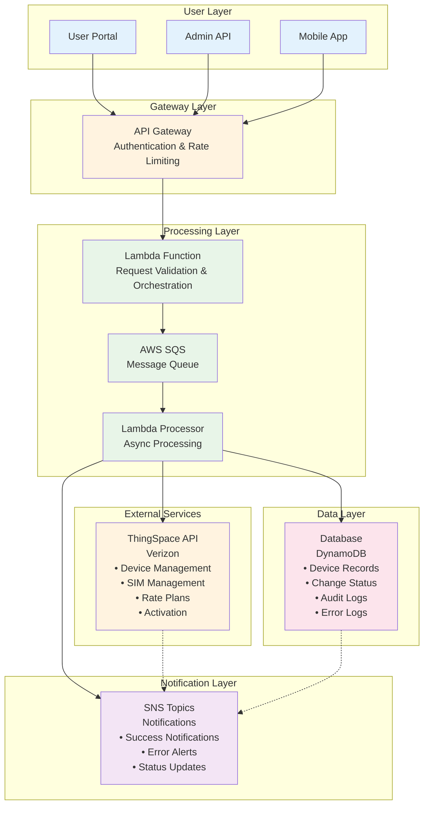

# Change ICCID/IMEI Change Type for Verizon ThingSpace IoT

## 1. Overview

### What is ICCID/IMEI Change Type?

**ICCID (Integrated Circuit Card Identifier)** and **IMEI (International Mobile Equipment Identity)** changes are critical operations in IoT device management that allow for:

- **SIM Card Swapping**: Replacing or reassigning SIM cards (ICCID) between devices
- **Device Hardware Swapping**: Changing the physical device (IMEI) while maintaining service continuity
- **Device Lifecycle Management**: Managing devices through replacement, upgrade, or transfer scenarios

### Why is it Important?

1. **Device Replacement**: When IoT devices fail or need upgrading
2. **SIM Card Management**: When SIM cards become defective or need to be reassigned
3. **Fleet Optimization**: Redistributing connectivity resources across device fleets
4. **Cost Management**: Optimizing rate plans and device assignments
5. **Compliance**: Meeting regulatory requirements for device tracking
6. **Business Continuity**: Ensuring uninterrupted service during hardware changes

### How Does it Work?

The process leverages **Verizon ThingSpace API** with **asynchronous callback handling** to:

1. **Authenticate** with ThingSpace using OAuth 2.0
2. **Validate** device and SIM compatibility
3. **Queue** change requests for bulk processing
4. **Process** changes asynchronously through AWS Lambda
5. **Track** status and handle errors gracefully
6. **Audit** all operations for compliance and troubleshooting

## 2. Complete Process Flow

```
User Interface 
    ↓
Rate Plan Selection 
    ↓
Device Selection 
    ↓
Plan Validation 
    ↓
Bulk Change Creation 
    ↓
Queue Processing (SQS) 
    ↓
Background Lambda Processing 
    ↓
Authentication & Authorization 
    ↓
Device-by-Device Processing 
    ↓
Database Operations 
    ↓
Status Tracking 
    ↓
Error Handling 
    ↓
Completion Processing 
    ↓
Audit Trail Creation 
    ↓
Rate Plan Activation Complete
```

### Detailed Flow Breakdown

#### Phase 1: User Interaction
- **User Interface**: Web portal or API interface for initiating changes
- **Rate Plan Selection**: Choose appropriate data plans for devices
- **Device Selection**: Select target devices for ICCID/IMEI changes

#### Phase 2: Validation & Preparation
- **Plan Validation**: Verify rate plan compatibility and availability
- **Bulk Change Creation**: Generate batch requests for processing
- **Queue Processing (SQS)**: Queue requests in AWS SQS for async processing

#### Phase 3: Background Processing
- **Background Lambda Processing**: AWS Lambda functions handle async processing
- **Authentication & Authorization**: OAuth 2.0 with ThingSpace API
- **Device-by-Device Processing**: Process each device change individually

#### Phase 4: Data Management
- **Database Operations**: Update device records, assignments, and status
- **Status Tracking**: Real-time status updates and progress monitoring
- **Error Handling**: Graceful error recovery and retry mechanisms

#### Phase 5: Completion & Audit
- **Completion Processing**: Finalize successful changes
- **Audit Trail Creation**: Create comprehensive audit logs
- **Rate Plan Activation Complete**: Confirm activation and service readiness

## 3. Data Flow Diagram

### Visual Architecture Flow



### Component Interaction Flow

```ascii
┌─────────────────┐    ┌─────────────────┐    ┌─────────────────┐
│   User Portal   │    │   Admin API     │    │  Mobile App     │
└─────────┬───────┘    └─────────┬───────┘    └─────────┬───────┘
          │                      │                      │
          └──────────────────────┼──────────────────────┘
                                 │
                    ┌────────────▼────────────┐
                    │    API Gateway          │
                    │  (Authentication &      │
                    │   Rate Limiting)        │
                    └────────────┬────────────┘
                                 │
                    ┌────────────▼────────────┐
                    │   Lambda Function       │
                    │  (Request Validation    │
                    │   & Orchestration)      │
                    └────────────┬────────────┘
                                 │
                    ┌────────────▼────────────┐
                    │      AWS SQS            │
                    │   (Message Queue)       │
                    └────────────┬────────────┘
                                 │
                    ┌────────────▼────────────┐
                    │   Lambda Processor      │
                    │  (Async Processing)     │
                    └─────────┬──┬────────────┘
                              │  │
              ┌───────────────┘  └───────────────┐
              │                                  │
    ┌─────────▼─────────┐              ┌────────▼────────┐
    │  ThingSpace API   │              │   Database      │
    │   (Verizon)       │              │   (DynamoDB)    │
    │                   │              │                 │
    │ • Device Mgmt     │              │ • Device Records│
    │ • SIM Management  │              │ • Change Status │
    │ • Rate Plans      │              │ • Audit Logs   │
    │ • Activation      │              │ • Error Logs   │
    └─────────┬─────────┘              └────────┬────────┘
              │                                  │
              └──────────────┬───────────────────┘
                             │
                ┌────────────▼────────────┐
                │     SNS Topics          │
                │   (Notifications)       │
                │                         │
                │ • Success Notifications │
                │ • Error Alerts          │
                │ • Status Updates        │
                └─────────────────────────┘
```

### Data Processing Pipeline

1. **Input Sources**: Multiple user interfaces feed requests into the system
2. **Gateway Processing**: API Gateway handles authentication, rate limiting, and routing
3. **Request Orchestration**: Lambda function validates and prepares requests for processing
4. **Queue Management**: SQS ensures reliable, scalable message processing
5. **Async Processing**: Background Lambda processors handle ThingSpace API interactions
6. **Data Persistence**: All changes and status updates stored in DynamoDB
7. **Notification Distribution**: SNS distributes status updates and alerts to stakeholders

## 4. Process Flow Phases

### Phase 1: Initiation & Validation (0-5 minutes)

**Objectives:**
- Capture user requirements
- Validate input data
- Prepare for processing

**Activities:**
1. **User Input Collection**
   - Device identifiers (current IMEI/ICCID)
   - Target identifiers (new IMEI/ICCID)
   - Rate plan selections
   - Change type specification

2. **Input Validation**
   - Format validation (IMEI/ICCID format)
   - Existence validation (device/SIM exists)
   - Compatibility validation (device-plan compatibility)
   - Business rule validation

3. **Pre-processing**
   - Generate unique change request ID
   - Create audit trail entry
   - Prepare batch processing payload

**Success Criteria:**
- All validations pass
- Change request queued successfully
- Initial audit trail created

### Phase 2: Queue Management & Authentication (5-10 minutes)

**Objectives:**
- Queue requests for async processing
- Establish secure connections
- Prepare processing environment

**Activities:**
1. **Queue Processing**
   - SQS message creation
   - Priority assignment
   - Batch grouping optimization

2. **Authentication Setup**
   - ThingSpace OAuth 2.0 token acquisition
   - Token refresh mechanism setup
   - API rate limit management

3. **Processing Preparation**
   - Lambda function warm-up
   - Database connection pooling
   - Error handling setup

**Success Criteria:**
- Messages queued successfully
- Authentication tokens acquired
- Processing environment ready

### Phase 3: Core Processing (10-30 minutes)

**Objectives:**
- Execute ICCID/IMEI changes
- Handle individual device processing
- Manage API interactions

**Activities:**
1. **Device-by-Device Processing**
   - Retrieve current device status
   - Validate change feasibility
   - Execute change through ThingSpace API

2. **API Interactions**
   - Device suspension (if required)
   - ICCID/IMEI update
   - Rate plan assignment
   - Device reactivation

3. **Real-time Monitoring**
   - Status tracking updates
   - Progress reporting
   - Error detection and handling

**Success Criteria:**
- Device changes executed successfully
- API responses processed correctly
- Status accurately tracked

### Phase 4: Data Persistence & Error Handling (30-40 minutes)

**Objectives:**
- Persist all changes to database
- Handle errors gracefully
- Maintain data consistency

**Activities:**
1. **Database Operations**
   - Update device records
   - Store change history
   - Update status tables

2. **Error Handling**
   - Retry failed operations
   - Log detailed error information
   - Trigger manual review for complex errors

3. **Data Consistency**
   - Validate data integrity
   - Reconcile with ThingSpace
   - Ensure referential integrity

**Success Criteria:**
- All data persisted correctly
- Errors handled appropriately
- Data consistency maintained

### Phase 5: Completion & Notification (40-45 minutes)

**Objectives:**
- Finalize all operations
- Send notifications
- Complete audit trail

**Activities:**
1. **Final Validation**
   - Verify all changes completed
   - Confirm device connectivity
   - Validate rate plan activation

2. **Notification Processing**
   - Send success notifications
   - Alert on any failures
   - Update stakeholders

3. **Audit Completion**
   - Finalize audit trail
   - Generate completion reports
   - Archive processing logs

**Success Criteria:**
- All operations completed successfully
- Notifications sent
- Complete audit trail available

## 5. Technical Architecture

### AWS Services Used
- **API Gateway**: Request routing and authentication
- **Lambda Functions**: Serverless processing
- **SQS**: Message queuing for async processing
- **DynamoDB**: Device and status data storage
- **SNS**: Notification services
- **CloudWatch**: Logging and monitoring

### Security Considerations
- OAuth 2.0 for ThingSpace authentication
- API Gateway security policies
- Encrypted data transmission
- Audit logging for compliance
- Role-based access controls

### Scalability Features
- Auto-scaling Lambda functions
- SQS for handling burst loads
- Database connection pooling
- Efficient batch processing
- Rate limiting and throttling

### Error Recovery
- Automatic retry mechanisms
- Dead letter queues for failed messages
- Manual intervention workflows
- Comprehensive error logging
- Rollback capabilities where applicable

## 6. Monitoring & Observability

### Key Metrics
- Processing time per change
- Success/failure rates
- API response times
- Queue depth and processing lag
- Error categories and frequencies

### Alerting
- Processing failures
- API timeouts
- Queue backlog alerts
- Authentication failures
- Data consistency issues

### Reporting
- Daily processing summaries
- Device change audit reports
- Performance analytics
- Cost optimization reports
- Compliance audit trails